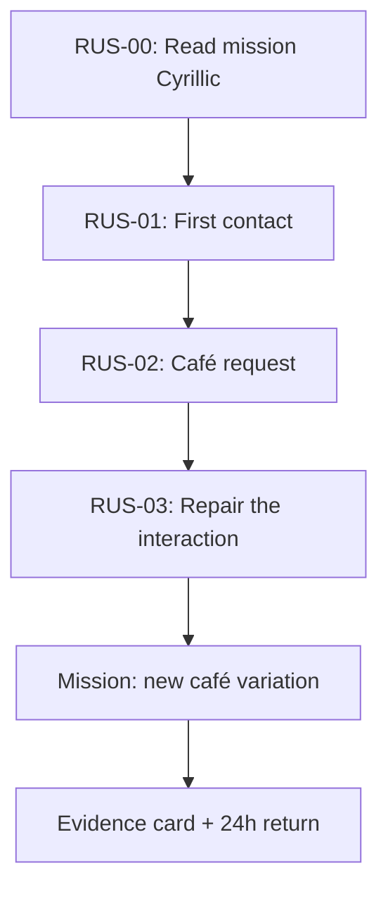

# `First Encounter` — Build Specification v0.1

**Purpose:** The first buildable vertical slice for the language-learning app
**Interface language:** English
**Learning language:** Russian
**Audience assumption:** Adult English-speaking A0 learner
**Status:** Product/content specification; no production implementation or CEFR certification claim

## 1. One-sentence product promise

> In one focused mission, help a complete beginner read the Russian needed for a small interaction, introduce themself, make a polite café request, and repair a misunderstanding — then show exactly which part still needs practice.

The experience must not promise fluency, a native accent, or a whole CEFR level.

## 2. Non-negotiable outcome

At the end of this mission, a learner may be marked **Functional** only if they can complete the following in a *new* but bounded variation:

1. Greet and give their name.
2. Ask or answer one personal-detail question.
3. Make one café order with `please`.
4. Use a repair phrase after the partner speaks too fast or asks for clarification.

The mission targets a deliberately small slice of CEFR A1: basic personal details, concrete needs, simple questions/answers and supported simple interaction. It does not grant A1. [Council of Europe A1 scale](https://www.coe.int/en/web/common-european-framework-reference-languages/table-1-cefr-3.3-common-reference-levels-global-scale)

## 3. Mission map



`RUS-00` is a literacy prerequisite, not a gamified side quest. Cyrillic must be treated as a real script; Latin look-alikes with different sounds are assessed explicitly.

## 4. Canonical content set

All learner-facing Russian must be reviewed by a qualified native Russian language reviewer before publication. The entries below are an implementation seed, not a substitute for that review.

| ID | Russian target expression | English learner meaning | Function | Variation rule |
|---|---|---|---|---|
| P01 | Здравствуйте. | Hello. (formal) | greet | No casual `Привет` in this first formal café mission |
| P02 | Меня зовут ___. | My name is ___. | state name | Insert a supported name token; do not judge name transliteration automatically |
| P03 | Как вас зовут? | What is your name? (formal) | ask name | Use `вы` register in all mission prompts |
| P04 | Откуда вы? | Where are you from? (formal) | ask origin | Answer set is bounded to supported country tokens |
| P05 | Я из Турции. | I am from Turkey. | state origin | Keep as a high-frequency chunk; explain pattern, not full case paradigm |
| P06 | Я учусь. / Я работаю. | I study. / I work. | state simple role | One optional identity variation |
| P07 | Мне, пожалуйста, кофе. | A coffee for me, please. | order | Substitute beverage token only after review |
| P08 | Можно меню, пожалуйста? | May I have a menu, please? | request | Fixed request pattern |
| P09 | Сколько стоит? | How much is it? | ask price | System supplies a simple answer; learner is not scored on full numeral production in v0.1 |
| P10 | Повторите, пожалуйста. | Please repeat. | repair | Must be requested by a generated repair event |
| P11 | Говорите медленнее, пожалуйста. | Please speak more slowly. | repair | Full formal repair request; same event class as P10 |
| P12 | Я не понимаю. | I do not understand. | repair | Same event class as P10/P11 |
| P13 | Спасибо. До свидания. | Thank you. Goodbye. | close | Required after completed café interaction |

### Review checklist for each expression

- Cyrillic spelling, punctuation and stress/audio alignment reviewed.
- English explanation communicates function, not a misleading word-for-word promise.
- Register (formal/informal), gender and cultural context are explicit where relevant.
- Acceptable learner variation is documented before AI evaluation is enabled.
- Audio is licensed, traceable and reviewed against on-screen text.

## 5. `RUS-00` script gate

### Target

Learner can decode the characters necessary for this mission and identify misleading Latin-like characters. It does **not** claim full Cyrillic fluency.

### Required character groups

| Group | Examples in this mission | Interaction | Pass condition |
|---|---|---|---|
| Familiar-looking / aligned sound | А а, К к, М м, О о, Т т | hear → choose character; see → choose sound | Can identify in isolated and word contexts |
| False friends | В в, Е е, Н н, Р р, С с, У у, Х х | contrast pair; explain visual trap | Does not map to Latin sound by appearance |
| Mission-specific shapes | Б б, Д д, Ж ж, И и, Й й, Л л, П п, Ф ф, Ц ц, Ч ч, Ь ь, Ы ы, Ю ю, Я я | choose/read only from mission phrases | Can read a previously unseen short mission word with optional slow audio |

### Interaction sequence

1. Show letter and native/validated sound; never imply a Latin equivalent is always exact.
2. Contrast letter pairs that look deceptively familiar.
3. Use short, newly assembled words before showing translations.
4. Fade Latin transliteration after the first exposure. User may re-open it as an accessibility aid, but it is not the default answer surface.
5. End with 8–12 word-level checks, including at least two unseen combinations assembled from learned characters.

### Evaluation rule

The user passes the gate only after a predeclared internal threshold and after at least one unseen-word check. The exact threshold must be set after content validation; it is intentionally not guessed in this document.

## 6. Learning loop specification

Every lesson card must have a `target_skill_id`; no generic “practice chat” card is allowed.

| Stage | Learner sees/does | System rule | Evidence produced |
|---|---|---|---|
| Notice | Hear and read one useful phrase in a micro-scene | Only one new communicative function at a time | Exposure logged, no skill claim |
| Understand | Opens `Why this phrase?` | Explanation max 60 English words; includes register/context and one example | Explanation viewed (not mastery) |
| Retrieve | Builds or speaks target phrase with support | Support can be faded; deterministic acceptance set precedes model use | Guided attempt |
| Vary | Changes name, city, item or price | At least one slot changes from the demonstrated prompt | Transfer attempt |
| Rehearse | Does a short mission-constrained roleplay | AI stays within a defined scene state and lexical boundary | Practice attempt |
| Repair | Responds to communication trouble | At least one repair event appears before completion | Repair evidence |
| Return | Comes back after 24h for a different variation | No XP/coin bonus tied to passing; state updates only from declared evidence | Delayed retrieval evidence |

## 7. Bounded AI roleplay contract

### Mission state

```text
scene: cafe
learner_role: customer
counterpart_role: server
target_functions: greet, identify, order, price, repair, close
allowed_menu_items: coffee, tea, water
supported_price_answers: one fixed reviewed currency/price set
repair_event: fast_speech | clarification_request | unavailable_item
completion: learner completes required functions, or ends safely with help
```

### AI output contract

- Use only reviewed phrase inventory plus explicitly approved variants.
- Produce one turn at a time, no long paragraphs, no unsolicited grammar lecture.
- Preserve the learner’s intent even if form is imperfect; only ask for a repeat when the learning objective requires it.
- Never claim to have heard pronunciation accurately when input confidence is low.
- If an answer is outside the acceptance set but plausible, return **unscored** and offer typed replay / slow audio / human-reviewed explanation path; do not force a false correction.
- Do not generate stereotypes, political commentary, travel-safety claims or factual cultural claims in a beginner roleplay.

### Deterministic feedback template

```text
You were trying to: [intent]
What worked: [communicative success]
Try this: [reviewed correction or accepted alternative]
Why: [short, source-backed explanation]
Next variation: [one changed slot]
```

If the system cannot fill each bracket faithfully, it must return `unscored` rather than invent feedback.

## 8. Skill states and update rules

| State | Entry condition | Display copy |
|---|---|---|
| Unknown | No valid evidence | `Not tried yet` |
| Emerging | Completes guided attempt | `You can do this with support` |
| Functional | Completes a changed-slot mission without target phrase being shown | `You used this in a new situation` |
| Stable | Functional evidence in two contexts plus 24h return | `You recalled this later too` |
| Needs repair | Evidence shows an actionable gap | `Practice this one part next` |

Updates must store the content version and evaluation mechanism used. A content correction must never silently rewrite historical learner evidence.

## 9. Minimal data contract (implementation-neutral)

| Entity | Required fields | Why it exists |
|---|---|---|
| `Skill` | id, language, can_do, CEFR_reference, prerequisites, status | Separates skill from course completion |
| `Mission` | id, scene, required_skill_ids, accepted_variations, content_version | Keeps AI and UI bounded |
| `ContentCard` | id, expression, translation, register, audio_source, reviewer, last_reviewed | Prevents untraceable learning content |
| `Attempt` | anonymized learner id, mission id, input mode, timestamp, output class | Supports reliable replay and quality analysis |
| `Evidence` | skill id, attempt id, method, state_before/after, confidence, rationale | Makes progress explainable |
| `Feedback` | attempt id, reviewed rule/source, accepted alternatives, uncertainty flag | Makes correction auditable |

No identity profile, location, private message, live audio recording or user-generated social content is required for this vertical slice.

## 10. Screen-level acceptance criteria

| Screen | Must be true before this slice is accepted |
|---|---|
| Goal setup | English UI states that the learner is practicing a small skill, not unlocking a language level |
| Mission card | Shows the exact real-life task, expected time band and skill evidence criteria |
| Script gate | Shows Cyrillic first; transliteration is progressively disclosed, not the dominant script |
| Phrase card | Has audio replay, slow option, English functional explanation and clear register |
| Practice | Offers typed fallback; voice error is recoverable and never loses progress |
| Roleplay | Shows current task and escape/hint/replay controls at all times |
| Feedback | Distinguishes `accepted`, `try again`, `unscored`; never calls uncertain input wrong |
| Evidence card | Shows one specific proven can-do, one remaining gap and one next action |
| Return check | Gives a changed context rather than replaying the exact same script |

## 11. QA matrix before any learner exposure

| Test class | Minimum test |
|---|---|
| Language correctness | Two independent native/qualified reviewer passes for every learner-visible Russian string and audio transcript |
| Curriculum scope | CEFR/mission alignment checked; no accidental claim beyond the four functions |
| AI grounding | 50–100 seed learner inputs including correct, partially correct, plausible alternatives, off-topic, ASR-noisy and unsafe inputs |
| Feedback quality | Every feedback response can be traced to a reviewed rule, phrase or explicit uncertainty state |
| Speech failure | Mic denial, offline, low confidence, noisy input and empty transcription all preserve learner progress and expose typed fallback |
| Accessibility | Screen reader label, large-text layout, no color-only state, replay controls, reduced-motion support |
| Privacy | No raw voice retained by default in a prototype; retention is explicit if later required |
| Cross-platform parity | Core path, error state and evidence card behave equivalently on iOS and Android target devices |

## 12. Explicit deferrals

- Free-form AI conversation.
- Full Russian alphabet course and all Russian A1 grammar.
- Story mode, AI podcast, infinite quiz generator and daily games.
- Rewards, coins, help-to-earn, marketplace/tutor flow, subscriptions and payment.
- Social profiles, DMs, voice rooms, human matching or video.
- Automatic pronunciation grade, accent judgment or CEFR score.

These are not omissions by accident. Each carries content-quality, moderation, fraud, legal, privacy or evaluation risk that this first slice must not hide.

## 13. Research basis

- [Council of Europe: CEFR A1 global scale](https://www.coe.int/en/web/common-european-framework-reference-languages/table-1-cefr-3.3-common-reference-levels-global-scale)
- [Council of Europe: qualitative A1 spoken-language descriptors](https://www.coe.int/en/web/common-european-framework-reference-languages/table-3-cefr-3.3-common-reference-levels-qualitative-aspects-of-spoken-language-use)
- [State Institute of Russian Language A.S. Pushkin: Beginner Russian](https://pushkininstitute.ru/beginner)
- [St Petersburg State University: Russian A1 course topics include self, work/study and ordering food](https://online.spbu.ru/courses/russian-language-a1-part-1/)
- [Lectorium / Tomsk Polytechnic University: Elementary Russian course](https://www.lektorium.tv/russian-language)
- [St Petersburg State University: TORFL overview](https://testingcenter.spbu.ru/en/exams/russian/torfl.html)
- [Busuu product/course evidence](https://help.busuu.com/hc/en-us/articles/15936615354641-What-is-Busuu)
- [Memrise Russian course evidence](https://www.memrise.com/en/learn-russian)
- [Prior project artifacts: market pilot and VOC deep dive](10_mkt_lite_pilot_report.md)

## 14. Next artifact enabled by this specification

Create a clickable, non-production English-UI prototype of the mission flow using only deterministic copy and feedback. It must visually demonstrate the learning loop without pretending that an unbuilt AI evaluator or social system already exists.
