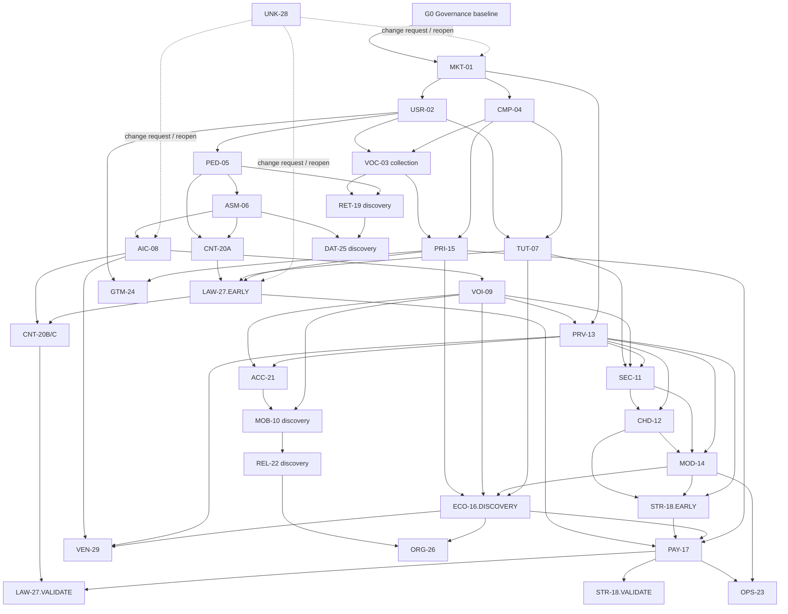

# Dil Uygulaması Research Operating System

**Sürüm:** 1.2 — bağımsız gereksinim ve işletilebilirlik denetimi sonrası değerlendirme taslağı
**Tarih:** 2026-08-11
**Durum:** Araştırma başlamadı
**Bu turun tek çıktısı:** araştırma haritası, sıra, karar bağımlılıkları ve tamamlanma ölçütleri

> Bu belgede ürün özelliği, teknoloji yığını, hedef segment, dil, ülke, fiyat, abonelik, AI sağlayıcısı veya iş modeli kesinleştirilmez. Rakip adı geçmesi araştırılacak evreni tanımlar; o rakip hakkında doğrulanmış bulgu anlamına gelmez. Sistem onaylanmadan hiçbir çalışma paketi yürütülmez.

---

## 1. Sistemin amacı

Bu Research Operating System, büyük ve belirsiz bir ürün fikrini binlerce dağınık göreve bölmek yerine şu zinciri kurar:

`Soru → kaynak planı → gözlem → iddia → kanıt kalitesi → çelişki → karar girdisi → karar kapısı`

Sistem beş soruya cevap verir:

1. Hangi alanlar ayrı araştırılmalı?
2. Her alanda neyin, hangi kaynakla ve hangi yöntemle araştırılacağı nedir?
3. Araştırmalar hangi sırada ve hangi bağımlılıkla yürütülmeli?
4. Varsayım, kullanıcı bildirimi, gözlem ve doğrulanmış bilgi nasıl ayrılmalı?
5. Bir çalışma paketi veya bütün araştırma programı ne zaman “tamamlandı” sayılmalı?

## 2. Değişmez çalışma kuralları

1. **Kaynaksız ürün kararı yok.** Kaynaksız betimleyici fikir `ASSUMPTION`; yanlışlanabilir ürün/iş önerisi `HYPOTHESIS` olarak kaydedilir. İkisi de doğrulanmış bilgi değildir.
2. **Gözlem ile yorum ayrılır.** “Ekranda bu metin var” gözlemdir; “kullanıcı bunu aldatıcı bulur” ayrı kanıt gerektirir.
3. **Kullanıcı yorumu gerçeklik değil sinyaldir.** Tek yorum yaygınlık, doğruluk veya nedensellik kanıtlamaz.
4. **Vendor iddiası bağımsız etkililik kanıtı değildir.** Vendor kaynağı ürünün ne söylediğini kanıtlar; gerçekten işe yaradığını değil.
5. **Fiyat, politika ve ürün akışı tarihlidir.** Bölge, platform, hesap, sürüm, para birimi ve erişim tarihi olmadan kaydedilmez.
6. **Yüksek etkili karar tek kaynağa dayanmaz.** Bağlayıcı resmî kural dışında bağımsız çapraz doğrulama aranır.
7. **Çelişki saklanmaz.** Çelişen kanıt `Çelişki Defteri`ne girer; ortalaması alınarak yok edilmez.
8. **Negatif kanıt aranır.** Her güçlü hipotez için onu yanlışlayacak veri ve kaynak önceden yazılır.
9. **Araştırma ile hukuk görüşü ayrıdır.** Mevzuat araştırması hukuk uzmanı incelemesinin yerine geçmez.
10. **Araştırma ile teknik seçim ayrıdır.** Teknik çalışma paketleri seçenek ve sınır üretir; bu turda yığın seçmez.
11. **Araştırma ile özellik seçimi ayrıdır.** Rakip boşluğu görmek otomatik olarak özellik kararı verdirmez.
12. **Araştırma kapsamı değişebilir; kayıt değişmez.** Yeni alan eklenir, eski kayıt sessizce yeniden yazılmaz.
13. **Her betimleyici iddia izlenebilir.** Varsayım dâhil her iddiada kaynak/üreten taraf, oluşturma veya yayın tarihi, erişim tarihi gerekiyorsa, kapsam ve güven bulunur.
14. **Normatif politika ampirik bulgu değildir.** Örneklem sayısı, tazelik penceresi veya kalite eşiği gibi ROS içi kurallar `POLICY_DEFAULT` olarak tarihli ve onay durumuyla kaydedilir; “bilimsel olarak doğrulanmış sayı” diye sunulmaz.
15. **Ham kanıt bir kez toplanır.** Rakip akışlarının kanıt sahibi CMP-04, kullanıcı yorumlarının kanıt sahibi VOC-03, ortak kaynakların sahibi Kaynak Sicili'dir. Diğer paketler bu varlıkları referanslar; aynı veriyi yeniden toplamaları için gerekçe ve değişiklik kaydı gerekir.
16. **Dış eylem varsayılan olarak yasaktır.** Onaylı protokol olmadan satın alma, hesap açma, scraping/bulk export, kullanıcıya veya şirkete ulaşma, destekle mystery interaction, kayıt alma, teşvik ödeme ya da çocuklardan veri toplama yapılmaz.
17. **Önceki çalışma karantinadadır.** ROS onayından önce üretilmiş materyal araştırma kanıtı sayılmaz; gelecekteki onaylı bir paket aynı kaynağı bu sistem altında yeniden doğrularsa ancak o zaman sicile girebilir.

Merkezi sahiplik sonucu MKT/USR/CMP/TUT ve diğer paketler ham yorum toplamaz; §13'teki “Toplanacak kullanıcı yorumları” alanı, VOC-03'ün hangi sinyalleri üretip pakete sunacağını tarif eder. MKT-01 ilk kategori frame'ini yorumsuz üretebilir. Erken yorum keşfi gerekirse MKT içinde yapılmaz; MKT minimum frame'inden sonra ayrı `VOC-03A DISCOVERY-SCAN` protokolü açılır. VOC sonucu MKT/USR/CMP claim'lerini yalnız `REFRESH_TRIGGER` ile yeniden açar.

## 3. Araştırma durum makinesi ve kapılar

Bir paket “başladı/bitti” ikiliğine değil, denetlenebilir geçişlere sahiptir. Ana yol:

`NOT_STARTED → SCOPING → PROTOCOL_REVIEW → APPROVED_TO_COLLECT → COLLECTING → DATA_FROZEN → CODING → SYNTHESIS → QUALITY_REVIEW → RED_TEAM_REVIEW → READY_FOR(Dxx, phase_enum, kapsam, sürüm, valid_until)`

| Durum | Giriş/çıkış anlamı | Geçişi onaylayan |
|---|---|---|
| `NOT_STARTED` | Yalnız harita kaydı var; veri, hesap, harcama veya outreach yok | Program Lead |
| `SCOPING` | Soru, kapsam dışı, dependency contract ve taslak protokol hazırlanır | Package Lead |
| `PROTOCOL_REVIEW` | Yöntem, örneklem, etik/PII/ToS, bütçe, stop rule ve analiz planı dondurulmadan denetlenir | Methods/QA + ilgili risk reviewer'ı |
| `APPROVED_TO_COLLECT` | Sürüm, yetki kimliği ve maliyet tavanı onaylıdır; ancak bu durumdan sonra veri toplanabilir | Research Governance Owner |
| `COLLECTING` | Yalnız onaylı protokol kapsamındaki veri toplanır | Package Lead |
| `DATA_FROZEN` | Ham veri manifest/checksum ile dondurulur; sonradan ekleme amendment gerektirir | Data Steward |
| `CODING` | Sürümlü codebook/analiz planı uygulanır | Package Lead |
| `SYNTHESIS` | İddia, çelişki, sınır, karşı açıklama ve bilinmeyenler yazılır | Package Lead |
| `QUALITY_REVIEW` | İzlenebilirlik, örneklem, yeniden üretilebilirlik, IRR ve tazelik denetlenir | Methods/QA Reviewer |
| `RED_TEAM_REVIEW` | Dondurulmuş kanıt manifesti üzerinde bağımsız çürütme denemesi yapılır | Independent Red-Team Reviewer |
| `READY_FOR(...)` | Yalnız adı verilen karar, faz, kapsam ve geçerlilik tarihi için yeterlidir; “doğrudur” veya “karar alındı” demek değildir | QA + gerekirse Domain Expert + Decision Owner |

| Yan/son durum | Ne zaman | Açan | Yeniden açan / kapanış |
|---|---|---|---|
| `PAUSED` | Planlı bekleme, kapasite veya upstream refresh | Package Lead veya Program Lead | Aynı rol + bağımlılık/kapasite kanıtı |
| `BLOCKED` | Gerekli yetki, kaynak veya artifact dışarıdan bekleniyor; yöntem henüz tüketilmedi | Package Lead; Program Lead triage eder | Governance Owner, blokör kanıtıyla |
| `STOPPED_RISK` | Etik, PII, ToS, çocuk, güvenlik, adverse event veya bütçe kill-switch'i | Her ekip üyesi tetikleyebilir | Governance Owner **ve** Data/Privacy-Ethics Reviewer; yüksek riskte Domain Expert ayrıca |
| `INCONCLUSIVE` | Onaylı yöntem ve stop rule tüketildi fakat minimum evidence floor karşılanmadı | QA Reviewer | Yeni CR/protokol, yeni kanıt tabanı ve Governance onayı |
| `CANCELLED` | Soru artık meşru/yararlı değil veya yetki kalıcı çekildi | Governance + Decision Owner | Eski kayıt açılmaz; gerekirse yeni Paket ID/sürüm |
| `SUPERSEDED` | Daha yeni protokol/artifact öncekinin yerini aldı | QA + Governance | Yeni sürüme immutable link; eski artifact korunur |
| `EXPIRED` | Zaman veya olay tetikleyicisi kanıtı geçersizleştirdi | Refresh Owner veya Data Steward | Yeniden doğrulama + QA; bağlı readiness otomatik yeniden açılır |

`BLOCKED`, yöntemin çalıştırılamadığı geçici dış bağımlılıktır; `INCONCLUSIVE`, yöntemin çalıştırılıp cevap üretememesidir. Stop sonrası yeni toplama derhal kesilir, erişimler askıya alınır, mevcut verinin bütünlüğü korunur, PII/adverse-event triage'ı yapılır ve gerekiyorsa notification/escalation kaydı açılır. `INCONCLUSIVE` veya “kaynağa ulaşılamadı” readiness değildir.

Waiver yalnız R0/R1 süreç sapmalarında kayıtlı gerekçe ve expiry ile mümkündür. Etik/consent/ToS, bütçe yetkisi, görev ayrılığı, R2/R3 expert sign-off, açık kritik zarar veya `DISCOVERY_REQUIRED` kanıt için waiver yoktur.

Her geçiş audit log'u şu alanları taşır: `{from, to, actor, timestamp, reason, artifact_version, required_approvals, open_findings}`. İzin verilmeyen atlama geçersizdir.

Bu belgedeki bütün araştırma paketlerinin mevcut durumu `NOT_STARTED`tır. Kapılar karıştırılmaz: mevcut artifact `ROS-DESIGN-v1.2 PROPOSED`; kullanıcı metni kabul ederse `ROS-DESIGN-v1.2 APPROVED`; roller, yönetişim varlıkları ve dry-run hazırlanırken `G0-CANDIDATE`; ancak §19'daki sekiz şart geçince `G0-GOVERNANCE-BASELINE APPROVED` oluşur. MKT-01 yalnız son artifact'ı tüketebilir.

### 3.1 Kanıt olgunluğu fazları

Tek bir `DECISION_READY` bütün yaşam döngüsünü temsil etmez:

| Faz | Kanıtın destekleyebileceği şey | Bu fazda gerekli olmayan/izin verilmeyen |
|---|---|---|
| `DISCOVERY_READY` | Problem, kategori, risk ve araştırılabilir seçeneklerin karşılaştırılması | Kod, teknoloji seçimi, ürün özelliğini kesinleştirme |
| `CONCEPT_READY` | Ayrı onaylı konseptlerin test edilmeye değer olup olmadığı | Üretim mimarisi veya lansman iddiası |
| `PROTOTYPE_VALIDATED` | Ayrı yetkiyle oluşturulmuş prototip/spike kanıtı | Pilot veya üretim genellemesi |
| `PILOT_VALIDATED` | Kontrollü pilot davranışı, ekonomi ve operasyon kanıtı | Ölçek/lansman genellemesi |
| `LAUNCH_READY` | Üretim güvenilirliği, hukuk, mağaza, destek ve rollback kanıtı | Sınırsız coğrafya/segment genellemesi |

Bu ROS turu yalnız sistemi ve gelecekteki `DISCOVERY_READY` araştırma yolunu tanımlar. Prototip, pilot ve launch kanıtı gelecek ayrı yetkilere bağlıdır.

### 3.2 Roller, yetki ve görev ayrılığı

Her paket `SCOPING` bitmeden gerçek kişi adlarıyla doldurulacak roller:

| Rol | Hesap verdiği alan | Tek başına yapamayacağı |
|---|---|---|
| Research Governance Owner | ROS, kapı ve istisna bütünlüğü | Kendi yürüttüğü pakete bağımsız QA veremez |
| Program Lead | Sıra, dependency, kapasite ve durum görünürlüğü | Bütçe/etik/uzman vetosunu aşamaz |
| Package Lead | Protokol, toplama, sentez ve düzeltme | Kendi `QUALITY_REVIEW`, red-team veya readiness onayını veremez |
| Methods/QA Reviewer | Yöntem, örneklem, kodlama, yeniden üretilebilirlik | Ürün tercihini yöntem kararı gibi dayatamaz |
| Data Steward / Privacy & Ethics Reviewer | Erişim, PII, consent, saklama, silme ve veri lineage | Hukuk uzmanı sign-off'ının yerini alamaz |
| Domain Expert | Dilbilim/ölçme/hukuk/çocuk güvenliği/security gibi alan kapısı | Kanıt olmadan ürün kararı veremez |
| Budget/Procurement Owner | Harcama tavanı, araç/hesap/satın alma yetkisi | Yöntem veya etik onayı veremez |
| Independent Red-Team Reviewer | En güçlü iddiaları çürütme ve dissent memo | Package Lead, ana veri toplayıcı veya Decision Owner olamaz |
| Decision Owner | Kanıta dayanarak ileride karar alma/risk kabulü | Eksik kritik kanıtı “yüksek güven” ilan edemez |

**RACI kuralı:** `APPROVED_TO_COLLECT` için Package Lead responsible; Research Governance Owner accountable; Methods/QA, Data Steward ve ilgili Domain Expert consulted; Program Lead informed. Harcama varsa Budget Owner; dış katılımcı/PII varsa Privacy & Ethics Reviewer zorunlu onaylayıcıdır. `READY_FOR` için QA ve Decision Owner birlikte; yüksek riskte ilgili Domain Expert ayrıca imzalar. Tek kişilik ekipte öz-inceleme bağımsızlık sayılmaz; dış/ayrı reviewer bulunana kadar yüksek etkili karar kapısı kapalı kalır.

Rol atama kaydı yeterlilik dayanağı, ilgili yargı/dil/alan deneyimi, güncellik ve çıkar çatışmasını taşır. Hukuk için ilgili yargı alanında yetkin hukuk uzmanı; çocuk için safeguarding deneyimi; ölçme için psychometrics/applied-linguistics yeterliliği; security için ilgili teknik güvenlik deneyimi aranır. Yeterlilik yoksa rol “dolu” sayılmaz. Zorunlu uzman `STOP/NO-GO` vetosu verebilir; Governance veya Decision Owner bunu waiver ile aşamaz.

### 3.3 Değişiklik kontrolü

Protokol `APPROVED_TO_COLLECT` öncesinde baseline olur. Her değişiklik şu kaydı gerektirir: `CR ID`, başlatan, gerekçe, veriye bakılmadan önce/sonra olduğu, değişen alan, etkilenen claim/paket/karar, eski/yeni sürüm, onaylayan, tarih, migration ve yeniden inceleme. Veriyi gördükten sonra yöntem/örneklem değişikliği `EXPLORATORY_AMENDMENT` olarak etiketlenir; doğrulayıcı sonuç için yeni/dondurulmamış örnek gerekir. Eski sürüm silinmez.

| Değişiklik türü | Zorunlu onay |
|---|---|
| Yazım/format; semantik yok | Data Steward; audit log |
| Soru, kapsam, kaynak, sample, analiz veya stop rule | Methods/QA + Governance Owner |
| Bütçe, satın alma veya dış eylem | Budget Owner + Governance Owner |
| PII, etik, consent, ToS, çocuk veya safety | Privacy & Ethics + ilgili Domain Expert + Governance Owner |
| Veriyi gördükten sonra yöntem değişikliği | Orijinal protocol reviewer'ları + `EXPLORATORY_AMENDMENT` + bağımsız doğrulama örneği |
| ROS baseline/dependency/risk rubric | Governance Owner + downstream etki analizi + semver + kullanıcı/sponsor onayı |

Semantik change için waiver yoktur; yeni sürüm ve bağımlı claim/readiness etki analizi zorunludur.

## 4. Gelecekte tutulacak araştırma varlıkları

Bu turda ayrı dosyalar oluşturulmaz; aşağıdaki varlıklar sistem onaylandıktan sonra paket bazında açılır.

### 4.1 Çalışma Paketi Kaydı

- Paket kimliği, sürümü; Package Lead ve bütün onaylayıcı roller
- Kapsam / kapsam dışı
- Karar bağımlılıkları ve artifact-bazlı dependency contract'ları
- Araştırma soruları
- Kaynak/örneklem/analiz planı; dahil etme ve dışlama ölçütleri
- Başlama / bitiş / tazelik tarihi
- Maliyet tavanı, izinli dış eylemler ve yetki kimlikleri
- Minimum kanıt tabanı, azami süre/harcama, stop/kill switch ve sonuçsuzluk yolu
- Veri sınıfı, saklama/silme ve etik/ToS koşulları
- Durum, audit log'u ve açık engeller

### 4.2 İddia Defteri

Her satır tek iddia taşır:

| Alan | Zorunlu içerik |
|---|---|
| Claim ID | Değişmeyen benzersiz kimlik |
| İddia | Tek, sınanabilir cümle |
| İddia türü | §5.1'deki tam taksonomiden tek etiket |
| Önem | `CRITICAL` / `SUPPORTING` / `EXPLORATORY` |
| Kapsam | Ülke, platform, dil, yaş, segment, sürüm, dönem |
| Kaynak/üreten | Doğrudan URL-belge; varsayımda üreten rol; policy'de politika kimliği |
| Tarihler | `observed_at`, `published_at`, `accessed_at`, `last_verified_at`, `expires_at` uygun olduğu ölçüde ayrı |
| Kanıt seviyesi | Kaynak sınıfı + kalite puanı |
| Güven | Düşük / orta / yüksek |
| Lineage | Ham artifact, türetilmiş analiz ve aynı temel veriyi kullanan kaynak ilişkisi |
| Çelişki | Varsa karşı kanıt kimliği |
| Refresh | Tetikleyici, sahibi ve doğrulama yöntemi |
| Karar bağlantısı | Hangi karar kartını etkiliyor |
| Yanlışlayıcı | Hangi veri iddiayı çürütebilir |

### 4.3 Kaynak Sicili

Yayıncı, yazar, kaynak türü, yöntem, örneklem, finansman/çıkar çatışması, ülke, tarih, erişim bağlantısı, arşiv referansı ve kullanım sınırı.

### 4.4 Rakip Akış Envanteri

Platform, ülke/storefront, cihaz, uygulama sürümü, hesap türü, tarih, akış adımı, ekran görüntüsü/video referansı, görünen metin, bekleme süresi, ücret ve sapma notu.

### 4.5 Kullanıcı Sesi Corpus'u

Ana corpus yalnız pseudonymous `Review ID`, platform sınıfı, tarih, uygulama sürümü, gözlenebilen ülke, puan, rol/`UNKNOWN`, davet işareti, konu kodu, şiddet, tekrar, çözülme, izinli paraphrase/kısa alıntı ve kopya/şüpheli içerik bayrağı taşır. Gerçek URL, kullanıcı adı veya yeniden tanımlama locator'ı gerekiyorsa ayrı `RESTRICTED-PII Source Locator` tablosunda en az yetkiyle tutulur; ana corpus'a kopyalanmaz.

### 4.6 Çelişki Defteri

İki iddia, `scope / time-version / method / source-lineage / true-unresolved` türü, önem derecesi, owner, son tarih, blocking bayrağı, olası neden, kapsam farkı, çözmek için gereken araştırma ve etkilenen kararlar. Çözüm; kapsamları ayırma, güven düşürme, supersede etme, yeni paket açma veya `UNRESOLVED` bırakmadır. Kritik unresolved çelişki ilgili readiness'i bloklar; upstream claim değişirse bağımlı paket/kararlar etki analiziyle yeniden açılır.

### 4.7 Karar Defteri

Karar sorusu, seçenekler, bağımlı paketler, kullanılan iddialar, kanıt tarihi, güven, geri döndürülebilirlik, sahibi, alınan karar ve yeniden açma koşulu.

### 4.8 Bilinmeyenler ve Sürprizler Defteri

Bilinen bilinmeyen, bilinmeyenin fark edildiği kaynak, olası etki, ilgili paket, triage ve yeni paket açma kararı.

### 4.9 Veri ve Kanıt Yönetim Planı

Her artifact `PUBLIC / INTERNAL / CONFIDENTIAL / RESTRICTED-PII` olarak sınıflanır. Değiştirilemez ham kanıt ile yeniden üretilebilir türetilmiş veri ayrılır; artifact ID, izin veriliyorsa snapshot/checksum, kaynak–iddia–analiz lineage'ı, erişim sahibi, lisans/telif/ToS kısıtı ve paket-bazlı saklama/silme tarihi kaydedilir.

- En az yetki, erişim log'u ve ayrı yedekleme uygulanır.
- Kullanıcı adı, profil bağlantısı, doğrudan alıntı, ses ve ekran görüntüsü yalnız gerekliyse ve izinliyse tutulur; varsayılan yaklaşım minimizasyon, paraphrase ve redaksiyondur.
- Kamusal yorum, sınırsız arşivleme veya yeniden yayımlama izni sayılmaz.
- Görüşmede bilgilendirilmiş onam, kayıt izni, teşvik açıklaması, geri çekilme ve katılımcı verisini silme prosedürü zorunludur.
- Kimlik eşleme anahtarı araştırma verisinden ayrı tutulur. Ham PII onaysız AI/vendor aracına yüklenmez.
- Minörlerden doğrudan veri toplama, CHD-12/PRV-13 ve nitelikli etik-çocuk güvenliği onayı olmadan yasaktır.
- Kaynak snapshot'ı erişim kontrolünü aşarak alınmaz; telifli içerik gerekenden fazla kopyalanmaz.

**Fiziksel blueprint — bu turda klasör/repo oluşturulmaz:** G0 dry-run'da seçilecek araştırma alanı için mantıksal yapı `research/<package>/<version>/{protocol,source_registry,raw,derived,claims,qa,red_team,decisions,tombstones}` olarak instantiate edilir. Zorunlu kimlikler: `SRC-`, `ART-`, `REV-`, `CLM-`, `CTR-`, `CR-`, `RA-`; şema dosyaları semver taşır. Tablosal veri UTF-8 CSV/JSONL, anlatı Markdown/PDF referansı olabilir; kanonik format paket kartında yazılır. Access-control grupları rol bazlıdır; credential/secret artifact klasörüne girmez ve onaylı secrets mekanizmasında tutulur. Şüpheli ihlal halinde erişimi kesme, immutable incident kaydı, kapsam/notification değerlendirmesi ve silme sonrası tombstone zorunludur. Bu yalnız gelecek veri yapısı tarifidir; burada herhangi bir repo veya veri alanı yaratılmamıştır.

### 4.10 Yetki ve bütçe kaydı

Paket kartı onaylı maliyet tavanı, taahhüt/gerçekleşen/kalan tutar, harcama sahibi, izinli hesap/ödeme yöntemi ve fazla harcamada otomatik durdurma taşır. Satın alma, rakip hesabı, scraping/bulk export, outreach, destek etkileşimi, kayıt ve katılımcı teşviki ayrı yetki sınıflarıdır. İzin reddinde daha zayıf alternatif yöntem kullanılabilir; kanıt sınırlaması açıkça düşürülür. Yetki ve etik kimliği olmadan `APPROVED_TO_COLLECT` verilemez.

### 4.11 Arama, seçim ve yeniden üretilebilirlik kaydı

Her tarama; veri tabanı/platform, tam sorgu, tarih-dil-ülke aralığı, filtre, sayfa/rank kapsamı, seçim/randomizasyon yöntemi ve seed, dahil/dışla gerekçesi, ilgili sayfa/bölüm/zaman kodu, OCR/çeviri belirsizliği ve çalışma zamanı taşır. AI özeti yalnız `DERIVED_NOTE` olabilir; kaynak değildir. Kaynak Sicili sabit `Source ID`, `underlying_dataset_id`, `supersedes/retracted_by` ve izinli snapshot hash'i taşır. Aynı temel veri setinden türeyen iki yayın bağımsız çapraz doğrulama sayılmaz.

Her `CRITICAL` claim readiness öncesinde ikinci araştırmacı tarafından gerçekten yeniden kurulur; yalnız “kurulabilir” olması yetmez. Kayıt: `{reproduced_by, reproduced_at, source_version, result, discrepancy, resolution}`. Başarısız veya çözümsüz reproduction R2/R3 readiness'i bloklar.

## 5. İddia türleri ve statüleri

### 5.1 Tür

| Etiket | Tanım | Örnek biçimi |
|---|---|---|
| `ASSUMPTION` | Henüz kanıtı olmayan çalışma varsayımı | “X segmentinde konuşma kaygısı ana problem olabilir.” |
| `OBSERVATION` | Doğrudan görülen veya ölçülen | “TR storefront checkout ekranında Y tutarı gösterildi.” |
| `USER_REPORT` | Kullanıcının kendi deneyim beyanı | “Yorumcu iptali tamamlayamadığını bildiriyor.” |
| `PRODUCT_CLAIM` | Rakibin/vendörün kendi iddiası | “Ürün, kişiselleştirilmiş geri bildirim sunduğunu söylüyor.” |
| `ASSOCIATION` | Değişkenler birlikte hareket ediyor | Nedensellik iddiası içermez |
| `CAUSAL_CLAIM` | Bir müdahalenin sonuç ürettiği iddiası | Deneysel veya güçlü yarı-deneysel kanıt gerekir |
| `BINDING_RULE` | Mevzuat, mağaza kuralı veya sözleşme şartı | Yargı alanı ve yürürlük tarihi zorunlu |
| `BENCHMARK` | Belirli veri setindeki karşılaştırma | Kendi ürünümüzün tahmini değildir |
| `HYPOTHESIS` | Yanlışlanabilir ürün/iş hipotezi | Test planı ve başarısızlık koşulu zorunlu |
| `POLICY_DEFAULT` | ROS'un önerdiği normatif yöntem/kapı kuralı | İç politika kaynağı, tarih, sürüm ve onay durumu zorunlu; ampirik gerçek değildir |
| `DERIVED_NOTE` | Kaynaktan türetilmiş özet, çeviri veya AI yardımlı not | Orijinal kaynağın yerini alamaz; türetme yöntemi zorunlu |

### 5.2 Statü

`UNVERIFIED → OBSERVED → CORROBORATED → DECISION_GRADE`

Bu zincir yalnız claim statüsüdür; paket readiness'i değildir. Her aşamada ayrıca `CONTESTED` veya `EXPIRED` olabilir. Bir iddianın çok kaynaklı olması onu otomatik olarak nedensel veya genellenebilir yapmaz.

`ASSUMPTION` kanıtlanmamış bağlam varsayımıdır; `HYPOTHESIS` ise test ve yanlışlanma koşulu tanımlanmış öneridir. Bir kayıt ikisi arasında sessizce geçmez; yeni sürüm ve gerekçe gerekir. `POLICY_DEFAULT` için güven puanı yerine `PROPOSED / APPROVED / SUPERSEDED` onay durumu kullanılır.

## 6. Kaynak sınıfları

| Seviye | Kaynak | Ne için güçlüdür | Tek başına neyi kanıtlamaz |
|---|---|---|---|
| A1 | Resmî mevzuat, düzenleyici, mahkeme, Apple/Google bağlayıcı politika | Yürürlükteki gereklilik | Uygulamadaki kullanıcı etkisi veya hukuk görüşü |
| A2 | Ürünün kendi şartları, help, checkout, ekran ve mağaza kaydı | O anda görünen ürün davranışı/iddiası | Etkililik, memnuniyet, tüm kullanıcılarda aynı deneyim |
| B1 | Sistematik derleme, meta-analiz, standart kuruluşu | Kanıt bütününün yönü ve sınırları | Bizim segmentte aynı etkinin kesin oluşması |
| B2 | Hakemli birincil çalışma, açık veri ve yöntem | Belirli bağlamdaki etki/ilişki | Farklı dil, yaş, seviye veya ürüne otomatik genelleme |
| C1 | Yöntemi açık sektör veri seti/benchmark | Pazar deseni ve çıpa | Yeni ürün tahmini veya nedensellik |
| C2 | Bağımsız uzman incelemesi/teardown | Hipotez ve mekanizma | Temsilî yaygınlık |
| D1 | Yapılandırılmış kullanıcı görüşmesi/günlük/usability testi | İhtiyaç, davranış ve mekanizma | Pazar büyüklüğü veya nüfus oranı |
| D2 | App Store, Google Play, Trustpilot, Reddit, forum | Sorun keşfi ve dil | Doğruluk, yaygınlık veya nedensellik |
| E | SEO listesi, affiliate, sosyal paylaşım, kaynaksız özet | Yeni soru üretme | Ürün kararı |

## 7. Kanıt kalitesi ve güven puanı

Her iddia beş boyutta 0–2 puanlanır. Toplam puan kararın yerini almaz; zayıflığı görünür kılar.

| Boyut | 0 | 1 | 2 |
|---|---|---|---|
| Doğrudanlık | Konuya dolaylı | Kısmen doğrudan | Tam olarak aynı soru/kapsam |
| Yöntem | Belirsiz/yok | Kısmen açıklanmış | Tekrarlanabilir ve uygun |
| Kapsam uyumu | Farklı ülke/segment/sürüm | Kısmi uyum | Karar kapsamıyla aynı |
| Tazelik | Eskimiş/belirsiz | Kabul edilebilir | Güncel ve tarihli |
| Çapraz doğrulama | Tek ve çıkar çatışmalı | İkinci sinyal var | Bağımsız kaynak/deneyle doğrulandı |

**0–3:** düşük, yalnız keşif
**4–7:** orta, yalnız düşük riskli ve geri döndürülebilir discovery seçeneği için aday
**8–10:** yüksek, kapsamı içinde karar girdisi adayı

Ek kurallar:

- A1 bağlayıcı kaynak, ilgili kuralın varlığında güçlüdür; ürün tasarımının iyi olduğunda değil.
- D2 yorumlar çok sayıda olsa bile örneklem yanlılığı çözülmeden yüksek güven alamaz.
- Causal claim için yöntem boyutu 2 değilse karar hazır sayılmaz.
- Hukuk, çocuk güvenliği, biyometrik veri ve yüksek riskli ölçmede yalnız masa başı puanı yeterli değildir; uzman incelemesi gerekir.
- Toplam telafi edici değildir: `CRITICAL` claim'de doğrudanlık, yöntem veya tazelik 0 ise toplam kaç olursa olsun readiness'e giremez.
- Yüksek zarar/hukuk/çocuk/güvenlik claim'inde doğrudanlık ve yöntem 2, uygun birincil kaynak ve nitelikli uzman incelemesi gerekir. Kaynağın söylediği kural ile uzmanın uygulama görüşü ayrı claim olarak tutulur.
- Güven: `düşük` = tek/zayıf veya önemli sınırlı sinyal; `orta` = uygun fakat kapsam/örneklem/triangulation sınırlı; `yüksek` = doğrudan, tekrarlanabilir, güncel, bağımsız doğrulanmış ve kritik çelişkisi kapalı. Güven yalnız skordan otomatik türetilmez; gerekçe yazılır.

Bu 0–10 rubric ve eşikleri `POLICY_DEFAULT-QA-01`, kaynak `ROS internal proposal v1.2`, tarih `2026-08-11`, durum `PROPOSED` kaydıdır. Dış dünyaya ilişkin doğrulanmış iddia değildir ve ROS onayında kabul/revize edilir.

### 7.1 Karar/claim risk sınıfı ve readiness tabanı

Her karar kesiti ve `CRITICAL` claim protokolde veriden önce en yüksek geçerli sınıfa atanır:

| Sınıf | Tanım | Minimum kanıt ve onay | Eksik kanıt/risk kabulü |
|---|---|---|---|
| `R0` | İç araştırma çerçevesi; kullanıcıya/mali değere etkisi yok, kolay geri alınır | Bir doğrudan kaynak veya açık assumption + QA kontrolü | Program Lead, dar kapsam ve expiry ile kabul edebilir |
| `R1` | Orta etkili, geri alınabilir konsept/ticari hipotez; hassas veri veya önemli harcama yok | Doğrudan kanıt + bağımsız ikinci sinyal; QA; risk-temelli red-team örneği | Decision Owner yalnız exposure cap ve kill trigger ile kabul edebilir |
| `R2` | Önemli finansal, mahremiyet, öğrenme-ölçme, erişilebilirlik, lock-in veya operasyon etkisi | Uygun birincil kaynak + bağımsız corroboration; QA + nitelikli Domain Expert; kritik claim'lerde %100 red-team | `DISCOVERY_REQUIRED` kritik soru `PARTIAL/INCONCLUSIVE` ise geçemez; açık `MAJOR/CRITICAL` finding bloklar |
| `R3` | Hukuk, çocuk/minör, insan güvenliği, biyometrik/ses, temel security veya ciddi/geri döndürülemez zarar | Resmî/bağlayıcı veya en doğrudan birincil kaynak + bağımsız kanıt; nitelikli uzman ve bağımsız red-team imzası | Eksik kritik kanıt, açık `MAJOR/CRITICAL` finding veya uzman eksikliği için risk kabulü yoktur |

Her araştırma sorusu baseline'da `DISCOVERY_REQUIRED` veya `LATER_PHASE_REQUIRED` olur. İlki `FUTURE_VALIDATION_REQUIRED` ile geçilemez. İkincisi discovery sonucunda test protokolü, acceptance envelope, owner ve gelecek fazı belirtilerek ertelenebilir.

`PARTIAL` yalnız R0/R1'de karar kapsamını açıkça daraltıyor, residual risk ve reopen trigger taşıyorsa readiness'e girebilir. R2/R3 kritik soruda `PARTIAL`, `INCONCLUSIVE` veya `FUTURE_VALIDATION_REQUIRED` discovery readiness sağlamaz. Tek faz enum'u kullanılır: `READY_FOR(Dxx, DISCOVERY_READY | CONCEPT_READY | PROTOTYPE_VALIDATED | PILOT_VALIDATED | LAUNCH_READY, kapsam, sürüm, valid_until)`.

İzinli risk kabulü şu kaydı taşır: `{RA ID, risk_class, owner, rationale, evidence_gap, reversible_action, exposure_cap, kill_trigger, expires_at, affected_decision}`. R2/R3'te yukarıdaki yasakları aşan waiver üretilemez.

Bu sınıflandırma `POLICY_DEFAULT-RISK-01`, kaynak `ROS internal proposal v1.2`, tarih `2026-08-11`, durum `PROPOSED` kaydıdır.

## 8. Tazelik politikası

Aşağıdaki pencereler `POLICY_DEFAULT-FRESH-01`, kaynak `ROS internal proposal v1.2`, tarih `2026-08-11`, durum `PROPOSED` değerleridir; dışsal gerçek değildir. Kritik kararın değişim hızı daha yüksekse paket daha kısa pencere belirler.

| Bilgi türü | Karar öncesi yeniden kontrol |
|---|---|
| Fiyat, trial, paywall, paket, mağaza kesintisi | En geç 7 gün önce; storefront bazında |
| Rakip ekranı ve özellik akışı | En geç 30 gün önce; uygulama sürümüyle |
| Apple/Google politika ve geliştirici şartı | Her ilgili karar ve her release öncesi |
| Model/ASR/TTS fiyatı ve teknik kapasite | En geç 14 gün önce ve sözleşme öncesi |
| KVKK/GDPR/AI mevzuatı | Karar anında resmî metin; lansman öncesi hukuk incelemesi |
| Sektör benchmark'ı | Son 12 ay tercih; eskiyse gerekçe |
| Akademik sentez | Son tarama tarihi kaydedilir; kritik konuda güncel literatür taraması |
| Kullanıcı yorumu | Son sürüm ve son 12 ay ağırlıklı; eski yapısal tema ayrıca etiketli |

Her claim `observed_at`, `published_at`, `accessed_at`, `last_verified_at`, `expires_at`, `refresh_trigger`, `refresh_owner` ve `verification_method` alanlarından uygun olanları taşır. Uygulama sürümü, politika, vendor/model veya kaynak düzeltmesi pencereyi beklemeden expiry tetikleyebilir. Paket readiness'i, kullandığı kritik claim'lerin en erken geçerlilik sınırını aşamaz. Bilgi süresi dolduğunda iddia silinmez; `EXPIRED` olur ve bağlı karar/paket etki analiziyle yeniden açılır.

## 9. Kullanıcı yorumu araştırma protokolü

Bu protokol yalnız VOC-03 onaylandıktan sonra uygulanır.

### 9.1 Örnekleme

1. Rakip evreni MKT-01 kategori frame'i; akış adları CMP-04 `FLOW-TAXONOMY-v0.x`; segment/JTBD kodları USR-02 `JTBD-CODEBOOK-v0.x` ile tanımlanır. Bunlar collection için minimum upstream artifact'lardır; ilgili paketlerin bütünüyle bitmesi gerekmez.
2. İki corpus karıştırılmaz: `DISCOVERY_CORPUS` tema/sorun keşfi içindir; `DISTRIBUTION_CORPUS` yalnız örnekleme frame'i yeterliyse strata içi görülme oranını tarif eder. Convenience veya platformun sıraladığı örnekten prevalence çıkarılmaz.
3. Paket protokolü; platform/storefront, dönem, puan, ürün sürümü, gözlenebiliyorsa ülke/rol/dil strata'sı; tam sorgu, sayfa/rank kapsamı, kota, çekme/randomizasyon yöntemi ve seed; dahil/dışla kuralı; düzenlenmiş yorum/developer response/kopya/eksik alan işlemini veriden önce dondurur.
4. Gözlenemeyen ülke, rol, sürüm veya demografi tahmin edilmez; `UNKNOWN` tutulur. Reddit, Trustpilot, destek forumu ve mağaza yorumları ayrı corpus/strata olarak kalır.
5. Keşif için ilk politika varsayımı ürün × platform başına 40 kayıt, izleyen partiler 20 kayıttır. İki ardışık partide yeni birinci-seviye kod oranının %10 altına düşmesi yalnız “doygunluk adayı”dır; heterojen strata ayrı değerlendirilir ve uzman muhakemesi gerekir.
6. Bu sayılar `POLICY_DEFAULT-VOC-01`, kaynak `ROS internal proposal v1.2`, tarih `2026-08-11`, durum `PROPOSED` değerleridir. Paket başlamadan, ham veriye bakılmadan yöntem gerekçesiyle değiştirilebilir; sonradan değişiklik `EXPLORATORY_AMENDMENT` olur.
7. Safety, çocuk, PII, taciz, fraud ve maddi zarar gibi nadir-yüksek zarar sinyalleri doygunluğa tabi değildir; ayrı anahtar-terim/sentinel taraması, manuel doğrulama ve ilgili uzman incelemesi gerekir. Bu tarama yaygınlık tahmini değildir.
8. Kopya, affiliate, promosyon ve şüpheli bot içeriği bayraklanır; dışlama gerekçesi ve paydası korunur. Sessizce atılmaz.

### 9.2 Kodlama alanları

- Kullanıcının işi ve bağlamı
- Beklenti ve vaat kaynağı
- Gerçekleşen sonuç
- Tetikleyici ekran/akış
- Sorun veya övgü türü
- Sıklık, şiddet, tekrar ve çözülme
- Ödeme/iptal/iade
- Öğrenme/geri bildirim/ilerleme
- Teknik hata, cihaz, ağ ve sürüm
- Güvenlik, taciz, dolandırıcılık
- Erişilebilirlik ve dil/aksan
- Kullanıcının önerdiği geçici çözüm

Codebook sürümlüdür; her kodda tanım, pozitif/negatif örnek, `UNKNOWN`, multi-label ve karar-kritik önem kuralı bulunur. Orijinal metin korunur; çeviri ayrı türetilmiş alan ve reviewer kimliği taşır.

### 9.3 Kodlayıcılar arası güvenilirlik

- Temsilî pilot batch kör biçimde en az iki kodlayıcı tarafından kodlanır. Nominal/ordinal/multilabel alana uygun metrik, kabul eşiği ve adjudicator protokolde veriden önce seçilir.
- Varsayılan olarak corpus'un strata-temsilî random örneklenmiş en az %20'si çift kodlanır; `N ≤ 50` ise corpus'un tamamı çift kodlanır. Seed ve her strata payı protokolde dondurulur. Ham agreement, kod prevalansı ve seçilen uyum metriği birlikte raporlanır.
- Karar-kritik safety/payment/PII kayıtları %100 çift kodlanır. Rare-harm için bütün corpus üzerinde ikinci bağımsız high-recall sentinel taraması yapılır; false-positive adjudication ve kaçırma riski raporlanır. Eşik altı sonuçta codebook revizyonu, yeniden eğitim ve son kabul edilen kalibrasyondan sonraki verinin yeniden kodlanması gerekir.
- Drift kontrol batch aralığı protocol baseline'ında zorunlu alandır. Uyuşmazlığı orijinal iki kodlayıcıdan biri tek başına kapatamaz; üçüncü adjudicator veya kayıtlı ortak oturum gerekir.
- Sayısal oranlar `POLICY_DEFAULT-IRR-01`, kaynak `ROS internal proposal v1.2`, tarih `2026-08-11`, durum `PROPOSED` değerleridir. VOC-03 protokolünde veri yapısına uygun metrik/eşik açıkça onaylanmadan collection başlayamaz.

### 9.4 Raporlama kuralı

“Kullanıcıların %X'i” denmez. Yalnız “tanımlı strata'da örneklenen N yorumun n tanesinde” denir. Orantısız strata birleştirilmez; discovery corpus dışına genelleme yapılmaz. Doğrudan alıntı yalnız gerekli ve izinliyse, kaynak/tarih/bağlam ile ve §4.9 minimizasyon kurallarına göre tutulur.

## 10. Rakip ekran ve akış denetim protokolü

Araştırılacak aday evren; insan öğretmen pazarları, canlı ders abonelikleri, yapılandırılmış kurslar, AI konuşma/telaffuz ürünleri, peer exchange ve uygulama dışı alternatiflerden oluşturulur. Aday isimler MKT-01 tamamlanmadan kesin rakip listesi değildir.

Her denetimde:

- temiz hesap,
- ülke/storefront,
- cihaz ve OS,
- uygulama sürümü,
- ücretsiz/deneme/ücretli hesap durumu,
- tarih ve saat,
- ağ koşulu,
- akış videosu veya ekran sırası,
- görünen fiyat ve vergi,
- erişilebilirlik durumu kaydedilir.

Temel akış kataloğu:

1. Store listing ve vaat
2. İlk açılış ve izinler
3. Hesapsız/hızlı başlangıç
4. Hedef, dil ve seviye seçimi
5. Placement/diagnostic
6. İlk ders veya ilk konuşma
7. Düzeltme ve açıklama
8. İlerleme/puan/streak
9. Tekrar/SRS/hafıza
10. Öğretmen/partner arama ve profil
11. Rezervasyon, no-show, reschedule
12. Paywall, trial ve checkout
13. Yenileme, kota ve hak devri
14. İptal, iade ve restore
15. Destek, rapor ve itiraz
16. Hesap/veri dışa aktarma ve silme
17. Offline, düşük ağ ve hata durumları
18. VoiceOver/TalkBack, yazı boyutu ve altyazı

Akış envanterinin veri sahibi CMP-04'tür; diğer paketler aynı artifact ID'lerini tüketir. Hesap açma, ücretli mystery-shopping, satın alma, kayıt, scraping veya destek etkileşimi §4.10'daki ayrı bütçe/etik/ToS yetkisi olmadan yapılmaz.

## 11. Yanlılık kataloğu ve kontroller

| Yanlılık | Risk | Kontrol |
|---|---|---|
| Onaylama | Sevilen fikre uygun veri seçmek | Her paket için yanlışlayıcı soru ve karşı kaynak |
| Platform seçilimi | App Store ve Trustpilot farklı kullanıcı çeker | Platformları ayrı raporla; puanları birleştirme |
| Yorum uçları | Çok mutlu/öfkeli kullanıcı görünür | Nötr/orta puan ve sessiz terk araştırması |
| Sürüm/recency | Eski şikâyet güncel sanılır | Sürüm ve tarih; yapısal/eski tema ayrımı |
| Bölge/kur | Fiyat ve akış ülkeye göre değişir | Storefront, para birimi, vergi, kampanya kaydı |
| A/B testi | Aynı ürün farklı ekran gösterir | Hesap, tarih ve mümkünse ikinci tekrar |
| Vendor | Pazarlama iddiası etki kanıtı sanılır | Bağımsız çalışma veya kullanıcı davranışı gerekir |
| Affiliate/astroturf | Tanıtım inceleme sanılır | Finansal ilişki ve hesap geçmişi kontrolü |
| Yayın yanlılığı | Olumlu akademik sonuçlar görünür | Preregistration, null sonuç ve kalite değerlendirmesi |
| Görüşmeci | Sorular cevabı yönlendirir | Tarafsız script, kayıt ve ikinci kodlayıcı |
| Recall | Kullanıcı geçmişi yanlış hatırlar | Son gerçek olayı ve davranış kanıtını sor |
| Survivorship | Sadece kalan kullanıcılar incelenir | Terk eden, refund isteyen ve pasif kullanıcı örneklemi |
| Dil/çeviri | Anlam kodlamada kayar | Orijinal metin + çeviri; iki dilli kontrol |
| Demografi | Tek yaş/cinsiyet/L1 genellenir | Örneklem kotası ve ayrı analiz |
| Novelty/AI | İlk wow etkisi uzun değer sanılır | Gecikmeli tekrar ve kullanım ölçümü |
| Cihaz/ağ | İyi cihaz sonucu genellenir | Cihaz/ağ matrisi |
| Hukuk alanı | Bir ülke kuralı küresel sanılır | Yargı alanı ve yürürlük etiketi |

### 11.1 Stop, sonuçsuzluk ve risk-kill kuralları

Her protokol veriden önce şunları tanımlar:

- Her araştırma sorusu için minimum kanıt tabanı ve `ANSWERED / PARTIAL / INCONCLUSIVE / NOT_APPLICABLE` ölçütü
- Azami takvim süresi, maliyet ve kaynak erişim denemesi
- Ek batch'in karar belirsizliğini hangi koşulda anlamlı azaltmadığına ilişkin marjinal bilgi stop rule'u
- Kritik varsayım yanlışlanırsa erken durdurma veya re-scope koşulu
- Etik, PII, ToS, güvenlik, çocuk zararı veya bütçe ihlalinde anlık `STOPPED_RISK` kill-switch'i
- Upstream artifact geçersizleşirse `PAUSED` ve etki analizi
- Erişilemeyen kaynak için izinli alternatif yöntem ve bunun kanıt kalitesine etkisi

`INCONCLUSIVE` sonuç; denenen yöntemleri, cevapsız soruyu, residual riski, bloklanan kararları, en küçük sonraki adımı ve reopen trigger'ını taşır. Sonuçsuzluk readiness sağlamaz. Yalnız düşük riskli ve kolay geri döndürülebilir bir discovery kararı, Decision Owner'ın açık risk kabulüyle sınırlı ilerleyebilir; hukuk, çocuk, güvenlik, mahremiyet ve önemli maddi zarar alanlarında bu istisna yoktur.

### 11.2 Bağımsız red-team protokolü

Red-Team Reviewer; Package Lead, ana veri toplayıcı ve Decision Owner'dan farklıdır; çıkar çatışmasını beyan eder ve mümkünse tercih edilen ürün seçeneğine kör çalışır. Dondurulmuş claim/evidence manifesti üzerinde en az şu saldırıları yapar: kaynak bağımsızlığı/lineage, örneklem ve eksik payda, alternatif açıklama, negatif/null kanıt, kapsam genellemesi, tazelik, alıntı/hesap doğruluğu, PII/etik/ToS ve sonuç–karar sıçraması.

Bulgu şiddeti: `CRITICAL` = sonuç/etik/hukuk/safety bütünlüğünü geçersizleştirir; `MAJOR` = karar kapsamını veya güvenini maddi biçimde değiştirir; `MINOR` = sonucu değiştirmeyen düzeltilebilir açık; `NOTE` = iyileştirme. Her bulgu owner yanıtı, due date, expiry, kapanış kanıtı ve dissent içerir.

Tüm `CRITICAL` claim'ler %100 red-team kapsamındadır; supporting claim'ler risk-temelli ve kaydı tutulan random/stratified örnekle incelenir. R2/R3 kararda açık `CRITICAL` **veya `MAJOR`** finding readiness'i bloklar. R0/R1'de açık `MAJOR` yalnız QA + Decision Owner tarafından §7.1 `RA` kaydı, exposure cap ve son tarihle geçici kabul edilebilir. Reviewer ilgili yöntem/alan yeterliliğini ve çıkar çatışmasını kaydeder. Azınlık görüşü silinmez. AI destekli review ikinci bakış olabilir; hukuk, çocuk güvenliği, güvenlik, ölçme veya mahremiyet uzman onayının yerini alamaz.

## 12. Karar kartları

Araştırma paketleri doğrudan özellik üretmez; aşağıdaki karar kartlarına kanıt sağlar.

| ID | Gelecekte cevaplanacak karar |
|---|---|
| D01 | Hangi kategori ve alternatiflerle gerçekten rekabet ediyoruz? |
| D02 | İlk problem/segment ve Jobs-to-be-Done nedir? |
| D03 | İlk ülke, açıklama dili ve hedef dil çifti nedir? |
| D04 | Yaş kapsamı ve çocuklara ilişkin sınır nedir? |
| D05 | Ürün arketipi AI ürünü, öğretmen pazaryeri, peer ürün veya hibrit mi? |
| D06 | Öğrenme ve ölçme modeli hangi kanıta dayanacak? |
| D07 | İnsan öğretmen/uzman hangi rolde ve hangi aşamada bulunacak? |
| D08 | Sosyal/UGC/partner özelliği kapsamı nedir? |
| D09 | Ücretsiz değer, ücretli değer, fiyat ve paket mantığı nedir? |
| D10 | AI konuşma ve ses için kabul edilebilir kalite/maliyet zarfı nedir? |
| D11 | Mobil/backend/ses mimarisi için seçenek ve seçim kriteri nedir? |
| D12 | Hangi veri toplanır, nerede işlenir, ne kadar saklanır? |
| D13 | Ödeme, abonelik, iptal, iade ve mağaza stratejisi nedir? |
| D14 | İçerik, dil, aksan ve yerelleştirme kapsamı nedir? |
| D15 | MVP kapsamı, kalite kapıları ve lansman ülkesi nedir? |
| D16 | Konumlandırma, edinim ve marka vaadi nedir? |
| D17 | Ekip, uzmanlık, bütçe ve partner planı nedir? |

Bu kartların hiçbiri bu turda karara bağlanmaz.

---

# 13. Bağımsız araştırma çalışma paketleri

Her paket, ortak iddia/kanıt standardına ek olarak aşağıdaki özel gerekliliklere sahiptir.

## ROS-00 — Kanıt yönetişimi ve araştırma kalite güvencesi

**Amaç:** Bütün araştırmaların aynı standartla üretilmesini ve denetlenmesini sağlamak.
**Girdi sözleşmesi:** Yok; sürekli yönetişim paketidir. Kullanıcı onaylı belge `ROS-DESIGN-v1.2 APPROVED` olur; tek başına G0 değildir.
**Durum:** Bu belgeyle tasarlandı; uygulama başlamadı.

**Cevaplanacak sorular**

- İddia, kaynak, çelişki ve karar kayıtlarını kim ve nasıl tutacak?
- Hangi karar için hangi kanıt eşiği geçerli?
- Kaynak tazeliği ve yeniden doğrulama nasıl yönetilecek?
- Araştırmacılar arası kodlama farkı nasıl ölçülecek?
- Bir paket nasıl durdurulacak, genişletilecek veya yeniden açılacak?

**Birincil kaynaklar:** Paketlerin ham verisi, kaynak dokümanları, ekran kayıtları, görüşme kayıtları, araştırma protokolleri.
**İkincil kaynaklar:** Araştırma yöntemi, sistematik derleme, usability ve mixed-methods rehberleri.
**Rakip ekran/akışları:** Doğrudan rakip akışı yok; bütün paketlerin denetim izi örneklenir.
**Toplanacak kullanıcı yorumları (VOC-03 veri sahibi; bu paket yalnız tanımlayıp tüketir):** Yorum corpus'undan rastgele kalite örneği ve kodlayıcı uyumu; ürün bulgusu çıkarılmaz.
**Kanıt kalitesi:** %100 kaynak/tarih/güven alanı; rastgele kayıt denetimi; kritik iddialarda ikinci inceleme.
**Olası yanlılıklar:** Araştırmacı onayı, kod kayması, “çok kaynak = doğru” yanılgısı.
**Karar bağlantısı:** Bütün karar kartları; tek başına ürün kararı vermez.

## MKT-01 — Pazar, kategori ve alternatif çözüm haritası

**Amaç:** Gerçek rekabet alanını ve kullanıcıların uygulama dışında kullandığı alternatifleri tanımlamak.
**Girdi sözleşmesi:** HARD — `G0-GOVERNANCE-BASELINE APPROVED`. İsimlendirilmiş roller ve MKT-01 protokol kartı dependency değil, `SCOPING → PROTOCOL_REVIEW → APPROVED_TO_COLLECT` durum kapılarıdır.
**Bu sistem onaylanırsa önerilen ilk araştırma paketi budur; henüz başlamamıştır.**

**Cevaplanacak sorular**

- İnsanlar hangi dil problemini hangi ürün/yöntemle çözüyor?
- Kategori sınırları öğretmen pazaryeri, kurs, AI konuşma, telaffuz, peer exchange ve özel ders arasında nasıl ayrılıyor?
- Ücretsiz ve ücretli alternatifler neler?
- Türkiye, seçilecek AB ülkeleri ve global pazar arasında yapı farkı var mı?
- Pazar büyüklüğünde güvenilir alt-üst sınır nasıl kurulabilir?

**Birincil kaynaklar:** Rakip resmî ürün sayfaları, mağaza listeleri, fiyat/terms, şirket raporları, resmî istatistik, doğrudan kategori gözlemi.
**İkincil kaynaklar:** Yöntemi açıklanan sektör raporları, akademik pazar çalışmaları, bağımsız kategori analizleri.
**Rakip ekran/akışları:** Store listing, ana değer vaadi, kategori seçimi, ücretsiz/ücretli giriş, ilk değer ve temel paywall.
**Toplanacak kullanıcı yorumları (VOC-03 veri sahibi; bu paket yalnız tanımlayıp tüketir):** “Neden bu ürünü seçtim?”, “hangi alternatifi bıraktım?”, “uygulama yerine ne kullandım?” içeren yorumlar; hacim analizi VOC-03'e bırakılır.
**Kanıt kalitesi:** Pazar sayısı için yöntem, yıl, ülke, tanım ve çifte sayım kontrolü; kategori için en az iki bağımsız kaynak.
**Olası yanlılıklar:** Şişirilmiş pazar raporu, kategori tanımının çıkar lehine genişletilmesi, yalnız uygulamaları rakip sayma.
**Karar bağlantısı:** D01; D02–D05'in araştırma evrenini sınırlar.

## USR-02 — Kullanıcı segmentleri ve Jobs-to-be-Done

**Amaç:** Demografik persona değil, acil ve gözlenebilir dil işini bulmak.
**Girdi sözleşmesi:** HARD — MKT-01 `CATEGORY-FRAME-v0.x` ve alternatif çözüm evreni; final MKT paketi gerekmez.

**Cevaplanacak sorular**

- Kim, hangi gerçek olay öncesinde hangi dili kullanmak zorunda?
- Problem ne sıklıkta ve ne şiddette oluşuyor?
- Bugün hangi zaman/para/itibar maliyetini yaratıyor?
- Kullanıcı hangi mevcut çözüm için para veya emek harcıyor?
- Başlangıç, orta ve ileri seviye ihtiyaçları nasıl ayrılıyor?
- Öğretmen, AI veya peer çözümü seçme nedeni nedir?

**Birincil kaynaklar:** Davranış odaklı görüşmeler, günlük çalışması, mevcut fatura/abonelik ve kullanım kanıtı, gerçek görev gözlemi.
**İkincil kaynaklar:** Demografi ve dil ihtiyacı istatistikleri, göç/eğitim/iş bağlamı raporları, önceki nitel araştırmalar.
**Rakip ekran/akışları:** Onboarding hedefleri, seviye/dil seçimi, kullanım amacı, plan oluşturma ve ilk görev.
**Toplanacak kullanıcı yorumları (VOC-03 veri sahibi; bu paket yalnız tanımlayıp tüketir):** Kullanım bağlamı açıkça belirtilen; iş, sınav, göç, seyahat, ilişki, akademi ve kaygı kodları taşıyan yorumlar.
**Kanıt kalitesi:** Son gerçek davranışa dayalı kayıt; segment başına doygunluk; karşıt ve terk eden kullanıcı örneği.
**Olası yanlılıklar:** “Kullanır mıydın?” niyet cevabı, arkadaş örneklemi, ücret ödeyenleri fazla temsil etme, sosyal beğenirlik.
**Karar bağlantısı:** D02, D03, D05, D09, D14, D16.

## VOC-03 — Kullanıcı yorumları ve müşteri sesi

**Amaç:** Ürün sayfalarında görünmeyen tekrar eden sürtünmeleri, övgüleri ve terk nedenlerini sistematik olarak kodlamak.
**Girdi sözleşmesi:** SCOPING için HARD — MKT-01 `CATEGORY-FRAME-v0.x`; COLLECTING için ayrıca HARD — USR-02 `JTBD-CODEBOOK-v0.x` ve CMP-04 `FLOW-TAXONOMY-v0.x`. Paketlerin tamamlanması değil bu sürümlü minimum artifact'lar gerekir.

**Cevaplanacak sorular**

- Hangi sorun hangi ekranda/akışta oluşuyor?
- Sorun güncel sürümlerde devam ediyor mu?
- Hangi özellik gerçekten tekrar kullanılıyor?
- İptal, iade, öğretmen, AI, ses, moderasyon ve ilerleme şikâyetleri nasıl kümeleniyor?
- Övgü ile retention davranışı aynı şeyi mi anlatıyor?

**Birincil kaynaklar:** App Store, Google Play, doğrudan kullanıcı görüşmeleri, destek kayıtları varsa kullanıcı izniyle.
**İkincil kaynaklar:** Trustpilot, Reddit, forum, bağımsız kullanıcı incelemesi; her biri ayrı corpus.
**Rakip ekran/akışları:** Yorumda adı geçen ekran; ayrıca paywall, lesson, feedback, progress, cancel, refund, support ve report.
**Toplanacak kullanıcı yorumları (VOC-03 ham kanıt sahibi):** Bölüm 9'daki katmanlı örneklem; öğrenci, öğretmen ve partner rolleri ayrılır.
**Kanıt kalitesi:** Paydalı raporlama, kod doygunluğu, kopya/şüpheli içerik kontrolü, ikinci kodlayıcı örneği.
**Olası yanlılıklar:** Negatif seçilim, davetli yorum, bot/affiliate, ülke/sürüm karışması, sessiz churn görünmezliği.
**Karar bağlantısı:** D01–D10, D13, D15, D16; tek başına hiçbir kararı kapatmaz.

## CMP-04 — Rakip ürün arkeolojisi ve uçtan uca akış denetimi

**Amaç:** Rakipleri özellik listesiyle değil, edinimden silmeye kadar gerçek akışla anlamak.
**Girdi sözleşmesi:** HARD — MKT-01 `CATEGORY-FRAME-v0.x` ve aday rakip/alternatif listesi.

**Cevaplanacak sorular**

- Her rakibin ilk değer döngüsü nedir?
- Ürün kullanıcıdan ne zaman hesap, izin, ödeme ve ses ister?
- Öğrenme, insan hizmeti, AI ve sosyal özellikler nasıl bağlanır?
- Hata, düşük ağ, iptal, iade ve silme akışında ne olur?
- Web, iOS ve Android davranışı farklı mı?

**Birincil kaynaklar:** Temiz hesapla gerçek ürün denetimi, resmî help/terms, store listing, checkout.
**İkincil kaynaklar:** Bağımsız teardown, destek forumu, kullanıcı videosu; güncellik doğrulanır.
**Rakip ekran/akışları:** Bölüm 10'daki 18 akışın tamamı; arketipe göre ek öğretmen/partner/AI akışları.
**Toplanacak kullanıcı yorumları (VOC-03 veri sahibi; bu paket yalnız tanımlayıp tüketir):** Her akış adımıyla eşleştirilecek yorum örneği; corpus analizi VOC-03'te.
**Kanıt kalitesi:** Platform/ülke/sürüm/tarih; mümkünse ikinci hesap tekrarı; görünen metin ile çıkarım ayrımı.
**Olası yanlılıklar:** A/B test, kişiselleştirilmiş fiyat, eski video, araştırmacının ücretli özelliğe erişememesi.
**Karar bağlantısı:** D01, D05, D07–D10, D13–D16.

## PED-05 — İkinci dil edinimi ve öğrenme bilimi

**Amaç:** Öğrenme etkileşimlerinin dayandığı mekanizmaları ve sınırlarını haritalamak.
**Girdi sözleşmesi:** HARD — USR-02 `JTBD-CANDIDATES-v0.x`; segment kararı gerekmez, değişiklik refresh trigger'ıdır.

**Cevaplanacak sorular**

- Retrieval, spaced practice, interleaving, input, output, interaction ve feedback hangi koşullarda etkilidir?
- Başlangıç/ileri seviye, L1/L2 ve yaş etkileri nedir?
- Telaffuzda anlaşılabilirlik ile aksan nasıl ayrılır?
- Motivasyon, kaygı, özerklik ve gamification'ın kanıtı nedir?
- Mobil müdahaleden gerçek yaşama transfer nasıl ölçülür?

**Birincil kaynaklar:** Hakemli deneyler ve açık veri, standartların orijinal belgeleri.
**İkincil kaynaklar:** Sistematik derleme, meta-analiz, kanıta dayalı eğitim rehberleri.
**Rakip ekran/akışları:** Ders, hatırlama, tekrar, feedback, roleplay, streak, progress ve transfer iddiası.
**Toplanacak kullanıcı yorumları (VOC-03 veri sahibi; bu paket yalnız tanımlayıp tüketir):** “Öğrendim/öğrenmedim”, tekrar, açıklama, kaygı, konuşma ve gerçek hayatta kullanım anlatan yorumlar; etki kanıtı sayılmaz.
**Kanıt kalitesi:** Araştırma kalitesi, delayed test, gerçek üretim/transfer ölçümü, örneklem ve bağlam uyumu.
**Olası yanlılıklar:** Yayın yanlılığı, kısa müdahale, laboratuvar testi, İngilizce/ağırlıklı örneklem, korelasyonu nedensellik sanma.
**Karar bağlantısı:** D06, D10, D14, D15.

## ASM-06 — Seviye tespiti, ölçme geçerliliği ve öğrenme çıktıları

**Amaç:** İlerleme iddiasının neye dayanabileceğini ve neye dayanamayacağını belirlemek.
**Girdi sözleşmesi:** HARD — PED-05 `LEARNING-EVIDENCE-MAP-v0.x` ve USR-02 `JTBD-CANDIDATES-v0.x`.

**Cevaplanacak sorular**

- CEFR/ACTFL gibi çerçeveler hangi amaçla kullanılabilir?
- Resmî rating ile formative feedback sınırı nedir?
- Reliability, validity, fairness, calibration ve transfer nasıl ölçülür?
- LLM/ASR puanlarının kabul edilebilir kullanım alanı nedir?
- Farklı beceriler tek skorda birleşmeli mi?

**Birincil kaynaklar:** CEFR/ACTFL/ILTA resmî belgeleri, test geliştirici teknik raporları, validation çalışmaları.
**İkincil kaynaklar:** Dil ölçme literatürü, sistematik inceleme, bağımsız adalet/bias analizi.
**Rakip ekran/akışları:** Placement, level badge, skill score, certificate, pronunciation score, progress report ve retest.
**Toplanacak kullanıcı yorumları (VOC-03 veri sahibi; bu paket yalnız tanımlayıp tüketir):** Yanlış seviye, skor değişkenliği, sertifika değeri, aksan yanlılığı ve itiraz deneyimi.
**Kanıt kalitesi:** Construct coverage, dış ölçüt, kör insan değerlendirmesi, alt grup analizi, tekrar test.
**Olası yanlılıklar:** Güzel UI'ı geçerlilik sanma, korelasyon, tek dil/aksan corpus'u, test-teach uyumu nedeniyle şişme.
**Karar bağlantısı:** D06, D10, D14, D15; pazarlama iddiaları için D16.

## TUT-07 — Öğretmen pazaryeri modeli, kalite ve arz ekonomisi

**Amaç:** İnsan öğretmen katmanının değerini, maliyetini, adaletini ve operasyonunu ayrı incelemek.
**Girdi sözleşmesi:** HARD — MKT-01 kategori frame'i, USR-02 hedef görevleri ve CMP-04 öğretmen-pazarı flow taxonomy'si.

**Cevaplanacak sorular**

- Öğrenci öğretmeni nasıl seçiyor ve kaliteyi nasıl değerlendiriyor?
- Sertifika, platform performansı, native olma ve kişisel uyum nasıl ayrılmalı?
- Komisyon, deneme dersi, no-show, iade ve payout arzı nasıl etkiliyor?
- Likidite, saat dilimi, az bulunan dil ve fiyat bandı problemi nedir?
- Öğretmen değişince bağlam nasıl taşınır?

**Birincil kaynaklar:** Öğrenci ve öğretmen görüşmeleri, resmî komisyon/terms, gerçek search/booking akışı, tutor onboarding.
**İkincil kaynaklar:** Pazaryeri ekonomisi araştırması, öğretmen toplulukları, sektör raporları.
**Rakip ekran/akışları:** Tutor search/filter, profile, credential badge, trial, booking, reschedule, no-show, transfer, review, dispute ve payout.
**Toplanacak kullanıcı yorumları (VOC-03 veri sahibi; bu paket yalnız tanımlayıp tüketir):** Öğrenci ve öğretmen corpus'u ayrı; kalite, ücret, komisyon, destek, haksız ban ve platform dışına çıkma.
**Kanıt kalitesi:** İki taraflı örneklem, fiyat/saat dilimi/dil kontrolü, resmî şartla yorumun ayrımı.
**Olası yanlılıklar:** Başarılı öğretmenlerin görünürlüğü, platformdan ayrılanların eksikliği, öğrenci–öğretmen çıkar çatışması.
**Karar bağlantısı:** D05, D07, D09, D13, D17.

## AIC-08 — AI konuşma teknolojileri ve pedagojik kalite

**Amaç:** AI konuşmanın yapabildiği, güvenilir yapamadığı ve nasıl değerlendirileceği sınırları araştırmak.
**Girdi sözleşmesi:** HARD — PED-05 öğrenme ilkeleri, ASM-06 ölçme/başarısızlık ölçütleri ve USR-02 görev-seviye senaryoları.

**Cevaplanacak sorular**

- Hangi görevler deterministik, hangi görevler üretken AI gerektirir?
- Düzeltme precision/recall, kabul edilen varyant ve abstention nasıl ölçülür?
- Serbest sohbet ile durum makinesi farkı nedir?
- Context/memory faydası ve mahremiyet maliyeti nedir?
- Model drift, prompt injection, sycophancy ve kültürel bias nasıl görünür?

**Birincil kaynaklar:** `DISCOVERY_READY` için sağlayıcı resmî kapasite/dokümanları, mevcut yayımlanmış benchmark/corpus ve yalnız eval/replay protokol tasarımı. Yeni model çağrısı, script, kendi kontrollü benchmark'ı, uzman etiketleme ve replay `PROTOTYPE/PILOT — FUTURE_VALIDATION_REQUIRED`dır.
**İkincil kaynaklar:** Hakemli LLM tutor/assessment araştırması, güvenlik ve factuality incelemeleri, bağımsız benchmark.
**Rakip ekran/akışları:** AI onboarding, konuşma, düzeltme, açıklama, memory, report, error report, safety refusal ve fallback.
**Toplanacak kullanıcı yorumları (VOC-03 veri sahibi; bu paket yalnız tanımlayıp tüketir):** Yanlış düzeltme, aşırı övgü, hafıza, seviye, kültürel hata, tekrar ve güven kaybı.
**Kanıt kalitesi:** Discovery'de kaynak-kapsam eşleşmesi, mevcut benchmark metodolojisi ve ortak acceptance envelope; aynı test setinde yeni ölçüm, kör dil uzmanı, model/prompt sürümü ve alt grup analizi gelecek fazda zorunludur.
**Olası yanlılıklar:** Vendor demosu, cherry-picked prompt, model güncellemesi, benchmark contamination, novelty etkisi.
**Karar bağlantısı:** D05, D06, D10–D12, D14, D15.

## VOI-09 — Ses altyapısı, ASR, TTS ve konuşma UX'i

**Amaç:** Sesli deneyimin kalite, gecikme, erişilebilirlik, cihaz ve maliyet sınırlarını araştırmak.
**Girdi sözleşmesi:** HARD — AIC-08 konuşma senaryo matrisi, USR-02 görev/bağlam senaryoları ve ASM-06 ölçme ölçütleri.

**Cevaplanacak sorular**

- Streaming zincir ile speech-to-speech seçenekleri nasıl karşılaştırılır?
- VAD, turn-taking, barge-in ve sessizlik farklı dillerde nasıl çalışır?
- ASR hatası ile dil hatası nasıl ayrılır?
- TTS doğallığı, aksan ve lisans koşulları nedir?
- Bluetooth, kesinti, arka plan, gürültü ve kötü ağ etkisi nedir?

**Birincil kaynaklar:** `DISCOVERY_READY` için sağlayıcı dokümanı/fiyat/lisansı, mevcut bağımsız ASR/TTS corpus/benchmark'ı ve gerçek-cihaz test protokol tasarımı. Yeni ses kaydı, physical-device çalıştırma ve ölçülen latency/error `PROTOTYPE/PILOT — FUTURE_VALIDATION_REQUIRED`dır.
**İkincil kaynaklar:** ASR/TTS benchmark, konuşma UX ve erişilebilirlik çalışmaları, bağımsız teknik analiz.
**Rakip ekran/akışları:** Mic permission, listening/thinking/speaking state, interruption, replay, transcript edit, retry, offline ve audio settings.
**Toplanacak kullanıcı yorumları (VOC-03 veri sahibi; bu paket yalnız tanımlayıp tüketir):** Söz kesme, söylenmeyen transkript, aksan, cihaz, Bluetooth, gecikme, pil ve veri kullanımı.
**Kanıt kalitesi:** Discovery'de dil × aksan × cihaz × gürültü × ağ test matrisi ve acceptance envelope; p50/p95, insan transkript referansı ve kendi cihaz ölçümü gelecek fazda zorunludur.
**Olası yanlılıklar:** Stüdyo sesi, iyi ağ, tek cihaz, WER'i pedagojik kalite sanma, sağlayıcı minimum faturalama birimi.
**Karar bağlantısı:** D10, D11, D12, D14, D15.

## MOB-10 — Mobil mimari seçenekleri ve teknik fizibilite

**Amaç:** iOS/Android seçeneklerini seçmeden önce karar kriterlerini ve riskleri oluşturmak.
**Girdi sözleşmesi:** HARD — MKT-01/USR-02'den karar olmayan ülke-yaş-cihaz aday senaryoları; AIC-08 kalite gereksinimleri, VOI-09 teknik sınırlar ve ACC-21 erişilebilirlik gereksinimleri. Discovery fazında kod/spike yoktur.

**Cevaplanacak sorular**

- Native, React Native, Flutter ve diğer seçeneklerin yaşam döngüsü maliyeti nedir?
- Ses, billing, accessibility, offline, background ve release gereksinimleri hangi native kaçışları ister?
- Ortak kod oranı değil, hata ve QA yüzeyi nasıl değişir?
- Minimum OS/cihaz kapsaması ne olmalı?
- Framework tedarik/upgrade ve ekip becerisi riski nedir?

**Birincil kaynaklar:** Discovery'de framework/OS resmî dokümanı, bakım politikası, uygulama mağaza gereksinimi ve yalnız spike test tasarımı; gerçek spike/profiling `PROTOTYPE_VALIDATED` fazına aittir.
**İkincil kaynaklar:** Güvenilir teknik vaka çalışmaları, performans ve bakım karşılaştırmaları.
**Rakip ekran/akışları:** Platformlar arası parity, startup, audio, background, offline, billing, accessibility ve crash davranışı.
**Toplanacak kullanıcı yorumları (VOC-03 veri sahibi; bu paket yalnız tanımlayıp tüketir):** iOS/Android'e özel bug, özellik farkı, eski cihaz, pil, depolama, offline ve update sorunları.
**Kanıt kalitesi:** Discovery'de ortak kabul matrisi, belgelenmiş sınır ve ekip/bütçe bağlamı; gerçek seçenek spike'ı, physical-device ölçümü ve release verisi sonraki fazda `FUTURE_VALIDATION_REQUIRED`.
**Olası yanlılıklar:** Framework fanlığı, demo performansı, yalnız geliştirme hızına bakma, ekip becerisini yok sayma.
**Karar bağlantısı:** D11 ve D15. Paket teknoloji seçmez; seçim kapısı için karşılaştırma üretir.

## SEC-11 — Güven, uygulama güvenliği, kötüye kullanım ve dolandırıcılık

**Amaç:** Hesap, veri, AI, ödeme ve kullanıcı etkileşimi tehditlerini haritalamak.
**Girdi sözleşmesi:** HARD — MKT-01/USR-02 ürün-aktör senaryoları; TUT-07, AIC-08 ve VOI-09 attack-surface envanteri; PRV-13 veri sınıfları. PAY-17 ve MOD-14 bulguları gelecekte `REFRESH_TRIGGER`dır, hard bağımlılık değildir.

**Cevaplanacak sorular**

- Tehdit aktörleri ve varlıklar neler?
- Credential, entitlement, replay, prompt injection ve maliyet saldırısı nasıl oluşur?
- Ses/transkript sızıntısı, SDK ve tedarik zinciri riski nedir?
- Dolandırıcılık, off-platform ödeme ve hesap ele geçirme nasıl önlenir?
- Kullanıcıya güven sinyali ve itiraz yolu nasıl verilir?

**Birincil kaynaklar:** `DISCOVERY_READY` için OWASP/OS güvenlik standardı, resmî SDK advisory, izinli kamu olay verisi ve tehdit modeli/test protokolü. Kendi sisteme saldırı, pentest, dynamic scan veya güvenlik testi `PROTOTYPE/PILOT — FUTURE_VALIDATION_REQUIRED`dır.
**İkincil kaynaklar:** Güvenlik araştırması, ihlal incelemeleri, bağımsız audit ve sektör fraud raporu.
**Rakip ekran/akışları:** Login/recovery, payment, device session, report/block, data export/delete, suspicious link ve support verification.
**Toplanacak kullanıcı yorumları (VOC-03 veri sahibi; bu paket yalnız tanımlayıp tüketir):** Hesap kaybı, scam, yanlış ban, ücret, sahte profil, güvenlik ve destek.
**Kanıt kalitesi:** Discovery'de yeniden kurulabilir tehdit senaryosu, varlık/aktör, severity/likelihood ve bağımsız model review; gerçek exploit/pentest sonucu gelecek faza aittir. Kullanıcı iddiası tek başına ihlal kanıtı değildir.
**Olası yanlılıklar:** Yalnız teknik açık, insan/operasyon riskini görmeme; yayımlanmayan olaylar.
**Karar bağlantısı:** D07, D08, D11–D13, D15, D17.

## CHD-12 — Çocuk kullanıcılar ve yaşa uygun güvenlik

**Amaç:** Çocuk kapsamının ayrı ürün/güvenlik vakası olarak gerekliliklerini araştırmak.
**Girdi sözleşmesi:** HARD — USR-02 yaş/guardian aday senaryoları, PRV-13 preliminary jurisdiction-data risk map ve SEC-11 abuse taxonomy. MOD-14/STR-18 daha sonra bu çocuk-güvenliği baseline'ını tüketir; ters hard ok yoktur.

**Cevaplanacak sorular**

- Hangi yaş grupları ve yargı alanları hangi yükümlülüğü doğurur?
- Yaş doğrulama, ebeveyn onayı ve ortak kullanım nasıl çalışır?
- AI duygusal bağımlılık, uygunsuz içerik ve grooming riski nedir?
- Çocuk sesi, profil, konum, reklam ve analytics nasıl sınırlandırılır?
- Raporlama ve insan eskalasyonu nasıl tasarlanır?

**Birincil kaynaklar:** UNICEF/UNESCO, düzenleyiciler, COPPA/Children's Code ve ilgili resmî metinler, çocuk güvenliği uzman görüşmesi.
**İkincil kaynaklar:** Çocuk–AI araştırması, güvenlik vaka analizi, ebeveyn/öğretmen çalışmaları.
**Rakip ekran/akışları:** Age gate, parental consent, privacy defaults, chat/match, purchase gate, report, guardian dashboard ve delete.
**Toplanacak kullanıcı yorumları (VOC-03 veri sahibi; bu paket yalnız tanımlayıp tüketir):** Ebeveyn, öğretmen ve genç kullanıcı güvenliği; kimlik ve hassas içerik redaksiyonu gerekir.
**Kanıt kalitesi:** Ülke/yaş özel resmî kural + uzman incelemesi + child-safety red team.
**Olası yanlılıklar:** “18+ etiketi yeter” varsayımı, çocukların sesini yetişkinle genelleme, ebeveynin tek temsilci sayılması.
**Karar bağlantısı:** D04, D08, D12, D14, D15. Bu paket tamamlanmadan çocuk kapsamı kararı alınmaz.

## PRV-13 — KVKK, GDPR, AI Act ve veri yönetişimi

**Amaç:** Veri akışı, hukuki dayanak, saklama, transfer ve kullanıcı haklarını haritalamak.
**Girdi sözleşmesi:** HARD — MKT-01/USR-02'den karar olmayan ülke-yaş aday senaryoları; AIC-08/VOI-09 veri işleme ve vendor akış envanteri.

**Cevaplanacak sorular**

- Hangi veri hangi amaçla işlenir ve zorunlu mudur?
- Controller/processor/subprocessor rolleri nedir?
- Ses ne zaman biyometrik veya özel nitelikli veri olur?
- KVKK yurt dışı aktarımı ve GDPR transfer mekanizması nedir?
- Rıza, sözleşme, meşru menfaat ve çocuk onayı sınırları nedir?
- Erişim, düzeltme, silme, taşıma, itiraz ve ihlal süreçleri nasıl işler?
- AI etkileşim şeffaflığı ve otomatik karar yükümlülüğü var mı?

**Birincil kaynaklar:** Resmî mevzuat, düzenleyici rehber/karar, AB Komisyonu/EDPB/KVKK, sağlayıcı DPA ve subprocessor listesi.
**İkincil kaynaklar:** Uzman hukuk yorumu, akademik hukuk analizi, karşılaştırmalı uyum rehberi.
**Rakip ekran/akışları:** Consent, privacy notice, mic, analytics opt-in, model-training opt-in, export, delete, retention ve vendor disclosure.
**Toplanacak kullanıcı yorumları (VOC-03 veri sahibi; bu paket yalnız tanımlayıp tüketir):** Mahremiyet, kayıt, rıza, silme, hesap kapama ve izinsiz kullanım endişeleri.
**Kanıt kalitesi:** Yargı alanı/yürürlük tarihi, resmî metin, veri akış şeması; lansman öncesi hukuk uzmanı.
**Olası yanlılıklar:** GDPR'yi küresel tek kural sayma, rızayı her şeyin çözümü sanma, vendor belgesini fiilî akış sanma.
**Karar bağlantısı:** D03, D04, D08, D10–D15, D17.

## MOD-14 — Moderasyon, UGC, topluluk ve insan güvenliği

**Amaç:** Sosyal, peer, öğretmen ve AI içerik risklerinin operasyonunu araştırmak.
**Girdi sözleşmesi:** HARD — USR-02 aktör/UGC senaryoları, SEC-11 abuse taxonomy, PRV-13 veri sınırları ve çocuk senaryosu varsa CHD-12 baseline. STR-18 bu çıktıyı tüketir; ters hard ok yoktur.

**Cevaplanacak sorular**

- Hangi içerik ve davranışlar yasak/limitli?
- Rapor, block, filter, appeal ve enforcement SLA'sı nedir?
- Otomatik sınıflandırma ile insan incelemesi sınırı nedir?
- Flört, taciz, grooming, kendine zarar, nefret ve scam nasıl ele alınır?
- Moderatör güvenliği, dil kapsaması ve maliyeti nedir?

**Birincil kaynaklar:** Mağaza kuralları, platform güvenlik politikaları, resmî safety standardı, moderasyon olay ve itiraz verisi.
**İkincil kaynaklar:** Trust & Safety araştırması, vaka çalışması, uzman görüşmesi, sivil toplum raporu.
**Rakip ekran/akışları:** Profile/match, DM, report, block, warning, ban, appeal, evidence upload ve safety center.
**Toplanacak kullanıcı yorumları (VOC-03 veri sahibi; bu paket yalnız tanımlayıp tüketir):** Taciz, dating, scam, report sonucu, haksız ban, moderator dili ve yanıt süresi.
**Kanıt kalitesi:** Senaryo tabanlı red team, enforcement sonucu, alt grup ve dil kapsaması; politika varlığı ile uygulama etkisi ayrılır.
**Olası yanlılıklar:** Sadece yakalanan olaylar, survivor bias, moderator kararını mutlak doğru sayma.
**Karar bağlantısı:** D04, D07, D08, D12, D15, D17.

## PRI-15 — Fiyatlandırma, paketleme ve ticari adalet

**Amaç:** Kullanıcı değeri, ödeme isteği ve adil paketleme seçeneklerini araştırmak.
**Girdi sözleşmesi:** HARD — USR-02, VOC-03, CMP-04 ve PED-05'in ilgili discovery artifact'ları. ECO-16 sonucu fiyat senaryolarını `REFRESH_TRIGGER` ile yeniden açar; hard döngü değildir.

**Cevaplanacak sorular**

- Kullanıcı hangi sonuç için ödeme yapar?
- Ücretsiz çekirdek ve maliyetli kullanım nasıl ayrılır?
- Abonelik, ders başı, kredi, aile/öğrenci ve pay-as-you-go seçenekleri nasıl algılanır?
- Yerel satın alma gücü ve storefront fiyatı nasıl değişir?
- Paywall, deneme, yenileme ve iptal hangi güven ilkesini taşımalı?

**Birincil kaynaklar:** Gerçek checkout fiyatları, fiyat deneyleri için ön-kayıtlı protokol, davranışsal satın alma testi, kullanıcı bütçe/harcama kanıtı.
**İkincil kaynaklar:** Şeffaf yöntemli subscription benchmark, fiyatlandırma araştırması, rekabet fiyat tarihi.
**Rakip ekran/akışları:** Paywall, feature matrix, trial, annual/monthly, local price, restore, cancel, refund ve win-back.
**Toplanacak kullanıcı yorumları (VOC-03 veri sahibi; bu paket yalnız tanımlayıp tüketir):** Pahalı/ucuz değil; beklenen değer, sürpriz ücret, hakkın sona ermesi, iptal ve yenileme bağlamı.
**Kanıt kalitesi:** Söylenen ödeme isteği değil davranış; vergi/storefront/tarih; cohort retention ve refund ile birlikte.
**Olası yanlılıklar:** Van Westendorp'u gerçek ödeme sanma, indirim çıpası, mevcut ücretli kullanıcı seçilimi, kur oynaklığı.
**Karar bağlantısı:** D09, D13, D15, D16.

## ECO-16 — Maliyetler, kapasite ve birim ekonomi

**Amaç:** Kullanım birimlerinin gerçek maliyetini ve sürdürülebilirlik sınırını araştırmak; henüz model kurmamak.
**Girdi sözleşmesi:** `ECO-16.DISCOVERY` için HARD — TUT-07, AIC-08, VOI-09, MOB-10 option envelope, MOD-14 ve PRI-15 senaryoları. OPS-23 ölçümleri yalnız gelecek `ECO-16.PILOT` refresh'idir; discovery'yi bloklamaz.

**Cevaplanacak sorular**

- ASR, TTS, model, storage, egress, observability ve moderation hangi birimde ücretlenir?
- Retry, sessizlik, uzun context ve ağır kullanıcı p95 maliyeti nedir?
- İnsan içerik/öğretmen/destek maliyeti nasıl davranır?
- Store fee, tax, refund ve chargeback katkıyı nasıl etkiler?
- Hangi ölçek ve eşzamanlılıkta mimari değişir?

**Birincil kaynaklar:** `ECO-16.DISCOVERY` için resmî fiyat sayfaları, şartlar, izinli teklif ve faturalama birimi; kendi ölçülen kullanım/faturası `ECO-16.PILOT` fazında `FUTURE_VALIDATION_REQUIRED`.
**İkincil kaynaklar:** Şeffaf sektör benchmark ve benzer ürün maliyet vakası.
**Rakip ekran/akışları:** Kota, “unlimited”, voice minutes, AI turn, offline/pre-generated content, heavy-use warning.
**Toplanacak kullanıcı yorumları (VOC-03 veri sahibi; bu paket yalnız tanımlayıp tüketir):** Kota sürprizi, performans düşürme, fazla kullanım, premium'da limit ve reklam/özellik farkı.
**Kanıt kalitesi:** Discovery'de açık varsayımlı p10/p50/p90/p95 senaryosu, bütün faturalama birimleri, en az iki vendor ve duyarlılık/kötüye kullanım analizi; gerçek dağılım iddiası yalnız pilot ölçümüyle.
**Olası yanlılıklar:** Liste fiyatını fatura sanma, ortalama kullanıcıya güvenme, insan QA/support maliyetini unutma.
**Karar bağlantısı:** D05, D09–D11, D13, D15, D17.

## PAY-17 — Ödeme sistemleri, abonelik yaşam döngüsü ve refund

**Amaç:** Satın alma ile entitlement'ın uçtan uca doğru ve kullanıcı dostu işlemesini araştırmak.
**Girdi sözleşmesi:** HARD — PRI-15 paket senaryoları, `ECO-16.DISCOVERY` cost envelope, `STR-18.EARLY` store-policy constraints ve `LAW-27.EARLY` legal issue map. PAY çıktısı `STR-18.VALIDATE`/`LAW-27.VALIDATE` doğrulamasını tetikler; early stage'lere ters hard ok oluşturmaz.

**Cevaplanacak sorular**

- IAP/Play Billing/web ödeme hangi durumda zorunlu veya mümkün?
- Purchase, acknowledge, restore, renew, grace, hold, refund, revoke ve chargeback nasıl işler?
- Bir kullanıcı cihaz değiştirince veya mağaza hesabı ayrışınca ne olur?
- İptal ve iade nasıl görünür ve doğrulanır?
- Fraud ve entitlement replay nasıl önlenir?

**Birincil kaynaklar:** `DISCOVERY_READY` için Apple/Google/ödeme sağlayıcısı resmî dokümanı, server-notification sözleşmesi, tüketici kuralı ve sandbox test planı. Sandbox transaction, test hesabı ve server-client reconciliation çalıştırması `PROTOTYPE — FUTURE_VALIDATION_REQUIRED`dır.
**İkincil kaynaklar:** Güvenilir billing vaka çalışmaları ve hata sonrası incelemeler.
**Rakip ekran/akışları:** Checkout, receipt, restore, manage subscription, cancel, refund, failed payment, grace/hold ve account delete.
**Toplanacak kullanıcı yorumları (VOC-03 veri sahibi; bu paket yalnız tanımlayıp tüketir):** Çifte ücret, restore, iptal sonrası ücret, iade gecikmesi, yanlış entitlement ve destek.
**Kanıt kalitesi:** Discovery'de kaynaklı uçtan uca durum matrisi ve platform/ülke farkı; sandbox ve server-client reconciliation sonucu gelecek fazda zorunludur.
**Olası yanlılıklar:** Happy path, yalnız iOS veya Android, mağaza ekranını uygulama davranışı sanma.
**Karar bağlantısı:** D09, D13, D15, D17.

## STR-18 — App Store ve Google Play kuralları

**Amaç:** Yayın, abonelik, AI, UGC, hesap, gizlilik ve yaş kurallarını karar öncesi haritalamak.
**Girdi sözleşmesi:** `STR-18.EARLY` için HARD — MKT-01/USR-02 ülke-yaş aday senaryoları, PRV-13, CHD-12 ve MOD-14 baseline'ları. `STR-18.VALIDATE` için HARD — PAY-17 işlem/abonelik durum taslağı. Early politika taraması PAY'den önce, validate akış doğrulaması PAY'den sonra yürür.

**Cevaplanacak sorular**

- Dijital ürün ödeme kuralı nedir?
- Hesap silme, privacy label/Data Safety ve SDK beyanı nedir?
- Generative AI raporlama/moderasyon gereksinimi nedir?
- UGC, çocuk, yaş derecesi ve social login kuralları nedir?
- Review için demo hesap/backend ve metadata gereksinimi nedir?

**Birincil kaynaklar:** Apple App Review/Developer ve Google Play Policy/Developer resmî güncel sayfaları.
**İkincil kaynaklar:** Yalnız açıklayıcı geliştirici analizi; bağlayıcı kaynakla doğrulanır.
**Rakip ekran/akışları:** Store metadata, privacy card, age rating, IAP, account deletion, report, subscription manage.
**Toplanacak kullanıcı yorumları (VOC-03 veri sahibi; bu paket yalnız tanımlayıp tüketir):** Mağaza reddi kullanıcı yorumu değildir; geliştirici forumu yalnız sinyal. Uygulama yorumlarında store-specific friction toplanır.
**Kanıt kalitesi:** Resmî madde, erişim/yürürlük tarihi, bölgesel istisna; her release öncesi tekrar.
**Olası yanlılıklar:** Blog özetini kural sanma, eski politika, bölgesel programı küresel sayma.
**Karar bağlantısı:** D04, D08, D09, D12–D15.

## RET-19 — Retention, alışkanlık, motivasyon ve bildirim

**Amaç:** Kullanıcıyı uygulamada tutmak ile öğrenmeyi sürdürmek arasındaki farkı araştırmak.
**Girdi sözleşmesi:** HARD — USR-02, PED-05, VOC-03 ve CMP-04 discovery artifact'ları. PRI-15 bulguları motivasyon/monetizasyon analizini `REFRESH_TRIGGER` ile günceller.

**Cevaplanacak sorular**

- İlk değer, ikinci kullanım ve ilk yenileme hangi mekanizmaya bağlı?
- Streak, reminder, commitment ve sosyal hesap verebilirlik ne zaman yararlı/zararlı?
- Churn gönüllü, başarısız ödeme, hedef tamamlama ve ürün hatası olarak nasıl ayrılır?
- Öğrenme çıktısı ile engagement çatışırsa hangisi kazanır?
- Re-engagement ve recovery nasıl etik kalır?

**Birincil kaynaklar:** Discovery'de izinli görüşme ve rakip onboarding/notification gözlemi; kendi kohort davranışı ve bildirim/alışkanlık deneyleri pilot fazında `FUTURE_VALIDATION_REQUIRED`.
**İkincil kaynaklar:** Habit/motivation meta-analizi, subscription retention benchmark, etik nudge araştırması.
**Rakip ekran/akışları:** First session, streak, reminder, lapse, win-back, cancellation survey ve renewal.
**Toplanacak kullanıcı yorumları (VOC-03 veri sahibi; bu paket yalnız tanımlayıp tüketir):** Sıkılma, tekrar, guilt, bildirim, paywall, hedef tamamlama ve neden bırakıldığı.
**Kanıt kalitesi:** Discovery iddiasında yöntem/kapsam eşleşmesi ve rakip mekanizması; kendi ürün retention iddiasında gelecekte segment/kohort, D1/D7/D30 yanında learning guardrail, ilk yenileme ve uzun dönem.
**Olası yanlılıklar:** Survivor bias, session time'ı değer sayma, kısa A/B testi, push izni verilen kullanıcı seçilimi.
**Karar bağlantısı:** D06, D09, D15, D16.

## CNT-20 — İçerik, müfredat, üretim hattı, kalite ve fikrî mülkiyet

**Amaç:** İçeriğin nasıl seçileceği, üretileceği, doğrulanacağı, lisanslanacağı ve güncelleneceğini araştırmak.
**Girdi sözleşmesi:** `CNT-20A` için HARD — PED-05, ASM-06 ve USR-02; `CNT-20B/C` için HARD — AIC-08 içerik-risk gereksinimleri ve `LAW-27.EARLY` IP/legal issue map. CNT-20A kaynak envanteri LAW-27.EARLY'e girdi; doğrulanmış hukuk çıktısı CNT-20B/C'yi açar.

**Cevaplanacak sorular**

- Öğrenme hedefi ve içerik şeması nasıl tanımlanır?
- İnsan yazar, dil uzmanı ve AI hangi rolde?
- Kabul edilen varyant, yaygın hata ve kültürel bağlam nasıl tutulur?
- Kaynak/provenance, lisans ve telif nasıl yönetilir?
- Dil ekleme kalite kapısı nedir?
- Hatalı içerik nasıl geri çağrılır?

**Birincil kaynaklar:** `DISCOVERY_READY` için onaylı insan uzman görüşmesi, resmî dil çerçevesi, lisans metni, mevcut içerik audit'i ve yalnız kendi audit/test protokolü. Yeni içerik üretimi, kendi test seti, kullanıcı görevi ve rollback tatbikatı `PROTOTYPE/PILOT — FUTURE_VALIDATION_REQUIRED`dır.
**İkincil kaynaklar:** Müfredat/öğretim tasarımı araştırması, content ops vaka çalışması.
**Rakip ekran/akışları:** Course map, lesson, explanation, example, variant, cultural note, content report, update ve offline package.
**Toplanacak kullanıcı yorumları (VOC-03 veri sahibi; bu paket yalnız tanımlayıp tüketir):** Yanlış/eski ifade, tekrar, dil kalitesi farkı, stereotip, gramer açıklaması ve içerik derinliği.
**Kanıt kalitesi:** Discovery'de uzman triangulation, kaynak/lisans/provenance ve dil-seviye acceptance planı; kendi test seti, sürüm/rollback kanıtı gelecek fazda zorunludur.
**Olası yanlılıklar:** AI akıcılığını doğruluk sanma, tek “standart” varyant, en popüler dildeki kaliteyi tüm dillere genelleme.
**Karar bağlantısı:** D06, D10, D12, D14, D15, D17.

## ACC-21 — Erişilebilirlik, yerelleştirme, lehçe ve kapsayıcılık

**Amaç:** Cihaz, engel, dil, aksan, kültür ve bağlantı nedeniyle dışlanmayı araştırmak.
**Girdi sözleşmesi:** HARD — USR-02 kapsayıcılık senaryoları, VOI-09 ses/cihaz sınırları, ASM-06 ölçme fairness ölçütleri ve PRV-13 veri sınırları.

**Cevaplanacak sorular**

- VoiceOver/TalkBack, dinamik yazı, kontrast, motion ve klavye gereksinimi nedir?
- Sesin transcript/caption alternatifi ve süre uzatma nasıl olmalı?
- RTL, plural, BCP-47, app/explanation/learning locale nasıl ayrılır?
- Aksan/diyalekt ve speech impairment'ta hata farkı nedir?
- Düşük ağ ve düşük cihazda temel görev tamamlanabiliyor mu?

**Birincil kaynaklar:** WCAG ve platform accessibility resmî rehberleri, engelli kullanıcı usability testi, yerel dil uzmanı.
**İkincil kaynaklar:** Erişilebilirlik araştırması, localization ve speech fairness incelemeleri.
**Rakip ekran/akışları:** Onboarding, mic, lesson, conversation, caption, feedback, paywall ve support; ekran okuyucuyla.
**Toplanacak kullanıcı yorumları (VOC-03 veri sahibi; bu paket yalnız tanımlayıp tüketir):** Ekran okuyucu, yazı boyutu, renk, altyazı, aksan, speech recognition, RTL ve düşük cihaz.
**Kanıt kalitesi:** Gerçek kullanıcı + otomatik audit; görev tamamlama; alt grup error gap; dil uzmanı.
**Olası yanlılıklar:** Checklist'i usability sanma, tek aksan, yalnız amiral gemisi cihaz, çeviriyi yerelleştirme sanma.
**Karar bağlantısı:** D03, D10, D11, D14, D15, D17.

## REL-22 — Kalite mühendisliği, güvenilirlik, observability ve release

**Amaç:** Araştırma aşamasında gelecekteki kalite kapılarının neyi ölçmesi gerektiğini belirlemek.
**Girdi sözleşmesi:** Discovery için HARD — AIC-08, VOI-09, MOB-10, SEC-11, PRV-13 ve ACC-21 gereksinimleri. PAY-17/STR-18 yalnız gelecek prototype/pilot/release refresh'idir; discovery readiness'i bloklamaz.

**Cevaplanacak sorular**

- Hangi SLO ve guardrail kullanıcı değerini korur?
- Mobil, backend, content, model ve prompt ayrı nasıl izlenir?
- Golden replay, contract, integration ve physical-device test kapsamı nedir?
- Canary, feature flag, kill switch ve rollback gereksinimi nedir?
- PII'siz observability nasıl kurulur?

**Birincil kaynaklar:** Discovery'de platform vitals/resmî release dokümanı, standartlar, incident postmortem ve test/rollback protokolü; kendi hata/latency ölçümü ve incident drill'i prototype/pilot fazında `FUTURE_VALIDATION_REQUIRED`.
**İkincil kaynaklar:** SRE/quality vaka çalışması, AI eval ve mobile reliability rehberi.
**Rakip ekran/akışları:** Error/retry, reconnect, update, degraded mode, status/support ve rollback etkisi.
**Toplanacak kullanıcı yorumları (VOC-03 veri sahibi; bu paket yalnız tanımlayıp tüketir):** Crash, ANR, data loss, sync, outage, güncelleme sonrası regresyon ve cihaz farkı.
**Kanıt kalitesi:** Discovery'de gerekçeli ölçüm tanımı, risk-temelli eşik taslağı ve doğrulama planı; gerçek cihaz/ağ sonucu, hata bütçesi ve bağımsız rollback tatbikatı launch öncesi gerekir.
**Olası yanlılıklar:** Ortalama latency, test ortamı, crash-free metriğini görev başarısı sanma.
**Karar bağlantısı:** D10, D11, D12, D15, D17.

## OPS-23 — Destek, operasyon, olay, iade ve uyuşmazlık

**Amaç:** Ürün çalışmadığında kullanıcı ve ekip tarafında gereken operasyonu araştırmak.
**Girdi sözleşmesi:** HARD — VOC-03 hizmet sorunları, TUT-07 aktör akışları, SEC-11/MOD-14 vaka sınıfları ve PAY-17 durum/uyuşmazlık senaryoları. OPS verisi `ECO-16.PILOT`ı daha sonra yeniden açar.

**Cevaplanacak sorular**

- Destek taksonomisi ve kanal/SLA nedir?
- Yanlış düzeltme, ödeme, veri silme, öğretmen no-show ve safety olayını kim çözer?
- Refund ve goodwill kuralı nasıl tutarlı olur?
- İçerik/model geri çağırma ve kullanıcı bildirimi nasıl işler?
- İnsan inceleme kapasitesi ve maliyeti nedir?

**Birincil kaynaklar:** Discovery'de rakip destek akışı, terms, izinli vaka/görüşme ve operasyon uzmanı; kendi pilot ticket'ları pilot fazında `FUTURE_VALIDATION_REQUIRED`.
**İkincil kaynaklar:** Support benchmark, incident management ve marketplace dispute vaka çalışması.
**Rakip ekran/akışları:** Help center, chatbot, human escalation, ticket, refund, report status, appeal ve outage notice.
**Toplanacak kullanıcı yorumları (VOC-03 veri sahibi; bu paket yalnız tanımlayıp tüketir):** Yanıt süresi, kopya cevap, çözülme, refund, haksız karar ve dil desteği.
**Kanıt kalitesi:** Discovery'de onay gerektiren mystery-support test planı, problem taksonomisi ve çözülme tanımı; gerçek çözülme/SLA kapasitesi yalnız izinli test veya pilotla.
**Olası yanlılıklar:** Yalnız açık ticket, çözülemeyen kullanıcının sessiz ayrılması, vendor SLA'sına güvenme.
**Karar bağlantısı:** D07–D09, D12, D13, D15, D17.

## GTM-24 — Konumlandırma, edinim, marka ve iddia disiplini

**Amaç:** Kullanıcıya ne vaat edilebileceğini ve hangi kanalda hangi problemin anlaşılacağını araştırmak.
**Girdi sözleşmesi:** HARD — MKT-01, USR-02, VOC-03, ASM-06 ve PRI-15 discovery artifact'ları; hukukî vaat sınırı için `LAW-27.EARLY`.

**Cevaplanacak sorular**

- Kullanıcı problemi hangi kelimelerle anlatıyor?
- “AI tutor”, “öğretmen”, “akıcı”, “seviye” gibi iddiaların güven/hukuk riski nedir?
- Hangi kanal hangi segmenti getiriyor?
- Organik, referral, içerik ve ücretli edinim kalitesi nasıl ayrılır?
- Marka; çocuk, eğitim ve insan ilişkisi çağrışımını nasıl yönetir?

**Birincil kaynaklar:** Kullanıcı dil örnekleri, mesaj testi, store/ad creative, gerçek edinim deneyi gelecekte.
**İkincil kaynaklar:** Kanal benchmark, reklam politikası, eğitim iddiası araştırması.
**Rakip ekran/akışları:** Store listing, landing, ad, onboarding promise, paywall ve sonuç iddiası.
**Toplanacak kullanıcı yorumları (VOC-03 veri sahibi; bu paket yalnız tanımlayıp tüketir):** Reklam–ürün farkı, “scam”, beklenti, tavsiye, viral etki ve güven.
**Kanıt kalitesi:** Mesajdan sonra davranış; kanal/kohort; iddianın ölçülebilir tanımı ve kanıtı.
**Olası yanlılıklar:** Click-through'ı değer sanma, influencer/affiliate etkisi, vaatle yanlış segment çekme.
**Karar bağlantısı:** D02, D09, D15, D16.

## DAT-25 — Analitik, deney tasarımı ve ölçüm etiği

**Amaç:** Gelecekte hangi verinin hangi kararı ölçmek için toplanacağını, minimum veriyle tanımlamak.
**Girdi sözleşmesi:** HARD — USR-02, PED-05, ASM-06, PRV-13 ve RET-19 discovery artifact'ları. Bu faz kendi ürün event'i istemez; yalnız ölçüm planı üretir.

**Cevaplanacak sorular**

- North-star ve guardrail nasıl ayrılır?
- Öğrenme, engagement, maliyet, güven ve safety birlikte nasıl ölçülür?
- Event sözleşmesi ve deney kayıt defteri nasıl olmalı?
- Sample ratio mismatch, novelty ve multiple testing nasıl kontrol edilir?
- Analytics için hangi veri gerçekten gerekli?

**Birincil kaynaklar:** Discovery'de standartlar, ölçüm/deney protokolü ve rıza gereksinimi; kendi ürün eventleri ile ölçüm audit'i prototype/pilot fazında `FUTURE_VALIDATION_REQUIRED`.
**İkincil kaynaklar:** Deney tasarımı, psychometrics, privacy-preserving analytics ve causal inference rehberleri.
**Rakip ekran/akışları:** Consent, progress, experiment variation, notification ve personalization controls.
**Toplanacak kullanıcı yorumları (VOC-03 veri sahibi; bu paket yalnız tanımlayıp tüketir):** Takip/kişiselleştirme endişesi, yanlış progress, deneysel özellik ve kontrol eksikliği.
**Kanıt kalitesi:** Discovery'de event/metric sözleşmesi, preregistration ve güç/guardrail planı; gerçek güç, SRM, segment ve nedensel sonuç iddiası ancak gelecek deney verisiyle.
**Olası yanlılıklar:** Metric gaming, Simpson paradoksu, post-hoc segment, kısa dönem optimizasyon, fazla veri toplama.
**Karar bağlantısı:** D06, D09, D10, D12, D15, D16.

## ORG-26 — Ekip, uzmanlık, yönetişim ve partner ihtiyacı

**Amaç:** Ürünü güvenilir biçimde araştırmak ve ileride işletmek için gereken yetkinlikleri belirlemek.
**Girdi sözleşmesi:** HARD — senaryo ihtiyacına göre TUT-07, MOD-14, PRV-13, CNT-20A, REL-22 discovery gereksinimleri ve `ECO-16.DISCOVERY` kapasite zarfı. Tam paket kapanışı gerekmez; kullanılan artifact sürümü yazılır.

**Cevaplanacak sorular**

- Hangi iş in-house, danışman veya vendor olmalı?
- Dil uzmanı, ölçme uzmanı, çocuk güvenliği, hukuk, Trust & Safety ve mobile/speech yetkinliği ne zaman gerekir?
- Çıkar çatışması ve kalite onayı nasıl ayrılır?
- Tek kişi riski ve bilgi sürekliliği nedir?
- Araştırma bütçesi ve onay kapısı nasıl yönetilir?

**Birincil kaynaklar:** Yetkinlik matrisi, uzman görüşmesi, gerçek teklif/SOW, ekip kapasitesi.
**İkincil kaynaklar:** Benzer ekip vaka çalışması ve operasyon benchmark.
**Rakip ekran/akışları:** Doğrudan ekran yok; rakip iş ilanı/ekip beyanı yalnız sinyal ve tarihli kaynak.
**Toplanacak kullanıcı yorumları (VOC-03 veri sahibi; bu paket yalnız tanımlayıp tüketir):** Destek, içerik ve moderasyon kalitesi ekip ihtiyacına sinyal olur; doğrudan headcount kanıtı olmaz.
**Kanıt kalitesi:** Somut görev/kapasite, sorumluluk ve maliyet; vendor öz-beyanı bağımsız doğrulanır.
**Olası yanlılıklar:** Büyük şirketi kopyalama, gizli insan emeğini yok sayma, AI ile uzmanlığın tamamen ikame edildiğini varsayma.
**Karar bağlantısı:** D07, D15, D17.

## LAW-27 — Tüketici hukuku, sözleşme, vergi ve fikrî mülkiyet

**Amaç:** Mahremiyet dışındaki hukuki ve mali sınırları ayrı haritalamak.
**Girdi sözleşmesi:** `LAW-27.EARLY` için HARD — MKT-01/USR-02 ülke-aktör aday senaryoları, PRI-15 ticari senaryoları, CNT-20A ve TUT-07 model tanımları. `LAW-27.VALIDATE` için HARD — PAY-17/CNT-20B/C/TUT-07 ayrıntılı aday akışları. Early issue map önce, validate model doğrulaması sonra yürür.

**Cevaplanacak sorular**

- Otomatik yenileme, cayma, dijital içerik ve refund kuralları nedir?
- Fiyat gösterimi, vergi, fatura ve kur sorumluluğu kimde?
- Öğretmen çalışan/bağımsız yüklenici sınıflandırması ve platform sorumluluğu nedir?
- İçerik, ses, marka, kullanıcı yüklemesi ve model çıktısında fikrî mülkiyet nedir?
- Sağlık/eğitim/akıcı olma iddialarında tüketici riski nedir?

**Birincil kaynaklar:** Resmî mevzuat/düzenleyici, vergi idaresi, sözleşme/terms, lisans ve marka sicili.
**İkincil kaynaklar:** Yetkin hukuk/mali müşavir yorumu ve karşılaştırmalı analiz.
**Rakip ekran/akışları:** Terms acceptance, price/tax, auto-renew, cancellation, refund, tutor contract, content attribution.
**Toplanacak kullanıcı yorumları (VOC-03 veri sahibi; bu paket yalnız tanımlayıp tüketir):** Yanıltıcı fiyat, yenileme, refund, telif/kimlik ve öğretmen çalışma koşulu sinyalleri.
**Kanıt kalitesi:** Yargı alanı ve tarih; uzman sign-off; yorum hukuk ihlali kanıtı değildir.
**Olası yanlılıklar:** Bir ülke kuralını genelleme, forum hukuk tavsiyesi, vergi/store komisyonunu karıştırma.
**Karar bağlantısı:** D03, D05, D07, D09, D13–D17.

## UNK-28 — Bilinmeyen bilinmeyenler ve ufuk taraması

**Amaç:** Mevcut haritanın kaçırdığı alanları sistematik biçimde ortaya çıkarmak.
**Girdi sözleşmesi:** Her dalganın dondurulmuş manifesti; hard yürütme bağımlılığı değil, zorunlu refresh/reopen kontrolüdür. Tek başına ilk paket değildir.

**Cevaplanacak sorular**

- Hangi varsayımlar hiçbir pakette test edilmiyor?
- Rakip olmayan komşu sektörlerden hangi risk/mekanizma geliyor?
- Yeni mevzuat, model, OS, mağaza veya tüketici davranışı neyi değiştiriyor?
- Hangi başarısızlık senaryosu risk kaydında yok?
- Hangi paydaş hiç temsil edilmedi?

**Birincil kaynaklar:** Paket çelişkileri, başarısızlık premortem'i, uzman red team, resmî değişiklik kayıtları.
**İkincil kaynaklar:** Horizon scan, komşu sektör vaka çalışması, bağımsız eleştiri.
**Rakip ekran/akışları:** Beklenmedik yeni arketipler; rakip listesiyle sınırlı değil.
**Toplanacak kullanıcı yorumları (VOC-03 veri sahibi; bu paket yalnız tanımlayıp tüketir):** Mevcut kod kitabına sığmayan “other” kayıtları; yeni kod oranı ve sürpriz olaylar.
**Kanıt kalitesi:** En az iki farklı disiplin/perspektif, açık “neden kaçırdık?” analizi.
**Olası yanlılıklar:** Mevcut kategoriye saplanma, teknoloji gündemine aşırı tepki, uç senaryoyu ana pazar sanma.
**Karar bağlantısı:** Bütün karar kartlarını yeniden açabilir; yeni paket önerebilir.

## VEN-29 — Vendor, tedarik zinciri, lock-in ve iş sürekliliği

**Amaç:** AI, speech, cloud, analytics, billing ve moderation tedarikçilerinin operasyonel/stratejik riskini araştırmak.
**Girdi sözleşmesi:** HARD — AIC-08, VOI-09, SEC-11, PRV-13 ve `ECO-16.DISCOVERY` vendor gereksinimleri. REL-22 gereksinimi `REFRESH_TRIGGER`dır; discovery başlangıcını bloklamaz.

**Cevaplanacak sorular**

- Veri bölgesi, saklama, model training ve subprocessor koşulu nedir?
- Rate limit, SLA, fiyat değişimi ve ürün sonlandırma riski nedir?
- Sağlayıcı değiştirmek için canonical interface ve veri taşınabilirliği ne ister?
- Fallback semantik olarak eşdeğer mi; bölge değiştiriyor mu?
- DPA, güvenlik raporu, sigorta ve incident notification yeterli mi?

**Birincil kaynaklar:** Vendor sözleşmesi, DPA, SLA, fiyat, status/incident history, security/compliance raporu ve teknik test.
**İkincil kaynaklar:** Bağımsız güvenlik/finansal dayanıklılık analizi ve müşteri vaka çalışması.
**Rakip ekran/akışları:** Sağlayıcı görünmez olabilir; privacy/subprocessor ve outage/degraded mode incelenir.
**Toplanacak kullanıcı yorumları (VOC-03 veri sahibi; bu paket yalnız tanımlayıp tüketir):** Sağlayıcı kaynaklı gecikme/kesinti sinyali; ürün sorumluluğundan ayrı doğrulanır.
**Kanıt kalitesi:** Sözleşme + teknik ölçüm + olay geçmişi; pazarlama SLA'sı tek başına yetmez.
**Olası yanlılıklar:** En düşük liste fiyatına odaklanma, exit cost'u unutma, aynı model ailesini bağımsız fallback sanma.
**Karar bağlantısı:** D10–D13, D15, D17.

## 13.1 Yürütme birimi ve zorunlu alt-paket ayrımı

Yukarıdaki 30 başlık program haritasıdır. Tek protokol, tek veri sahibi veya tek uzmanla güvenilir yürütülemeyecek geniş başlıklar aşağıdaki bağımsız alt-paketlere ayrılır. Alt-paketler ayrı owner, sürüm, state, bütçe, etik/PII sınıfı ve `READY_FOR` sonucu taşır; parent paket yalnız roll-up görünümüdür. Her alt-paket §13'teki aynı yedi zorunlu alanı kendi scope kartında miras alıp daraltır.

| Parent | Bağımsız yürütme alt-paketleri |
|---|---|
| TUT-07 | `TUT-07A` arz/öğretmen ekonomisi; `TUT-07B` credential-vetting ve kalite; `TUT-07C` matching, takvim, no-show ve uyuşmazlık |
| AIC-08 | `AIC-08A` konuşma/model davranışı; `AIC-08B` düzeltme doğruluğu ve pedagojik açıklama; `AIC-08C` eval/fairness/halüsinasyon güven kapısı |
| SEC-11 | `SEC-11A` uygulama/hesap güvenliği; `SEC-11B` fraud ve ödeme-kötüye kullanım threat model'i; `SEC-11C` insan güvenliği/abuse yüzeyi. Enforcement MOD-14'te kalır |
| PRV-13 | `PRV-13A` veri envanteri/amaç/saklama; `PRV-13B` KVKK; `PRV-13C` GDPR/ePrivacy; `PRV-13D` AI düzenlemeleri ve cross-border vendor akışı. Yargı alanları ayrı scope'tur |
| CNT-20 | `CNT-20A` müfredat/öğrenme içeriği; `CNT-20B` üretim-QA-sürümleme; `CNT-20C` kaynak/provenance/lisans operasyonu. Hukuk görüşü LAW-27C'dedir |
| ACC-21 | `ACC-21A` WCAG/mobile accessibility; `ACC-21B` yerelleştirme, lehçe/aksan ve kültürel kapsama; `ACC-21C` düşük cihaz/ağ, veri ve enerji kapsayıcılığı |
| OPS-23 | `OPS-23A` genel destek/SLA; `OPS-23B` safety/incident escalation; `OPS-23C` ödeme-iade-uyuşmazlık; `OPS-23D` içerik/model recall ve kullanıcı bildirimi |
| LAW-27 | `LAW-27A` tüketici/sözleşme/dijital hizmet; `LAW-27B` vergi-fatura-cross-border; `LAW-27C` fikrî mülkiyet/lisans; `LAW-27D` öğretmen/çalışan-yüklenici ve pazaryeri sorumluluğu |

Aynı yorum veya ekran bu alt-paketlerde yeniden toplanmaz; VOC/CMP artifact ID'si referanslanır. Alt-paketler paralel olabilir, ancak parent readiness yalnız ilgili kararın zorunlu alt-paketleri hazırsa verilir.

---

# 14. Araştırma sırası, artifact bağımlılıkları ve paralel dalgalar

Sıra; yanlış çıkarsa en çok yeniden iş ve kullanıcı zararı üretecek bilinmeyenleri önce azaltır. Bir paketin tamamı başka bir paketi kilitlemez; yalnız tanımlı minimum artifact kilitler. Her dependency contract şu alanları taşır:

`contract_id · upstream_artifact · minimum_status · version · scope · HARD/SOFT/REFRESH_TRIGGER · consumer · valid_until · reopen_condition`

`HARD` collection/readiness kapısıdır. `SOFT` yalnız yöntem veya kapsamı iyileştirir. Geri besleme `REFRESH_TRIGGER`dır; hard ok olarak çizilmez. Böylece hard grafik döngüsüzdür.

### 14.1 Kanonik HARD dependency-contract sicili

Bu tablo tek otoritedir; §13 girdi satırları insan-okur özeti, aşağıdaki Mermaid ise bu sicilin roll-up görselidir. `QR*` = named artifact kesiti `QUALITY_REVIEW`den geçmiş, R2/R3 açık `MAJOR/CRITICAL` bulgusu yok. Tüm `v*` girişleri exact semver ile pinlenir, consumer scope'u ile kesişimi yazılır, en erken upstream expiry'yi miras alır; upstream version/scope/status/expiry değişikliği consumer'ı `PAUSED` edip etki analizi açar.

| Contract ID | Consumer / çıktı | HARD upstream artifact | Minimum status | Sürüm / kapsam | Valid-until / reopen |
|---|---|---|---|---|---|
| `CTR-001` | MKT-01 | `G0-GOVERNANCE-BASELINE` | `APPROVED` | exact v1.x; program | G0 supersede |
| `CTR-002` | USR-02 → `JTBD-*` | MKT `CATEGORY-FRAME`, `ALTERNATIVE-UNIVERSE` | `QR*` | pin; kategori | earliest; MKT refresh |
| `CTR-003` | CMP-04 → `FLOW-TAXONOMY` | MKT `CATEGORY-FRAME`, `ALTERNATIVE-UNIVERSE` | `QR*` | pin; kategori/platform | earliest; MKT refresh |
| `CTR-004` | VOC-03A scoping | MKT `CATEGORY-FRAME` | `QR*` | pin; kategori | earliest; frame change |
| `CTR-005` | VOC-03 collecting → `VOC-CORPUS` | USR `JTBD-CODEBOOK`; CMP `FLOW-TAXONOMY` | `QR*` | pin; strata/platform | earliest; codebook/taxonomy change |
| `CTR-006` | PED-05 | USR `JTBD-CANDIDATES` | `QR*` | pin; görev/segment adayı | earliest; JTBD refresh |
| `CTR-007` | ASM-06 | PED `LEARNING-EVIDENCE-MAP`; USR `JTBD-CANDIDATES` | `QR*` | pin; görev/seviye | earliest; upstream change |
| `CTR-008` | TUT-07A/B/C | MKT category; USR JTBD; CMP teacher-flow taxonomy | `QR*` | pin; öğretmen senaryosu | earliest; upstream change |
| `CTR-009` | AIC-08A/B/C | PED learning map; ASM measurement/failure criteria; USR task-level scenarios | `QR*` | pin; dil/seviye/görev | earliest; scenario/model-policy refresh |
| `CTR-010` | VOI-09 | AIC conversation/eval matrix; ASM criteria; USR contexts | `QR*` | pin; dil/aksan/cihaz adayı | earliest; upstream change |
| `CTR-011` | RET-19 discovery | USR JTBD; PED; VOC corpus cut; CMP flow cut | `QR*` | pin; segment/period | earliest; VOC/product-flow refresh |
| `CTR-012` | CNT-20A | PED; ASM; USR content-task scenarios | `QR*` | pin; dil/seviye | earliest; upstream change |
| `CTR-013` | PRV-13A | MKT jurisdiction candidates; USR actor/age; AIC/VOI data-flow inventory | `QR*` | pin; jurisdiction/data purpose | earliest; law/data-flow event |
| `CTR-014` | PRV-13B/C/D | PRV-13A inventory; MKT jurisdiction candidates | `QR*` | pin; one jurisdiction per scope | earliest; legal/vendor change |
| `CTR-015` | SEC-11A | AIC/VOI attack surface; PRV-13A data classes | `QR*` | pin; system scenario | earliest; surface/advisory change |
| `CTR-016` | SEC-11B | MKT/USR actor scenarios; SEC-11A account model | `QR*` | pin; fraud scenario | earliest; PAY later `REFRESH_TRIGGER` |
| `CTR-017` | SEC-11C | TUT actor flows; USR interaction scenarios; PRV-13A limits | `QR*` | pin; human-interaction scope | earliest; MOD later `REFRESH_TRIGGER` |
| `CTR-018` | CHD-12 | USR age/guardian; PRV-13B/C; SEC-11A/C taxonomy | `QR*` | pin; jurisdiction/age | earliest; law/safety change |
| `CTR-019` | MOD-14 | USR UGC actors; SEC-11C; PRV-13A; applicable CHD baseline | `QR*` | pin; UGC/age scope | earliest; upstream incident/change |
| `CTR-020` | ACC-21A/B/C | USR inclusion scenarios; VOI constraints; ASM fairness; PRV-13A | `QR*` | pin; locale/ability/device | earliest; scope change |
| `CTR-021` | MOB-10 discovery | MKT/USR country-age-device candidates; AIC; VOI; ACC-21A/C | `QR*` | pin; OS/device envelope | earliest; OS/framework policy change |
| `CTR-022` | REL-22 discovery | AIC; VOI; MOB; SEC-11A; PRV-13A; ACC-21A/C | `QR*` | pin; reliability scenario | earliest; upstream change |
| `CTR-023` | PRI-15 | USR; VOC corpus cut; CMP price/paywall flows; PED | `QR*` | pin; segment/storefront | earliest; price/VOC refresh |
| `CTR-024` | LAW-27.EARLY | MKT/USR jurisdiction-actor; PRI scenarios; CNT-20A inventory; TUT model | `QR*` | pin; one jurisdiction/model | earliest; law/model change |
| `CTR-025` | STR-18.EARLY | MKT/USR country-age; PRV-13B/C; CHD; MOD | `QR*` | pin; store/country/age | earliest; store-policy change |
| `CTR-026` | ECO-16.DISCOVERY | TUT-07A; AIC; VOI; MOB option envelope; MOD; PRI | `QR*` | pin; scenario/currency/date | earliest; vendor/price refresh |
| `CTR-027` | PAY-17 discovery | PRI; ECO-16.DISCOVERY; LAW-27.EARLY; STR-18.EARLY | `QR*` | pin; country/store/package | earliest; upstream rule/price change |
| `CTR-028` | CNT-20B/C | CNT-20A; AIC content-risk; LAW-27.EARLY IP/licence cut | `QR*` | pin; language/content source | earliest; licence/model change |
| `CTR-029` | LAW-27.VALIDATE | PAY; CNT-20B/C; TUT-07 model details | `QR*` | pin; one candidate model/jurisdiction | earliest; candidate-flow change |
| `CTR-030` | STR-18.VALIDATE | PAY transaction state; PRV; MOD | `QR*` | pin; store/country/account | earliest; store/PAY change |
| `CTR-031` | OPS-23A/B/C/D | VOC service cut; TUT; SEC; MOD; PAY | `QR*` | pin; case/actor/channel | earliest; case taxonomy change |
| `CTR-032` | DAT-25 discovery | USR; PED; ASM; PRV-13A; RET discovery | `QR*` | pin; metric/consent scope | earliest; purpose/metric change |
| `CTR-033` | GTM-24 | MKT; USR; VOC; ASM; PRI; LAW-27.EARLY claim limits | `QR*` | pin; segment/jurisdiction | earliest; evidence/claim change |
| `CTR-034` | ORG-26 | TUT; MOD; PRV; CNT-20A; REL discovery; ECO-16.DISCOVERY | `QR*` | pin; candidate operating scenario | earliest; scenario change |
| `CTR-035` | VEN-29 | AIC; VOI; SEC-11A; PRV-13D; ECO-16.DISCOVERY | `QR*` | pin; vendor/data region | earliest; vendor/contract incident |
| `CTR-036` | UNK-28 wave scan | Dondurulmuş wave manifesti | `DATA_FROZEN` | exact manifest; wave scope | next wave or manifest change |

SOFT ve `REFRESH_TRIGGER` kenarları ayrı contract satırıyla kaydedilir ama hard DAG'e girmez. Bu tablo değişirse `POLICY_DEFAULT-MAP-01` semver artar, Mermaid/matris yeniden üretilir ve cycle/reachability kontrolü tekrar çalıştırılır.

## Dalga 0 — ROS değerlendirmesi ve operasyon dry-run'ı

1. Bu ROS kullanıcı tarafından kabul edilir, revize edilir veya reddedilir.
2. Roller gerçek kişilerle doldurulur; bütçe/etik/ToS ve görev ayrılığı kapıları kabul edilir.
3. Boş/sentetik bir paket kartı üzerinde veri toplamadan masa başı dry-run yapılır: bir araştırmacı durum geçişini, claim kaydını, amendment'ı, `INCONCLUSIVE` yolunu ve readiness talebini uygular.
4. “Bunu kim onaylıyor?” veya “hangi artifact gerekiyor?” sorusu cevapsızsa G0 verilmez.

**Ara durum:** Kullanıcı metni kabul ettiğinde `ROS-DESIGN-v1.2 APPROVED`; roller/şemalar doldurulup dry-run hazırlanırken `G0-CANDIDATE`.
**Çıkış artifact'ı:** Yalnız dört adımın tamamı geçince `G0-GOVERNANCE-BASELINE APPROVED`. Bu çıktı araştırma değildir ve hiçbir paketi otomatik başlatmaz.

## Dalga 1A — Kategori frame'i

- Yalnız **MKT-01** scope/protokol kartı hazırlanır; ayrı onaydan sonra collection'a geçebilir.
- Çıkış minimum artifact'ları: `CATEGORY-FRAME-v0.x`, `ALTERNATIVE-UNIVERSE-v0.x`, `JURISDICTION-CANDIDATES-v0.x`.

## Dalga 1B — Problem ve ürün arkeolojisi

- MKT minimum artifact'larından sonra **USR-02** ile **CMP-04** paralel ilerleyebilir.
- Minimum çıktılar: `JTBD-CANDIDATES-v0.x`, `JTBD-CODEBOOK-v0.x`, `FLOW-TAXONOMY-v0.x`, aday rakip/alternatif frame'i.

## Dalga 1C — Kullanıcı sesi

- **VOC-03** scope'u MKT ile açılır; collection ancak USR/CMP minimum codebook/taxonomy artifact'ları hazır olduğunda başlar.
- **UNK-28** ilk premortem/omission scan yapar; bulguları paketleri sessizce değiştirmez, change request veya yeni paket önerir.

**Dalga 1 çıkışı:** D01/D02 kararı değil; problem uzayının kaynaklı adayları, karşı hipotezleri ve araştırma frame'i.

## Dalga 2 — Öğrenme ve insan hizmeti mekanizmaları

1. USR minimum artifact'ından sonra **PED-05** ve **TUT-07**.
2. PED + USR'den sonra **ASM-06**.
3. PED/ASM/USR'den sonra **CNT-20A**; PED/VOC/CMP/USR'den sonra **RET-19 discovery**.

**Çıkış:** Öğrenme, ölçme, öğretmen hizmeti, içerik ve retention hakkında seçenek eleme ölçütleri. Özellik veya ürün arketipi seçilmez.

## Dalga 3 — AI, ses, veri ve zarar zarfı

1. PED/ASM/USR'den sonra **AIC-08**, ardından **VOI-09**.
2. Ülke/yaş aday senaryoları ile AIC/VOI veri akışlarından sonra **PRV-13**.
3. TUT/AIC/VOI/PRV'den sonra **SEC-11**; ardından çocuk senaryosu için **CHD-12**; sonra **MOD-14**.
4. VOI/ASM/PRV/USR'den sonra **ACC-21**; ardından **MOB-10 discovery**.
5. Bu gereksinimlerden sonra **REL-22 discovery** ve **VEN-29**.

**Çıkış:** Teknoloji seçimi veya spike değil; kalite, mahremiyet, güvenlik, erişilebilirlik, cihaz ve vendor seçeneklerini ileride eleyecek sınırlar.

## Dalga 4 — Ticaret, mağaza ve sürdürülebilirlik

1. **PRI-15**, ilgili USR/VOC/CMP/PED artifact'larından sonra.
2. **LAW-27.EARLY** ve **STR-18.EARLY** issue/policy map olarak; PAY ayrıntısından önce.
3. **ECO-16.DISCOVERY**, hizmet/AI/ses/mobil/moderasyon ve fiyat senaryolarından sonra.
4. **PAY-17**, PRI + ECO-16.DISCOVERY + LAW-27.EARLY + STR-18.EARLY sonrasında.
5. PAY/CNT/TUT ayrıntılı aday akışlarından sonra **LAW-27.VALIDATE** ve **STR-18.VALIDATE**; early sürümleri doğrular veya yeniden açar.
6. **CNT-20B/C** AIC ve LAW-27.EARLY ile; **OPS-23** VOC/TUT/SEC/MOD/PAY ile.
7. OPS gerçek pilot verisi ve `ECO-16.PILOT` bu discovery fazının gelecek doğrulamasıdır; mevcut fazı sahte biçimde bekletmez.

**Çıkış:** Fiyat veya iş modeli kararı değil; ticari seçenekler, adalet ilkeleri, maliyet envelope'u ve bağlayıcı blokörler.

## Dalga 5 — Ölçüm, iddia disiplini ve organizasyon

- **DAT-25 discovery** gelecekteki event/deney planını üretir; henüz kendi ürün verisi istemez.
- **GTM-24** kanıtlanabilir vaat sınırlarını; **ORG-26** rol/kapasite senaryolarını araştırır.
- **UNK-28** tam ufuk taraması ve cross-package omission scan yapar.

**Çıkış:** Gelecek konsept/prototip araştırmasının neyi, hangi uzmanlık ve ölçümle sınayacağı.

## Dalga 6 — Karar sentezi

Bu dalga bu turda yapılmaz. Her karar yalnız `READY_FOR(Dxx, DISCOVERY_READY, kapsam, sürüm, valid_until)` olan paket kesitlerini tüketir. Kritik `INCONCLUSIVE`, `EXPIRED`, unresolved contradiction veya red-team finding varsa karar bloklanır ya da yalnız §11.1 ve §7.1'deki dar risk-kabul yolu uygulanır. Ürün planı ve teknik seçim bu ROS değerlendirme turunun dışındadır.

## Döngüsüz roll-up sıra görünümü

Okunabilirlik için bu görsel alt-paketleri ve bazı paralel hard kenarları bilinçli olarak katlar; yürütme yetkisi vermez. Çelişkide yalnız §14.1 kanonik sicili geçerlidir.

# 15. Karar bağımlılık matrisi

Bu matris ürün kararı vermez; gelecekteki Decision Owner'ın hangi sürümlü paket kesitlerini görmeden karar alamayacağını gösterir. Her hücre `DISCOVERY_READY` için taslaktır; prototip/pilot/launch kararı ilgili daha yüksek fazı ayrıca ister. Matris ve risk sınıfları `POLICY_DEFAULT-DECISION-01`, kaynak `kullanıcı brief'i + ROS internal design`, tarih `2026-08-11`, durum `PROPOSED` kaydıdır.

| Karar | Zorunlu paket/stage kesitleri | Başlangıç risk tavanı | Karar alınmadan önce gereken |
|---|---|---|---|
| D01 Kategori | MKT-01, CMP-04, VOC-03 | R1 | Alternatifler ve kategori sınırı; karşı örnek |
| D02 İlk segment | USR-02, VOC-03, MKT-01 | R2 | Davranış kanıtı, problem şiddeti, mevcut çözüm |
| D03 Ülke/dil | USR-02, MKT-01, PRV-13B/C/D, LAW-27A/B, ACC-21B/C, ECO-16.DISCOVERY | R3 | Talep + dil kalitesi + hukuk + maliyet |
| D04 Yaş | USR-02, CHD-12, PRV-13B/C, MOD-14, STR-18.EARLY | R3 | Çocuk güvenliği ve yargı alanı blokörleri |
| D05 Arketip | MKT-01, USR-02, TUT-07A/B/C, AIC-08A/B/C, ECO-16.DISCOVERY, SEC-11A/C | R2 | İnsan/AI/peer değer–risk–maliyet karşılaştırması |
| D06 Öğrenme/ölçme | PED-05, ASM-06, DAT-25, CNT-20A/B | R2 | Transfer, validity, içerik ve ölçüm standardı |
| D07 İnsan rolü | TUT-07A/B/C, OPS-23A/C, ORG-26, ECO-16.DISCOVERY | R2 | Kalite, operasyon ve adil ekonomi |
| D08 Sosyal/UGC | MOD-14, SEC-11C, CHD-12, STR-18.EARLY/VALIDATE, ECO-16.DISCOVERY | R3 | Moderasyon ve mağaza gereksinimi |
| D09 Monetizasyon | PRI-15, ECO-16.DISCOVERY, PAY-17, LAW-27A/B, RET-19 | R2 | WTP davranışı, katkı ve adalet |
| D10 AI/ses zarfı | AIC-08A/B/C, VOI-09, ASM-06, ACC-21B/C, ECO-16.DISCOVERY | R3 | Kalite, fairness, latency ve p95 maliyet; ölçüm sonucu gelecek fazdaysa açık blocker |
| D11 Mimari | MOB-10, VOI-09, REL-22, VEN-29, ORG-26 | R2 | Discovery'de seçenek/acceptance envelope; gerçek spike ve seçim yalnız ayrı prototype kapısında |
| D12 Veri | PRV-13A/B/C/D, SEC-11A, DAT-25, CHD-12, VEN-29 | R3 | Amaç, dayanak, saklama, transfer ve silme |
| D13 Ödeme/store | PAY-17, STR-18.EARLY/VALIDATE, PRI-15, LAW-27A/B | R3 | Uçtan uca durum ve bölgesel kural |
| D14 İçerik/dil | CNT-20A/B/C, PED-05, ASM-06, ACC-21B, ECO-16.DISCOVERY | R2 | Dil-seviye kalite kapısı ve kapasite |
| D15 MVP/lansman | Önceki tüm ilgili karar kesitleri, REL-22, OPS-23A/B/C/D | R3 | Discovery'de yalnız aday kapsam/doğrulama planı; gerçek karar prototype/pilot/launch kanıtı ister |
| D16 GTM | GTM-24, USR-02, ASM-06, PRI-15, LAW-27A | R2 | Kanıtlanabilir vaat ve doğru segment |
| D17 Ekip/bütçe | ORG-26, ECO-16.DISCOVERY, OPS-23A/B/C/D, MOD-14, REL-22 | R2 | Kapasite ve sorumluluk modeli |

Risk sınıfı başlangıç tavanıdır; paket yeni bir R3 zarar yolu bulursa aşağı çekilemez, yükseltilir. Parent paket yalnız tabloda adı geçen alt-paket/stage kesitleri hazırsa ilgili karara readiness verebilir.

# 16. Çalışma paketi tamamlanma kriteri

Paketin tek global “bitti” etiketi yoktur. Her araştırma sorusu `ANSWERED / PARTIAL / INCONCLUSIVE / NOT_APPLICABLE` olur; readiness yalnız `READY_FOR(Dxx, phase_enum, kapsam, sürüm, valid_until)` biçiminde verilir. Aynı paket D01 için hazır, D03 için hazır olmayabilir.

Bir readiness kesiti ancak aşağıdaki koşulların tamamı geçtiğinde verilir:

1. **Yönetişim:** İsimlendirilmiş roller, görev ayrılığı, dependency contract'ları ve audit log'u tamdır.
2. **Protokol baseline'ı:** Soru, kapsam/kapsam dışı, dahil-dışla, örneklem, analiz, minimum evidence floor, stop rule ve amendment geçmişi sürümlüdür.
3. **Yetki:** Harcama, hesap, outreach, kayıt, scraping, PII ve etik/ToS onayları gerekiyorsa kimlikleri vardır; yetkisiz dış eylem yoktur.
4. **Kaynak:** Varsayım dâhil **her iddiada** kaynak/üreten, tarih, kapsam, güven veya policy onay durumu vardır. Ürün mekaniği, fiyat, bağlayıcı kural ve hukuk metni uygun birincil kaynağa dayanır.
5. **Kanıt tabanı/risk:** Karar ve claim risk sınıfı baseline'da atanmış; `CRITICAL` claim'ler §7.1'in telafi edilemez tabanlarını geçer. Aynı lineage'dan gelen kaynaklar bağımsız sayılmaz.
6. **Ham veri, lineage ve reproduction:** Artifact manifesti dondurulmuş; checksum/snapshot izinliyse mevcut; ham/türetilmiş ayrımı ve claim–source–analysis zinciri tekrar kurulabilir. Her kritik claim için ikinci araştırmacının gerçek reproduction kaydı geçmiştir.
7. **Örneklem:** Frame, strata, dönem, platform, payda, unknown alanlar ve selection bias görünürdür. Doygunluk yalnız keşif sınırı olarak gerekçelendirilir; ulaşılamaması readiness sağlamaz.
8. **Kodlama/analiz:** Sürümlü codebook, kör pilot, uygun IRR metriği/eşiği, drift ve adjudication sonucu geçmiştir; hesap/çeviri/alinti ikinci kontrolü yapılmıştır.
9. **Çelişki/negatif kanıt:** Yanlışlayıcı arama yapılmış; açık karşı kanıt ve alternatif açıklamalar kaydedilmiş; kritik unresolved çelişki yoktur.
10. **Yanlılık ve kapsam:** Paket-özel yanlılıklar, uygulanan kontrol, residual risk ve genellenemeyen gruplar açıkça raporlanmıştır.
11. **Etik/veri:** Minimizasyon, erişim, onam, redaksiyon, saklama/silme ve telif/ToS şartları uygulanmıştır; açık kritik ihlal yoktur.
12. **Red team:** Bağımsız reviewer dondurulmuş manifesti saldırı listesiyle incelemiş; §7.1'e göre bloke eden açık `CRITICAL/MAJOR` finding yok; dissent korunmuştur.
13. **Tazelik:** Tüm kritik claim'ler karar anında geçerli; en erken expiry readiness'in `valid_until` değeridir.
14. **Soru durumu:** Bütün `DISCOVERY_REQUIRED` sorular §7.1'e göre geçmiştir: R2/R3 kritik soru `ANSWERED`; R0/R1 `PARTIAL` ise kapsam daraltma + RA kaydı vardır. `INCONCLUSIVE` kritik soru ve later-phase olmayan `FUTURE_VALIDATION_REQUIRED` readiness'i bloklar.
15. **Onay:** QA Reviewer + Decision Owner; yüksek riskte ilgili nitelikli Domain Expert imzalamıştır. Package Lead kendini onaylamamıştır.

`NOT_APPLICABLE` yalnız kapsam kanıtı, owner gerekçesi, bağımsız QA onayı ve reopen trigger ile kullanılabilir. Paket, “her şeyi biliyoruz” diye değil, yalnız belirtilen karar/faz/kapsam için yeterli olduğu için hazır olur.

# 17. Genel araştırma programı tamamlanma kriteri

Program tek seferde “araştırma bitti” demez; birbirine karıştırılmayan beş kapı kullanır:

| Program kapısı | Tamamlanma anlamı | Sonraki aşamaya verdiği yetki |
|---|---|---|
| `ROS_MAPPING_COMPLETE` | Harita, sıra, hard DAG, roller, veri/etik, stop, red-team ve readiness kuralları kullanıcı tarafından onaylı; sentetik dry-run geçti | Yalnız ilk paket kartını scope etme |
| `DISCOVERY_RESEARCH_COMPLETE` | İlgili D01–D17 kesitleri discovery için hazır; kritik bilinmeyen/risk görünür | Ayrı onayla karar sentezi ve konsept araştırma planı; kod/stack yetkisi vermez |
| `CONCEPT_RESEARCH_COMPLETE` | Onaylı konsept testleri ve karşı hipotezler yeterli | Ayrı onayla prototip araştırma planı |
| `PROTOTYPE/PILOT_RESEARCH_COMPLETE` | Gerçek prototip/pilot davranışı, kalite, ekonomi ve operasyon kanıtı yeterli | Build/lansman değerlendirmesi; otomatik launch yetkisi vermez |
| `LAUNCH_EVIDENCE_COMPLETE` | Üretim, hukuk, mağaza, güvenlik, destek ve rollback kapıları geçilmiş | Yalnız tanımlı kapsamda launch karar girdisi |

Bu belgede yalnız ilk iki kapının yolu ayrıntılıdır; sonraki kapılar gelecekte ayrı scope ve yetki gerektirir. `DISCOVERY_RESEARCH_COMPLETE` için:

- Her karar kartının `DISCOVERY_REQUIRED` paket kesiti `READY_FOR(Dxx, DISCOVERY_READY, ...)` veya §16 koşullarını geçen gerekçeli `NOT_APPLICABLE`dır. Yalnız `LATER_PHASE_REQUIRED` soru `FUTURE_VALIDATION_REQUIRED` olabilir; bu statü discovery'de hangi karar kapsamını bloke ettiğini açıkça taşır ve sahte readiness değildir.
- Hiçbir kritik karar girdisi düşük güvenli, süresi dolmuş tek claim'e veya vendor beyanına dayanmaz; bütün claim'lerde kaynak/üreten, tarih, kapsam ve güven/policy statüsü vardır.
- Kullanıcı sesi corpus'unda frame/selection, strata ve payda görünür; discovery yorum oranı pazar prevalansı gibi sunulmaz; nadir-yüksek zarar sentinel taraması ayrıdır.
- Öğrenme iddialarında engagement ile gerçek öğrenme ayrılır; delayed/transfer ölçüm planı ve hangi fazda doğrulanacağı belirtilir.
- AI/ses için dil × seviye × aksan × cihaz × gürültü başarısızlık ve fairness matrisi tanımlıdır; gerçek benchmark gerekiyorsa sonraki faza `FUTURE_VALIDATION_REQUIRED` geçer.
- Çocuk, UGC/peer, öğretmen pazarı, ödeme ve sürekli ses gibi yüksek riskli genişlemeler ayrı kapı ve nitelikli uzman incelemesine bağlıdır.
- KVKK/GDPR, tüketici hukuku, çocuk güvenliği ve mağaza kurallarında ilgili yargı alanı, yürürlük/tazelik ve uzman sign-off ihtiyacı kaydedilmiştir; research memo hukuk görüşü diye sunulmaz.
- Ücretsiz kullanım, AI/ses ve insan operasyonu maliyet birimleri scenario olarak tanımlı; varsayım olan girdiler açıkça etiketli; pilot ölçümü gerekiyorsa sonraki faza aktarılmıştır.
- Kritik rakip fiyat/politika/akış artifact'ları tazedir; expire olursa bağlı readiness otomatik yeniden açılır.
- Her kritik paket kesitinde bağımsız red-team memo ve kapatılmış kritik bulgular; program düzeyinde en güçlü sentezi yanlışlayan ayrı dissent memo vardır.
- UNK-28 tam omission/horizon scan yapmış; bulunan kritik alan ya paket/change request olarak kayda alınmış ya da ilgili readiness'i bloklamıştır.
- Karar Defteri henüz karar vermeden seçenekleri, trade-off'ları, kanıt linklerini, residual riski, geri alma/reopen koşulunu ve Decision Owner'ı göstermektedir.
- Prototip, kendi ürün cohort'u, incident drill, production invoice veya support ticket gerektiren kanıt discovery paketini kilitlemez; açık `FUTURE_VALIDATION_REQUIRED` olarak sonraki kapıya taşınır.

# 18. Araştırma paketlerinde kullanılacak teslim şablonu

Her paket sonunda aynı yapı kullanılacaktır:

1. Paket kimliği, tarih, sürüm, faz ve state-transition log'u
2. Roller/RACI, çıkar çatışmaları ve onay imzaları
3. Karar bağlantısı ve `READY_FOR` talep kapsamı
4. Dependency contract'ları ve kullanılan upstream artifact sürümleri
5. Kapsam, kapsam dışı, sorular ve `ANSWERED/PARTIAL/INCONCLUSIVE/N/A` durumu
6. Dondurulmuş protokol: yöntem, frame, örneklem, dahil/dışla, analiz ve amendment log'u
7. Bütçe, dış eylem, etik/PII/ToS yetkileri ve stop/kill kuralları
8. Birincil ve ikincil kaynak seçim log'ları
9. Rakip akışları: merkezi CMP artifact referansları
10. Kullanıcı sesi: merkezi VOC artifact referansları, strata ve paydalar
11. Ham artifact manifesti, veri sınıfı, lineage, saklama/silme
12. İddia tablosu: tür/önem, kaynak-üreten, tarih, kapsam, kalite, güven, expiry, yanlışlayıcı
13. Kodlama/analiz QA, IRR/drift/adjudication ve yeniden üretilebilirlik sonucu
14. Çelişkiler, negatif kanıt ve alternatif açıklamalar
15. Yanlılık, residual risk ve genelleme sınırı
16. Karar seçeneklerine etkisi; karar veya özellik önerisi değil
17. Açık bilinmeyenler, `FUTURE_VALIDATION_REQUIRED` ve reopen trigger'ları
18. Tazelik/yeniden kontrol planı
19. Bağımsız red-team memo, dissent ve finding kapanışları
20. Readiness sonucu ve bütün onaylar

# 19. İlk onay kapısı

Bu belge kullanıcı tarafından değerlendirildiğinde yalnız `ROS-DESIGN-v1.2 APPROVED/REVISED/REJECTED` sonucu doğar. `APPROVED` sonrasında `G0-CANDIDATE` açılır ve G0 için sekiz şartın tamamı aranır:

1. Çalışma paketi haritası, karar kartları ve kapsam kabul/revize edilmiş.
2. RACI gerçek kişilerle doldurulmuş ve görev ayrılığı sağlanmış.
3. State-transition/gate tablosu ile istisna ve audit log'u kabul edilmiş.
4. Hard dependency grafiği döngüsüz; her ilk-dalga kenarında minimum upstream artifact tanımlı.
5. Veri/kanıt, PII, etik, ToS, bütçe, dış eylem ve değişiklik kuralları kabul edilmiş.
6. VOC sampling/codebook/IRR policy default'ları kabul edilmiş veya revize edilmiş.
7. Red-team bağımsızlık, finding closure ve sonuçsuzluk prosedürü kabul edilmiş.
8. Araştırma yapmadan sentetik/boş paket dry-run'ı geçmiş.

Yalnız `G0-GOVERNANCE-BASELINE APPROVED` sonrasında MKT-01 için `SCOPING` açılabilir; yine otomatik collection başlamaz. **MKT-01 Pazar, kategori ve alternatif çözüm haritası** kartı; arama evreni, database/platform, ülke/storefront, tarih/dil aralığı, dahil/dışla, süre, bütçe, izinli dış eylemler, kaynak hedefi, minimum evidence floor, stop rule, etik/ToS ve bitiş/readiness ölçütleriyle `PROTOCOL_REVIEW` geçirir. Ancak ayrıca `APPROVED_TO_COLLECT` verildikten sonra collection başlar.

**Mevcut kapı durumu:** `ROS-DESIGN-v1.2 PROPOSED`; henüz `G0-CANDIDATE` bile açılmamıştır. MKT-01 dâhil hiçbir araştırma paketi başlatılmış sayılmaz; hiçbir kod, repo, stack seçimi, ürün özelliği, hedef segment, fiyat veya sağlayıcı kararı verilmemiştir.

---

## Belge içi politika/iddia kaydı

Bu ROS'taki paket bölümü, sıra, dependency ve eşikler ampirik pazar bulgusu değil; kullanıcı brief'inden türetilmiş normatif araştırma tasarımıdır:

| Kayıt | Tür | Kaynak | Tarih | Güven/onay |
|---|---|---|---|---|
| `POLICY_DEFAULT-MAP-01` | Paket haritası ve sıra | Kullanıcının 2026-08-11 brief'i + ROS internal design | 2026-08-11 | `PROPOSED`; güven uygulanmaz |
| `POLICY_DEFAULT-QA-01` | 0–10 kanıt rubric'i ve tabanlar | ROS internal proposal v1.2 | 2026-08-11 | `PROPOSED` |
| `POLICY_DEFAULT-FRESH-01` | Tazelik pencereleri | ROS internal proposal v1.2 | 2026-08-11 | `PROPOSED` |
| `POLICY_DEFAULT-VOC-01` | Yorum batch/doygunluk başlangıç değerleri | ROS internal proposal v1.2 | 2026-08-11 | `PROPOSED` |
| `POLICY_DEFAULT-IRR-01` | Çift kodlama başlangıç oranları | ROS internal proposal v1.2 | 2026-08-11 | `PROPOSED` |
| `POLICY_DEFAULT-DECISION-01` | Karar dependency/risk taslağı | Kullanıcı brief'i + ROS internal design | 2026-08-11 | `PROPOSED` |
| `POLICY_DEFAULT-RISK-01` | R0–R3 risk/readiness ve risk-kabul kuralları | ROS internal proposal v1.2 | 2026-08-11 | `PROPOSED` |
| `POLICY_DEFAULT-CONTRACT-01` | §14.1 kanonik dependency contract sicili | ROS internal proposal v1.2 | 2026-08-11 | `PROPOSED` |
| `OBS-ROS-QA-01` | Mekanik yapı gözlemi: 30 paket × 7/7 zorunlu alan; 36 benzersiz HARD contract; roll-up 31 düğüm/50 kenar ve döngüsüz; VOC 1 owner + 29 consumer | Bu dosya v1.2 üzerinde case-sensitive alan sayımı ve topological-sort lint'i | 2026-08-11 | `HIGH`; dosya değişirse yeniden çalıştırılır |

Bu kayıtlardan hiçbiri “kanıtlanmış ürün gerçeği” değildir. Kullanıcı değerlendirmesi G0'da bunları `APPROVED`, `REVISED` veya `REJECTED` yapar.
