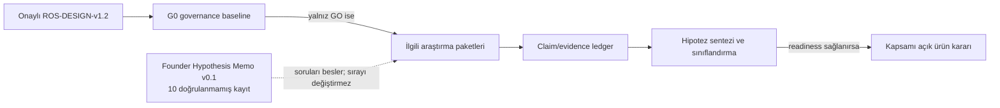

# Founder Hypothesis Memo v0.1 — Intake ve Kanıt Kuyruğu

**Artifact ID:** `FHM-0.1-INTAKE-001`
**Tarih:** 2026-08-11
**Durum:** `INTAKE_QUEUED / UNVERIFIED / NOT_ACTIVE`
**Parent:** `ROS-DESIGN-v1.2`
**G0 durumu:** `NO-GO FOR RESEARCH COLLECTION`
**Kaynak olayı:** `SRC-FHM-000/001/002`, Founder/user mesajı, 2026-08-11
**Genel güven:** `LOW — fikirlerin ürün değeri henüz araştırılmadı`

> Bu belge ürün gereksinimi, özellik listesi, roadmap, öncelik kararı, mimari karar veya geliştirme yetkisi değildir. Founder'ın on fikrini anlam kaybı olmadan araştırılabilir hipotez kayıtlarına dönüştürür. Hiçbir hipotez kabul edilmiş sayılmaz; araştırma sırası değişmez.

## 1. Kesin sınırlar

| Kontrol | Kayıt | Kaynak / tarih / güven |
|---|---|---|
| Ürün gereksinimi mi? | Hayır | `SRC-FHM-000`, 2026-08-11, `HIGH` |
| Roadmap'e eklendi mi? | Hayır | `SRC-FHM-000/002`, 2026-08-11, `HIGH` |
| Mimari veya teknoloji seçildi mi? | Hayır | `SRC-FHM-000`, 2026-08-11, `HIGH` |
| Rakip araştırması yapıldı mı? | Hayır; bu memo yalnız intake kaydıdır | Bu artifact'ın provenance kaydı, 2026-08-11, `HIGH` |
| Kullanıcı yorumu toplandı mı? | Hayır | Bu artifact'ın provenance kaydı, 2026-08-11, `HIGH` |
| Altı sınıflı evidence değerlendirmesi yapıldı mı? | Hayır; tümü `NOT_YET_ELIGIBLE` | G0 ve ROS readiness kontrolü, 2026-08-11, `HIGH` |
| Deney başlatıldı mı? | Hayır; deney önerileri dahi protokol değildir | G0 `NO-GO`, 2026-08-11, `HIGH` |
| Önceki araştırma kullanıldı mı? | Hayır; pre-ROS materyal karantinada kaldı | ROS provenance kuralı, 2026-08-11, `HIGH` |
| Araştırma sırası değişti mi? | Hayır | `SRC-FHM-000` + ROS dependency DAG, 2026-08-11, `HIGH` |

Bu tablodaki “güven”, ürün hipotezinin doğruluğuna değil kayıt/provenance doğruluğuna ilişkindir.

## 2. İddia türlerinin ayrımı

1. **Founder hypothesis:** Ürün değeri hakkında henüz doğrulanmamış önerme. Kaynağı `SRC-FHM-001#H01–H10` exact local source snapshot'ıdır; varsayılan güven `LOW`.
2. **Codex testability expansion:** “Sağlayabilir” biçimindeki ölçülebilir sonuç, risk ayrıştırması ve çürütücü koşullar Founder'ın kesin iddiası değil, fikri doğrulanabilir kılan Codex sentezidir. Kaynak `Codex intake transformation`, tarih 2026-08-11, güven `LOW`.
3. **Governance mapping:** Hipotezin hangi ROS paketleri ve karar kapıları tarafından inceleneceğine ilişkin iç süreç sınıflaması. Kaynak `ROS-DESIGN-v1.2 + Codex mapping`, tarih 2026-08-11, güven `MEDIUM`; ürün kanıtı değildir.
4. **Evidence claim:** Birincil/ikincil kaynak veya kullanıcı verisine dayanan doğrulanabilir iddia. Bu memoda **yoktur**.
5. **Product decision:** Readiness ve karar protokolü geçmiş, kapsamı açık karar. Bu memoda **yoktur**.

Her hipotezin mevcut değerlendirme etiketi: **`NOT_YET_ELIGIBLE — kanıt paketi açılmadı`**.

## 3. Gelecekte kullanılabilecek sınıflandırma sözlüğü

Aşağıdaki etiketler yalnız gerekli paketler tamamlandığında ve claim ledger kaynaklarıyla desteklendiğinde atanabilir:

- `Evidence-supported`
- `Promising but unvalidated`
- `Already commoditized`
- `High-risk/high-cost`
- `Later-stage`
- `Reject or substantially redesign`

Bir hipotez birden fazla eksende farklı sonuç verebileceğinden, nihai rapor bir **ana etiket** ve gerekçeli **ikincil uyarılar** taşıyabilir. Etiket, kaynaksız uzman görüşüyle atanamaz.

## 4. Aday karşılaştırma evreni — araştırma yapılmış sayılmaz

Founder tarafından aday gösterilen ürünler: **Tandem, HelloTalk, Lingbe, Hilokal, italki, Preply, Cambly, Busuu, Duolingo, Speak ve ELSA**; ayrıca ilgili doğrudan/dolaylı rakipler.

Bu liste:

- rakiplerin bu hipotezleri gerçekten uyguladığını iddia etmez;
- evrenin eksiksiz olduğunu iddia etmez;
- ekran, akış, fiyat, politika veya kullanıcı görüşü hakkında kanıt içermez;
- MKT-01 kapsamlandırması ve örnekleme protokolü geçmeden genişletilemez ya da daraltılamaz.

**Kaynak / tarih / güven:** `SRC-FHM-002`, Founder/user mesajı, 2026-08-11, `HIGH` (yalnız aday listenin aktarım doğruluğu için).

## 5. Her hipotez için zorunlu gelecek kanıt zarfı

Her kayıt, sınıflandırılmadan önce aşağıdaki alanların tamamını doldurmalıdır:

| Alan | Minimum kayıt |
|---|---|
| Kullanıcı problemi | Segment, JTBD, bağlam, sıklık/şiddet ve negatif kontrol |
| Mevcut rakipler | Exact ürün/sürüm/platform/tarih; incelenen ekran ve akış |
| Olumlu kullanıcı kanıtı | Kaynak, tarih, ülke/platform, örnekleme yöntemi, sayım, tema, temsil sınırı |
| Olumsuz kullanıcı kanıtı | Aynı provenance; şikâyet şiddeti, tekrar, alternatif açıklamalar |
| Öğrenme bilimi | Birincil çalışma/derleme, popülasyon, müdahale, sonuç, etki ve transfer sınırı |
| Teknik maliyet | Sadece ilgili teknik keşif paketinden aralık, varsayım ve hassasiyet |
| AI maliyeti | Model/vendor bağımsız workload; kalite-latency-cost senaryoları |
| Güvenlik riski | Tehdit modeli, harm taxonomy, residual risk, operasyon ve kill switch |
| Hukuki/platform riski | Yetki alanı, güncel politika metni, tarih, hukukçu gerektiren hususlar |
| Fraud riski | Aktör, teşvik, saldırı yolu, tespit/önleme, yanlış pozitif ve zarar üst sınırı |
| Bağımlılıklar | ROS contract/Dxx readiness ve çözülmemiş blokörler |
| Doğrulama deneyi | Ön kayıtlı önerme, metrik, guardrail, örneklem, stop rule, falsifier ve etik onay |

Eksik alan “yok” diye doldurulamaz; `NOT_RESEARCHED`, `NOT_APPLICABLE` veya `INCONCLUSIVE` ve gerekçe kullanılır.

## 6. Hipotez kayıtları

### HYP-FHM-001 — Yeterlilik puanı ile oyun metriklerini ayırma

**Nötr hipotez:** XP, streak ve uygulama içi ekonomiden ayrı; listening, reading, speaking, pronunciation, writing, grammar ve vocabulary boyutlarını ayrı değerlendiren ve mümkünse CEFR can-do tanımlarına bağlanan bir yeterlilik modeli, etkinlik puanına kıyasla gerçek dil becerisini daha geçerli ve anlaşılır biçimde temsil edebilir.

| Alan | Intake kaydı |
|---|---|
| Kanıt durumu | `UNVERIFIED / NOT_YET_ELIGIBLE` |
| Founder kaynağı | `SRC-FHM-001#H01`, 2026-08-11, güven `LOW` (ürün doğruluğu) |
| Risk ön sınıfı | `R2 candidate`; sertifikasyon, yüksek etkili kullanım veya otomatik speaking/pronunciation puanında `R3 candidate` |
| Birincil ROS paketleri | `PED-05`, `ASM-06`, `CNT-20A`, `DAT-25` |
| Koşullu paketler | `AIC-08B/C`, `VOI-09`, `ACC-21B`, `GTM-24` |
| Karar bağı | Birincil `D06`; koşullu `D10`, `D14`, `D16` |
| Çürütücü koşullar | Geçerlik, güvenirlik, adalet veya transfer kurulamaması; mobil ölçümün becerileri ayıramaması; kullanıcının puanı yine XP gibi yorumlaması |
| En erken değerlendirme kapısı | İlgili PED+ASM+CNT+DAT çıktıları `D06 DISCOVERY_READY`; speech scoring için ayrıca AIC+VOI+ACC üzerinden `D10` |
| Deney durumu | `NOT_DESIGNED / NOT_AUTHORIZED` |

Risk/paket/karar eşlemesi ürün kanıtı değil, `ROS-DESIGN-v1.2 + Codex mapping`, 2026-08-11, güven `MEDIUM` olan yönetişim kaydıdır.

### HYP-FHM-002 — Ayrı uygulama içi ekonomi

**Nötr hipotez:** Kullanıcıların günlük öğrenme görevleri veya başkalarına dil yardımı karşılığında, XP ve yeterlilikten ayrı bir para kazanması ve anlamlı fakat dengeli kullanım/sink alanlarında harcaması; enflasyon, bot, collusion, fraud, kalite ve operasyon maliyeti kabul edilebilir tutulabilirse öğrenme ve faydalı katkıyı destekleyebilir. Satın alınabilirlik ve nakde çevrilebilirlik birbirinden ayrı ve daha yüksek riskli varyantlardır; paranın nerede harcanacağı ayrıca araştırılmalıdır.

| Alan | Intake kaydı |
|---|---|
| Kanıt durumu | `UNVERIFIED / NOT_YET_ELIGIBLE` |
| Founder kaynağı | `SRC-FHM-001#H02`, 2026-08-11, güven `LOW` |
| Risk ön sınıfı | Kapalı, satın alınamaz/nakde çevrilemez sistem `R2 candidate`; satın alınabilir veya cash-out varyantı `R3 candidate` |
| Birincil ROS paketleri | `RET-19`, `PRI-15`, `ECO-16`, `SEC-11B`, `PAY-17`, `STR-18`, `LAW-27A/B`, `DAT-25` |
| Koşullu paketler | `TUT-07A`, `MOD-14`, `OPS-23C`, `PRV-13A` |
| Karar bağı | Birincil `D09`, `D13`; koşullu `D07`, `D08`, `D12`, `D15`, `D17` |
| Çürütücü koşullar | Ölçülebilir öğrenme/katkı/retention değeri olmaması; anlamlı sink kurulamaması veya sink'lerin öğrenmeyi bozması; reward hunting; kontrol edilemeyen enflasyon/bot/collusion; hukuk, store veya destek yükünün değeri aşması |
| En erken değerlendirme kapısı | İlgili `D09/D13 DISCOVERY_READY`; purchase/cash-out ancak PAY+STR validasyonu ve hukuk/vergi incelemesinden sonra |
| Deney durumu | `NOT_DESIGNED / NOT_AUTHORIZED` |

Risk/paket/karar eşlemesi: `ROS-DESIGN-v1.2 + Codex mapping`, 2026-08-11, güven `MEDIUM`.

### HYP-FHM-003 — Guided Language Exchange

**Nötr hipotez:** Ana yapılandırılmış eğitim sistemine ek olarak; seviye, ana dil, hedef dil, öğrenilen konu ve güven sinyaline göre eşleştirilmiş, süreli ve yapılandırılmış text/voice ve daha sonra olası video oturumları, anonim ve rastgele sohbete göre daha güvenli ve daha verimli pratik sağlayabilir.

| Alan | Intake kaydı |
|---|---|
| Kanıt durumu | `UNVERIFIED / NOT_YET_ELIGIBLE` |
| Founder kaynağı | `SRC-FHM-001#H03`, 2026-08-11, güven `LOW` |
| Risk ön sınıfı | `R3 candidate` |
| Birincil ROS paketleri | `USR-02`, `TUT-07B/C`, `SEC-11C`, `MOD-14`, `CHD-12`, `PRV-13A/B/C`, `STR-18`, `OPS-23B`, `DAT-25` |
| Koşullu paketler | `VOI-09`, `ECO-16`, `REL-22` |
| Karar bağı | Birincil `D08`; koşullu `D04`, `D05`, `D07`, `D10`, `D12`, `D15`, `D17` |
| Çürütücü koşullar | Kalite, tamamlama, öğrenme veya güvenlik avantajı olmaması; eşleşme likiditesinin yetersizliği; bias, taciz ya da moderasyon yükünün kabul edilemezliği; voice/video riskinin faydayı aşması |
| En erken değerlendirme kapısı | İlgili `D08 DISCOVERY_READY`; voice/video için ayrıca `D10/D12` |
| Deney durumu | `NOT_DESIGNED / NOT_AUTHORIZED`; insan deneyi G0 ve etik kapıları geçmeden kurulamaz |

Risk/paket/karar eşlemesi: `ROS-DESIGN-v1.2 + Codex mapping`, 2026-08-11, güven `MEDIUM`.

### HYP-FHM-004 — Helper, native speaker ve tutor rollerini ayırma

**Nötr hipotez:** Language helper, verified native speaker ve verified tutor rollerini; role özel doğrulama, puanlama ve kötüye kullanım kontrolleriyle ayırmak beklenti doğruluğu ve güveni artırabilir, ancak meşru yardımcıları dışlamamalı ve orantısız operasyon yükü yaratmamalıdır.

| Alan | Intake kaydı |
|---|---|
| Kanıt durumu | `UNVERIFIED / NOT_YET_ELIGIBLE` |
| Founder kaynağı | `SRC-FHM-001#H04`, 2026-08-11, güven `LOW` |
| Risk ön sınıfı | `R3 candidate` |
| Birincil ROS paketleri | `TUT-07A/B/C`, `SEC-11C`, `MOD-14`, `OPS-23A/B`, `LAW-27D`, `ECO-16`, `ORG-26` |
| Koşullu paketler | `PRV-13A/B/C`, `DAT-25` |
| Karar bağı | Birincil `D07`; koşullu `D05`, `D08`, `D12`, `D15`, `D17` |
| Çürütücü koşullar | Etiketlerin beklenti/güveni iyileştirmemesi; “native” doğrulamasının geçersiz veya ayrımcı olması; spoofing/yanlış ret; rating bias/retaliation; maliyetin değeri aşması |
| En erken değerlendirme kapısı | İlgili `D07 DISCOVERY_READY` |
| Deney durumu | `NOT_DESIGNED / NOT_AUTHORIZED` |

Risk/paket/karar eşlemesi: `ROS-DESIGN-v1.2 + Codex mapping`, 2026-08-11, güven `MEDIUM`.

### HYP-FHM-005 — AI Lesson Studio

**Nötr hipotez:** Her ders veya konu bağlamında kullanıcının seçtiği ya da AI'ya belirttiği zorlanma noktasını daha basit açıklama, sesli özet, mini podcast, sesli egzersiz, quiz, test, sözlü sınav, role-play veya yalnız hatalara yönelik çalışmaya dönüştüren bir stüdyo; doğruluk, ölçme geçerliği, bilişsel yük, latency ve maliyet sınırları içinde statik tekrardan daha iyi anlama, retention veya transfer sağlayabilir.

| Alan | Intake kaydı |
|---|---|
| Kanıt durumu | `UNVERIFIED / NOT_YET_ELIGIBLE` |
| Founder kaynağı | `SRC-FHM-001#H05`, 2026-08-11, güven `LOW` |
| Risk ön sınıfı | `R3 candidate` |
| Birincil ROS paketleri | `PED-05`, `ASM-06`, `AIC-08A/B/C`, `VOI-09`, `CNT-20A/B`, `DAT-25`, `REL-22` |
| Koşullu paketler | `PRV-13A/D`, `ACC-21A/B`, `ECO-16`, `VEN-29`, `CNT-20C` |
| Karar bağı | Birincil `D06`, `D10`; koşullu `D11`, `D12`, `D14`, `D15`, `D17` |
| Çürütücü koşullar | Gecikmeli öğrenme/transfer üstünlüğü olmaması; AI hatası veya geçersiz ölçme; modalite parçalanması/bilişsel yük; voice gizlilik, maliyet veya latency sınırlarının aşılması |
| En erken değerlendirme kapısı | İlgili `D06/D10 DISCOVERY_READY` |
| Deney durumu | `NOT_DESIGNED / NOT_AUTHORIZED` |

Risk/paket/karar eşlemesi: `ROS-DESIGN-v1.2 + Codex mapping`, 2026-08-11, güven `MEDIUM`.

### HYP-FHM-006 — Doğrulanmış curriculum/skill graph üzerinde grounded AI

**Nötr hipotez:** Uzmanlarca doğrulanmış bir curriculum/skill graph'ı ana kaynak tutup AI'yı yalnız grounded kişiselleştirilmiş açıklama, örnek ve egzersiz varyasyonlarıyla sınırlamak; structured output, doğrulama, eval, regression, fallback ve insan denetimiyle birlikte, kişiselleştirme hızını korurken desteklenmeyen veya pedagojik açıdan hatalı çıktıları azaltabilir.

| Alan | Intake kaydı |
|---|---|
| Kanıt durumu | `UNVERIFIED / NOT_YET_ELIGIBLE` |
| Founder kaynağı | `SRC-FHM-001#H06`, 2026-08-11, güven `LOW` |
| Risk ön sınıfı | `R3 candidate` |
| Birincil ROS paketleri | `PED-05`, `ASM-06`, `AIC-08A/B/C`, `CNT-20A/B/C`, `REL-22`, `OPS-23D` |
| Koşullu paketler | `PRV-13A/D`, `LAW-27C`, `VEN-29`, `ECO-16`, `ORG-26` |
| Karar bağı | Birincil `D06`, `D10`, `D14`; koşullu `D11`, `D12`, `D15`, `D17` |
| Çürütücü koşullar | Grounding'in unsupported içeriği yeterince azaltmaması; graph'ın yanlış/eksik/eski olması; validator'ların hata kaçırması; kişiselleştirme veya doğallığın bozulması; QA/latency/maliyetin alternatifi aşması |
| En erken değerlendirme kapısı | İlgili `D06/D10/D14 DISCOVERY_READY` |
| Deney durumu | `NOT_DESIGNED / NOT_AUTHORIZED` |

Risk/paket/karar eşlemesi: `ROS-DESIGN-v1.2 + Codex mapping`, 2026-08-11, güven `MEDIUM`.

### HYP-FHM-007 — Tek kişiselleştirilmiş Daily Mission

**Nötr hipotez:** Grammar, vocabulary, writing, listening ve speaking için günlük oyun ve aktiviteleri kişisel hata ve tekrar geçmişinden seçilen tek bir Daily Mission içinde birleştirmek, çok sayıda ayrı görev hissini azaltırken sürdürülebilir pratik ve dengeli beceri gelişimi sağlayabilir.

| Alan | Intake kaydı |
|---|---|
| Kanıt durumu | `UNVERIFIED / NOT_YET_ELIGIBLE` |
| Founder kaynağı | `SRC-FHM-001#H07`, 2026-08-11, güven `LOW` |
| Risk ön sınıfı | `R2 candidate` |
| Birincil ROS paketleri | `PED-05`, `ASM-06`, `RET-19`, `DAT-25` |
| Koşullu paketler | `CNT-20A/B`, `AIC-08A/B/C`, `PRV-13A`, `ACC-21A/B` |
| Karar bağı | Birincil `D06`; koşullu `D09`, `D12`, `D14`, `D15`, `D16` |
| Çürütücü koşullar | Görev yükü hissinin sürmesi; bazı becerilerin sistematik ihmal edilmesi; engagement'ın öğrenmeye transfer etmemesi; hata geçmişinin yanlış/adaletsiz atama üretmesi; sistemi oyunlaştırarak kandırma |
| En erken değerlendirme kapısı | `D06 DISCOVERY_READY`; ekonomiye bağlıysa ayrıca `D09` |
| Deney durumu | `NOT_DESIGNED / NOT_AUTHORIZED` |

Risk/paket/karar eşlemesi: `ROS-DESIGN-v1.2 + Codex mapping`, 2026-08-11, güven `MEDIUM`.

### HYP-FHM-008 — Ünite sonu hikâyeli ve kümülatif mini oyunlar

**Nötr hipotez:** Ünite sonunda öğrenilenleri gerçek hayat senaryosunda kullandıran hikâyeli mini oyunlar ve birkaç ünitede bir kümülatif senaryolar, gecikmeli transfer ve engagement'ı artırabilir. Hikâye, quiz veya konuşma formatı seçilebilse de ölçülen beceriye uygun olmayan format aynı yeterlilik kanıtını vermemelidir.

| Alan | Intake kaydı |
|---|---|
| Kanıt durumu | `UNVERIFIED / NOT_YET_ELIGIBLE` |
| Founder kaynağı | `SRC-FHM-001#H08`, 2026-08-11, güven `LOW` |
| Risk ön sınıfı | Genel tasarım `R2 candidate`; yüksek etkili veya otomatik speaking scoring `R3 candidate` |
| Birincil ROS paketleri | `PED-05`, `ASM-06`, `CNT-20A/B`, `DAT-25`, `RET-19` |
| Koşullu paketler | `AIC-08B/C`, `VOI-09`, `ACC-21A/B` |
| Karar bağı | Birincil `D06`; koşullu `D10`, `D14`, `D15`, `D16` |
| Çürütücü koşullar | Gecikmeli transfer artmaması; format seçiminin ölçülen beceriden kaçış sağlaması; skorların karşılaştırılamaz/geçersiz olması; speech değerlendirmesinin adaletsiz/güvenilmez olması; içerik QA maliyetinin faydayı aşması |
| En erken değerlendirme kapısı | `D06 DISCOVERY_READY`; speech scoring için ayrıca `D10` |
| Deney durumu | `NOT_DESIGNED / NOT_AUTHORIZED` |

Risk/paket/karar eşlemesi: `ROS-DESIGN-v1.2 + Codex mapping`, 2026-08-11, güven `MEDIUM`.

### HYP-FHM-009 — Tekrar kullanılabilir Scenario Engine

**Nötr hipotez:** Ortam, karakter, amaç, hedef dil yapıları, dallanan seçenekler, yazılı/sesli cevaplar, sonuçlar ve ölçme rubriğini bileşenleştiren tekrar kullanılabilir bir Scenario Engine; çeşitlilik, doğallık ve ölçme geçerliğini koruyabilirse her ders için sıfırdan üretime kıyasla içerik ve QA yükünü azaltabilir.

| Alan | Intake kaydı |
|---|---|
| Kanıt durumu | `UNVERIFIED / NOT_YET_ELIGIBLE` |
| Founder kaynağı | `SRC-FHM-001#H09`, 2026-08-11, güven `LOW` |
| Risk ön sınıfı | Deterministik sürüm `R2 candidate`; generative branching veya voice assessment `R3 candidate` |
| Birincil ROS paketleri | `PED-05`, `ASM-06`, `CNT-20A/B`, `AIC-08A/B/C`, `REL-22`, `ECO-16` |
| Koşullu paketler | `VOI-09`, `MOB-10`, `ACC-21A/B`, `LAW-27C`, `VEN-29` |
| Karar bağı | Birincil `D06`, `D10`, `D14`; koşullu `D11`, `D15`, `D17` |
| Çürütücü koşullar | Tekrarlılık; kültürel/dilsel kalite düşüşü; kombinatoryal QA'nın büyümesi; rubriklerin geçersizliği; toplam maliyetin düşmemesi |
| En erken değerlendirme kapısı | İlgili `D06/D10/D14 DISCOVERY_READY`; voice/runtime için ayrıca `D11` |
| Deney durumu | `NOT_DESIGNED / NOT_AUTHORIZED` |

Risk/paket/karar eşlemesi: `ROS-DESIGN-v1.2 + Codex mapping`, 2026-08-11, güven `MEDIUM`.

### HYP-FHM-010 — Güvenliği sosyal ürünün temel mimarisi yapmak

**Nötr hipotez:** Yaş doğrulama ve yaş grubu ayrımı, ilk sosyal betayı 18+ sınırlama, block/report/mute/leave, uygunsuz içerik ve çıplaklık algılama, harassment/grooming/scam/dating kontrolleri, hesap ve yardımcı doğrulaması, moderasyon/itiraz, veri minimizasyonu ve görüşme kaydı yönetimi ile güncel Apple/Google UGC kurallarını birlikte ele alan safety-by-design yaklaşımı; yanlış pozitif, dışlama, mahremiyet ve operasyon maliyeti kabul edilebilirken olay riskini kabul edilebilir düzeye indirebilir.

| Alan | Intake kaydı |
|---|---|
| Kanıt durumu | `UNVERIFIED / NOT_YET_ELIGIBLE` |
| Founder kaynağı | `SRC-FHM-001#H10`, 2026-08-11, güven `LOW` |
| Risk ön sınıfı | `R3 candidate` |
| Birincil ROS paketleri | `SEC-11A/C`, `CHD-12`, `PRV-13A/B/C/D`, `MOD-14`, `STR-18`, `OPS-23B/D`, `DAT-25`, `REL-22`, `ORG-26` |
| Koşullu paketler | `USR-02`, `PAY-17`, `LAW-27A/B`, `ECO-16`, `VEN-29` |
| Karar bağı | Birincil `D04`, `D08`, `D12`; koşullu `D11`, `D13`, `D15`, `D17` |
| Çürütücü koşullar | Yaş/hesap kontrollerinin kolay aşılması; residual harm'ın kabul edilemezliği; detection/appeal yükünün yönetilememesi; kayıt politikasının minimizasyonla çatışması; store/hukuk blokörü; sürdürülemez moderasyon kapasitesi veya SLA |
| En erken değerlendirme kapısı | İlgili `D04/D08/D12 DISCOVERY_READY`; beta/launch değerlendirmesi için ayrıca `D15` |
| Deney durumu | `NOT_DESIGNED / NOT_AUTHORIZED`; çocuklar veya gerçek sosyal etkileşimle deney ayrıca etik ve insan sign-off olmadan yasak |

Risk/paket/karar eşlemesi: `ROS-DESIGN-v1.2 + Codex mapping`, 2026-08-11, güven `MEDIUM`.

## 7. Bağımlılık görünümü

Bu memo ROS DAG'ına yeni hard edge eklemez. Hipotezler mevcut paketlerden doğacak kanıtı **tüketen** kuyruk kayıtlarıdır. Parent paket isimleri yalnız routing ipucudur; exact faz, artifact sürümü ve contract kesiti ilgili protokolde ayrıca pinlenmedikçe dependency sayılmaz.

**Mevcut konum:** G0 `NO-GO`; bu nedenle oklar üzerinde gerçek collection, sentez, sınıflandırma veya karar hareketi yoktur.

### 7.1 Queue aktivasyon kapısı

Bir `HYP-FHM-*` kaydı doğrudan package scope'u, öncelik, örneklem, arama terimi, claim veya hard upstream artifact olamaz. Aktivasyon yalnız şu sırayla gerçekleşebilir:

1. `G0-GOVERNANCE-BASELINE APPROVED` oluşur.
2. Package Lead, hipotezi ilgili mevcut paket sorusuna yönlendirir; yeni soru gerekiyorsa change control açar.
3. Methods/QA, kapsamın Founder fikrini doğrulamaya çalışan confirmation bias üretip üretmediğini denetler ve karşı örnek aramasını zorunlu kılar.
4. Dependency, örneklem, kaynak evreni, stop rule, bütçe ve etik/ToS sınırlarıyla sürümlü protokol `PROTOCOL_REVIEW` geçirir.
5. Yalnız `APPROVED_TO_COLLECT` sonrasında kayıt aktif araştırma sorusuna dönüşebilir.

Aday rakip listesi yalnız seed'dir; MKT-01 bağımsız kategori/alternatif evreni ve negatif örnekleri kurmak zorundadır.

## 8. Sentez ve sınıflandırma için tamamlanma kriterleri

Bir hipotez ancak aşağıdakilerin tümü sağlandığında “raporlanmaya hazır” olabilir:

1. İlgili ROS paketleri kendi discovery/validation readiness koşullarını geçer.
2. Rakip ekran/akış gözlemleri ürün, sürüm, platform ve tarih provenance'ıyla kaydedilir.
3. Olumlu ve olumsuz kullanıcı yorumları önceden tanımlı örneklem ve codebook ile incelenir; platform bias'ı ve survivorship bias raporlanır.
4. Öğrenme bilimi iddiaları popülasyon, müdahale, outcome ve transfer sınırıyla ayrıştırılır.
5. Teknik, AI ve operasyon maliyetleri tek sayı değil aralık/senaryo ve hassasiyetle verilir.
6. Güvenlik, hukuk/platform ve fraud kayıtları ilgili risk seviyesinin insan sign-off koşulunu karşılar.
7. En güçlü alternatif açıklama ve falsifier red-team incelemesinden geçer.
8. Her sentez cümlesi kaynak, yayın/erişim tarihi ve güven düzeyi taşır.
9. Kanıt yetersizse etiket zorlanmaz; `INCONCLUSIVE` kullanılır.
10. Nihai sınıflandırma ürün kararı yerine geçmez; karar kapsamı ayrıca kanonik `Decision Card / READY_FOR` sürecinden geçer.

## 9. Queue hükmü

| Kayıt | Hüküm |
|---|---|
| `FHM-0.1-INTAKE-001` | `LOGGED IN INACTIVE HYPOTHESIS QUEUE` |
| On hipotez | `UNVERIFIED / NOT_YET_ELIGIBLE` |
| Araştırma sırası | `UNCHANGED` |
| MKT-01 veya başka package collection | `NOT_STARTED` |
| Kod/repo/stack/roadmap | `NONE` |
| Bir sonraki izinli hareket | G0 gerçek-insan RACI blokörünü kapatmak veya exact kapsamı/formel diff'i yazılmış dar `CR-G0-001` önerisini değerlendirmek |

## Appendix 0 — Founder handling directive snapshot

**Source ID:** `SRC-FHM-000`
**Kaynak:** Founder/user message, 2026-08-11
**Platform turn/message ID:** Bu arayüzde sunulmadı
**Capture niteliği:** Exact lexical içerik
**Güven:** `HIGH` source-fidelity

> Mevcut araştırma görevini tamamladıktan sonra aşağıdaki fikirleri “kesin ürün gereksinimleri” olarak değil, Founder Hypothesis Memo v0.1 olarak değerlendir. Bunları hemen uygulama, mimariyi bunlara göre erken kilitleme ve mevcut araştırma sırasını bozma.

## Appendix A — Founder source snapshot

**Source ID:** `SRC-FHM-001`
**Kaynak:** Founder/user message, 2026-08-11
**Platform turn/message ID:** Bu arayüzde sunulmadı
**Capture niteliği:** Exact lexical içerik; yalnız blockquote/list Markdown sunumu normalize edildi
**Güven:** `HIGH` source-fidelity; içerikteki ürün iddiaları için güven üretmez

### `SRC-FHM-001#H01`

> Uygulamada gerçek dil yeterliliğini gösteren seviyeler/puanlar bulunabilir. Yeterlilik puanı; XP, streak ve uygulama içi paradan ayrı olmalıdır. Listening, reading, speaking, pronunciation, writing, grammar ve vocabulary becerilerinin ayrı değerlendirilmesi ve mümkünse CEFR can-do tanımlarına dayanması araştırılmalıdır.

### `SRC-FHM-001#H02`

> Ayrı bir uygulama içi ekonomi bulunabilir. Kullanıcılar günlük öğrenme görevlerini tamamlayarak veya diğer kullanıcılara kendi bildikleri dilde yardımcı olarak uygulama parası kazanabilir. Paranın nerede harcanacağı, enflasyon/fraud/collusion/bot riskleri, satın alınabilir ya da nakde çevrilebilir olması hâlinde doğacak App Store, Google Play, ödeme, vergi ve hukuki yükümlülükler araştırılmalıdır.

### `SRC-FHM-001#H03`

> Ana yapılandırılmış eğitim sistemine ek olarak kullanıcıların birbirleriyle text, voice ve ileride video üzerinden pratik yapabileceği bir language exchange alanı bulunabilir. Bu alan serbest ve anonim rastgele sohbetten ziyade; seviye, hedef dil, ana dil, öğrenilen konu ve güven puanına göre eşleştirilmiş, süreli ve yapılandırılmış “Guided Language Exchange” oturumları şeklinde düşünülebilir.

### `SRC-FHM-001#H04`

> Başka kullanıcılara yardımcı olan herkes doğrudan “teacher” sayılmamalıdır. Language helper, verified native speaker ve verified tutor rolleri arasındaki ayrım; doğrulama, puanlama ve kötüye kullanım riskleri araştırılmalıdır.

### `SRC-FHM-001#H05`

> Her ders veya konu için NotebookLM benzeri bir AI Lesson Studio bulunabilir. Kullanıcı takıldığı bölümü seçerek ya da AI’ya söyleyerek:
>
> - daha basit açıklama,
> - sesli özet,
> - mini podcast,
> - sesli egzersiz,
> - quiz,
> - test,
> - sözlü sınav,
> - role-play,
> - yalnızca yaptığı hatalara yönelik çalışma
>
> oluşturabilmelidir.

### `SRC-FHM-001#H06`

> AI ana müfredatı serbestçe üretmemelidir. Uzmanlarca doğrulanmış bir curriculum/skill graph ana kaynak olmalı; AI yalnızca bunun üzerinden kişiselleştirilmiş açıklamalar, örnekler ve egzersiz varyasyonları oluşturmalıdır. Grounding, structured output, doğrulama, eval, regression test, fallback ve insan denetimi gereksinimleri araştırılmalıdır.

### `SRC-FHM-001#H07`

> Grammar, vocabulary, writing, listening ve speaking için günlük oyunlar ve aktiviteler bulunabilir. Bunun kullanıcıyı çok sayıda ayrı görevle bunaltmadan, kişisel hata ve tekrar geçmişine göre oluşturulan tek bir Daily Mission içinde nasıl sunulabileceği değerlendirilmelidir.

### `SRC-FHM-001#H08`

> Her ünitenin sonunda o ünitede öğrenilenleri gerçek hayat senaryosunda kullandıran hikâyeli mini oyunlar bulunabilir. Birkaç ünitede bir önceki üniteleri de kapsayan kümülatif senaryolar yapılabilir. Kullanıcı çalışma biçimi olarak hikâye, quiz veya konuşmalı pratik seçebilir; ancak ölçülen beceriye uygun olmayan bir formatın aynı yeterlilik puanını vermemesi gerekir.

### `SRC-FHM-001#H09`

> Hikâye ve mini oyunların her ders için sıfırdan üretilmesi yerine tekrar kullanılabilir bir Scenario Engine yaklaşımı araştırılmalıdır: ortam, karakter, amaç, hedeflenen dil yapıları, dallanan seçenekler, sesli/yazılı cevaplar, sonuçlar ve ölçme rubriği.

### `SRC-FHM-001#H10`

> Sosyal özellik için güvenlik temel ürün mimarisinin parçası olmalıdır. Özellikle:
>
> - yaş doğrulama ve yaş gruplarını ayırma,
> - ilk sosyal betanın 18+ olması,
> - block/report/mute/leave,
> - uygunsuz içerik ve çıplaklık algılama,
> - taciz, grooming, dolandırıcılık ve flört amaçlı kötüye kullanım,
> - hesap ve öğretici doğrulaması,
> - moderasyon operasyonu ve itiraz sistemi,
> - veri minimizasyonu ve görüşme kayıtlarının yönetimi,
> - Apple ve Google kullanıcı içeriği politikaları
>
> incelenmelidir.

Bu snapshot'ın üstündeki nötr hipotez cümleleri ve bütün risk/falsifier/paket/karar eşlemeleri Codex tarafından üretilmiş araştırma-operasyon katmanıdır; Founder'a atfedilmez.

## Appendix B — Founder comparison/reporting directive snapshot

**Source ID:** `SRC-FHM-002`
**Kaynak:** Founder/user message, 2026-08-11
**Platform turn/message ID:** Bu arayüzde sunulmadı
**Capture niteliği:** Exact lexical içerik; yalnız blockquote/list Markdown sunumu normalize edildi
**Güven:** `HIGH` source-fidelity; rakipler hakkında kanıt üretmez

> Bu hipotezleri Tandem, HelloTalk, Lingbe, Hilokal, italki, Preply, Cambly, Busuu, Duolingo, Speak, ELSA ve ilgili rakiplerin mevcut özellikleri ve özellikle kullanıcı yorumlarıyla karşılaştır.
>
> Her hipotezi şu sınıflardan biriyle raporla:
>
> - Evidence-supported
> - Promising but unvalidated
> - Already commoditized
> - High-risk/high-cost
> - Later-stage
> - Reject or substantially redesign
>
> Her biri için kullanıcı problemi, mevcut rakip uygulamalar, olumlu/olumsuz kullanıcı kanıtları, öğrenme bilimi desteği, teknik maliyet, AI maliyeti, güvenlik riski, hukuki/platform riski, fraud riski, bağımlılıklar ve doğrulama deneyi belirt.
>
> Bu aşamada kod yazma veya bu özellikleri kesin roadmap’e ekleme. Mevcut araştırma sistemini tamamla; daha sonra bu notu onun içine hipotez ve kanıt kuyruğu olarak yerleştir.
