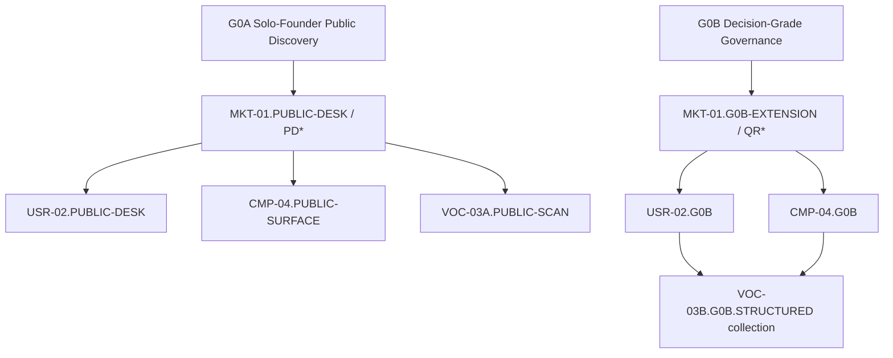

# ROS-DESIGN-v1.3-CANDIDATE — Exact Semantic Diff

**Artifact ID:** `ROS-DESIGN-v1.3-CANDIDATE-DIFF-001`
**Tarih:** 2026-08-11
**Durum:** `CANDIDATE / NOT_APPROVED / NO_EFFECT / NO_COLLECTION`
**Parent:** `ROS-DESIGN-v1.2 APPROVED`
**Parent dosya:** `01_arastirma_isletim_sistemi.md`
**Parent SHA-256:** `6433B02B131F84A5DD204DB5ECB4D66EA300AFD70BD0781CC58DBE74824FA56B`
**Değişiklik kaynağı:** Founder/user `REVISE` talimatı, 2026-08-11
**Yerini alması önerilen talep:** `CR-G0-001-v0.1`; mevcut statüsü `REVISE_REQUESTED`, yürürlük yok

> Bu artifact onaylı ROS'u değiştirmez. Aşağıdaki patch ancak Founder/user ayrıca `ROS-DESIGN-v1.3-CANDIDATE APPROVED` derse normatif baseline olabilir. Candidate onayı dahi MKT-01 collection'ı otomatik başlatmaz; önce G0A dry-run ve MKT-01 protokol onayı gerekir.

## 1. Diff uygulama kuralı

- Bu dosyada `REPLACE`, `ADD AFTER`, `ADD BEFORE` veya `DELETE` olarak yazılmayan v1.2 metni **aynen korunur**.
- Historical artifact ID, hash ve audit kayıtları yeniden yazılmaz.
- Yeni politika metinleri ampirik bulgu değildir: kaynak `Founder directive + Codex operationalization`, tarih 2026-08-11, statü `PROPOSED`; güven puanı uygulanmaz.
- G0A, G0B'nin waiver'ı değildir. Ayrı input/action/output sınırına sahip bir lane'dir; sınır aşılırsa otomatik G0B escalation oluşur.

## 2. Yeni kanonik terimler

Bu bölüm review özeti olup tek başına patch değildir. Applied ROS için tek normatif metin `DIFF-1.3-000`dır; çelişkide o kontrol eder.

| Terim | Exact anlam |
|---|---|
| `G0A — SOLO-FOUNDER PUBLIC DISCOVERY` | R0/R1, bütçe 0, login gerektirmeyen halka açık read-only kaynaklar, küçük/minimize public-UGC örneği ve yalnız preliminary çıktılar için yönetişim kapısı |
| `G0B — DECISION-GRADE / HUMAN-EXPERT GOVERNED` | Herhangi bir Dxx/decision-grade promotion ve ayrıca R2/R3 veya named sensitive eylem/karar için gerçek-insan governance; R2/R3'te uygun Domain Expert ve bağımsızlık kapısı |
| `G0B-DECISION-GRADE-GOVERNANCE-BASELINE(scope, trigger_set, version)` | G0B için tek kanonik approval artifact ailesi; exact scope/trigger/role/version/expiry pin'i |
| `AI_OPERATIONAL_QA` | Ayrı Codex context/alt ajanının protocol/source/claim/minimization kontrolü; `reviewer_kind=AI`, `is_human=false`, `independent_human_review=false` |
| `AI_OPERATIONAL_RED_TEAM` | Ayrı Codex context/alt ajanının yanlışlama/overreach saldırısı; **independent human red-team değildir** |
| `PRELIMINARY / PUBLIC-DISCOVERY` | Yalnız public desk discovery kapsamındaki soru, hipotez, kategori, kaynak ve risk sinyali; decision-grade/readiness değildir |
| `PD*` | G0A state/ledger/AI operational QA ve red-team kontrollerini geçen pinned preliminary artifact kesiti; yalnız başka G0A public-discovery paketince tüketilebilir |
| `PRELIMINARY_FOR(Pxx, PUBLIC_DISCOVERY, scope, version, valid_until)` | Sonraki public-discovery paketine input olma kaydı; `READY_FOR(Dxx, ...)` değildir ve ürün kararı yetkisi vermez |

## 3. G0A/G0B routing kuralı

Bu bölüm review özetidir; exact `ADD` operation'ı `DIFF-1.3-000` içindedir.

Bir çalışmanın lane'i yalnız konu adına göre değil, **input + eylem + intended use + kümülatif çıktı/karar etkisi** birleşimine göre atanır. Yüksek riskli bir hükmü küçük R1 sorularına bölmek onu G0A yapmaz.

| Durum | G0A'da kalabilir | G0B'yi zorunlu tetikler |
|---|---|---|
| Risk/intended use | R0/R1, geri alınabilir public discovery; Dxx readiness yok | Her Dxx/decision-grade promotion; R2/R3'te ayrıca uygun expert |
| İnsan verisi | Küçük, public, minimize edilmiş UGC sinyali | Gerçek katılımcı, görüşme/test, outreach, consent gereken çalışma |
| Kimlik/veri | Kullanıcı adı/profil/locator kaydetmeden page-level public source | PII, re-identification, hassas veri, profil oluşturma |
| Yaş/çocuk | Yaş bilinmiyorsa `UNKNOWN`; çocuk iddiası yalnız issue-spotting | Minör içeriği/vakası, yaş doğrulama veya çocuk güvenliği hükmü |
| Ses/görüntü | Resmî sayfadaki ürün açıklamasını okumak | Voice/video kaydı, biyometrik veri, kişi görüntüsü üzerinde analiz |
| Öğrenme/ölçme | Araştırma sorusu ve literatür source map'i | Psychometric validity, yeterlilik/certification veya yüksek etkili scoring hükmü |
| Hukuk/platform | Resmî metinde ne yazdığının tarihli gözlemi | Hukuki yorum, uygunluk/uyumsuzluk hükmü, yargı alanı tavsiyesi |
| Fiyat/ödeme | Public price/product claim gözlemi | Satın alma, ödeme akışı kararı, vergi/entitlement/refund hükmü |
| Sosyal güvenlik | Public policy ve kullanıcı raporunu risk sinyali olarak kaydetmek | Moderasyon yeterliliği, abuse risk kabulü, sosyal beta/launch kararı |
| Security | Public security/safety claim'i kaydetmek | Pentest, reverse engineering, exploit/attack doğrulama veya security sufficiency kararı |
| Ürün aşaması | Sonraki araştırma sorusu/scope kararı | Roadmap, build, beta, pilot, launch veya production kararı |

Belirsizlikte risk aşağı çekilmez: kayıt `PAUSED(reason=G0B_TRIAGE)` olur. G0A yalnız issue-spotting yapabilir; G0B uzman hükmünü taklit edemez.

## 4. Exact semantic patch

### `DIFF-1.3-000` — §1 sonuna lane sözlüğü ve routing'i ekle

**Operation:** `ADD AFTER` v1.2 §1 son paragrafı, §2 başlığından hemen önce.

**Added text:**

#### 1.1 Solo-Founder Public Discovery lane sözlüğü ve routing

| Terim | Exact anlam |
|---|---|
| `G0A — SOLO-FOUNDER PUBLIC DISCOVERY` | R0/R1, bütçe 0, login gerektirmeyen halka açık read-only kaynaklar, küçük/minimize public-UGC örneği ve yalnız preliminary çıktılar için yönetişim kapısı |
| `G0B — DECISION-GRADE / HUMAN-EXPERT GOVERNED` | Herhangi bir Dxx/decision-grade promotion ve ayrıca R2/R3 veya named-sensitive eylem/karar için gerçek-insan governance; R2/R3'te uygun Domain Expert ve bağımsızlık kapısı |
| `G0B-DECISION-GRADE-GOVERNANCE-BASELINE(scope, trigger_set, version)` | G0B için tek kanonik approval artifact ailesi; her instance exact scope, trigger set, sürüm, gerçek-insan roller/yeterlilik/COI ve expiry taşır |
| `AI_OPERATIONAL_QA` | Ayrı Codex context/alt ajanının protocol/source/claim/minimization kontrolü; `reviewer_kind=AI`, `is_human=false`, `independent_human_review=false` |
| `AI_OPERATIONAL_RED_TEAM` | Ayrı Codex context/alt ajanının yanlışlama/overreach saldırısı; independent human red-team değildir |
| `PRELIMINARY / PUBLIC-DISCOVERY` | Yalnız public-desk discovery kapsamındaki soru, hipotez, kategori, kaynak ve risk sinyali; decision-grade/readiness değildir |
| `PD*` | G0A state/ledger/AI operational QA ve red-team kontrollerini geçen pinned preliminary artifact kesiti; yalnız başka G0A public-discovery paketince tüketilebilir |
| `PRELIMINARY_FOR(Pxx, PUBLIC_DISCOVERY, scope, version, valid_until)` | Sonraki public-discovery paketine input kaydı; `READY_FOR(Dxx, ...)` değildir ve ürün kararı yetkisi vermez |

Bir çalışmanın lane'i konu adına göre değil, `input + action + intended_use + cumulative decision effect` birleşimine göre atanır. Yüksek riskli bir hükmü küçük R1 sorularına bölmek onu G0A yapmaz.

| Durum | G0A'da kalabilir | G0B'yi zorunlu tetikler |
|---|---|---|
| Risk/intended use | R0/R1, geri alınabilir public discovery; Dxx readiness yok | Her Dxx/decision-grade promotion; R2/R3'te ayrıca uygun expert |
| İnsan verisi | Küçük, public, minimize edilmiş UGC sinyali | Gerçek katılımcı, görüşme/test, outreach, consent gereken çalışma |
| Kimlik/veri | Kullanıcı adı/profil/locator kaydetmeden page-level public source | PII, re-identification, hassas veri, profil oluşturma |
| Yaş/çocuk | Yaş bilinmiyorsa `UNKNOWN`; çocuk iddiası yalnız issue-spotting | Minör içeriği/vakası, yaş doğrulama veya çocuk güvenliği hükmü |
| Ses/görüntü | Resmî sayfadaki ürün açıklamasını okumak | Voice/video kaydı, biyometrik veri, kişi görüntüsü üzerinde analiz |
| Öğrenme/ölçme | Araştırma sorusu ve literatür source map'i | Psychometric validity, yeterlilik/certification veya yüksek etkili scoring hükmü |
| Hukuk/platform | Resmî metinde ne yazdığının tarihli gözlemi | Hukuki yorum, uygunluk/uyumsuzluk hükmü, yargı alanı tavsiyesi |
| Fiyat/ödeme | Public price/product claim gözlemi | Satın alma, ödeme akışı kararı, vergi/entitlement/refund hükmü |
| Sosyal güvenlik | Public policy ve kullanıcı raporunu risk sinyali olarak kaydetmek | Moderasyon yeterliliği, abuse risk kabulü, sosyal beta/launch kararı |
| Security | Public security/safety claim'i kaydetmek | Pentest, reverse engineering, exploit/attack doğrulama veya security sufficiency kararı |
| Ürün aşaması | Sonraki araştırma sorusu/scope kararı | Roadmap, build, beta, pilot, launch veya production kararı |

Belirsizlikte risk aşağı çekilmez: kayıt `PAUSED(reason=G0B_TRIAGE)` olur. G0A yalnız issue-spotting yapabilir; G0B uzman hükmünü taklit edemez.

### `DIFF-1.3-001` — Belge metadata'sı

**Operation:** `REPLACE` v1.2 başlığından ilk yatay çizgiye kadar olan metadata bloğu.

**Replacement:**

```text
# Dil Uygulaması Research Operating System

**Sürüm:** 1.3-CANDIDATE — Solo-Founder Public Discovery Lane / G0A revizyon adayı
**Tarih:** 2026-08-11
**Parent:** ROS-DESIGN-v1.2 APPROVED; SHA-256 6433B02B131F84A5DD204DB5ECB4D66EA300AFD70BD0781CC58DBE74824FA56B
**Durum:** CANDIDATE / NOT APPROVED / RESEARCH NOT STARTED
**Bu turun tek çıktısı:** exact semantic diff, G0A/G0B kapıları, MKT-01 limited protocol draft ve kontrol karşılaştırması

> Bu candidate ürün özelliği, teknoloji yığını, hedef segment, dil, ülke, fiyat, abonelik, sağlayıcı, iş modeli veya roadmap kesinleştirmez. Candidate onayı collection onayı değildir. G0A baseline ve paket-bazlı APPROVED_TO_COLLECT oluşmadan hiçbir public source açılmaz.
```

### `DIFF-1.3-002` — §2 kural 15: merkezi sahiplik ile erken public signal scan'i uzlaştır

**Operation:** `REPLACE` §2 madde 15.

**Replacement:**

```text
15. Ham kanıt bir kez kayıt altına alınır. Rakip public-flow gözlemlerinin kanıt sahibi CMP-04, kullanıcı yorumlarının merkezi source/corpus sahibi VOC-03, ortak kaynakların sahibi Kaynak Sicili'dir. G0A MKT-01 ilk preliminary category frame'ini public non-UGC kaynaklarla üretir. Public yorum sinyali ancak bu frame dondurulduktan sonra ayrı `VOC-03A.PUBLIC-SCAN` protokolüyle incelenir; uzun ham içerik tutulmaz ve sonraki paket aynı kaydı yeniden kopyalamaz. Bu scan prevalence veya ürün memnuniyeti sonucu değildir.
```

### `DIFF-1.3-003` — §2 kural 16: public read-only eylemi tanımla

**Operation:** `REPLACE` §2 madde 16.

**Replacement:**

```text
16. Dış eylem varsayılan olarak yasaktır. Yalnız G0A baseline ve package-level FOUNDER_APPROVED_TO_COLLECT sonrasında, protokolde adı geçen login gerektirmeyen halka açık sayfalara manuel/read-only erişim yapılabilir. Login, hesap açma, satın alma, abonelik/trial, outreach, kullanıcı/şirket/support etkileşimi, scraping/crawling, bulk download/export, yüksek hacimli otomasyon, kayıt alma, teşvik ve kişisel veri toplama yasaktır. G0B bu yasakları otomatik kaldırmaz; her eylem ayrıca yetkilendirilir.
```

### `DIFF-1.3-004` — §2 merkezi VOC paragrafı

**Operation:** `REPLACE` “Merkezi sahiplik sonucu...” ile başlayan paragraf.

**Replacement:**

```text
Merkezi sahiplik sonucu MKT/USR/CMP/TUT ham yorum toplamaz. G0A MKT-01 ilk `CATEGORY-FRAME-PD` sürümünü yorumsuz dondurur. Bundan sonra ayrı `VOC-03A.PUBLIC-SCAN`, yalnız aday kategori, alternatif, geçiş dili ve yeni soru keşfi için açılabilir; sonucu MKT'ye artifact referansı/refresh trigger olarak döner. Full VOC-03 corpus, distribution, sentiment/prevalence, safety/payment conclusion veya decision readiness kendi protokol ve G0B kapılarına bağlıdır.
```

### `DIFF-1.3-005` — §3: çift state machine

**Operation:** `REPLACE` “Bir paket ‘başladı/bitti’...” paragrafını ve hemen altındaki tek ana-yol satırını; mevcut v1.2 durum tablolarını `G0B/decision-grade path` olarak koru; aşağıdaki G0A tablosunu onların önüne `ADD` et.

**Replacement lead text:**

```text
Bir paket lane etiketi olmadan ilerleyemez. G0A public discovery ile G0B decision-grade/higher-risk state'leri ayrı tutulur; G0A artifact'ı sessizce G0B readiness'e terfi edemez.

G0A yolu:
NOT_STARTED → SCOPING → AI_OPERATIONAL_PROTOCOL_REVIEW → FOUNDER_APPROVED_TO_COLLECT → PUBLIC_COLLECTING → DATA_FROZEN → CODING → SYNTHESIS → AI_OPERATIONAL_QA → AI_OPERATIONAL_RED_TEAM → PRELIMINARY_PUBLIC_DISCOVERY

G0B yolu v1.2 ana yolunu aynen korur:
NOT_STARTED → SCOPING → PROTOCOL_REVIEW → APPROVED_TO_COLLECT → COLLECTING → DATA_FROZEN → CODING → SYNTHESIS → QUALITY_REVIEW → RED_TEAM_REVIEW → READY_FOR(Dxx, phase_enum, kapsam, sürüm, valid_until)
```

**ADD G0A state table:**

| G0A durumu | Exact anlam | Actor/onay |
|---|---|---|
| `NOT_STARTED` | Yalnız harita/protocol draft kaydı; source access yok | Founder veya Program Lead |
| `SCOPING` | Soru, kapsam, G0A/G0B routing, örneklem, kaynak, cap, stop rule taslağı | Codex Package Lead |
| `AI_OPERATIONAL_PROTOCOL_REVIEW` | Ayrı context protokolü ve confirmation-bias riskini kontrol eder | `reviewer_kind=AI`, `is_human=false`, `independent_human_review=false` etiketi zorunlu |
| `FOUNDER_APPROVED_TO_COLLECT` | Founder exact protocol version, budget=0, source/action cap ve stop rule'u onaylar | Founder / Scope-Budget-Decision Owner |
| `PUBLIC_COLLECTING` | Yalnız approved public/read-only scope | Codex Package Lead |
| `DATA_FROZEN` | Minimal source manifest/ledger dondurulur; amendment gerekir | Codex Data/Provenance function |
| `CODING` | Pre-registered selection/codebook uygulanır | Codex Package Lead |
| `SYNTHESIS` | Observation, company claim, user report ve inference ayrılır | Codex Package Lead |
| `AI_OPERATIONAL_QA` | Ayrı context source–claim reconstruction ve minimization kontrolü | `reviewer_kind=AI`, `is_human=false`, `human_review_performed=false`, `independent_human_review=false` |
| `AI_OPERATIONAL_RED_TEAM` | Ayrı context falsifier, karşı örnek, scope overreach ve missing-category saldırısı | `reviewer_kind=AI`, `is_human=false`, `human_review_performed=false`, `independent_human_review=false` |
| `PRELIMINARY_PUBLIC_DISCOVERY` | Yalnız `PD*`/`PRELIMINARY_FOR(...)`; Dxx readiness veya ürün kararı değil | Açık `CRITICAL` veya `MAJOR` finding yoksa Package Lead kaydeder; tüketme kararını Founder verir |

G0A audit log'u v1.2 alanlarına ek olarak `{lane, review_kind, reviewer_kind=AI, is_human=false, independent_human_review=false, source_action_class}` taşır. `STOPPED_RISK` G0B tetikleyicisinden doğduysa G0A içinde reopen edilemez.

### `DIFF-1.3-005A` — §3 eski tek-G0 current-state paragrafı

**Operation:** `REPLACE` “Bu belgedeki bütün araştırma paketlerinin mevcut durumu...” ile başlayan ve “MKT-01 yalnız son artifact'ı tüketebilir” diye biten paragraf.

**Replacement:**

```text
Bu candidate'taki bütün araştırma paketlerinin durumu `NOT_STARTED`tır. `ROS-DESIGN-v1.3-CANDIDATE` onayı, G0A veya G0B'yi otomatik açmaz. G0A MKT public-desk branch'i yalnız `G0A-SOLO-FOUNDER-PUBLIC-DISCOVERY APPROVED` ve exact package protocol `FOUNDER_APPROVED_TO_COLLECT` artifact'larını tüketebilir. G0B/decision-grade MKT branch'i yalnız `G0B-DECISION-GRADE-GOVERNANCE-BASELINE(scope, trigger_set, version) APPROVED` artifact'ını tüketebilir. G0A ve G0B aynı anda farklı status taşıyabilir; biri diğerinin onayı değildir.
```

**ADD side-state routing:**

```text
G0A'da R0/R1 procedural pause `PAUSED(reason=PROCEDURAL)`dır ve Founder + `AI_OPERATIONAL_QA` kaydıyla scope içinde açılabilir. `INCONCLUSIVE` G0A'da readiness değildir; yalnız yeni sürümlü/frozen protocol için Founder `A`, Codex Package Lead `R` ve ayrı `AI_OPERATIONAL_QA` operational check ile reopen edilebilir. G0B tetikleyicisi varsa G0A içinde reopen edilemez. G0B uzman değerlendirmesi gereken konu `PAUSED(reason=G0B_TRIAGE)` olur; bu state G0A içinde karar üretmez. Gerçek PII/etik/ToS/safety incident veya budget ihlali `STOPPED_RISK(reason=...)` olur ve v1.2 risk-reopen kapıları korunur. Yeni **side-state** enum'u yaratılmaz.
```

### `DIFF-1.3-006` — §3 waiver cümlesi

**Operation:** `REPLACE` “Waiver yalnız R0/R1...” paragrafı.

**Replacement:**

```text
G0A bir waiver değil, onaylı scope sınıfıdır. G0A içinde yalnız R0/R1 public/read-only prosedür sapması; Founder kaydı, dar kapsam, exposure cap, kill trigger ve expiry ile kabul edilebilir. G0A/G0B sınırı, etik/consent/ToS, budget>0, R2/R3 expert sign-off, PII, minör, voice/video, security test, legal judgment, payment transaction, social-safety decision ve beta/launch için waiver yoktur.
```

### `DIFF-1.3-006A` — §3.1 evidence-phase ayrımı

**Operation:** `ADD AFTER` §3.1 evidence maturity table.

```text
`PRELIMINARY_PUBLIC_DISCOVERY` bir evidence phase veya `DISCOVERY_READY` değildir. `PD*` hiçbir `READY_FOR(Dxx, DISCOVERY_READY | CONCEPT_READY | PROTOTYPE_VALIDATED | PILOT_VALIDATED | LAUNCH_READY, ...)` kaydının yerine geçmez.
```

### `DIFF-1.3-007` — §3.2 lane-aware Roller/RACI

**Operation A:** `REPLACE` §3.2 açılış cümlesi “Her paket `SCOPING` bitmeden gerçek kişi adlarıyla doldurulacak roller:” ile.

```text
G0A yalnız aşağıdaki solo-Founder/AI-operational RACI istisnasını kullanır. G0B'de v1.2 gerçek-kişi rol tablosu, RACI paragrafı, qualification/COI ve veto hükümleri kelimesi kelimesine korunur.
```

**Operation B:** `ADD BEFORE` v1.2 rol tablosu:

#### G0A RACI

| İş | Founder/user | Codex Package Lead | Ayrı AI QA context | Ayrı AI red-team context | Gerçek insan uzman |
|---|---|---|---|---|---|
| Scope ve araştırma soruları | `A` | `R` | `C` | `C` | Gerekmez |
| Budget | `A/R`; tavan `0` | `I` | `I` | `I` | Gerekmez |
| Protocol draft | `A` | `R` | `C — AI_OPERATIONAL_QA` | `C — AI_OPERATIONAL_RED_TEAM` | Gerekmez |
| `FOUNDER_APPROVED_TO_COLLECT` | `A/R` | `C` | `C` | `I` | Gerekmez |
| Public collection ve source ledger | `A` | `R` | `I` | `I` | Gerekmez |
| Data minimization/provenance | `A` | `R` | `C — AI_OPERATIONAL_QA` | `I` | Gerekmez |
| Synthesis | `A` | `R` | `C` | `C` | Gerekmez |
| QA | `A` | `C`; kendi QA'sını bağımsız ilan edemez | `R — AI_OPERATIONAL_QA`; `is_human=false`, `independent_human_review=false` | `I` | Önkoşul değil |
| Red-team | `A` | `C` | `I` | `R — AI_OPERATIONAL_RED_TEAM`; `is_human=false`, `independent_human_review=false` | Önkoşul değil |
| Sonraki public package'a `PD*` tüketme | `A/R` | `C` | `C` | `C` | Gerekmez |
| Roadmap/high-risk karar | Yetkisiz under G0A | Yetkisiz | Yetkisiz | Yetkisiz | G0B zorunlu |

G0A'da Founder aynı anda Scope, Budget ve Decision Owner'dır. “Decision” yalnız protokolü onaylama, durdurma/devam ettirme ve bir sonraki public araştırma sorusunu seçme yetkisidir; preliminary evidence'ı roadmap/build/beta/launch kararı yapmaz.

**Operation B2:** `ADD` G0A RACI metninden sonra, korunmuş v1.2 rol tablosunun hemen önüne görünür başlık:

#### G0B RACI — v1.2 preserved

**Operation C — KEEP:** v1.2'nin aşağıdaki bütün G0B semantiği aynen kalır:

- Research Governance Owner, Program Lead, Package Lead, Methods/QA, Data Steward/Privacy & Ethics, Domain Expert, Budget/Procurement Owner, Independent Red-Team ve Decision Owner tablosu;
- `APPROVED_TO_COLLECT` için Package Lead responsible / Research Governance Owner accountable ayrımı;
- Package Lead self-QA/self-red-team yasağı;
- `READY_FOR` QA + Decision Owner ve yüksek risk Domain Expert imzası;
- qualification, ilgili yargı/dil/alan deneyimi, güncellik, COI ve uzman veto/waiver yasağı.

**Operation D:** `ADD AFTER` korunmuş v1.2 G0B tablosu ve paragrafları; aşağıdaki trigger-to-expert routing özeti v1.2 rollerinin yerine geçmez.

#### G0B trigger özeti

| Tetik/kapsam | Zorunlu gerçek-insan roller | Codex'in rolü | Founder'ın rolü |
|---|---|---|---|
| R0/R1 Dxx/decision-grade promotion | Gerçek-insan Methods/QA + Decision Owner; v1.2 görev ayrılığı | Package Lead/analysis support olabilir | Scope/Budget/Decision Owner; kendi QA'sı olamaz |
| R2/R3 claim veya Dxx readiness | İlgili Domain Expert + Methods/QA; R3'te bağımsız human red-team | Package Lead/analysis support olabilir | Scope/Budget/Decision Owner; expert vetosunu aşamaz |
| Gerçek katılımcı/PII/voice/video | Privacy & Ethics/Data reviewer + yöntem reviewer; konuya göre expert | Onaylı protokolle support | Consent/authority/budget; tek başına etik onay veremez |
| Çocuk/minör | Safeguarding/child-safety expert + privacy/ethics + gerekirse hukuk | Uzman yerine geçemez | Scope/Decision; waiver veremez |
| Psychometrics/yeterlilik | Psychometrician/applied-linguistics expert + human QA | Analysis support | Decision; validity hükmü veremez |
| Hukuki hüküm | İlgili yargı alanında yetkin hukuk uzmanı | Resmî source map hazırlayabilir | İş kararı; hukuk görüşünü taklit edemez |
| Payment/transaction | Payments/consumer/tax uzmanı ihtiyaca göre + human QA | Public observation veya technical option support | Budget/Decision; işlem izni ayrıca gerekir |
| Social safety/moderation | Trust & Safety/safeguarding expert + privacy; R3'te human red-team | Public risk map desteği | Beta/launch kararı ancak gate sonrası |
| Security test | Yetkili security expert + written authorization + independent review | Scope içinde support | Yetki/bütçe; test kendiliğinden başlamaz |
| Beta/pilot/launch | İlgili bütün domain expert'lar + human QA/red-team | Evidence assembly | Nihai Decision Owner; açık blocker'ı risk kabulüyle aşamaz |

G0B rol kaydı v1.2'nin yeterlilik, yargı/dil deneyimi, güncellik ve çıkar çatışması alanlarını aynen korur.

### `DIFF-1.3-007A` — §3.3 G0A change control

**Operation:** `REPLACE` §3.3'ün tamamını aşağıdaki lane-aware metinle. Zorunlu CR alanları, post-data etiketi, immutable history ve semver semantiği iki lane'de de korunur.

```text
### 3.3 Değişiklik kontrolü

Protokol lane-specific `FOUNDER_APPROVED_TO_COLLECT` veya `APPROVED_TO_COLLECT` öncesinde baseline olur. Her değişiklik şu kaydı gerektirir: `CR ID`, başlatan, gerekçe, veriye bakılmadan önce/sonra olduğu, değişen alan, etkilenen claim/paket/karar, eski/yeni sürüm, onaylayan, tarih, migration ve yeniden inceleme. Veriyi gördükten sonra yöntem/örneklem değişikliği `EXPLORATORY_AMENDMENT`tır; eski sürüm silinmez.

G0A değişiklik onayı:

| Değişiklik türü | Zorunlu onay / sonuç |
|---|---|
| Yazım/format veya frozen seçim kuralıyla önceden belirlenmiş URL'nin çözülmesi; semantik yok | Codex Data/Provenance function + ayrı `AI_OPERATIONAL_QA`; audit log |
| Query, source class/selection rule, sample, codebook, analysis, soru, kapsam, cap, intended use veya stop rule'da semantik değişiklik | Founder + ayrı `AI_OPERATIONAL_QA`; yeni frozen protocol sürümü + yeni exact `FOUNDER_APPROVED_TO_COLLECT` |
| Veriyi gördükten sonra yöntem/selection değişikliği | Bir üstteki semantic-change gate aynen uygulanır: Founder + `AI_OPERATIONAL_QA`, yeni frozen protocol sürümü ve yeni exact `FOUNDER_APPROVED_TO_COLLECT`; ayrıca `EXPLORATORY_AMENDMENT`, confirmatory dil yasağı ve yeni/unseen örnek gereği |
| ROS baseline/dependency/risk rubric | Founder + downstream etki analizi + semver; yeni ROS candidate/onayı |
| Budget>0, login/account/purchase/outreach, PII, participant, voice/video, child, consent/ToS/ethics, security test veya R2/R3 hüküm | G0A amendment'i olamaz; `PAUSED(reason=G0B_TRIAGE)` + yeni `G0B-DECISION-GRADE-GOVERNANCE-BASELINE(scope, trigger_set, version) APPROVED` gerekir |

G0B'de v1.2 §3.3 tablosu aynen geçerlidir: semantik soru/kapsam/kaynak/sample/analysis/stop değişikliği Methods/QA + Governance Owner; bütçe/dış eylem Budget Owner + Governance Owner; PII/etik/consent/ToS/çocuk/safety Privacy & Ethics + ilgili Domain Expert + Governance Owner; post-data değişiklik orijinal protocol reviewer'ları + `EXPLORATORY_AMENDMENT` + bağımsız doğrulama örneği; ROS değişikliği Governance Owner + downstream impact + semver + user/sponsor approval gerektirir.

Semantik change için silent edit veya status promotion yoktur. G0A artifact'ı amendment ile `QR*`, `READY_FOR` veya decision-grade'a terfi ettirilemez.
```

### `DIFF-1.3-008` — §4.5 ve §4.9: G0A public-UGC minimizasyonu

**Operation A:** `ADD AFTER` §4.5 mevcut paragrafı.

**Added text:**

```text
G0A PUBLIC-UGC kaydı en az şu güvenli alanları taşır: `Public Signal ID`, page/thread/store URL, platform/source class, visible publication date, accessed_at, country/storefront/language if observed, selection rank/query stratum, paraphrase or necessary short quote, topic code, claim type=`USER_REPORT`, confidence and inclusion/exclusion reason. §4.2'nin identity-free claim/lineage alanları eklenebilir. Kullanıcı adı, handle, avatar, profil URL'si, comment deep-link'i, comment ID'si veya yeniden tanımlama locator'ı tutulmaz. Page URL kullanıcı adı içeriyorsa daha üst public thread/store URL'si kullanılır veya kayıt dışlanır.

v1.2'deki `RESTRICTED-PII Source Locator` seçeneği G0A için kapalıdır; böyle bir locator ihtiyacı G0B trigger'ıdır.
```

**Operation B:** `ADD AFTER` §4.9 bullet listesi.

**Added text:**

```text
- Public sayfada incidental kullanıcı adı/avatarın ekranda transient görünmesi collection sayılmaz; extract, copy, hash, profile veya ledger alanı olarak retain etmek yasaktır. Kimliksiz analiz mümkün değilse kayıt dışlanır.
- G0A public UGC için uzun ham metin, toplu screenshot, profil veya thread dump saklanmaz. Paraphrase varsayılandır; kısa alıntı yalnız anlamı korumak için gerekli ve yeniden tanımlama riski düşükse tutulur.
- Public olmak etik sınırsız kullanım izni değildir. Explicit minör, iletişim bilgisi, sağlık/cinsellik/kimlik gibi hassas kişisel ayrıntı veya doxxing içeren kayıt alınmaz; yalnız redacted risk sentinel oluşturulup G0B triage'a yönlendirilir.
- G0A sample descriptive signal'dir; kullanıcı nüfusunu, prevalence'ı, sentiment dağılımını veya nedenselliği temsil ettiği söylenemez.
- Protocol `raw_working_note_delete_at`, `derived_record_expires_at` ve source refresh trigger taşır.
```

### `DIFF-1.3-009` — §4.10 izinli/yasak eylemler

**Operation:** `ADD AFTER` §4.10 mevcut paragrafı.

| Eylem | G0A | Koşul / hüküm |
|---|---|---|
| Public search query çalıştırma | İzinli | Approved protocol query log'u ve cap içinde |
| Resmî site/help/pricing/safety/privacy/terms açma | İzinli | Login yok; tarih/locale/source type kaydı |
| Public App Store/Google Play listing açma | İzinli | Publisher fields observation; review ayrı D2 stratum |
| Public App Store/Google Play yorumunu manuel okuma | İzinli | Küçük ön-tanımlı sample; minimize record |
| Public forum/Reddit/community thread okuma | İzinli | Page-level URL; username/profile/deep-link yok; platform ayrı stratum |
| Güvenilir third-party/academic/institutional source okuma | İzinli | Method, COI, tarih ve source class kaydı |
| Kısa paraphrase / gerekli kısa anonim alıntı | İzinli | Copyright/privacy minimization; uzun ham depolama yok |
| Public fiyat/özellik/policy metni gözlemi | İzinli | `OBSERVATION`, `PRODUCT_CLAIM` veya `BINDING_RULE-TEXT-OBSERVATION` ayrımı; hukuk/etkililik hükmü yok |
| Login, hesap, trial, subscription, purchase | Yasak | G0A'da istisna yok |
| Outreach, kullanıcı/şirket/support iletişimi | Yasak | G0A'da istisna yok |
| Scraping, crawling, bulk export/download | Yasak | Manuel küçük sample; rate-limit aşılmaz |
| Yüksek hacimli otomasyon veya sayfa dökümü | Yasak | Exposure cap ihlalinde stop |
| Username/profile/deep-link/comment ID kaydı | Yasak | Re-identification riski |
| PII/hassas veri/minör içeriği toplama | Yasak | Exclude + gerekirse G0B sentinel |
| Voice/video/image kişi analizi veya kayıt | Yasak | G0B gerekir |
| Pentest/reverse engineering/traffic interception | Yasak | Written authorization + G0B gerekir |
| Hukuki, safety, psychometric veya launch hükmü | Yasak | G0B gerekir |
| Bütçe/ödeme | Yasak | G0A tavanı 0 |

### `DIFF-1.3-009B` — §4.10 yetki/etik kimliği cümlesi

**Operation:** `REPLACE` §4.10 son cümlesi “Yetki ve etik kimliği olmadan `APPROVED_TO_COLLECT` verilemez.”

**Replacement:**

```text
G0A'da, yalnız login gerektirmeyen halka açık read-only R0/R1 kapsam, bütçe 0 ve PII/katılımcı/voice-video içermeyen exact protocol için Founder'ın sürümlü `FOUNDER_APPROVED_TO_COLLECT` kaydı gerekli ve yeterli authority identity'sidir; ayrı gerçek-insan privacy/ethics reviewer önkoşulu değildir. G0B'de ve PII, katılımcı, çocuk, voice/video, consent, hassas veri veya başka etik/yetki tetiklerinde v1.2'nin yetki ve etik kimliği şartı aynen korunur.
```

### `DIFF-1.3-009A` — §4.1–§4.3 ledger ve package alanları

**Operation A:** `ADD` §4.1 Çalışma Paketi Kaydı alanlarına:

```text
lane; question_risk; claim_risk; action_risk; intended_use; cumulative_effect;
public_access_only; login_required=NO; budget_cap=0; entity/source/UGC/time caps;
retained_fields; prohibited_fields; reviewer_kind; is_human; independent_human_review;
output_ceiling=PRELIMINARY_PUBLIC_DISCOVERY; G0B_escalation_triggers
actual_spend=0; valid_until; refresh_owner; refresh_trigger;
valid_until = min(all critical source expires_at, package completion date + 30 calendar days)
```

**Operation B:** `ADD` §4.2 İddia Defteri alanlarına:

```text
claim_type = v1.2 canonical type;
evidence_posture = OBSERVATION | COMPANY_CLAIM | USER_REPORT | INFERENCE;
source_url; publisher/producer; source_class; published_or_updated_at; accessed_at;
country/locale/storefront/platform; preliminary_only; intended_use;
retention_form; human_review_status; G0A_lane; existing contradiction/falsifier/confidence/refresh fields
```

**Operation C:** `ADD` §4.3 Kaynak Sicili'ne:

```text
public_surface_url ile person/profile locator ayrıdır. G0A person/profile locator tutmaz.
Trusted third-party source; görünür yazar/yayıncı/tarih, incelenebilir yöntem veya source chain ve kayıtlı COI/affiliate durumu taşır.
Search-result snippet ve AI özeti kaynak değildir; yalnız SOURCE_LEAD veya DERIVED_NOTE olabilir.
```

**Operation D:** `ADD` D2/public-UGC field override:

```text
D2/public-UGC için generic fields şu identity-safe değeri alır: `publisher_or_producer=platform/store/community` (asla kişi/handle değil); `producer_type=ANONYMOUS_PUBLIC_USER`; `title=OMITTED_FOR_UGC` veya sanitized parent-page title; `underlying_dataset_id=parent listing/thread corpus ID` (asla comment/account/profile ID değil); `source_url` parent listing/thread URL'sidir, comment permalink değildir.
```

### `DIFF-1.3-010` — §4.11 reproduction dili

**Operation:** `REPLACE` §4.11 son paragrafı.

**Replacement:**

```text
G0A'da `CRITICAL-within-PD` claim, Package Lead'den ayrı AI context tarafından source URL/version üzerinden yeniden kurulur ve `AI_OPERATIONALLY_REPRODUCED`, `reviewer_kind=AI`, `is_human=false`, `independent_human_review=false` etiketi alır. Bu etiket bağımsız corroboration veya decision-grade anlamına gelmez. Bağımsız ikinci kaynak varsa claim ayrıca `CORROBORATED` olabilir. G0B'de v1.2'nin bütün `CRITICAL` claim'ler için gerçek ikinci araştırmacı/reproduction şartı aynen korunur; R2/R3'te ayrıca human QA ve gerekli Domain Expert reconstruction/sign-off aranır. Kayıt `{reproduced_by, reviewer_kind, is_human, independent_human_review, reproduced_at, source_version, result, discrepancy, resolution}` taşır.
```

### `DIFF-1.3-011` — §5.2 claim statüsü

**Operation:** `ADD AFTER` v1.2 claim-status açıklaması.

**Added text:**

```text
G0A için `AI_OPERATIONALLY_CHECKED` ayrı kalite bayrağıdır, claim maturity basamağı değildir. Bir AI review claim'i `CORROBORATED` veya `DECISION_GRADE` yapmaz. `USER_REPORT` yalnız kişinin kamuya açık beyanını; `PRODUCT_CLAIM` yalnız şirketin söylediğini; `OBSERVATION` yalnız görünen içeriği; `INFERENCE` posture'ı ise canonical `DERIVED_NOTE` claim'inin araştırmacı yorum alt-türünü gösterir. G0A package terminali `PRELIMINARY_PUBLIC_DISCOVERY`dir.
```

**Operation B:** `ADD` §5.1 sonuna exact posture/type mapping:

| Evidence posture | Canonical v1.2 claim type | Ek zorunlu alan |
|---|---|---|
| `OBSERVATION` | `OBSERVATION` | Görülen exact scope/date |
| `COMPANY_CLAIM` | `PRODUCT_CLAIM` | Company/publisher ve claim scope |
| `USER_REPORT` | `USER_REPORT` | Minimized public-signal provenance |
| `INFERENCE` | `DERIVED_NOTE`, subtype=`INFERENCE` | Supporting claim ID'leri, alternative explanation, falsifier, scope ve confidence rationale |

Observation, company claim, user report ve inference sessizce birbirine dönüştürülemez. `BINDING_RULE_TEXT_SEEN` ve `HIGH_RISK_SIGNAL_UNASSESSED` claim type değil, sırasıyla observation/routing flag'idir.

### `DIFF-1.3-012` — §7.1 R0/R1 onay tabanı

**Operation:** `ADD AFTER` §7.1 risk tablosu.

**Added text:**

```text
G0A'da R0/R1 için tabloda geçen QA ve red-team, ayrı `AI_OPERATIONAL_QA` ve `AI_OPERATIONAL_RED_TEAM` kontrolleriyle karşılanabilir; ikisi de `reviewer_kind=AI`, `is_human=false`, `independent_human_review=false` taşır ve yalnız `PRELIMINARY / PUBLIC-DISCOVERY` üretir. R1'de “independent second signal” hâlâ ayrı source lineage anlamına gelir; ikinci AI ajan ayrı kanıt sayılmaz. Her R2/R3 claim/readiness ve listed G0B trigger'ı için v1.2 minimum human/expert tabanı değişmez.
```

**ADD source admissibility note to §6:** A1, A2, B1, B2, C1, C2 ve bounded D2 G0A'da kullanılabilir. D1 gerçek kullanıcı araştırması G0A'da yasaktır. E yalnız `SOURCE_LEAD`/yeni soru üretebilir. Public privacy/safety/legal/child/payment/psychometric source'u okumak G0A'da yalnız text observation, company claim veya `HIGH_RISK_ISSUE_UNASSESSED` routing flag'i üretir; adequacy/compliance/validity hükmü üretmez.

### `DIFF-1.3-013` — §9 public comment protocol entry

**Operation:** `REPLACE` “Bu protokol yalnız VOC-03 onaylandıktan sonra uygulanır.” cümlesi.

**Replacement:**

```text
§9 iki mod taşır. Aşağıdaki mevcut v1.2 §9.1–§9.4 kuralları yalnız `VOC-03B.G0B.STRUCTURED` için geçerlidir; `VOC-03A.PUBLIC-SCAN` yalnız bu diff'te yazılan finite sampling, minimized retention, AI consistency ve no-prevalence reporting kurallarını kullanır. `VOC-03A.PUBLIC-SCAN`, terminal MKT `CATEGORY-FRAME-PD/PD*` sonrasında ayrı approved finite protocol'le public yorumları yalnız problem/kategori/alternatif dili keşfetmek için inceleyebilir; upstream'i yalnız MKT PD'dir. `VOC-03B.G0B.STRUCTURED`, v1.2'nin USR `JTBD-CODEBOOK` + CMP `FLOW-TAXONOMY`, 40+20 sample/saturation, original-text lineage, human coding/IRR/adjudication ve decision-grade kurallarını aynen korur. MKT/USR/CMP VOC-03A/B artifact'ını referanslar; ham yorumu tekrar toplamaz. G0A scan prevalence, temsil, sentiment dağılımı, safety/payment sufficiency veya roadmap sonucu üretemez. Rare-harm G0A'da yalnız identity-free routing flag'i olabilir; substantive rare-harm analysis ve expert review `VOC-03B.G0B.STRUCTURED`/G0B kapsamıdır.
```

**Operation B — `REPLACE` §9.1'i lane-aware iki alt-bölümle:**

```text
#### §9.1A — VOC-03A/G0A finite public scan

Hard upstream yalnız pinned MKT `CATEGORY-FRAME-PD/PD*`dır. Ayrı exact protocol; finite `N_total`, entity×platform/stratum cap, query/rank/date window, include/exclude, duplicate/bot işlemi ve stop rule'u collection öncesi dondurur. Gözlenmeyen demografi/ülke/rol tahmin edilmez; `UNKNOWN` tutulur. Platform/store/forum strata'ları birleştirilmez. Safety/child/PII/harm metni tutulmaz; yalnız identity-free `HIGH_RISK_SIGNAL_UNASSESSED` route edilebilir. v1.2'deki USR/CMP upstream, 40+20 batch/saturation, `DISCOVERY_CORPUS`/`DISTRIBUTION_CORPUS` ve rare-harm sentinel hükümleri G0A'ya uygulanmaz.

#### §9.1B — VOC-03B/G0B structured research

v1.2 §9.1'in sekiz maddesi kelimesi kelimesine korunur; MKT+USR+CMP upstream, corpus ayrımı, 40+20 başlangıç değerleri, saturation sınırı, rare-harm ve bot/duplicate kontrolleri G0B'de geçerlidir.
```

**Operation C — `REPLACE` §9.2'yi lane-aware iki alt-bölümle:**

```text
#### §9.2A — VOC-03A/G0A minimized coding

Yalnız category vocabulary, named alternative, selection/switching context, substitute type, uncertainty ve identity-free topic code tutulabilir. Varsayılan kayıt anonimleştirilmiş paraphrase'tir; gerekli kısa quote düşük re-identification riskiyle sınırlıdır. Username/handle/avatar/profile/comment locator, uzun/orijinal ham metin, screenshot veya thread dump tutulmaz. Transient working note `DATA_FROZEN` öncesi silinir.

#### §9.2B — VOC-03B/G0B full codebook

v1.2 §9.2 kod alanları, sürümlü codebook ve original-text/translation lineage kuralı aynen korunur.
```

**Operation D — `REPLACE` §9.3'ü lane-aware iki alt-bölümle:**

```text
#### §9.3A — VOC-03A/G0A AI diagnostic

İkinci AI context consistency/reconstruction kontrolü yapabilir; metrik `AI_OPERATIONAL_CONSISTENCY_DIAGNOSTIC`, reviewer'lar arası insan güvenirliği/IRR değildir. `reviewer_kind=AI`, `is_human=false`, `independent_human_review=false` zorunludur.

#### §9.3B — VOC-03B/G0B human reliability

v1.2 §9.3 human coding, çift-kodlama, IRR, drift, adjudication ve rare-harm hükümleri aynen korunur.
```

**Operation E — `ADD BEFORE` §9.4 mevcut raporlama kuralı:**

```text
VOC-03A/G0A raporu yalnız bounded selection içinde görülen candidate vocabulary/alternative ve selection-context sinyallerini tekil Signal ID'lerle sunar. `n/N`, yüzde, sentiment, complaint rate, prevalence, satisfaction veya kullanıcı nüfusu dili kullanmaz. v1.2 §9.4'ün bounded-corpus `n/N` raporlama hükmü yalnız VOC-03B/G0B için geçerlidir.
```

### `DIFF-1.3-013A` — §10 rakip akış protokolünü lane-aware yap

**Operation:** `ADD BEFORE` mevcut 18-akış kataloğu; mevcut clean-account/full-flow metnini G0B yolu olarak koru.

**Added text:**

```text
G0A CMP/MKT public-surface gözlemi yalnız login gerektirmeyen şu yüzeyleri kapsar: (1) store listing ve publisher-supplied screenshot/copy, (2) public landing/category/value copy, (3) public pricing/package claim, (4) public help/FAQ, (5) public safety/privacy/terms, (6) şirketçe public dokümante edilen onboarding/learning/social/payment flow açıklaması. Install, clean account, app içi ekran, personalized experience, checkout, trial ve paid flow G0A kapsamı değildir. Public media görüntülenebilir fakat indirilemez; kişi yüzü/sesi üzerinde analiz veya transcription yapılamaz.

Mevcut 18-akış kataloğu ve clean-account procedure yalnız ayrı yetkili G0B/CMP full-flow protocol'ünde geçerlidir.
```

### `DIFF-1.3-014` — MKT-01 ve VOC-03 package giriş/çıkışları

**Operation A:** `REPLACE` MKT-01 `Girdi sözleşmesi` ve durum cümlesi.

**Replacement:**

```text
Girdi sözleşmesi: G0A public lane için HARD — `G0A-SOLO-FOUNDER-PUBLIC-DISCOVERY APPROVED` + exact MKT-01 protocol `FOUNDER_APPROVED_TO_COLLECT`. G0B-triggered extension için ayrıca exact `G0B-DECISION-GRADE-GOVERNANCE-BASELINE(scope, trigger_set, version) APPROVED`. Candidate veya G0A baseline tek başına collection başlatmaz.
Bu package'ın G0A **substantive research outputs** kümesi yalnız `CATEGORY-FRAME-PD`, `ALTERNATIVE-UNIVERSE-PD`, `ENTITY-SOURCE-REGISTRY-PD` ve gerekçeli counter-hypothesis olabilir; D01 readiness değildir. Bunlara ek olarak §16'nın zorunlu protocol approval, public-action log, selection log, claim ledger, data-freeze manifest, contradiction/falsifier log, spend reconciliation, AI operational QA, AI operational red-team, G0B escalation queue, completion memo ve `PRELIMINARY_FOR(...)` governance artifact'ları üretilir; bunlar ayrı ürün/pazar bulguları değildir.
```

**Operation B:** `REPLACE` MKT-01 “Toplanacak kullanıcı yorumları” satırı.

**Replacement:**

```text
Tüketilecek public kullanıcı sinyalleri: Ayrı `VOC-03A.PUBLIC-SCAN` artifact'ından yalnız “neden seçtim/bıraktım”, “hangi alternatifi kullandım” ve category vocabulary. MKT ham yorum toplamaz; prevalence, memnuniyet, feature validity veya safety/payment hükmü çıkarmaz.
```

**Operation C:** `REPLACE` VOC-03 package kartındaki `**Girdi sözleşmesi:** SCOPING için HARD — ...` ile başlayan tek satırı. Başlık, amaç ve onu izleyen “Cevaplanacak sorular” bölümü korunur.

**Replacement:**

```text
`VOC-03A.PUBLIC-SCAN`: HARD upstream pinned MKT `CATEGORY-FRAME-PD/PD*`; ayrıca exact finite public-scan protocol ve kendi `FOUNDER_APPROVED_TO_COLLECT` event'i. `VOC-03B.G0B.STRUCTURED`: v1.2 MKT/USR/CMP `QR*` upstream, full corpus, görüşme, distribution, human IRR ve decision-grade koşullarını korur. A ve B ayrı state, manifest, source registry, ledger, QA/red-team ve completion memo taşır.
```

**Operation D:** `ADD` ROS-00, USR-02 ve CMP-04 package kartlarına lane-specific giriş/çıkış:

```text
ROS-00: v1.3 lifecycle, G0A/G0B audit ve AI reviewer-kind disclosure'ı yönetir.
USR-02.PUBLIC-DESK: HARD input MKT `CATEGORY-FRAME-PD + ALTERNATIVE-UNIVERSE-PD/PD*`; yalnız public-source segment/JTBD hypotheses, no participant contact, preliminary-only.
CMP-04.PUBLIC-SURFACE: aynı MKT PD input'u; yalnız public/no-login surfaces, preliminary-only.
USR-02 ve CMP-04 mevcut QR*/full-flow/participant yolları G0B/decision-grade için korunur.
```

### `DIFF-1.3-014A` — §13.1 alt-paket sonuç türü

**Operation:** `REPLACE` §13.1'in “Alt-paketler ayrı owner...” ile başlayan cümlesi.

```text
Alt-paketler ayrı owner, sürüm, state, bütçe ve etik/PII sınıfı taşır. G0B/decision-grade alt-paketleri ayrı `READY_FOR(...)` sonucu taşır; approved G0A public-desk branch'leri yalnız `PRELIMINARY_PUBLIC_DISCOVERY`/`PD*` taşır ve parent veya sibling `READY_FOR` sonucunu karşılamaz. Parent paket yalnız roll-up görünümüdür. Her alt-paket §13'teki aynı yedi zorunlu alanı kendi scope kartında miras alıp daraltır.
```

### `DIFF-1.3-015` — §14.1 dependency contract'ları

**Operation A:** `ADD BEFORE` kanonik contract tablosu.

**Added text:**

```text
`PD*` = G0A protocol/state/source ledger/minimization/AI operational QA-red-team kontrollerini geçen pinned preliminary cut. `PD*`, `QR*` değildir; yalnız `.PUBLIC-DESK` consumer'ının SCOPING/COLLECTING input'u olabilir ve hiçbir Dxx readiness'i kapatamaz.
```

**Operation B:** `REPLACE` `CTR-001`; mevcut `CTR-002–CTR-003` ve `CTR-006–CTR-036` decision-grade kontratlarını değiştirme. Mevcut `CTR-004/005` aşağıda VOC-03B olarak yeniden adlandırılır.

| Contract ID | Consumer / çıktı | HARD upstream artifact | Minimum status | Sürüm / kapsam | Valid-until / reopen |
|---|---|---|---|---|---|
| `CTR-001A` | `MKT-01.PUBLIC-DESK` | `G0A-SOLO-FOUNDER-PUBLIC-DISCOVERY` | `APPROVED` | exact v1.3; R0/R1 public/read-only | G0A revoke/expiry/escalation |
| `CTR-001B` | `MKT-01.G0B-EXTENSION` | `G0B-DECISION-GRADE-GOVERNANCE-BASELINE(scope, trigger_set, version)` | `APPROVED` | exact scope/trigger/expert/jurisdiction pin | expert/scope/authority change |

**Operation C:** `ADD` aşağıdaki parallel preliminary contracts; bunlar decision-grade hard DAG'e girmez ve ayrı `PD-LANE` DAG'ında tutulur.

| Contract ID | Consumer / çıktı | Preliminary upstream | Minimum | Scope | Reopen |
|---|---|---|---|---|---|
| `CTR-PD-002` | `USR-02.PUBLIC-DESK` → JTBD hypotheses | MKT `CATEGORY-FRAME-PD`, `ALTERNATIVE-UNIVERSE-PD` | `PD*` | Public-source hypotheses; no participant contact | MKT PD refresh |
| `CTR-PD-003` | `CMP-04.PUBLIC-SURFACE` → public flow/claim taxonomy | MKT `CATEGORY-FRAME-PD`, `ALTERNATIVE-UNIVERSE-PD` | `PD*` | No login/account/purchase | MKT PD refresh |
| `CTR-PD-004` | `VOC-03A.PUBLIC-SCAN` | MKT `CATEGORY-FRAME-PD` | `PD*` | Small public UGC; no distribution | frame/sample policy change |

Her `PD*` output kendi `PRELIMINARY_FOR(consumer, PUBLIC_DISCOVERY, scope, version, valid_until)` kaydını taşır. `valid_until = min(non-null critical-source expires_at values, package completion date + 30 calendar days)`; source expiry yoksa 30 günlük üst sınır geçerlidir. `refresh_owner` Package Lead, consume/reopen kararı Founder'dır.

**Operation C1:** `ADD` ayrı SOFT/refresh contract siciline:

| Contract ID | Producer | Consumer | Edge type | Minimum input | İzin verilen etki | Yasak/yeniden açma |
|---|---|---|---|---|---|---|
| `CTR-RT-PD-001` | `VOC-03A.PUBLIC-SCAN` | `MKT-01.PUBLIC-DESK` | `REFRESH_TRIGGER` | Terminal `VOC-03A PD*` + exact `PRELIMINARY_FOR(MKT-01.PUBLIC-DESK, PUBLIC_DISCOVERY, REFRESH_SIGNAL_ONLY: category/alternative vocabulary scope, version, valid_until)` | Yalnız yeni category/alternative sorusu ve CR önerisi | Auto-reopen, silent edit ve status promotion yok; Founder kabul ederse yeni MKT protocol/version/approval |

**Operation C2:** `REPLACE` mevcut `CTR-004/005` consumer adları; upstream/minimum semantiği G0B için korunur.

| Contract ID | Consumer | Upstream / minimum |
|---|---|---|
| `CTR-004` | `VOC-03B.G0B.STRUCTURED scoping` | Mevcut MKT `CATEGORY-FRAME / QR*` |
| `CTR-005` | `VOC-03B.G0B.STRUCTURED collecting → VOC-STRUCTURED-CORPUS` | Mevcut USR `JTBD-CODEBOOK` + CMP `FLOW-TAXONOMY / QR*` |

`PD-LANE` hard edges are `G0A → MKT-01.PUBLIC-DESK → {USR-02.PUBLIC-DESK, CMP-04.PUBLIC-SURFACE, VOC-03A.PUBLIC-SCAN}`; bu hard graf döngüsüzdür. `CTR-RT-PD-001` ayrı soft refresh edge'idir ve auto-reopen oluşturmaz. PD artifact'ı mevcut `CTR-002–CTR-036` içindeki `QR*` yerine kullanılamaz.

**Taint propagation:** `PD*` tüketen her downstream artifact, G0B'de source-by-source revalidation ve yeni sürüm olmadan `PRELIMINARY_ONLY` kalır. Birden fazla preliminary artifact'ı birleştirmek status laundering veya decision-grade terfi oluşturmaz.

**Operation D — Mermaid/roll-up:** v1.2 roll-up Mermaid'indeki `flowchart TD` directive'i ile onu izleyen `G0 → MKT`, `MKT → USR`, `MKT → CMP`, `USR → VOC`, `CMP → VOC` beş edge satırını (toplam altı satır) aşağıdaki blokla `REPLACE`; `USR → PED` ile başlayan geri kalan bütün satırları aynen koru. G0A'dan G0B'ye auto-promotion oku eklenmez.



**Operation E:** `REPLACE` §14.1 açılışındaki “Bu tablo tek otoritedir...” cümlesi.

```text
§14.1'deki v1.2 kanonik HARD contract tablosu G0B/decision-grade lane'in; bu diff'teki `CTR-001A/B` ve `CTR-PD-*` tabloları G0A/entry split ile PD-LANE'in tek otoritesidir. Tablolar lane alanıyla birlikte okunur; `PD*` hiçbir `QR*` upstream'i yerine kullanılamaz. §13 girdi satırları ve Mermaid yalnız insan-okur özetidir.
```

### `DIFF-1.3-016` — Dalga 0 ve 1

**Operation:** `REPLACE` v1.2 `Dalga 0` ve `Dalga 1A–1C` yürütme metni.

**Replacement:**

```text
Dalga 0A — G0A kurulumu
1. Founder v1.3'ü onaylar/revize eder/reddeder.
2. Founder Scope/Budget/Decision Owner rolünü ve budget=0'ı kabul eder.
3. Yalnız v1.3 semantik delta'sı; public-UGC minimization, incidental identifier, G0B routing ve prohibited-action negative-path fixture'ıyla hedefli tabletop/dry-run edilir. v1.2 full dry-run baştan tekrarlanmaz.
4. AI review'lar `reviewer_kind=AI`, `is_human=false`, `human_review_performed=false`, `independent_human_review=false` etiketlerini taşır; G0B escalation testi geçer.
5. Yalnız bu dört koşuldan sonra `G0A-SOLO-FOUNDER-PUBLIC-DISCOVERY APPROVED` oluşur.

Dalga 1A — MKT-01 public discovery
- MKT-01-G0A protocol ayrı `FOUNDER_APPROVED_TO_COLLECT` almadan collection başlamaz.
- Çıkışlar yalnız PD artifact'larıdır; D01 veya roadmap kararı değildir.

Dalga 1B — Parallel public desk discovery
- Pinned `MKT-01.PUBLIC-DESK` PD artifact'larından sonra `USR-02.PUBLIC-DESK`, `CMP-04.PUBLIC-SURFACE` ve `VOC-03A.PUBLIC-SCAN` ayrı approved protokollerle paralel ilerleyebilir.
- Her G0B trigger'ı ilgili branch'i durdurur; diğer R0/R1 public branch'ler scope içinde sürebilir.

Dalga 0B / G0B — İnsan/uzman kapısı
- G0B global takvim aşaması değil, trigger oluştuğunda package/claim/decision scope'unda açılan kapıdır.
- Uygun gerçek-insan roller, yeterlilik/COI, etik/yetki ve bağımsızlık sağlanmadan ilgili R2/R3 branch ilerlemez.

Mevcut Wave 2–6 ve decision-grade Wave 1 branch'leri G0B/QR*/READY_FOR yolunda korunur. Yalnız ayrı `CTR-PD-*` ve approved G0A protocol'ü olan public-desk branch G0A'da ilerleyebilir.
```

### `DIFF-1.3-016A` — §15 karar matrisi preface'i

**Operation:** `ADD BEFORE` mevcut D01–D17 tablosu.

```text
G0A `PD*` artifact'ları D01–D17 tablosundaki zorunlu package/stage kesitlerinin hiçbirini karşılamaz. Yalnız sonraki araştırma scope/priority ve G0B referral planına preliminary input olabilir. Tablodaki risk sınıfları, expert gereksinimleri ve phase kapıları değişmez.
```

### `DIFF-1.3-017` — §16 G0A completion ve artifact tüketimi

**Operation:** `ADD BEFORE` mevcut §16 decision-grade readiness kriterleri; mevcut 15 kriteri G0B/`READY_FOR` için aynen koru.

**Added text:**

```text
G0A package “ready” olmaz; yalnız `PRELIMINARY_PUBLIC_DISCOVERY` olabilir. Bunun için: exact approved protocol, budget=0 ve actual spend=0, public/read-only action log, frozen minimal source ledger/data-freeze manifest, claim-type/date/scope/confidence/falsifier, sample-selection ve non-representativeness sınırı, UGC minimization, contradiction/counter-search, ayrı AI operational QA/red-team labels, açık `CRITICAL` veya `MAJOR` finding olmaması, expiry/refresh owner ve G0B escalation queue zorunludur. `valid_until`, bütün kritik kaynakların en erken `expires_at` değeri ile package completion tarihinden 30 takvim günü sonrasının erken olanıdır. Çıkış yalnız `PRELIMINARY_FOR(Pxx, PUBLIC_DISCOVERY, scope, version, valid_until)` kaydıyla başka G0A package'a girdi olur.
```

G0A completion, `DISCOVERY_READY`, `DISCOVERY_RESEARCH_COMPLETE` veya v1.2 §16 readiness kriterlerinin karşılandığı anlamına gelmez.

### `DIFF-1.3-018` — §17 program kapılarını lane-aware ayır

**Operation:** `REPLACE` §17 program kapıları tablosu ve onu izleyen “Bu belgede yalnız...” açıklamasının ilk cümlesi. Eski `DISCOVERY_RESEARCH_COMPLETE`, `CONCEPT_RESEARCH_COMPLETE`, `PROTOTYPE/PILOT_RESEARCH_COMPLETE` ve `LAUNCH_EVIDENCE_COMPLETE` satırları aşağıdaki G0B anlamıyla korunur; eski tek-anlamlı `ROS_MAPPING_COMPLETE` adı kullanılmaz.

| Program kapısı | Tamamlanma anlamı | Verdiği yetki |
|---|---|---|
| `G0A_PUBLIC_DISCOVERY_ENABLED` | ROS v1.3 ve hedefli semantic-delta check onaylı; G0A baseline oluşmuş | Yalnız exact package protocol'ünü scope etme; collection yok |
| `G0A_PUBLIC_DISCOVERY_MAPPED` | Onaylı G0A paketlerinin preliminary kategori/soru/source/risk artifact'ları tamam; G0B queue görünür | Yalnız sonraki public-desk protocol veya G0B uzman planı; ürün/roadmap/build/beta/launch yetkisi yok |
| `G0B-DECISION-GRADE-GOVERNANCE-BASELINE(scope, trigger_set, version) APPROVED` | v1.2'nin gerçek-insan RACI, görev ayrılığı, etik/yetki, hard DAG, VOC/IRR, red-team ve dry-run koşulları exact scope/trigger için geçmiş | Yalnız ilgili G0B package kartını scope etme |
| `DISCOVERY_RESEARCH_COMPLETE` | İlgili D01–D17 kesitleri G0B/decision-grade discovery için hazır; kritik bilinmeyen/risk görünür | Ayrı onayla karar sentezi ve konsept araştırma planı; kod/stack yetkisi vermez |
| `CONCEPT_RESEARCH_COMPLETE` | Onaylı G0B konsept testleri ve karşı hipotezler yeterli | Ayrı onayla prototip araştırma planı |
| `PROTOTYPE/PILOT_RESEARCH_COMPLETE` | Gerçek prototip/pilot davranışı, kalite, ekonomi ve operasyon kanıtı yeterli | Build/lansman değerlendirmesi; otomatik launch yetkisi vermez |
| `LAUNCH_EVIDENCE_COMPLETE` | Üretim, hukuk, mağaza, güvenlik, destek ve rollback kapıları geçilmiş | Yalnız tanımlı kapsamda launch karar girdisi |

Bu belgede G0A public-discovery kapıları ile G0B decision-grade kapıları ayrı izlenir. `G0A_PUBLIC_DISCOVERY_MAPPED`, `G0B-DECISION-GRADE-GOVERNANCE-BASELINE(scope, trigger_set, version) APPROVED` veya sonraki hiçbir G0B kapısıyla eşdeğer değildir.

### `DIFF-1.3-019` — §18 teslim şablonu

**Operation:** `ADD AFTER` mevcut 20 maddelik template.

**Added text:**

```text
G0A tesliminde “bağımsız QA/red-team” ifadeleri kullanılamaz. Alanlar `AI_OPERATIONAL_QA`, `AI_OPERATIONAL_RED_TEAM`, `reviewer_kind=AI`, `is_human=false`, `independent_human_review=false`, `PUBLIC-DISCOVERY`, `not_representative`, `G0B_escalations` olarak yazılır. `Readiness sonucu` yerine `PD* / PRELIMINARY_FOR(...) / INCONCLUSIVE / PAUSED(reason=G0B_TRIAGE)` kullanılır.
```

### `DIFF-1.3-019A` — §11.2 red-team independence

**Operation A:** `REPLACE` §11.2'nin “Red-Team Reviewer...” ile başlayan açılış paragrafı. Başlık ve onu izleyen bulgu-şiddeti paragrafı korunur.

```text
G0A'da Package Lead'den ayrı AI context, dondurulmuş manifest üzerinde kaynak bağımsızlığı/lineage, örneklem/eksik payda, alternatif açıklama, negatif/null kanıt, kapsam genellemesi, tazelik, alıntı/hesap doğruluğu, PII/etik/ToS ve sonuç–karar sıçraması saldırılarını uygular; yalnız `AI_OPERATIONAL_RED_TEAM`, `reviewer_kind=AI`, `is_human=false`, `human_review_performed=false`, `independent_human_review=false` olarak kaydedilir. Independent reviewer, ikinci kanıt veya human dissent imzası sayılmaz.

G0B'de Red-Team Reviewer Package Lead, ana veri toplayıcı ve Decision Owner'dan farklı gerçek insandır; COI beyan eder, mümkünse tercih edilen seçeneğe kör çalışır ve aynı saldırı listesini uygular.
```

**Operation B:** `REPLACE` §11.2'nin “Tüm `CRITICAL` claim'ler...” ile başlayan son paragrafı.

```text
G0A'da bütün `CRITICAL` claim'ler ve category-boundary/inclusion-exclusion kararları %100 AI operational red-team kapsamındadır; supporting claim'ler sürümlü risk-temelli örneklemle incelenir. Açık `CRITICAL` veya `MAJOR` finding preliminary completion'ı bloklar ve G0A risk acceptance ile geçilemez.

G0B'de tüm `CRITICAL` claim'ler %100 gerçek-insan red-team kapsamındadır; supporting claim'ler risk-temelli kayıtlı random/stratified örnekle incelenir. R2/R3 kararda açık `CRITICAL` veya `MAJOR` finding readiness'i bloklar. R0/R1 Dxx promotion'ında açık `MAJOR` yalnız v1.2 human QA + Decision Owner, §7.1 RA, exposure cap ve expiry ile geçici kabul edilebilir. Reviewer yeterlilik/COI kaydeder; dissent silinmez. AI destekli review yalnız ikinci bakıştır ve uzman onayının yerini alamaz. G0B finding'i G0A/Founder tarafından kapatılamaz.
```

### `DIFF-1.3-020` — §19'un tamamı: G0A/G0B kapıları

**Operation:** `REPLACE` §19 “İlk onay kapısı” bölümünü, politika ledger başlığına kadar.

**Replacement:**

# 19. İlk onay kapısı — G0A/G0B

#### G0A kapısı

`G0A-SOLO-FOUNDER-PUBLIC-DISCOVERY APPROVED` yalnız aşağıdakilerin tümü geçerse oluşur:

1. `ROS-DESIGN-v1.3` Founder tarafından açıkça onaylanmıştır.
2. Founder Scope, Budget ve Decision Owner rolünü; budget cap `0` olarak kabul etmiştir.
3. G0A/G0B routing, public-source allowlist, yasak eylemler ve kill/escalation kuralları onaylıdır.
4. Public UGC minimization, no-prevalence ve source-ledger şeması onaylıdır.
5. AI review'lar insan-okur için “AI operational review; not independent human review” açıklamasını ve kanonik `reviewer_kind=AI`, `is_human=false`, `human_review_performed=false`, `independent_human_review=false` alanlarını taşır.
6. G0A state/change/claim/UGC/escalation semantic delta'sını kullanan hedefli sentetik negative-path check, AI operational QA ve red-team'den geçmiştir; v1.2 full dry-run tekrarlanmaz.

G0A onayı package collection onayı değildir. MKT-01 ayrı exact protocol ve `FOUNDER_APPROVED_TO_COLLECT` gerektirir.

#### G0B kapısı

G0B şu trigger'lardan birinde zorunludur: herhangi bir Dxx/decision-grade promotion (R0/R1 dâhil); R2/R3 claim/readiness/decision; çocuk/minör; gerçek participant research; PII/hassas veri; voice/video/biometric; psychometrics/high-stakes assessment; legal judgment; payment/transaction/tax; social-product safety/moderation sufficiency; security testing; beta/pilot/launch/production. R0/R1 bir Dxx için G0B Methods/QA ve Decision Owner gerekir; R2/R3 ve named-sensitive kapsamlar ayrıca tetik-uygun Domain Expert, privacy/ethics ve/veya bağımsız gerçek-insan red-team gerektirir.

G0B'de collection/readiness authority yalnız `G0B-DECISION-GRADE-GOVERNANCE-BASELINE(scope, trigger_set, version) APPROVED` artifact'ıyla temsil edilir; `G0B APPROVED`, `G0B_GOVERNANCE_BASELINE_APPROVED` veya başka shorthand geçerli artifact ID değildir.

G0B package kartı trigger'a uygun gerçek-insan Domain Expert, Methods/QA, Privacy/Ethics, hukuk, security, safeguarding ve/veya independent human red-team rollerini isim/yeterlilik/COI ile atar. Founder Decision Owner olarak kalır fakat expert/ethics/safety vetosunu waiver ile aşamaz. G0B yalnız named package/claim/decision scope'unda açılır; bir G0B onayı diğer risk alanlarına taşınamaz.

G0B, v1.2 §19'daki sekiz koşulun lane-aware sürümünü korur: gerçek-insan RACI/görev ayrılığı, state/audit, hard DAG, veri/etik/ToS/bütçe, VOC/IRR, independent human red-team/closure ve synthetic governance check kaldırılmaz.

#### Candidate mevcut durum

`ROS-DESIGN-v1.3-CANDIDATE = NOT_APPROVED`; `G0A = NOT_STARTED`; `G0B = NOT_STARTED`; `MKT-01 protocol = DRAFT`; `COLLECTION = PROHIBITED`. Kod, repo, stack, ürün özelliği, segment, fiyat, provider veya roadmap kararı yoktur.

### `DIFF-1.3-021` — Policy ledger migration

**Operation A:** `REPLACE` v1.2 policy ledger tablosunu aşağıdaki lane-aware migration tablosuyla. “Approved” burada kullanıcının ROS-DESIGN-v1.2 onayını ifade eder; v1.3 sütunu yalnız aday değişikliktir. Normatif policy kaydına ampirik güven puanı uygulanmaz.

| Policy ID | v1.2 durumu | v1.3-CANDIDATE işlemi | Exact kapsam |
|---|---|---|---|
| `POLICY_DEFAULT-MAP-01` | `APPROVED_IN_v1.2` | `REVISED_IN_v1.3-CANDIDATE / NOT_APPROVED` | Yalnız lane-aware waves/program gates; eski G0B harita korunur |
| `POLICY_DEFAULT-QA-01` | `APPROVED_IN_v1.2` | `INHERITED_UNCHANGED_FOR_G0B`; G0A AI label override proposed | 0–10 rubric ve G0B tabanları değişmez |
| `POLICY_DEFAULT-FRESH-01` | `APPROVED_IN_v1.2` | `INHERITED_UNCHANGED`; G0A 30-day maximum eklenir | En erken critical-source expiry kuralı korunur |
| `POLICY_DEFAULT-VOC-01` | `APPROVED_IN_v1.2` | `REVISED_FOR_VOC-03A_ONLY / NOT_APPROVED`; `INHERITED_FOR_VOC-03B` | G0A finite micro-scan; G0B 40+20/saturation korunur |
| `POLICY_DEFAULT-IRR-01` | `APPROVED_IN_v1.2` | `REVISED_FOR_G0A_ONLY / NOT_APPROVED`; `INHERITED_FOR_G0B` | G0A AI consistency IRR değildir; G0B human IRR korunur |
| `POLICY_DEFAULT-DECISION-01` | `APPROVED_IN_v1.2` | `INHERITED_UNCHANGED` | G0A PD hiçbir Dxx hücresini karşılamaz |
| `POLICY_DEFAULT-RISK-01` | `APPROVED_IN_v1.2` | `REVISED_IN_v1.3-CANDIDATE / NOT_APPROVED` | G0A R0/R1 routing; Dxx ve R2/R3 G0B kapıları |
| `POLICY_DEFAULT-CONTRACT-01` | `APPROVED_IN_v1.2` | `REVISED_IN_v1.3-CANDIDATE / NOT_APPROVED` | CTR-001 split, VOC-03B adları ve ayrı PD-LANE |
| `OBS-ROS-QA-01` | `HISTORICAL_V1.2_ONLY` | `NOT_CARRIED_FORWARD_AS_V1.3_OBSERVATION` | “36 contract / 31 node / 50 edge” v1.3 lint edilmeden tekrar iddia edilemez |

**Operation B:** `ADD` yeni candidate policy kayıtları:

| Policy ID | Konu | Kaynak | Tarih | Durum |
|---|---|---|---|---|
| `POLICY-G0A-01` | Solo-Founder Public Discovery lane, state ve RACI | Founder REVISE directive + Codex operationalization | 2026-08-11 | `PROPOSED`; ampirik güven uygulanmaz |
| `POLICY-G0B-01` | Human/expert escalation gate | Founder REVISE directive + v1.2 preserved controls | 2026-08-11 | `PROPOSED`; ampirik güven uygulanmaz |
| `POLICY-PUBLIC-UGC-MIN-01` | Küçük public-UGC sample, minimization ve non-representativeness | Founder REVISE directive + v1.2 privacy controls | 2026-08-11 | `PROPOSED`; ampirik güven uygulanmaz |
| `POLICY-PD-CONTRACT-01` | `PD*` ve preliminary-only dependency lane | Codex operational mapping | 2026-08-11 | `PROPOSED`; ampirik güven uygulanmaz |
| `OBS-V13-DIFF-01` | Exact diff'in uygulanabilirlik/tutarlılık gözlemi | Üç ayrı context AI operational QA/red-team; audited semantic snapshots 05=`239F8092…FFB6`, 06=`B34F3FDA…C9D7` | 2026-08-11 | `PASS: P0=0, P1=0, P2=0`; `reviewer_kind=AI`, `is_human=false`, `human_review_performed=false`, `independent_human_review=false`; approval/collection yetkisi değil |

**Operation C:** v1.2 gövdesindeki historical inline status ibarelerini aşağıdaki exact ID mapping'iyle `REPLACE`. Bu yalnız onay statüsünü normalize eder; policy değerlerinin bilimsel olarak doğrulandığını söylemez.

| Inline Policy ID | Eski token | Replacement token |
|---|---|---|
| `POLICY_DEFAULT-QA-01` | `durum PROPOSED` | `durum APPROVED_IN_v1.2; v1.3 migration tablosuna tabidir` |
| `POLICY_DEFAULT-RISK-01` | `durum PROPOSED` | `durum APPROVED_IN_v1.2; v1.3 migration tablosuna tabidir` |
| `POLICY_DEFAULT-FRESH-01` | `durum PROPOSED` | `durum APPROVED_IN_v1.2; v1.3 migration tablosuna tabidir` |
| `POLICY_DEFAULT-VOC-01` | `durum PROPOSED` | `durum APPROVED_IN_v1.2; VOC-03A override'i v1.3-CANDIDATE/NOT_APPROVED` |
| `POLICY_DEFAULT-IRR-01` | `durum PROPOSED` | `durum APPROVED_IN_v1.2; G0A override'i v1.3-CANDIDATE/NOT_APPROVED` |
| `POLICY_DEFAULT-DECISION-01` | `durum PROPOSED` | `durum APPROVED_IN_v1.2; v1.3'te inherited unchanged` |

**Operation D:** `REPLACE` v1.2 policy ledger'ını izleyen “Bu kayıtlardan hiçbiri...” paragrafı.

```text
Bu policy kayıtları ampirik ürün gerçeği değildir. Kullanıcının ROS-DESIGN-v1.2 onayı historical v1.2 policy default'larını `APPROVED_IN_v1.2` yapmıştır. v1.3'te tek otorite yukarıdaki migration tablosudur: `INHERITED` kesimler approved kalır; `REVISED_IN_v1.3-CANDIDATE` ve yeni `POLICY-G0A-*` kesimleri Founder ayrıca onaylayana kadar `PROPOSED / NOT_APPROVED` kalır.
```

## 5. Revize G0A/G0B kapı özeti

| Boyut | G0A | G0B |
|---|---|---|
| Amaç | Erken public product discovery | Decision-grade promotion ve yüksek riskli araştırma/karar kapısı |
| Risk/intended use | R0/R1 ve Dxx readiness yok | Her Dxx promotion; R2/R3 veya named trigger'da ek uzman kapıları |
| Founder | Scope + Budget(0) + Decision Owner | Scope + Budget + Decision Owner; expert vetosunu aşamaz |
| Codex | Package/research lead; provenance/data function olabilir | Package lead/support olabilir; uzman yerine geçemez |
| QA | Ayrı context `AI_OPERATIONAL_QA`; `is_human=false`, `independent_human_review=false` | Uygun gerçek-insan Methods/QA |
| Red-team | Ayrı context `AI_OPERATIONAL_RED_TEAM`; `is_human=false`, `independent_human_review=false` | Riske göre bağımsız gerçek-insan reviewer |
| Privacy reviewer | Public/minimize/PII-free scope'ta önkoşul değil | PII, participant, voice/video, child vb. için zorunlu |
| Kaynak | Public official, store, small public UGC, forum/Reddit, credible third-party, academic/institutional | G0A kaynakları + ayrıca onaylı hassas/participant/technical evidence |
| Eylem | Manual/read-only; budget 0 | Yalnız ayrı yazılı authority/ethics/budget ile |
| Çıkış | `PRELIMINARY / PUBLIC-DISCOVERY`, `PD*` | Scope-specific `READY_FOR(...)` adayı |
| Kullanım | Sonraki public research question/package | Dxx decision input; roadmap/beta/launch yine ilgili faz kapılarına bağlı |

## 6. v1.2'den kaldırılan bürokrasi ve korunan güvenlik

### Kaldırılan/daraltılan adımlar

| v1.2 yükü | v1.3 candidate değişikliği |
|---|---|
| Her public R0/R1 package başlamadan gerçek kişilerle tüm RACI | G0A'da Founder + Codex + ayrı AI operational contexts yeterli |
| R0/R1 public desk research için human QA/privacy/red-team önkoşulu | Zorunlu değil; AI review `reviewer_kind=AI`, `is_human=false`, `human_review_performed=false`, `independent_human_review=false` etiketli |
| Public yorum sinyali için full VOC/G0B yolunu bekleme | MKT preliminary frame'inden sonra ayrı küçük `VOC-03A.PUBLIC-SCAN`; merkezi sahiplik ve no-prevalence sınırıyla izinli |
| Preliminary artifact'ın başka public package'a girdi olamaması | `PD*` parallel lane ile yalnız public-desk consumer'a girdi olabilir |
| Preliminary critical claim için gerçek ikinci araştırmacı şartı | Ayrı AI source reconstruction kabul edilir; bağımsız/corroborated/decision-grade sayılmaz |
| Program-wide full G0 tamamlanmadan MKT scoping | G0A baseline + ayrı Founder-approved MKT protocol yeterli |

### Aynen korunan veya güçlendirilen kontroller

| Kontrol | Durum |
|---|---|
| Kaynak URL, publication/access date, country/platform/scope | Korundu |
| Observation / Product Claim / User Report / Inference ayrımı | Korundu ve G0A'da zorunlu |
| Confidence, falsifier, contradiction, lineage ve freshness | Korundu |
| Protocol baseline, amendment log, exposure cap, stop/kill | Korundu |
| Bütçe | G0A'da sabit `0` |
| Login/account/purchase/subscription/outreach | Yasak |
| Scraping/crawling/bulk/high-volume automation | Yasak |
| Public UGC minimization ve no-representativeness | Güçlendirildi |
| R2/R3 ve child/PII/voice/psychometric/legal/payment/social-safety/security | Gerçek-insan G0B kapıları aynen korundu |
| Beta/pilot/launch/roadmap/build | G0A çıktısıyla yasak; ilgili G0B ve faz kapıları korunuyor |
| Founder Hypothesis Memo | Yalnız soru/karşı-hipotez seed'i; sonuç veya requirement olamaz |
| Pre-ROS materyal | Karantinada; yeniden doğrulanmadan kullanılamaz |

## 7. Candidate hükmü

- Bu diff kullanıcının 10 maddelik G0A talebini normatif candidate'a dönüştürür.
- Founder Hypothesis Memo `QUESTION_ORIGIN` olabilir; source/evidence/claim değildir ve G0A sonucu memo satırını otomatik sınıflandırmaz.
- `CR-G0-001-v0.1` mevcut hâliyle yürürlüğe girmez.
- `ROS-DESIGN-v1.2` dosyası ve hash'i değişmemiştir.
- Bu artifact'tan sonra izinli tek eylem kullanıcı review'ıdır; web araştırması ve MKT-01 collection yasaktır.
