# Dil Uygulaması Research Operating System

**Sürüm:** `ROS-DESIGN-v1.3-CANDIDATE-COMPILED`
**Tarih:** 2026-08-11
**Durum:** `CANDIDATE / NOT_APPROVED / NO_EFFECT / NO_COLLECTION`
**Parent:** `ROS-DESIGN-v1.2 APPROVED`; SHA-256 `6433B02B131F84A5DD204DB5ECB4D66EA300AFD70BD0781CC58DBE74824FA56B`
**Lineage:** Founder `REVISE` kararları → `05_ros_design_v1.3_candidate_exact_diff.md` audit artifact → bu compiled candidate
**Bu turun tek çıktısı:** compiled ROS, kısa delta, staged MKT/VOC protocol ve targeted AI operational review

> Bu belge henüz onaylı ROS değildir. Ürün özelliği, teknoloji yığını, hedef segment, launch ülkesi, fiyat, abonelik, AI sağlayıcısı, iş modeli veya roadmap kesinleştirmez. Rakip adı yalnız `FOUNDER_NOMINATED_SEARCH_SEED` olabilir; doğrulanmış rakip bulgusu değildir. Founder bu candidate'ı ayrıca onaylamadan G0A aktive olmaz. Onay sonrasında dahi frozen package protocol ve exact collection authority olmadan hiçbir public source açılmaz.

---

## 1. Sistemin amacı

Bu Research Operating System, büyük ve belirsiz bir ürün fikrini binlerce dağınık göreve bölmek yerine şu zinciri kurar:

`Soru → kaynak planı → gözlem → iddia → kanıt kalitesi → çelişki → karar girdisi → karar kapısı`

Sistem beş soruya cevap verir:

1. Hangi alanlar ayrı araştırılmalı?
2. Her alanda neyin, hangi kaynakla ve hangi yöntemle araştırılacağı nedir?
3. Araştırmalar hangi sırada ve hangi bağımlılıkla yürütülmeli?
4. Varsayım, kullanıcı bildirimi, gözlem ve doğrulanmış bilgi nasıl ayrılmalı?
5. Bir çalışma paketi veya bütün araştırma programı ne zaman “tamamlandı” sayılmalı?

### 1.1 Kanonik lane ve çıktı sözlüğü

| Terim | Kanonik anlam |
|---|---|
| `G0A — SOLO-FOUNDER PUBLIC DISCOVERY` | R0/R1, bütçe `0`, login gerektirmeyen public/read-only yöntem ve yalnız preliminary çıktı lane'i |
| `G0B — HUMAN/EXPERT GOVERNED` | Dxx readiness/validated decision, R2/R3 veya named-sensitive araştırma/eylem için gerçek-insan yönetişim lane'i |
| `AI_OPERATIONAL_QA` | Ayrı AI context operasyonel kontrolü; `reviewer_kind=AI`, `is_human=false`, `human_review_performed=false`, `independent_human_review=false` |
| `AI_OPERATIONAL_RED_TEAM` | Ayrı AI context yanlışlama/overreach kontrolü; bağımsız insan red-team değildir |
| `PRELIMINARY_PUBLIC_DISCOVERY` | Public keşif sonucu; evidence phase, validation veya Dxx readiness değildir |
| `PD*` | G0A protocol/state/ledger/minimization/AI operational review kontrollerinden geçmiş pinned preliminary kesit |
| `PRELIMINARY_FOR(Pxx, PUBLIC_DISCOVERY, scope, version, claim_freshness_manifest)` | Sonraki public araştırmaya girdi kaydı; ürün kararı veya artifact-wide expiry değildir |
| `FOUNDER_EXPLORATORY_DIRECTION` | Founder'ın geri alınabilir iç araştırma yönü/hipotez önceliği kaydı; evidence, Dxx readiness, roadmap commitment veya build authority değildir |

Lane yalnız konu başlığına göre değil `input + action + intended use + cumulative decision effect` ile atanır. Yüksek riskli bir hükmü küçük R1 sorularına bölmek onu G0A yapmaz. Buna karşılık yalnız araştırma sırası veya preliminary hipotez önceliği belirleyen `FOUNDER_EXPLORATORY_DIRECTION`, dış eylem/harcama/build/participant/PII üretmiyorsa kendiliğinden G0B değildir.

### 1.2 G0A/G0B routing

| Boyut | G0A'da kalabilir | G0A dışında kalan yol |
|---|---|---|
| Intended use | Sonraki araştırma sorusu, scope ve `FOUNDER_EXPLORATORY_DIRECTION` | Dxx readiness, validated decision veya karar-kritik promotion |
| İnsan verisi | Küçük, public, minimize edilmiş UGC `USER_REPORT` sinyali | Katılımcı araştırması, outreach, test/interview veya consent |
| Kimlik/veri | Kişi locator'ı tutmadan page-level public kaynak | PII, hassas veri, re-identification veya profil oluşturma |
| Çocuk | Yalnız kimliksiz issue-spotting | Minör içeriği/vakası, yaş doğrulama veya child-safety hükmü |
| Ses/görüntü | Resmî ürün açıklamasını okumak | Kişi voice/video/image kaydı veya analizi |
| Ölçme | Soru/literatür haritası | Psychometric validity, certification veya high-stakes scoring hükmü |
| Hukuk/platform | Resmî metnin tarihli gözlemi | Hukuki uygunluk/yorum veya jurisdiction advice |
| Fiyat/ödeme | Public price ve `USER_REPORT` billing sinyali | Satın alma, işlem, vergi/refund/entitlement hükmü |
| Sosyal güvenlik | Public policy/user report risk sinyali | Moderasyon yeterliliği, risk kabulü, social beta/launch |
| Security | Public claim gözlemi | Pentest, reverse engineering, exploit doğrulama veya sufficiency |
| Ürün aşaması | Future internal mockup/technical-spike protocol **talebi** | İcra mevcut G0A'nın dışındadır; gelecekte ayrı tasarlanıp onaylanacak lane gerekir. Dxx/high-risk/beta/pilot/launch/production G0B'dir |

Belirsizlikte konu `PAUSED(reason=G0B_TRIAGE)` olur; risk aşağı çekilmez. G0B yalnız scope-specific `G0B-DECISION-GRADE-GOVERNANCE-BASELINE(scope, trigger_set, version) APPROVED` artifact'ıyla açılır.

## 2. Değişmez çalışma kuralları

1. **Kaynaksız ürün kararı yok.** Kaynaksız betimleyici fikir `ASSUMPTION`; yanlışlanabilir ürün/iş önerisi `HYPOTHESIS` olarak kaydedilir. İkisi de doğrulanmış bilgi değildir.
2. **Gözlem ile yorum ayrılır.** “Ekranda bu metin var” gözlemdir; “kullanıcı bunu aldatıcı bulur” ayrı kanıt gerektirir.
3. **Kullanıcı yorumu gerçeklik değil sinyaldir.** Tek yorum yaygınlık, doğruluk veya nedensellik kanıtlamaz.
4. **Vendor iddiası bağımsız etkililik kanıtı değildir.** Vendor kaynağı ürünün ne söylediğini kanıtlar; gerçekten işe yaradığını değil.
5. **Fiyat, politika ve ürün akışı tarihlidir.** Bölge, platform, hesap, sürüm, para birimi ve erişim tarihi olmadan kaydedilmez.
6. **Yüksek etkili karar tek kaynağa dayanmaz.** Bağlayıcı resmî kural dışında bağımsız çapraz doğrulama aranır.
7. **Çelişki saklanmaz.** Çelişen kanıt `Çelişki Defteri`ne girer; ortalaması alınarak yok edilmez.
8. **Negatif kanıt aranır.** Her güçlü hipotez için onu yanlışlayacak veri ve kaynak önceden yazılır.
9. **Araştırma ile hukuk görüşü ayrıdır.** Mevzuat araştırması hukuk uzmanı incelemesinin yerine geçmez.
10. **Araştırma ile teknik seçim ayrıdır.** Teknik çalışma paketleri seçenek ve sınır üretir; bu turda yığın seçmez.
11. **Araştırma ile özellik seçimi ayrıdır.** Rakip boşluğu görmek otomatik olarak özellik kararı verdirmez.
12. **Araştırma kapsamı değişebilir; kayıt değişmez.** Yeni alan eklenir, eski kayıt sessizce yeniden yazılmaz.
13. **Her betimleyici iddia izlenebilir.** Varsayım dâhil her iddiada kaynak/üreten taraf, oluşturma veya yayın tarihi, erişim tarihi gerekiyorsa, kapsam ve güven bulunur.
14. **Normatif politika ampirik bulgu değildir.** Örneklem sayısı, tazelik penceresi veya kalite eşiği gibi ROS içi kurallar `POLICY_DEFAULT` olarak tarihli ve onay durumuyla kaydedilir; “bilimsel olarak doğrulanmış sayı” diye sunulmaz.
15. **Ham kanıt bir kez tutulur.** G0A official/public-surface logical artifact'ının sahibi `MKT01.PUBLIC_SURFACE_MATRIX`; G0B application/account içi full-flow envanterinin sahibi `CMP04.FULL_FLOW_INVENTORY`; public kullanıcı sinyallerinin sahibi VOC-03; ortak kaynakların sahibi Kaynak Sicili'dir. MKT-01B VOC kayıtlarını `Signal ID` ile tüketir; ham UGC'yi kopyalamaz. Fiziksel dosya konsolidasyonu logical ownership veya lineage'i değiştirmez.
16. **Dış eylem varsayılan olarak yasaktır.** G0A baseline + frozen staged envelope + exact `FOUNDER_APPROVED_TO_COLLECT` olmadan public sayfa dahi açılmaz. Login, hesap/trial, purchase/subscription, outreach, support interaction, scraping/crawling, API/RSS/bulk export/download, yüksek hacimli otomasyon, kayıt, teşvik ve PII toplama G0A'da yasaktır. G0B etiketi bu eylemleri otomatik yetkilendirmez.
17. **Önceki çalışma karantinadadır.** ROS onayından önce üretilmiş materyal araştırma kanıtı sayılmaz; gelecekteki onaylı bir paket aynı kaynağı bu sistem altında yeniden doğrularsa ancak o zaman sicile girebilir.
18. **Founder Hypothesis Memo kanıt değildir.** `Founder Hypothesis Memo v0.1` yalnız araştırma sorusu, karşı-hipotez ve falsifier queue'sunu besleyebilir; source/claim/sonuç, competitor finding, requirement veya roadmap girdisi olarak sayılamaz.

G0A'nın ilk staged paketi tek yönlüdür: `MKT-01A CATEGORY/ALTERNATIVE SEED FRAME → VOC-03A PUBLIC USER-SIGNAL SCAN → MKT-01B INTEGRATED MARKET SYNTHESIS`. MKT-01A yalnız interim/provisional upstream frame üretir; terminal MKT sonucu değildir. VOC-03A ayrı source/ledger ownership'ini korur ve sinyalleri MKT-01B'nin normal input'udur. MKT-01B terminal `PD*` üretir; geri ok veya dependency cycle yoktur. Üç stage, toplam scope/source class/risk/budget/exposure cap değişmediği sürece tek frozen approval envelope ve tek Founder collection approval'ı kullanır.

## 3. Araştırma durum makinesi ve kapılar

Her package `lane` taşır. G0A ve G0B ayrı state machine kullanır; G0A artifact'ı sessizce G0B readiness'e terfi edemez.

G0A ana yolu:

`NOT_STARTED → SCOPING → AI_OPERATIONAL_PROTOCOL_REVIEW → FOUNDER_APPROVED_TO_COLLECT(STAGED_ENVELOPE) → MKT01A_PUBLIC_COLLECTING → MKT01A_STAGE_FROZEN → VOC03A_PARENT_TRANSACTING → VOC03A_MINIMIZED_SIGNAL_STAGE_FROZEN → MKT01B_NAMED_ALTERNATIVE_COLLECTING → MKT01B_CANDIDATE_CLAIM_SET_FROZEN → MKT01B_RECHECK_QUEUE_FROZEN → MKT01B_CRITICAL_DYNAMIC_REVERIFY → MKT01B_INTEGRATED_SYNTHESIS → AI_OPERATIONAL_QA → AI_OPERATIONAL_RED_TEAM → PRELIMINARY_PUBLIC_DISCOVERY`

| G0A durumu | Giriş/çıkış anlamı | Actor/onay |
|---|---|---|
| `NOT_STARTED` | Yalnız harita/protocol draft; source access yok | Founder veya Codex Package Lead |
| `SCOPING` | Soru, kapsam, kaynak sınıfı, sample, cap, stop ve retention taslağı | Codex Package Lead |
| `AI_OPERATIONAL_PROTOCOL_REVIEW` | Ayrı AI context yöntem/confirmation-bias/minimization kontrolü | AI reviewer; insan/bağımsız değil |
| `FOUNDER_APPROVED_TO_COLLECT(STAGED_ENVELOPE)` | Founder exact frozen envelope version, budget `0`, source/risk/exposure cap'i tek olayla onaylar | Founder / Scope-Budget-Decision Owner |
| `MKT01A_PUBLIC_COLLECTING` | Yalnız approved login-free official/public source ve frozen finite selection | Codex Package Lead |
| `MKT01A_STAGE_FROZEN` | Provisional seed/category frame dondurulur; `completion_quality=COMPLETE|WITH_GAPS`; yalnız `COMPLETE` VOC kapısını karşılar; terminal değildir | Codex Data/Provenance function |
| `VOC03A_PARENT_TRANSACTING` | Her bounded public UGC parent'ı açılır; aynı parent açıkken inspect → select → ikinci-AI QA → transient-note delete → freeze/exclude atomik alt-sırası tamamlanır; sonra parent kapanır ve ancak bundan sonra sıradaki parent/query açılır | Codex Package Lead + ayrı AI QA context; tamamlanmayan signal dışlanır |
| `VOC03A_MINIMIZED_SIGNAL_STAGE_FROZEN` | Transient note silindikten sonra minimized dataset/codebook dondurulur; terminal değildir | Codex Data/Provenance function |
| `MKT01B_NAMED_ALTERNATIVE_COLLECTING` | Yalnız frozen VOC Signal Records'dan deterministik seçilen en çok beş named lead için frozen exact query/rank/open kuralı yürütülür; ad hoc lead veya query yoktur | Codex Package Lead; aynı staged-envelope cap'i |
| `MKT01B_CANDIDATE_CLAIM_SET_FROZEN` | Terminal current-state dilinde tüketilmesi önerilen bütün Claim ID'ler, queue kurulmadan önce dondurulur | Codex Package Lead + provenance checkpoint |
| `MKT01B_RECHECK_QUEUE_FROZEN` | Frozen candidate set'ten türeyen deterministic unique direct-URL queue, hiçbir recheck başlamadan dondurulur | Codex Package Lead + provenance checkpoint |
| `MKT01B_CRITICAL_DYNAMIC_REVERIFY` | Aynı envelope/cap içinde action-log'lu direct-source claim recheck; arama yok | Codex Package Lead; claim freshness log |
| `MKT01B_INTEGRATED_SYNTHESIS` | A + VOC pinned inputs; posture/contradiction/freshness korunur | Codex Package Lead |
| `AI_OPERATIONAL_QA` | Source–claim, selection, minimization ve freshness reconstruction | Ayrı AI context; human review değildir |
| `AI_OPERATIONAL_RED_TEAM` | Falsifier, counterexample, overclaim, omission ve scope saldırısı | Ayrı AI context; human red-team değildir |
| `PRELIMINARY_PUBLIC_DISCOVERY` | Yalnız `PD*`, next-question veya `FOUNDER_EXPLORATORY_DIRECTION` input'u | Açık `CRITICAL/MAJOR` yoksa Package Lead kaydeder; Founder tüketme yönü verir |

G0B yolu v1.2'nin human-governed ana yoludur:

`NOT_STARTED → SCOPING → PROTOCOL_REVIEW → APPROVED_TO_COLLECT → COLLECTING → DATA_FROZEN → CODING → SYNTHESIS → QUALITY_REVIEW → RED_TEAM_REVIEW → READY_FOR(Dxx, phase_enum, scope, version, claim_freshness_manifest)`

| Yan/son durum | Ne zaman | Açan | Yeniden açan / kapanış |
|---|---|---|---|
| `PAUSED` | Planlı bekleme, G0B triage, kritik claim refresh veya upstream değişikliği | Lane'e göre Package/Program Lead | G0A'da Founder + AI operational QA; G0B'de mevcut human authority |
| `BLOCKED` | Gerekli yetki, kaynak veya artifact dışarıdan bekleniyor; yöntem henüz tüketilmedi | G0A: Codex Package Lead kaydeder, Founder triage eder; G0B: Package/Program Lead | G0A: Founder + blokör kanıtı + gerekiyorsa AI QA; G0B: Governance Owner |
| `STOPPED_RISK` | Etik, PII, ToS, çocuk, güvenlik, adverse event veya bütçe kill-switch'i | Her actor tetikleyebilir | G0A yalnız saf cap/bütçe sapmasında Founder + AI QA ile yeni frozen approval yoluna dönebilir; PII/etik/ToS/çocuk/safety/security olayında G0B Governance + Data/Privacy-Ethics + ilgili Domain Expert gerekir. G0B mevcut human kapıları uygular |
| `INCONCLUSIVE` | Onaylı yöntem ve stop rule tüketildi fakat minimum evidence floor karşılanmadı | G0A: AI operational QA; G0B: QA Reviewer | G0A: Founder + yeni sürümlü protocol; G0B: Governance/QA |
| `CANCELLED` | Soru artık meşru/yararlı değil veya yetki kalıcı çekildi | G0A: Founder; G0B: Governance + Decision Owner | Eski kayıt açılmaz; gerekirse yeni Package ID/sürüm |
| `SUPERSEDED` | Daha yeni protokol/artifact öncekinin yerini aldı | G0A: Founder + AI provenance/QA kaydı; G0B: QA + Governance | Yeni sürüme immutable link; eski artifact korunur |
| `STAGE_ACTIVE_CAP_REACHED` | Yalnız mevcut stage'in aktif-süre alt-tavanı doldu; global authority kendiliğinden expire olmaz | G0A Package Lead otomatik loglar | Yeni public action yok; stage completion geçerse mevcut kayıtlarla freeze ve sıradaki stage, geçmezse `INCONCLUSIVE` |
| `AUTHORITY_EXPIRED` | Collection approval wall-clock window'ı veya bütün envelope total-active cap'i bitti; historical artifact silinmez | G0A: Founder authority clock/total counter; G0B: Governance | Lane'e uygun yeni exact approval; eski authority immutable kalır |

`BLOCKED`, yöntemin çalıştırılamadığı geçici dış bağımlılıktır; `INCONCLUSIVE`, yöntemin çalıştırılıp cevap üretememesidir. Stop sonrası yeni toplama derhal kesilir, mevcut minimized kayıtların bütünlüğü korunur, PII/adverse-event triage'ı yapılır ve gerekiyorsa incident/tombstone açılır. `INCONCLUSIVE` readiness değildir. Artifact blanket expiry almaz; claim `CURRENT`, `STALE`, `SUPERSEDED` veya `REVERIFY_BEFORE_USE` olabilir.

G0A public UGC'de ekranda tesadüfen görünür fakat çıkarılmayan/not edilmeyen/retained kayda girmeyen identifier `PII collection` veya `STOPPED_RISK` değildir. Kimliğe, minörlüğe veya hassas ayrıntıya bağımlı unit içerik tutulmadan dışlanır. PII/identifier/raw content artifact'a yazılır, re-identification üretilir veya substantive safety/child/privacy hükmü gerekirse sırasıyla `STOPPED_RISK` ya da `PAUSED(reason=G0B_TRIAGE)` uygulanır. Login/consent wall/CAPTCHA/rate-limit yalnız slotu kapatır; workaround denemesi `STOPPED_RISK`tır.

G0A bir waiver değil, bounded scope sınıfıdır. Yalnız R0/R1 procedural sapma Founder kaydı, dar exposure cap ve kill trigger ile ele alınabilir. Etik/consent/ToS, budget>0, R2/R3 expert sign-off, PII, çocuk, voice/video, security test, legal judgment, payment transaction, social-safety decision veya launch için waiver yoktur.

Her geçiş audit log'u `{lane, from, to, actor, reviewer_kind, is_human, timestamp, reason, artifact_version, approval_envelope, required_approvals, open_findings}` taşır. İzin verilmeyen atlama geçersizdir.

Bu compiled candidate'taki bütün araştırma paketleri `NOT_STARTED`tır. `ROS-DESIGN-v1.3-CANDIDATE-COMPILED` onayı G0A'yı veya collection'ı otomatik açmaz. İlk staged package ancak `G0A-SOLO-FOUNDER-PUBLIC-DISCOVERY APPROVED` ve exact `MKT-VOC-G0A-STAGED-ENVELOPE-v0.2 FOUNDER_APPROVED_TO_COLLECT` artifact'larını tüketebilir. G0B yalnız kanonik scope-specific artifact'ı tüketir.

### 3.1 Kanıt olgunluğu fazları

Tek bir `DECISION_READY` bütün yaşam döngüsünü temsil etmez:

| Faz | Kanıtın destekleyebileceği şey | Bu fazda gerekli olmayan/izin verilmeyen |
|---|---|---|
| `DISCOVERY_READY` | Problem, kategori, risk ve araştırılabilir seçeneklerin karşılaştırılması | Kod, teknoloji seçimi, ürün özelliğini kesinleştirme |
| `CONCEPT_READY` | Ayrı onaylı konseptlerin test edilmeye değer olup olmadığı | Üretim mimarisi veya lansman iddiası |
| `PROTOTYPE_VALIDATED` | Ayrı yetkiyle oluşturulmuş prototip/spike kanıtı | Pilot veya üretim genellemesi |
| `PILOT_VALIDATED` | Kontrollü pilot davranışı, ekonomi ve operasyon kanıtı | Ölçek/lansman genellemesi |
| `LAUNCH_READY` | Üretim güvenilirliği, hukuk, mağaza, destek ve rollback kanıtı | Sınırsız coğrafya/segment genellemesi |

`PRELIMINARY_PUBLIC_DISCOVERY` bu fazlardan biri değildir ve `DISCOVERY_READY` yerine geçmez. Bu ROS turu yalnız public discovery ile gelecekteki human-governed faz yollarını tanımlar. `FOUNDER_EXPLORATORY_DIRECTION`, ileride ayrı onaylı internal mockup/technical-spike protokolü **istemeye** izin verir; böyle bir lane'in authority, data, security, bütçe ve completion kuralları bu turda tasarlanmamış ve aktive edilmemiştir.

### 3.2 Roller, yetki ve görev ayrılığı

G0A solo-Founder public discovery'de Founder/user `Scope Owner + Budget Owner + Decision Owner`dır. “Decision” yetkisi yalnız protocol/envelope approval, durdurma/devam ettirme, sonraki araştırma sırası ve `FOUNDER_EXPLORATORY_DIRECTION` ile sınırlıdır; Dxx/product/launch kararı değildir.

| G0A işi | Founder/user | Codex Package Lead | Ayrı AI QA context | Ayrı AI red-team context | Gerçek-insan uzman |
|---|---|---|---|---|---|
| Scope ve sorular | `A` | `R` | `C` | `C` | Önkoşul değil |
| Budget | `A/R`; cap `0` | `I` | `I` | `I` | Önkoşul değil |
| Frozen protocol/envelope | `A` | `R` | `C` | `C` | Önkoşul değil |
| `FOUNDER_APPROVED_TO_COLLECT` | `A/R` | `C` | `C` | `I` | Önkoşul değil |
| Public collection/ledger | `A` | `R` | `I` | `I` | Önkoşul değil |
| Minimizasyon/provenance | `A` | `R` | `C` | `I` | Önkoşul değil |
| Synthesis | `A` | `R` | `C` | `C` | Önkoşul değil |
| QA | `A` | `C` | `R — AI_OPERATIONAL_QA` | `I` | Human independence sağlamaz |
| Red-team | `A` | `C` | `I` | `R — AI_OPERATIONAL_RED_TEAM` | Human independence sağlamaz |
| `FOUNDER_EXPLORATORY_DIRECTION` | `A/R` | `C` | `C` | `C` | Build/roadmap yetkisi vermez |
| Dxx/high-risk/build/beta/launch | Yetkisiz | Yetkisiz | Yetkisiz | Yetkisiz | G0B/future lane zorunlu |

Her AI review artifact'ı `reviewer_kind=AI`, `is_human=false`, `human_review_performed=false`, `independent_human_review=false` taşır.

#### G0B RACI — v1.2 human-governed model

G0B package'ları `SCOPING` bitmeden gerçek kişi adlarıyla aşağıdaki rolleri doldurur:

| Rol | Hesap verdiği alan | Tek başına yapamayacağı |
|---|---|---|
| Research Governance Owner | ROS, kapı ve istisna bütünlüğü | Kendi yürüttüğü pakete bağımsız QA veremez |
| Program Lead | Sıra, dependency, kapasite ve durum görünürlüğü | Bütçe/etik/uzman vetosunu aşamaz |
| Package Lead | Protokol, toplama, sentez ve düzeltme | Kendi `QUALITY_REVIEW`, red-team veya readiness onayını veremez |
| Methods/QA Reviewer | Yöntem, örneklem, kodlama, yeniden üretilebilirlik | Ürün tercihini yöntem kararı gibi dayatamaz |
| Data Steward / Privacy & Ethics Reviewer | Erişim, PII, consent, saklama, silme ve veri lineage | Hukuk uzmanı sign-off'ının yerini alamaz |
| Domain Expert | Dilbilim/ölçme/hukuk/çocuk güvenliği/security gibi alan kapısı | Kanıt olmadan ürün kararı veremez |
| Budget/Procurement Owner | Harcama tavanı, araç/hesap/satın alma yetkisi | Yöntem veya etik onayı veremez |
| Independent Red-Team Reviewer | En güçlü iddiaları çürütme ve dissent memo | Package Lead, ana veri toplayıcı veya Decision Owner olamaz |
| Decision Owner | Kanıta dayanarak ileride karar alma/risk kabulü | Eksik kritik kanıtı “yüksek güven” ilan edemez |

**G0B RACI kuralı:** `APPROVED_TO_COLLECT` için Package Lead responsible; Research Governance Owner accountable; Methods/QA, Data Steward ve ilgili Domain Expert consulted; Program Lead informed. Harcama varsa Budget Owner; dış katılımcı/PII varsa Privacy & Ethics Reviewer zorunlu onaylayıcıdır. `READY_FOR` için QA ve Decision Owner birlikte; yüksek riskte ilgili Domain Expert ayrıca imzalar. Tek kişilik ekipte öz-inceleme bağımsızlık sayılmaz; uygun gerçek-insan reviewer bulunana kadar ilgili decision-grade kapı kapalı kalır.

G0B rol atama kaydı yeterlilik dayanağı, ilgili yargı/dil/alan deneyimi, güncellik ve çıkar çatışmasını taşır. Hukuk için ilgili yargı alanında yetkin hukuk uzmanı; çocuk için safeguarding deneyimi; ölçme için psychometrics/applied-linguistics yeterliliği; security için ilgili teknik güvenlik deneyimi aranır. Yeterlilik yoksa rol “dolu” sayılmaz. Zorunlu uzman `STOP/NO-GO` vetosu verebilir; Governance veya Decision Owner bunu waiver ile aşamaz.

### 3.3 Değişiklik kontrolü

Her değişiklik `{CR ID, initiator, rationale, pre/post-data, changed field, affected claim/package/direction, old/new version, approver_or_reviewer, date, migration, re-review}` kaydı taşır. Eski sürüm silinmez.

#### G0A staged-envelope change control

`MKT-VOC-G0A-STAGED-ENVELOPE-v0.2` kapsamındaki `MKT-01A → VOC-03A → MKT-01B` geçişleri yeni collection approval gerektirmez. Tek `FOUNDER_APPROVED_TO_COLLECT`, üç stage'i toplam frozen scope ve cap içinde yetkilendirir.

Founder authority identity'si exact `scope_hash + source_class_hash + risk_class + budget_cap + exposure_caps_hash` birleşimidir. Founder'ın gördüğü başlangıç protocol hash'i lineage olarak pinlenir; her action ayrıca active protocol hash + baseline'a uzanan CR chain taşır. Bu beş authority alanını değiştirmeyen amendment yeni protocol version, ayrı AI operational QA ve `AUTHORITY_FIELDS_UNCHANGED=true` freeze'i ister ama tek başına yeni Founder approval tetiklemez; eşitlik kanıtlanamazsa action durur ve yeni approval gerekir.

Kanonik authority event şeması; package protocol'ündeki exact değerlerle ve bu field sırasında kullanılır:

```text
FOUNDER_APPROVED_TO_COLLECT(
  envelope_id,
  protocol_id,
  approved_protocol_baseline_hash_for_lineage,
  scope_hash,
  source_class_hash,
  risk_class,
  budget_cap,
  exposure_caps_hash,
  authority_identity_hash,
  approved_at_utc,
  authority_expires_at_utc,
  approved_by
)
```

Authority hash profile `AUTH-JCS-SHA256-v0.2`dir: protocol, veriden önce exact `scope_manifest`, `source_class_manifest` ve `exposure_caps_manifest` JSON projection'larını dondurur; string values Unicode NFC, `null` yasak, omitted key ile boş array farklı, set array'ler Unicode code-point ascending, sequence array'ler frozen sıradadır; byte projection RFC 8785 JCS/UTF-8 without BOM; SHA-256 uppercase 64-hex. `authority_identity_hash`, `{schema_id, scope_hash, source_class_hash, risk_class, budget_cap, exposure_caps_hash}` object'inin aynı profile göre hash'idir. `AUTHORITY_FIELDS_UNCHANGED=true` yalnız eski/yeni canonical projection byte'ları ve recomputed identity hash birebir eşitse verilebilir. İlk staged protocol'ün exact manifest schema/value'ları combined v0.2 protocol'ünde bulunur.

Protocol lineage hash profili ayrı `PROTOCOL-FILE-BYTES-SHA256-v0.2`dir. Approval target protocol artifact'ı UTF-8 without BOM, yalnız LF line ending ve EOF'ta tam bir LF ile freeze edilir; hash sırasında Unicode normalization, whitespace trim, field projection veya placeholder substitution yapılmaz. `approved_protocol_baseline_hash_for_lineage=SHA256(exact_frozen_protocol_file_bytes)` ilk Founder-approved protocol dosyasını; `active_protocol_hash` ise action anındaki exact approved/amended protocol dosyasını pinler. İki değer uppercase 64-hex'tir. Hash değerleri hash'lenen protocol dosyasının içine yazılmaz; C1'deki ayrı approval/action ledger record'unda tutulur. C1 protocol section'ı exact byte-length-delimited payload'ı byte-for-byte saklar; section wrapper'ı payload hash'ine girmez. Böylece projection tanımlı, self-reference yok ve iki uygulayıcı aynı dosyadan aynı hash'i üretir.

| Değişiklik | Zorunlu işlem |
|---|---|
| Yazım/format veya frozen rule ile URL resolution; semantik yok | Codex provenance check + audit log |
| Query evreni, rank, entity/source dedup veya selection semantics değişiyor | İlgili immutable `query_universe_id` ve/veya `selection_ruleset_id` bump; `scope_manifest/scope_hash` değişir; yeni frozen envelope + yeni exact Founder approval |
| Analysis/coding kuralı değişiyor fakat collection evreni, intended use/output ceiling, source/risk/budget/cap değişmiyor | CR + ayrı `AI_OPERATIONAL_QA`; Founder informed; approval envelope aynı kalabilir; post-data ise ayrıca `EXPLORATORY_AMENDMENT` |
| Open code ekleniyor fakat retained-field/risk/source/cap genişlemiyor | Codebook minor version + AI QA; approval envelope aynı kalabilir |
| **Scope, source class, risk class, budget veya exposure cap** semantik değişiyor | Yeni frozen envelope version + yeni exact `FOUNDER_APPROVED_TO_COLLECT` |
| Retained field/PII/minor/voice/video/participant/consent/security/payment action ekleniyor | Risk/source scope genişlemesi sayılır; ilgili stage `PAUSED(reason=G0B_TRIAGE)` ve yeni G0B/future authority gerekir |
| Veriyi gördükten sonra selection/query/analysis değişiyor | Yukarıdaki gate + `EXPLORATORY_AMENDMENT`; önceden taranan kayıtlar confirmatory kanıt sayılmaz |
| ROS baseline/dependency/risk rubric değişiyor | Yeni ROS candidate, downstream etki analizi, semver ve Founder approval |

Search engine/source-access yöntemi değişikliği source class/access scope değişikliği sayılır. `query_universe_id` ve `selection_ruleset_id` immutable semantic-version kimlikleridir; bağlı exact query/rank/dedup/selection metninde semantic byte değişikliği yeni ID ister ve mevcut authority altında yürütülemez. Yalnız typo/format veya frozen kuralın mekanik uygulanması aynı ID'de kalabilir. Analysis değişikliği intended use/output ceiling'i değiştirirse scope change'dir; “cap aynı” denerek geçirilemez.

#### G0B change control

G0B'de soru/kapsam/kaynak/sample/analysis/stop değişikliği Methods/QA + Governance Owner; bütçe/dış eylem Budget Owner + Governance; PII/etik/consent/ToS/çocuk/safety Privacy & Ethics + ilgili Domain Expert + Governance; post-data değişiklik original reviewers + `EXPLORATORY_AMENDMENT` + bağımsız yeni örnek gerektirir.

Silent edit veya status promotion yoktur. G0A artifact'ı amendment ile `QR*`, `READY_FOR` veya validated evidence'a terfi ettirilemez.

## 4. Gelecekte tutulacak araştırma varlıkları

Bu turda execution artifact'ı oluşturulmaz. Aşağıdakiler logical varlıklardır; logical Artifact ID sayısı fiziksel dosya sayısı değildir. İlk staged MKT+VOC run'ında bütün logical varlıklar §4.9'daki en fazla beş fiziksel container'a map edilir.

### 4.1 Çalışma Paketi Kaydı

- Paket kimliği, sürümü; Package Lead ve bütün onaylayıcı roller
- Kapsam / kapsam dışı
- Karar bağımlılıkları ve artifact-bazlı dependency contract'ları
- Araştırma soruları
- Kaynak/örneklem/analiz planı; dahil etme ve dışlama ölçütleri
- Execution başlama/bitiş tarihi; claim-level freshness manifesti
- Maliyet tavanı, izinli dış eylemler ve yetki kimlikleri
- Minimum kanıt tabanı, azami süre/harcama, stop/kill switch ve sonuçsuzluk yolu
- Veri sınıfı, saklama/silme ve etik/ToS koşulları
- Durum, audit log'u ve açık engeller
- `lane`, risk/intended use, approval envelope ID, source/action/signal/time cap
- `physical_container_id`, section/table anchor ve logical owner namespace
- G0A'da `budget_cap=0`, `actual_spend=0`, output ceiling=`PRELIMINARY_PUBLIC_DISCOVERY`

### 4.2 İddia Defteri

Her satır tek iddia taşır:

| Alan | Zorunlu içerik |
|---|---|
| Claim ID | Değişmeyen benzersiz kimlik |
| İddia | Tek, sınanabilir cümle |
| İddia türü | §5.1'deki tam taksonomiden tek etiket |
| Önem | `CRITICAL` / `SUPPORTING` / `EXPLORATORY` |
| Kapsam | Ülke, platform, dil, yaş, segment, sürüm, dönem |
| Kaynak/üreten | Doğrudan URL-belge; varsayımda üreten rol; policy'de politika kimliği |
| Tarihler | `observed_at`, `published_at`, `accessed_at`, `last_verified_at`, claim-level `fresh_until` uygun olduğu ölçüde ayrı |
| Kanıt seviyesi | Kaynak sınıfı + kalite puanı |
| Güven | Düşük / orta / yüksek |
| Lineage | Ham artifact, türetilmiş analiz ve aynı temel veriyi kullanan kaynak ilişkisi |
| Çelişki | Varsa karşı kanıt kimliği |
| Refresh | Tetikleyici, sahibi ve doğrulama yöntemi |
| Karar bağlantısı | Hangi karar kartını etkiliyor |
| Yanlışlayıcı | Hangi veri iddiayı çürütebilir |
| Epistemik posture | `OBSERVATION / COMPANY_CLAIM / USER_REPORT / INFERENCE` |
| Freshness | `freshness_class`, `CURRENT / STALE / SUPERSEDED / REVERIFY_BEFORE_USE`, refresh owner/method |
| G0A sınırı | `preliminary_only=true`; Dxx/validated-evidence promotion yasak |

### 4.3 Kaynak Sicili

Yayıncı, yazar, kaynak türü, yöntem, örneklem, finansman/çıkar çatışması, ülke/storefront/locale/platform, yayın ve erişim tarihi, parent public URL, underlying dataset, selection stratum/rank ve kullanım sınırı. Search snippet ve AI özeti source değildir. G0A public UGC'de publisher/producer platform/store/community olur; kişi/handle/comment-level locator tutulmaz, user-authored title `OMIT/REDACT`, underlying dataset ID parent listing/thread corpus ID'sidir. Parent URL'nin kendisi gereksiz kişisel veri taşıyorsa source dışlanır.

### 4.4 Rakip Akış Envanteri

`CMP04.FULL_FLOW_INVENTORY` G0B logical artifact'ıdır: platform, ülke/storefront, cihaz, uygulama sürümü, hesap türü, tarih, akış adımı, izinli ekran/video referansı, görünen metin, bekleme süresi, ücret ve sapma notu. G0A official/store/help surface observations bunun içine yazılmaz; `MKT01.PUBLIC_SURFACE_MATRIX` owner'ında kalır.

### 4.5 Kullanıcı Sesi Corpus'u

`VOC-03A.PUBLIC-SCAN` yalnız random `Signal ID`, parent listing/thread URL, platform/storefront/language/date/rating if visible, selection stratum/rank, identity-free derived paraphrase, signal-family code, inclusion/exclusion, transient-QA sonucu ve `claim_type=USER_REPORT` taşır. Username, handle, avatar, profile URL, account/comment ID, permalink veya kişi-türevi locator tutulmaz; `RESTRICTED-PII Source Locator` G0A'da kapalıdır.

İzinli identity-free signal family'leri:

1. `F01_CHOICE_OR_QUIT_REASON`
2. `F02_ALTERNATIVE_OR_SWITCHING`
3. `F03_SELF_DESCRIBED_NEED_JTBD`
4. `F04_PRAISE_OR_DELIGHT`
5. `F05_FRICTION_OR_COMPLAINT`
6. `F06_FEATURE_REQUEST_OR_MISSING_CAPABILITY`
7. `F07_PRICE_SUBSCRIPTION_OR_BILLING_REPORT`
8. `F08_TRUST_OR_MODERATION_CONCERN`
9. `F09_PERCEIVED_LEARNING_BENEFIT_OR_FAILURE`
10. `F10_UNUSED_OR_ABANDONED_FEATURE`

Bu sinyaller yalnız “bir public kullanıcı … bildirdi” biçiminde `USER_REPORT` olabilir. Tekil rapor ürün gerçeği değildir; prevalence, oran, temsil, nedensellik, gerçek öğrenme etkililiği, safety sufficiency veya hukuki uygunluk üretmez. Full VOC-03/G0B corpus'u ayrı human-governed protokole tabidir.

### 4.6 Çelişki Defteri

İki iddia, `scope / time-version / method / source-lineage / true-unresolved` türü, önem derecesi, owner, son tarih, blocking bayrağı, olası neden, kapsam farkı, çözmek için gereken araştırma ve etkilenen kararlar. Çözüm; kapsamları ayırma, güven düşürme, supersede etme, yeni paket açma veya `UNRESOLVED` bırakmadır. Kritik unresolved çelişki ilgili readiness'i bloklar; upstream claim değişirse bağımlı paket/kararlar etki analiziyle yeniden açılır.

### 4.7 Karar Defteri

Karar sorusu, seçenekler, bağımlı paketler, kullanılan iddialar, kanıt tarihi, güven, geri döndürülebilirlik, sahibi, alınan karar ve yeniden açma koşulu.

#### 4.7A Founder Exploratory Direction Register

§12.1'de tanımlanan `FOUNDER_EXPLORATORY_DIRECTION` ayrı governance register'da tutulur; Decision Ledger veya Claim Ledger satırı değildir. Her direction `evidence=false`, `preliminary=true`, `reversible=true`, allowed/prohibited use ve revisit/kill trigger taşır.

### 4.8 Bilinmeyenler ve Sürprizler Defteri

Bilinen bilinmeyen, bilinmeyenin fark edildiği kaynak, olası etki, ilgili paket, triage ve yeni paket açma kararı.

### 4.9 Veri ve Kanıt Yönetim Planı

Her artifact `PUBLIC / INTERNAL / CONFIDENTIAL / RESTRICTED-PII` olarak sınıflanır. Değiştirilemez historical artifact ile türetilmiş kayıt ayrılır; logical ID, physical container/anchor, izinli checksum, kaynak–signal–claim–analysis lineage'ı, erişim sahibi, lisans/telif/ToS ve record-level retention kaydedilir. Claim stale olduğunda historical artifact silinmez veya blanket unusable olmaz.

- En az yetki, erişim log'u ve ayrı yedekleme uygulanır.
- G0A public UGC'de kullanıcı adı, profil, permalink, comment/account ID, screenshot ve uzun ham metin hiçbir zaman kopyalanmaz/depolanmaz; paraphrase zorunludur, kısa quote dahi varsayılan değildir.
- Kamusal yorum, sınırsız arşivleme veya yeniden yayımlama izni sayılmaz.
- Görüşmede bilgilendirilmiş onam, kayıt izni, teşvik açıklaması, geri çekilme ve katılımcı verisini silme prosedürü zorunludur.
- Kimlik eşleme anahtarı araştırma verisinden ayrı tutulur. Ham PII onaysız AI/vendor aracına yüklenmez.
- Minörlerden doğrudan veri toplama, CHD-12/PRV-13 ve nitelikli etik-çocuk güvenliği onayı olmadan yasaktır.
- Kaynak snapshot'ı erişim kontrolünü aşarak alınmaz; telifli içerik gerekenden fazla kopyalanmaz.

#### 4.9.1 Dinamik public-UGC transient QA sırası

Her retained Signal ID için sıralama zorunludur:

1. Public source transient olarak görünür.
2. İlk context identity-free derived paraphrase hazırlar; raw/identifier kopyalamaz.
3. İkinci AI context source hâlâ görünürken fidelity, posture, minimization ve code kontrolünü yapar.
4. Discrepancy source görünürken çözülür; çözülemez veya source kaybolursa `EXCLUDED_QA_NOT_COMPLETED` olur ve record freeze edilmez.
5. Varsa kısa identity-free transient paraphrase working note silinir.
6. `qa_completed_at ≤ transient_note_deleted_at < derived_frozen_at` audit event'leriyle minimized record freeze edilir.

QA artifact'ı identifier/raw quote tutmaz. Parent URL + rank'in aynı yorumu daha sonra göstereceği veya dinamik yorumun sonradan yeniden kurulabileceği iddia edilemez. “Transient” burada araştırma artifact'ında retain etmeme kuralıdır; AI provider'ın kendi log-retention davranışı hakkında kanıtsız non-retention iddiası değildir. Her retained public-user signal %100 contemporaneous second-context QA görür; genel MKT claim QA örneklemi bundan ayrıdır.

**MKT+VOC fiziksel konsolidasyon — bu turda klasör/repo oluşturulmaz:** İlk staged execution en fazla beş authoritative container üretir:

| Container | İçerik |
|---|---|
| `MKT-VOC-01_PROTOCOL_APPROVAL_ACTION_SELECTION_MANIFEST_v0.2` | Frozen protocol, approval envelope, action/selection log, stage transitions ve change log |
| `MKT-VOC-02_SOURCE_REGISTRY_EVIDENCE_CLAIM_LEDGER_v0.2` | Source registry + evidence/claim ledger + freshness fields + authoritative atomic contradiction/falsifier records + owner namespace |
| `MKT-VOC-03_CATEGORY_ALTERNATIVE_COMPETITOR_PUBLIC_SURFACE_MATRIX_v0.2` | Category, alternative ve competitor public-surface matrix |
| `MKT-VOC-04_DEIDENTIFIED_PUBLIC_USER_SIGNAL_DATASET_CODEBOOK_v0.2` | De-identified public user-signal dataset + codebook + transient-QA result fields |
| `MKT-VOC-05_INTEGRATED_FINDINGS_CONTRADICTIONS_UNKNOWNS_QA_REDTEAM_G0B_NEXT_RESEARCH_MEMO_v0.2` | Integrated findings; C2 contradiction/falsifier kayıtlarına reference-only görünüm; unknowns, AI QA/red-team, G0B escalations ve next-research memo |

Spend=0, data freeze, minimization, approval ve tombstone ayrı logical event/section olabilir; ayrı fiziksel belge değildir. Her logical ID manifestte tek container + exact section/table anchor + version + owner + record key'e map edilir. Sıfır orphan ve sıfır duplicate-authority zorunludur; yeni run eski freeze'i overwrite etmez.

### 4.10 Yetki ve bütçe kaydı

G0A staged envelope `budget_cap=0`, `actual_spend=0`, login/account/purchase/outreach/scraping/bulk/recording/participant/PII=`PROHIBITED` taşır. Founder'ın exact `FOUNDER_APPROVED_TO_COLLECT` event'i yalnız bu bounded public/read-only scope için authority identity'sidir; ayrı human privacy reviewer önkoşulu değildir. Her high-risk/PII/participant/child/voice/video/consent trigger'ında G0B'nin gerçek-insan etik/uzman authority şartı aynen korunur.

### 4.11 Arama, seçim ve yeniden üretilebilirlik kaydı

Her tarama engine/database, exact query, interface/search locale, storefront/country, execution order, date, rank window, selection/dedup rule, include/exclude ve runtime taşır. AI özeti yalnız `DERIVED_NOTE` olabilir; source değildir. Aynı underlying dataset bağımsız corroboration sayılmaz.

G0A'da claim reconstruction ayrı AI context tarafından source/version üzerinden yapılır ve yalnız `AI_OPERATIONALLY_CHECKED` sayılır; corroboration veya human reproduction değildir. Dinamik UGC için yalnız §4.9.1 contemporaneous per-signal QA geçerlidir; daha sonra aynı comment'in yeniden bulunabildiği iddia edilmez. G0B'de her `CRITICAL` claim readiness öncesinde gerçek ikinci araştırmacı tarafından yeniden kurulur; başarısız reproduction R2/R3 readiness'i bloklar.

## 5. İddia türleri ve statüleri

### 5.1 Tür

| Etiket | Tanım | Örnek biçimi |
|---|---|---|
| `ASSUMPTION` | Henüz kanıtı olmayan çalışma varsayımı | “X segmentinde konuşma kaygısı ana problem olabilir.” |
| `OBSERVATION` | Doğrudan görülen veya ölçülen | “US storefront public listing'inde Y metni gösterildi.” |
| `USER_REPORT` | Kullanıcının kendi deneyim beyanı | “Yorumcu iptali tamamlayamadığını bildiriyor.” |
| `PRODUCT_CLAIM` | Rakibin/vendörün kendi iddiası | “Ürün, kişiselleştirilmiş geri bildirim sunduğunu söylüyor.” |
| `ASSOCIATION` | Değişkenler birlikte hareket ediyor | Nedensellik iddiası içermez |
| `CAUSAL_CLAIM` | Bir müdahalenin sonuç ürettiği iddiası | Deneysel veya güçlü yarı-deneysel kanıt gerekir |
| `BINDING_RULE` | Mevzuat, mağaza kuralı veya sözleşme şartı | Yargı alanı ve yürürlük tarihi zorunlu |
| `BENCHMARK` | Belirli veri setindeki karşılaştırma | Kendi ürünümüzün tahmini değildir |
| `HYPOTHESIS` | Yanlışlanabilir ürün/iş hipotezi | Test planı ve başarısızlık koşulu zorunlu |
| `POLICY_DEFAULT` | ROS'un önerdiği normatif yöntem/kapı kuralı | İç politika kaynağı, tarih, sürüm ve onay durumu zorunlu; ampirik gerçek değildir |
| `DERIVED_NOTE` | Kaynaktan türetilmiş özet, çeviri veya AI yardımlı not | Orijinal kaynağın yerini alamaz; türetme yöntemi zorunlu |

### 5.2 Statü

`UNVERIFIED → OBSERVED → CORROBORATED → DECISION_GRADE`

Bu zincir yalnız claim maturity'sidir; paket readiness'i değildir. G0A claim'i `DECISION_GRADE` olamaz. `AI_OPERATIONALLY_CHECKED` ayrı QA flag'idir; maturity veya corroboration değildir. Her aşamada ayrıca `CONTESTED`, `STALE`, `SUPERSEDED` veya `REVERIFY_BEFORE_USE` olabilir. Bir iddianın çok kaynaklı olması onu otomatik olarak nedensel veya genellenebilir yapmaz.

`ASSUMPTION` kanıtlanmamış bağlam varsayımıdır; `HYPOTHESIS` ise test ve yanlışlanma koşulu tanımlanmış öneridir. Bir kayıt ikisi arasında sessizce geçmez; yeni sürüm ve gerekçe gerekir. `POLICY_DEFAULT` için güven puanı yerine tek kanonik `PROPOSED | APPROVED | SUPERSEDED | REJECTED` onay enum'u kullanılır. `REVISE` bir status değil governance event'idir; eski version `SUPERSEDED`, revize edilen yeni version `PROPOSED` olur. Belge düzeyindeki `CANDIDATE / NOT_APPROVED / NO_EFFECT` metadata'sı bu policy enum'undan ayrıdır.

G0A epistemik posture mapping'i: `OBSERVATION → OBSERVATION`, `COMPANY_CLAIM → PRODUCT_CLAIM`, `USER_REPORT → USER_REPORT`, `INFERENCE → DERIVED_NOTE(subtype=INFERENCE)`. `FOUNDER_EXPLORATORY_DIRECTION`, `record_type=GOVERNANCE_DIRECTION` ve `evidence=false` taşır; claim değildir ve supporting evidence olarak bağlanamaz.

## 6. Kaynak sınıfları

| Seviye | Kaynak | Ne için güçlüdür | Tek başına neyi kanıtlamaz |
|---|---|---|---|
| A1 | Resmî mevzuat, düzenleyici, mahkeme, Apple/Google bağlayıcı politika | Yürürlükteki gereklilik | Uygulamadaki kullanıcı etkisi veya hukuk görüşü |
| A2 | Ürünün kendi şartları, help, checkout, ekran ve mağaza kaydı | O anda görünen ürün davranışı/iddiası | Etkililik, memnuniyet, tüm kullanıcılarda aynı deneyim |
| B1 | Sistematik derleme, meta-analiz, standart kuruluşu | Kanıt bütününün yönü ve sınırları | Bizim segmentte aynı etkinin kesin oluşması |
| B2 | Hakemli birincil çalışma, açık veri ve yöntem | Belirli bağlamdaki etki/ilişki | Farklı dil, yaş, seviye veya ürüne otomatik genelleme |
| C1 | Yöntemi açık sektör veri seti/benchmark | Pazar deseni ve çıpa | Yeni ürün tahmini veya nedensellik |
| C2 | Bağımsız uzman incelemesi/teardown | Hipotez ve mekanizma | Temsilî yaygınlık |
| D1 | Yapılandırılmış kullanıcı görüşmesi/günlük/usability testi | İhtiyaç, davranış ve mekanizma | Pazar büyüklüğü veya nüfus oranı |
| D2 | App Store, Google Play, Trustpilot, Reddit, forum | Sorun keşfi ve dil | Doğruluk, yaygınlık veya nedensellik |
| E | SEO listesi, affiliate, sosyal paylaşım, kaynaksız özet | Yeni soru üretme | Ürün kararı |

G0A yalnız login gerektirmeyen public/read-only A1, A2, B1, B2, C1, C2 ve küçük, dondurulmuş D2 kesitlerini kullanabilir; D1 yasaktır. Public hukuk, platform, privacy, safety veya psychometrics kaynağı G0A'da ancak tarihli `OBSERVATION`/`COMPANY_CLAIM` ve issue-spotting üretir; uygunluk, yeterlilik, geçerlilik veya hukuk hükmü üretmez. English-first kaynak seçimi global kullanıcı nüfusunun veya launch pazarının temsil edildiği anlamına gelmez.

## 7. Kanıt kalitesi ve güven puanı

Her iddia beş boyutta 0–2 puanlanır. Toplam puan kararın yerini almaz; zayıflığı görünür kılar.

| Boyut | 0 | 1 | 2 |
|---|---|---|---|
| Doğrudanlık | Konuya dolaylı | Kısmen doğrudan | Tam olarak aynı soru/kapsam |
| Yöntem | Belirsiz/yok | Kısmen açıklanmış | Tekrarlanabilir ve uygun |
| Kapsam uyumu | Farklı ülke/segment/sürüm | Kısmi uyum | Karar kapsamıyla aynı |
| Tazelik | Eskimiş/belirsiz | Kabul edilebilir | Güncel ve tarihli |
| Çapraz doğrulama | Tek ve çıkar çatışmalı | İkinci sinyal var | Bağımsız kaynak/deneyle doğrulandı |

**0–3:** düşük, yalnız keşif
**4–7:** orta, yalnız düşük riskli ve geri döndürülebilir discovery seçeneği için aday
**8–10:** yüksek, kapsamı içinde karar girdisi adayı

Ek kurallar:

- A1 bağlayıcı kaynak, ilgili kuralın varlığında güçlüdür; ürün tasarımının iyi olduğunda değil.
- D2 yorumlar çok sayıda olsa bile örneklem yanlılığı çözülmeden yüksek güven alamaz.
- Causal claim için yöntem boyutu 2 değilse karar hazır sayılmaz.
- Hukuk, çocuk güvenliği, biyometrik veri ve yüksek riskli ölçmede yalnız masa başı puanı yeterli değildir; uzman incelemesi gerekir.
- Toplam telafi edici değildir: `CRITICAL` claim'de doğrudanlık, yöntem veya tazelik 0 ise toplam kaç olursa olsun readiness'e giremez.
- Yüksek zarar/hukuk/çocuk/güvenlik claim'inde doğrudanlık ve yöntem 2, uygun birincil kaynak ve nitelikli uzman incelemesi gerekir. Kaynağın söylediği kural ile uzmanın uygulama görüşü ayrı claim olarak tutulur.
- Güven: `düşük` = tek/zayıf veya önemli sınırlı sinyal; `orta` = uygun fakat kapsam/örneklem/triangulation sınırlı; `yüksek` = doğrudan, tekrarlanabilir, güncel, bağımsız doğrulanmış ve kritik çelişkisi kapalı. Güven yalnız skordan otomatik türetilmez; gerekçe yazılır.

Bu 0–10 rubric ve eşikleri `POLICY_DEFAULT-QA-01-v1.3c`, kaynak `ROS v1.2 + Founder REVISE`, tarih `2026-08-11`, policy durumu `PROPOSED` kaydıdır. Dış dünyaya ilişkin doğrulanmış iddia değildir ve ROS onayında kabul/revize edilir.

### 7.1 Karar/claim risk sınıfı ve readiness tabanı

Risk sınıfı ile lane ortogonaldir. G0A ancak public/read-only yöntem + bütçe `0` + R0/R1 intended use + PII/UGC minimizasyonu + preliminary çıktı şartlarının **tamamı** sağlanıyorsa kullanılabilir. Bunlardan biri bozulursa konu G0B triage'a gider; G0B etiketi tek başına collection yetkisi değildir. Her karar kesiti ve `CRITICAL` claim protokolde veriden önce en yüksek geçerli sınıfa atanır:

| Sınıf | Tanım | Minimum kanıt ve onay | Eksik kanıt/risk kabulü |
|---|---|---|---|
| `R0` | İç araştırma çerçevesi; kullanıcıya/mali değere etkisi yok, kolay geri alınır | G0A preliminary kullanımında açık assumption veya public doğrudan kaynak + ayrı AI operational QA; G0B readiness'te human QA | G0A'da Founder yalnız dar scope/exposure cap ve kill trigger ile araştırma yönü verebilir |
| `R1` | Orta etkili, geri alınabilir konsept/ticari hipotez; hassas veri veya önemli harcama yok | G0A preliminary kullanımında uygun public sinyal + ayrı AI operational QA/red-team; G0B readiness'te doğrudan kanıt + bağımsız ikinci sinyal + human QA | G0A'da yalnız `FOUNDER_EXPLORATORY_DIRECTION`; Dxx/risk acceptance üretilemez |
| `R2` | Önemli finansal, mahremiyet, öğrenme-ölçme, erişilebilirlik, lock-in veya operasyon etkisi | Uygun birincil kaynak + bağımsız corroboration; QA + nitelikli Domain Expert; kritik claim'lerde %100 red-team | `DISCOVERY_REQUIRED` kritik soru `PARTIAL/INCONCLUSIVE` ise geçemez; açık `MAJOR/CRITICAL` finding bloklar |
| `R3` | Hukuk, çocuk/minör, insan güvenliği, biyometrik/ses, temel security veya ciddi/geri döndürülemez zarar | Resmî/bağlayıcı veya en doğrudan birincil kaynak + bağımsız kanıt; nitelikli uzman ve bağımsız red-team imzası | Eksik kritik kanıt, açık `MAJOR/CRITICAL` finding veya uzman eksikliği için risk kabulü yoktur |

Her araştırma sorusu baseline'da `DISCOVERY_REQUIRED` veya `LATER_PHASE_REQUIRED` olur. İlki `FUTURE_VALIDATION_REQUIRED` ile geçilemez. İkincisi discovery sonucunda test protokolü, acceptance envelope, owner ve gelecek fazı belirtilerek ertelenebilir.

`PARTIAL` yalnız G0B R0/R1'de karar kapsamını açıkça daraltıyor, residual risk ve reopen trigger taşıyorsa readiness'e girebilir. R2/R3 kritik soruda `PARTIAL`, `INCONCLUSIVE` veya `FUTURE_VALIDATION_REQUIRED` discovery readiness sağlamaz. G0B'nin tek faz enum'u `READY_FOR(Dxx, DISCOVERY_READY | CONCEPT_READY | PROTOTYPE_VALIDATED | PILOT_VALIDATED | LAUNCH_READY, kapsam, sürüm, claim_freshness_manifest)` biçimindedir.

İzinli risk kabulü şu kaydı taşır: `{RA ID, risk_class, owner, rationale, evidence_gap, reversible_action, exposure_cap, kill_trigger, expires_at, affected_decision}`. R2/R3'te yukarıdaki yasakları aşan waiver üretilemez.

`FOUNDER_EXPLORATORY_DIRECTION` risk kabulü, Dxx kararı veya readiness değildir; yalnız geri alınabilir araştırma sırası/hipotez yönüdür. Hukuk, çocuk, real-user participant research/contact/interview/test/consent, PII, voice/video, psychometrics, ödeme işlemi, sosyal ürün güvenliği, security testi, beta veya launch kapsamını G0A'ya alamaz. Bounded, identity-free, public/read-only UGC §9.1 uyarınca bunun istisnası değil; ayrı izinli G0A source türüdür.

Bu sınıflandırma `POLICY_DEFAULT-RISK-01-v1.3c`, kaynak `ROS internal proposal v1.2 + Founder REVISE 2026-08-11`, tarih `2026-08-11`, policy durumu `PROPOSED` kaydıdır.

## 8. Tazelik politikası

Aşağıdaki pencereler `POLICY_DEFAULT-FRESH-01-v1.3c`, kaynak `Founder REVISE + ROS internal design`, tarih `2026-08-11`, policy durumu `PROPOSED` değerleridir; dışsal gerçek değildir. Tazelik artifact veya package bazında değil **claim bazında** yönetilir.

| Claim sınıfı | Varsayılan freshness horizon | Ek kural |
|---|---:|---|
| Fiyat, abonelik, trial/paywall ve storefront availability | 30 gün | Storefront, para birimi ve plan scope'u ayrıdır |
| Güncel ürün özelliği, help ve şirket/product policy claim'i | 90 gün | Ürün sürümü veya kaynak değişikliği daha erken stale yapar |
| Kategori/alternatif taksonomisi | 180 gün | Yeni karşı-örnek veya category-boundary değişikliği daha erken stale yapar |
| Akademik/kurumsal kaynak claim'i | 365 gün veya superseded olana kadar | Retracted, corrected veya yeni sentez erken supersession tetikler |
| Kritik dinamik claim | Tüketilmeden hemen önce | Takvim penceresi safe harbor değildir; exact direct source yeniden doğrulanır |

Kritik dinamik claim veya aynı direct URL'ye bağlı claim grubu için başarılı recheck, source-access action log'unda tüketimden önceki son dış-source adımıdır; arada yalnız recheck ledger'ını yazma işlemi bulunabilir. Başka source navigation'ı, `ACTIVE_TIMER_PAUSE|ACTIVE_TIMER_RESUME`, lifecycle `PAUSED` geçişi, authority kesintisi veya observed source değişimi olursa transaction başarısızdır ve claim `REVERIFY_BEFORE_USE` kalır. Normal active-time event'leri lifecycle state değildir. Sabit saat/gün penceresi “hemen önce” kuralının yerine geçmez.

Bir claim birden çok sınıfa girerse en kısa uygulanabilir pencere kullanılır. Her claim şu alanları taşır: `freshness_class`, `observed_at`, `published_at`, `accessed_at`, `last_verified_at`, `fresh_until`, `claim_freshness=CURRENT|STALE|SUPERSEDED|REVERIFY_BEFORE_USE`, `verification_method`, `refresh_trigger`, `refresh_owner`, `superseded_by` ve `critical_dynamic`.

`preservation_mode=IMMUTABLE_HISTORICAL_RECORD` değişmez; `artifact_lifecycle=ACTIVE|SUPERSEDED|RETIRED` bunun ayrı governance alanıdır. Bir claim stale olduğunda artifact silinmez, overwrite edilmez veya bütünüyle “expired” sayılmaz; yalnız o claim yeniden doğrulanmadan current-state consumer tarafından kullanılamaz. Consumer exact Claim ID'leri ve `claim_freshness_manifest`i pin'ler. Tek stale fiyat claim'i aynı artifact'taki current taxonomy claim'ini geçersiz kılmaz.

Kaynak güncellemesi, düzeltmesi, retract'i, ürün/store değişikliği veya bağlayıcı policy değişikliği takvim penceresini beklemeden ilgili claim'i `STALE/SUPERSEDED` yapar. G0B readiness grant'i gerekli claim stale olunca lapse olabilir; tarihsel artifact kaydı yine korunur. Hukuk, Apple/Google bağlayıcı politika, model/vendor güvenliği ve release-kritik claim'ler için ilgili karar/release anındaki daha sıkı yeniden doğrulama ve nitelikli insan uzman kapıları korunur.

## 9. Kullanıcı yorumu araştırma protokolü

Bu bölüm iki ayrı lane'i tanımlar. G0A'nın küçük public scan'i ile G0B'nin structured VOC araştırması birbirine terfi etmez.

### 9.1 G0A — VOC-03A public user-signal scan

VOC-03A yalnız tek staged envelope içindeki dondurulmuş `MKT-01A PROVISIONAL_SEED_FRAME`i tüketir. Kesin platform, sorgu, rank, sayfa/ünite, dahil-dışla ve exposure cap kuralları package protocol'ünde veriden önce dondurulur. Convenience/public-ranking sample'ı purposive discovery'dir; nüfusu, bütün kullanıcıları, ülkeyi veya platformu temsil etmez. Gözlenemeyen demografi, ülke, rol ve kullanıcı kimliği tahmin edilmez.

İzinli identity-free signal family'leri:

1. `F01_CHOICE_OR_QUIT_REASON`
2. `F02_ALTERNATIVE_OR_SWITCHING`
3. `F03_SELF_DESCRIBED_NEED_JTBD`
4. `F04_PRAISE_OR_DELIGHT`
5. `F05_FRICTION_OR_COMPLAINT`
6. `F06_FEATURE_REQUEST_OR_MISSING_CAPABILITY`
7. `F07_PRICE_SUBSCRIPTION_OR_BILLING_REPORT`
8. `F08_TRUST_OR_MODERATION_CONCERN`
9. `F09_PERCEIVED_LEARNING_BENEFIT_OR_FAILURE`
10. `F10_UNUSED_OR_ABANDONED_FEATURE`

Her kayıt `claim_type=USER_REPORT` ve düşük confidence taşır; kısa paraphrase “kullanıcı … bildirdi” sınırını korur. Bir record bir primary ve protokolün izin verdiği sınırlı secondary kodları taşıyabilir. Named alternative, switching yönü, özellik veya bağlam yalnız kaynakta açıkça varsa kodlanır; motivasyon çıkarımsanmaz. Tekil signal yalnız candidate question/hypothesis üretir, product truth olmaz.

Her retain edilecek signal için §4.9.1'in sırası %100 uygulanır: public source görünür → identity-free derived paraphrase → ayrı AI context contemporaneous fidelity/minimization/code QA → uyuşmazlık çöz veya dışla → transient çalışma notunu sil → minimized record'u freeze et. Username, handle, avatar, profil bağlantısı, comment/account ID, permalink, raw quote, raw-text hash, screenshot, page/thread dump veya uzun ham içerik tutulmaz. QA source kaybolmadan tamamlanamazsa kayıt `EXCLUDED_QA_NOT_COMPLETED` olur. Bu kontrol human IRR veya bağımsız kanıt değildir ve daha sonra yorumun yeniden bulunmasını garanti etmez.

G0A raporunda yasaktır:

- yüzde, oran, prevalence, “çoğu kullanıcı”, satisfaction veya platformlar arası rate;
- temsil, saturation veya nüfus genellemesi;
- nedensellik veya gerçek öğrenme etkililiği;
- safety/moderation yeterliliği, fraud doğrulaması veya hukuk/platform compliance hükmü;
- USER_REPORT'u observation/company fact'e dönüştürmek;
- singleton'ı market need, category truth veya feature requirement yapmak.

Sample sayıları yalnız action/exposure accounting'dir ve bulgu gücü diye raporlanmaz. Hassas/çocuk/harassment/fraud anlatısı ayrıntılı retain edilmez; generic `HIGH_RISK_SIGNAL_UNASSESSED` + G0B escalation kaydı açılır ve substantive hüküm verilmez.

### 9.2 G0B — structured VOC

G0B'de v1.2'nin corpus/strata, payda, version/time, duplicate/bot, codebook, human double-coding, IRR, drift, adjudication ve rare-harm sentinel ilkeleri korunur; exact yöntem package scope'una uygun gerçek-insan Methods/QA, Data/Privacy ve gerekli Domain Expert kapılarıyla onaylanır. G0A'nın minimized corpus'u ham corpus veya human reliability örneklemi yerine kullanılamaz.

G0B dahi convenience/discovery corpus'tan population prevalence çıkaramaz. Oran ancak tanımlı sampling frame, payda ve uygun yöntemle, exact strata içinde raporlanabilir. Doğrudan alıntı/ham içerik tutulması ayrı lawful-purpose, minimizasyon, retention ve human privacy review ister; G0A kuralı buna otomatik yetki vermez.

Bu ayrım `POLICY_DEFAULT-VOC-01-v1.3c` ve `POLICY_DEFAULT-IRR-01-v1.3c`, kaynak `ROS v1.2 + Founder REVISE 2026-08-11`, policy durumu `PROPOSED` kayıtlarıdır.

## 10. Rakip ekran ve akış denetim protokolü

Araştırılacak aday evren; insan öğretmen pazarları, canlı ders abonelikleri, yapılandırılmış kurslar, AI konuşma/telaffuz ürünleri, peer exchange ve uygulama dışı alternatiflerden oluşturulur. Aday isimler MKT-01 tamamlanmadan kesin rakip listesi değildir.

**G0A public-surface modu:** Yalnız public official global-English web, public help/pricing/policy ve store listing sayfaları; login/install/account/trial/checkout olmadan incelenir. Apple App Store US ve Google Play US primary comparable storefront'lardır. Türkiye yalnız dondurulmuş sınırlı secondary availability/public-price/access context'idir; Türkçe sorgular supplemental discovery'dir. Bu seçim target user, D03, launch-market veya ülke talebi sonucu değildir. Eksik US slotu TR veya başka locale ile doldurulmaz; tam dil × ülke × store Cartesian matrisi kurulmaz. Her kayıt requested/observed locale, storefront, tarih, rank/selection ve erişim kapsamını taşır.

G0A'nın `MKT01.PUBLIC_SURFACE_MATRIX` çıktısı resmî sayfada ne görüldüğünü veya şirketin ne iddia ettiğini kaydeder; CMP-04 yalnız downstream consumer/public-surface extension olabilir, owner değildir. Bu çıktı gerçek ürün davranışı, learning efficacy, satisfaction, compliance veya bütün kullanıcılarda aynı deneyim sonucu üretmez. Ekran videosu, temiz hesap ve uygulama içi denetim G0A'da yoktur.

**G0B full-flow modu:** Ayrı human-governed protocol ve eylem yetkisi sonrası, gerekli olduğu ölçüde aşağıdakileri kaydeder:

- temiz hesap,
- ülke/storefront,
- cihaz ve OS,
- uygulama sürümü,
- ücretsiz/deneme/ücretli hesap durumu,
- tarih ve saat,
- ağ koşulu,
- akış videosu veya ekran sırası,
- görünen fiyat ve vergi,
- erişilebilirlik durumu kaydedilir.

Temel akış kataloğu:

1. Store listing ve vaat
2. İlk açılış ve izinler
3. Hesapsız/hızlı başlangıç
4. Hedef, dil ve seviye seçimi
5. Placement/diagnostic
6. İlk ders veya ilk konuşma
7. Düzeltme ve açıklama
8. İlerleme/puan/streak
9. Tekrar/SRS/hafıza
10. Öğretmen/partner arama ve profil
11. Rezervasyon, no-show, reschedule
12. Paywall, trial ve checkout
13. Yenileme, kota ve hak devri
14. İptal, iade ve restore
15. Destek, rapor ve itiraz
16. Hesap/veri dışa aktarma ve silme
17. Offline, düşük ağ ve hata durumları
18. VoiceOver/TalkBack, yazı boyutu ve altyazı

Akış envanterinin veri sahibi CMP-04'tür; diğer paketler aynı artifact ID'lerini tüketir. Yukarıdaki 18 akışın uygulama-içi/hesaplı kısmı yalnız G0B'dedir. Hesap açma, ücretli mystery-shopping, satın alma, kayıt, scraping veya destek etkileşimi ayrı G0B bütçe/etik/ToS yetkisi olmadan yapılmaz; G0A staged envelope bunları kapsamaz.

## 11. Yanlılık kataloğu ve kontroller

| Yanlılık | Risk | Kontrol |
|---|---|---|
| Onaylama | Sevilen fikre uygun veri seçmek | Her paket için yanlışlayıcı soru ve karşı kaynak |
| Platform seçilimi | App Store ve Trustpilot farklı kullanıcı çeker | Platformları ayrı raporla; puanları birleştirme |
| Yorum uçları | Çok mutlu/öfkeli kullanıcı görünür | Nötr/orta puan ve sessiz terk araştırması |
| Sürüm/recency | Eski şikâyet güncel sanılır | Sürüm ve tarih; yapısal/eski tema ayrımı |
| Bölge/kur | Fiyat ve akış ülkeye göre değişir | Storefront, para birimi, vergi, kampanya kaydı |
| A/B testi | Aynı ürün farklı ekran gösterir | Hesap, tarih ve mümkünse ikinci tekrar |
| Vendor | Pazarlama iddiası etki kanıtı sanılır | Bağımsız çalışma veya kullanıcı davranışı gerekir |
| Affiliate/astroturf | Tanıtım inceleme sanılır | Finansal ilişki ve hesap geçmişi kontrolü |
| Yayın yanlılığı | Olumlu akademik sonuçlar görünür | Preregistration, null sonuç ve kalite değerlendirmesi |
| Görüşmeci | Sorular cevabı yönlendirir | Tarafsız script, kayıt ve ikinci kodlayıcı |
| Recall | Kullanıcı geçmişi yanlış hatırlar | Son gerçek olayı ve davranış kanıtını sor |
| Survivorship | Sadece kalan kullanıcılar incelenir | Terk eden, refund isteyen ve pasif kullanıcı örneklemi |
| Dil/çeviri | Anlam kodlamada kayar | G0A: contemporaneous source-visible paraphrase QA, raw retention yok; G0B: lawful-purpose ve privacy gate varsa original+translation lineage/iki dilli kontrol |
| Demografi | Tek yaş/cinsiyet/L1 genellenir | Örneklem kotası ve ayrı analiz |
| Novelty/AI | İlk wow etkisi uzun değer sanılır | Gecikmeli tekrar ve kullanım ölçümü |
| Cihaz/ağ | İyi cihaz sonucu genellenir | Cihaz/ağ matrisi |
| Hukuk alanı | Bir ülke kuralı küresel sanılır | Yargı alanı ve yürürlük etiketi |
| English/US scope | English web ve US storefront global kullanıcı/launch pazarı sanılır | Primary/supplemental etiketleri; D03 ve temsil yasağı |
| Public ranking | İlk sayfa/rank gerçek önem veya kalite sanılır | Exact rank window; boş slot backfill yok; ordering bias disclosure |
| USER_REPORT laundering | Paraphrase ürün gerçeği, efficacy veya prevalence olur | Claim posture lint; singleton yalnız soru; yasak dil taraması |
| Dynamic UGC QA | Anlık fidelity kontrolü kalıcı reproduction sanılır | Contemporaneous-only etiketi; locator/raw retention yok |
| Konsolidasyon | Fiziksel birleşme logical owner/lineage'i siler | Tek authoritative logical map; orphan/duplicate kontrolü |
| Founder yönü | Geri alınabilir araştırma önceliği roadmap/kanıt olur | `evidence=false`; allowed/prohibited-use ve Dxx lint'i |

### 11.1 Stop, sonuçsuzluk ve risk-kill kuralları

Her protokol veriden önce şunları tanımlar:

- Her araştırma sorusu için minimum kanıt tabanı ve `ANSWERED / PARTIAL / INCONCLUSIVE / NOT_APPLICABLE` ölçütü
- Azami takvim süresi, maliyet ve kaynak erişim denemesi
- Ek batch'in karar belirsizliğini hangi koşulda anlamlı azaltmadığına ilişkin marjinal bilgi stop rule'u
- Kritik varsayım yanlışlanırsa erken durdurma veya re-scope koşulu
- Etik/ToS/security ihlali, PII/identifier/raw artifact yazımı veya re-identification, çocuk zararı incident'i, yasak access workaround'ı ya da bütçe ihlalinde anlık `STOPPED_RISK` kill-switch'i
- Upstream artifact geçersizleşirse `PAUSED` ve etki analizi
- Erişilemeyen kaynak için izinli alternatif yöntem ve bunun kanıt kalitesine etkisi

`INCONCLUSIVE` sonuç; denenen yöntemleri, cevapsız soruyu, residual riski, bloklanan kararları, en küçük sonraki adımı ve reopen trigger'ını taşır. Sonuçsuzluk readiness sağlamaz. G0A'da Founder yalnız aynı sınırlar içindeki sonraki araştırmayı veya geri alınabilir hipotez önceliğini seçebilir; risk kabulüyle ürün/launch ilerletemez. G0B R0/R1'deki dar risk-kabul yolu §7.1'e tabidir; hukuk, çocuk, güvenlik, mahremiyet ve önemli maddi zarar alanlarında istisna yoktur.

### 11.2 Lane-bazlı red-team protokolü

G0A'da ayrı AI context `AI_OPERATIONAL_RED_TEAM` yapar ve her artifact açıkça `reviewer_kind=AI; is_human=false; human_review_performed=false; independent_human_review=false` taşır. Bu kontrol kaynak lineage'i, selection/rank, eksik slot, alternatif açıklama, negative evidence, English/US genellemesi, USER_REPORT overclaim'i, claim tazeliği, UGC minimizasyonu ve sonuç→karar sıçramasını test eder. Sonradan dinamik yorumu reproduce ettiğini iddia edemez.

G0B'de Independent Red-Team Reviewer; Package Lead, ana veri toplayıcı ve Decision Owner'dan farklı gerçek kişidir; çıkar çatışmasını beyan eder ve mümkünse tercih edilen ürün seçeneğine kör çalışır. Dondurulmuş claim/evidence manifesti üzerinde en az şu saldırıları yapar: kaynak bağımsızlığı/lineage, örneklem ve eksik payda, alternatif açıklama, negatif/null kanıt, kapsam genellemesi, tazelik, alıntı/hesap doğruluğu, PII/etik/ToS ve sonuç–karar sıçraması.

Bulgu şiddeti: `CRITICAL` = sonuç/etik/hukuk/safety bütünlüğünü geçersizleştirir; `MAJOR` = karar kapsamını veya güvenini maddi biçimde değiştirir; `MINOR` = sonucu değiştirmeyen düzeltilebilir açık; `NOTE` = iyileştirme. Her bulgu owner yanıtı, due date, expiry, kapanış kanıtı ve dissent içerir.

G0A terminal `PD*` için integrated finding'lerin %100'ü AI operational red-team kapsamındadır; açık `CRITICAL` veya `MAJOR` bulgu terminal çıktıyı bloklar. G0B'de tüm `CRITICAL` claim'ler %100 human red-team kapsamındadır; supporting claim'ler risk-temelli kayıtlı örnekle incelenir. R2/R3 kararda açık `CRITICAL` veya `MAJOR` finding readiness'i bloklar. Reviewer yeterlilik/çıkar çatışmasını kaydeder; dissent silinmez. AI review hukuk, çocuk güvenliği, security, psychometrics veya mahremiyet uzman onayının yerini alamaz.

## 12. Karar kartları

Araştırma paketleri doğrudan özellik üretmez; aşağıdaki karar kartlarına kanıt sağlar.

| ID | Gelecekte cevaplanacak karar |
|---|---|
| D01 | Hangi kategori ve alternatiflerle gerçekten rekabet ediyoruz? |
| D02 | İlk problem/segment ve Jobs-to-be-Done nedir? |
| D03 | İlk ülke, açıklama dili ve hedef dil çifti nedir? |
| D04 | Yaş kapsamı ve çocuklara ilişkin sınır nedir? |
| D05 | Ürün arketipi AI ürünü, öğretmen pazaryeri, peer ürün veya hibrit mi? |
| D06 | Öğrenme ve ölçme modeli hangi kanıta dayanacak? |
| D07 | İnsan öğretmen/uzman hangi rolde ve hangi aşamada bulunacak? |
| D08 | Sosyal/UGC/partner özelliği kapsamı nedir? |
| D09 | Ücretsiz değer, ücretli değer, fiyat ve paket mantığı nedir? |
| D10 | AI konuşma ve ses için kabul edilebilir kalite/maliyet zarfı nedir? |
| D11 | Mobil/backend/ses mimarisi için seçenek ve seçim kriteri nedir? |
| D12 | Hangi veri toplanır, nerede işlenir, ne kadar saklanır? |
| D13 | Ödeme, abonelik, iptal, iade ve mağaza stratejisi nedir? |
| D14 | İçerik, dil, aksan ve yerelleştirme kapsamı nedir? |
| D15 | MVP kapsamı, kalite kapıları ve lansman ülkesi nedir? |
| D16 | Konumlandırma, edinim ve marka vaadi nedir? |
| D17 | Ekip, uzmanlık, bütçe ve partner planı nedir? |

Bu kartların hiçbiri bu turda karara bağlanmaz.

### 12.1 Founder Exploratory Direction Register

`FOUNDER_EXPLORATORY_DIRECTION` Karar Defteri'nden ve Claim Ledger'dan ayrı, preliminary/reversible bir governance kaydıdır. Alanları:

`direction_id · basis_PD_artifact_ids · selected_next_research_package · prioritized_problem_segment_feature_hypothesis_ids · assumptions · rationale · preliminary=true · reversible=true · budget_authority=NONE · external_action_authority=NONE · allowed_use · prohibited_use · revisit_or_kill_trigger · status=ACTIVE|SUPERSEDED|WITHDRAWN · founder · timestamp`

İzin verdiği:

- bir sonraki public research package'ını seçmek;
- problem, segment veya feature hipotezlerini yalnız **araştırma önceliği** olarak sıralamak;
- ileride ayrı scope/onayla tasarlanabilecek internal mockup veya technical-spike protocol'ünün hazırlanmasını istemek.

İzin vermediği:

- supporting evidence, validated fact, Dxx veya `READY_FOR`;
- product requirement, roadmap commitment, architecture/stack/vendor seçimi;
- mockup, spike veya build'ı yürütmek;
- participant research, ödeme, sosyal/çocuk/high-risk ürün kararı;
- beta, pilot, launch veya public commitment.

English-first/US-primary araştırma yönü bu kayıt veya protocol parameter'ı olabilir; D03 ya da launch-country kararı değildir. Future internal mockup/spike lane'i bu turda yalnız placeholder'dır; permission, tooling, veri, güvenlik veya completion tasarımı yapılmaz.

---

# 13. Bağımsız araştırma çalışma paketleri

Her paket, ortak iddia/kanıt standardına ek olarak aşağıdaki özel gerekliliklere sahiptir.

## ROS-00 — Kanıt yönetişimi ve araştırma kalite güvencesi

**Amaç:** Bütün araştırmaların aynı standartla üretilmesini ve denetlenmesini sağlamak.
**Girdi sözleşmesi:** Yok; sürekli yönetişim paketidir. Bu target onaylanırsa exact-hash kopya `ROS-DESIGN-v1.3 APPROVED` olur; tek başına G0A/G0B veya collection authority değildir.
**Durum:** Bu belgeyle tasarlandı; uygulama başlamadı.

**Cevaplanacak sorular**

- İddia, kaynak, çelişki ve karar kayıtlarını kim ve nasıl tutacak?
- Hangi karar için hangi kanıt eşiği geçerli?
- Kaynak tazeliği ve yeniden doğrulama nasıl yönetilecek?
- Araştırmacılar arası kodlama farkı nasıl ölçülecek?
- Bir paket nasıl durdurulacak, genişletilecek veya yeniden açılacak?

**Birincil kaynaklar:** Paketlerin ham verisi, kaynak dokümanları, ekran kayıtları, görüşme kayıtları, araştırma protokolleri.
**İkincil kaynaklar:** Araştırma yöntemi, sistematik derleme, usability ve mixed-methods rehberleri.
**Rakip ekran/akışları:** Doğrudan rakip akışı yok; bütün paketlerin denetim izi örneklenir.
**Toplanacak kullanıcı yorumları (VOC-03 veri sahibi; bu paket yalnız tanımlayıp tüketir):** Yorum corpus'undan rastgele kalite örneği ve kodlayıcı uyumu; ürün bulgusu çıkarılmaz.
**Kanıt kalitesi:** %100 kaynak/tarih/güven alanı; rastgele kayıt denetimi; kritik iddialarda ikinci inceleme.
**Olası yanlılıklar:** Araştırmacı onayı, kod kayması, “çok kaynak = doğru” yanılgısı.
**Karar bağlantısı:** Bütün karar kartları; tek başına ürün kararı vermez.

## MKT-01 — Pazar, kategori ve alternatif çözüm haritası

**Amaç:** Rekabet/category/alternative dilini provisional biçimde keşfetmek, bounded public kullanıcı sinyaliyle sınamak ve tek integrated preliminary synthesis üretmek.
**G0A girdi sözleşmesi:** HARD — `G0A-SOLO-FOUNDER-PUBLIC-DISCOVERY APPROVED` + exact frozen `MKT-VOC-G0A-STAGED-ENVELOPE-v0.2 FOUNDER_APPROVED_TO_COLLECT`. Bu candidate'ta ikisi de yoktur; paket `NOT_STARTED`dır.
**G0A stage'leri:** `MKT-01A CATEGORY/ALTERNATIVE SEED FRAME → VOC-03A PUBLIC USER-SIGNAL SCAN → MKT-01B INTEGRATED MARKET SYNTHESIS`. A yalnız provisional checkpoint; B tek terminal MKT `PD*` çıktısıdır. Üç stage tek approval envelope kullanır.

**Cevaplanacak sorular**

- Public sources ürünleri/uygulama dışı çözümleri hangi delivery mechanism ve alternative diliyle anlatıyor?
- Founder seed'leri hangi provisional kategori sınırlarına oturuyor; hangi karşı-örnekler sınırı bozuyor?
- USER_REPORT'lar choice/quit/switching/need/friction/praise/missing capability dilini nasıl genişletiyor?
- English global web + US storefront primary kesiti ile TR secondary context nerede uyuşuyor/ayrışıyor?
- Hangi sorular USR/CMP/VOC veya gelecekteki G0B araştırmasına aktarılmalı?

**Birincil kaynaklar:** Login-free official global-English product/help/pricing; Apple US ve Google Play US public listing; sınırlı TR listing context.
**İkincil kaynaklar:** Dondurulmuş query/rank içinde yöntem ve provenance'i görünen akademik/kurumsal veya güvenilir third-party public kaynak.
**Rakip ekran/akışları:** Yalnız public store listing, value proposition, public feature/help/pricing/policy surface; uygulama içi akış yok.
**Kullanıcı sinyalleri:** Logical owner VOC-03A'dır. MKT-01B yalnız minimized `Signal ID` tüketir; raw içerik kopyalamaz.
**Kanıt kalitesi:** Observation/company claim/user report/inference ayrımı; exact selection log; counterexample; claim-level freshness; lineage bağımsızlığı.
**Olası yanlılıklar:** Search rank, Founder seed, English/US merkezlilik, public availability, affiliate/SEO, category confirmation, singleton laundering.
**Karar bağlantısı:** Yalnız sonraki public research scope'u ve `FOUNDER_EXPLORATORY_DIRECTION` girdisi. D01 veya başka Dxx readiness vermez.

G0B MKT, pazar büyüklüğü, jurisdiction/launch karşılaştırması veya decision-grade kategori iddiası için ayrıca scope-specific human-governed protocol kullanır; G0A `PD*` tek başına yeterli değildir.

## USR-02 — Kullanıcı segmentleri ve Jobs-to-be-Done

**Amaç:** Demografik persona değil, acil ve gözlenebilir dil işini bulmak.
**Girdi sözleşmesi:** G0A public-desk için HARD — MKT-01B integrated `PD*` (`CTR-PD-STAGED-004`); yalnız public preliminary scope. G0B için HARD — MKT-01.G0B `CATEGORY-FRAME-v0.x` + alternative universe, `QR*`.

**Cevaplanacak sorular**

- Kim, hangi gerçek olay öncesinde hangi dili kullanmak zorunda?
- Problem ne sıklıkta ve ne şiddette oluşuyor?
- Bugün hangi zaman/para/itibar maliyetini yaratıyor?
- Kullanıcı hangi mevcut çözüm için para veya emek harcıyor?
- Başlangıç, orta ve ileri seviye ihtiyaçları nasıl ayrılıyor?
- Öğretmen, AI veya peer çözümü seçme nedeni nedir?

**G0A kaynakları:** Yalnız MKT-01B `PD*` içindeki pinned public Claim/Signal referansları ile login-free public institutional/demographic context; participant contact, interview, diary, account, fatura veya davranış gözlemi yok.
**G0B birincil kaynaklar:** Ayrı human-governed protocol sonrası davranış odaklı görüşmeler, günlük çalışması, mevcut fatura/abonelik ve kullanım kanıtı, gerçek görev gözlemi.
**G0B ikincil kaynaklar:** Demografi ve dil ihtiyacı istatistikleri, göç/eğitim/iş bağlamı raporları, önceki nitel araştırmalar.
**Rakip ekran/akışları:** Onboarding hedefleri, seviye/dil seçimi, kullanım amacı, plan oluşturma ve ilk görev.
**Toplanacak kullanıcı yorumları (VOC-03 veri sahibi; bu paket yalnız tanımlayıp tüketir):** Kullanım bağlamı açıkça belirtilen; iş, sınav, göç, seyahat, ilişki, akademi ve kaygı kodları taşıyan yorumlar.
**Kanıt kalitesi:** Son gerçek davranışa dayalı kayıt; segment başına doygunluk; karşıt ve terk eden kullanıcı örneği.
**Olası yanlılıklar:** “Kullanır mıydın?” niyet cevabı, arkadaş örneklemi, ücret ödeyenleri fazla temsil etme, sosyal beğenirlik.
**Karar bağlantısı:** D02, D03, D05, D09, D14, D16.

## VOC-03 — Kullanıcı yorumları ve müşteri sesi

**Amaç:** Public kullanıcı içeriğinden küçük, kimliksiz ve non-representative seçim/alternatif/ihtiyaç/değer/sürtünme sinyalleri türetmek; bunları ürün gerçeğine çevirmemek.
**G0A girdi sözleşmesi:** HARD — aynı staged envelope içindeki `MKT-01A PROVISIONAL_SEED_FRAME / STAGE_FROZEN`. Ayrı VOC approval yoktur. VOC-03A stage checkpoint'i terminal `PD*` değildir; normal downstream'i MKT-01B'dir.
**G0B girdi sözleşmesi:** Scope-specific structured VOC için USR/CMP codebook/taxonomy, human QA/privacy ve gerekli expert gates ayrıca aranır.

**Cevaplanacak sorular**

- Kullanıcılar neden seçtiğini, bıraktığını veya alternatife geçtiğini nasıl anlatıyor?
- Hangi self-described need/JTBD, praise, friction, missing capability ve unused-feature dili görülüyor?
- Price/subscription/billing ve trust/moderation concern hangi araştırma sorularını açıyor?
- Kullanıcılar hangi perceived learning benefit/failure'ı bildiriyor; gerçek efficacy'den nasıl ayrılıyor?
- Hangi tekil/çelişkili sinyaller MKT-01B'de yalnız question/open code kalmalı?

**G0A kaynakları:** Public Apple US/Google Play US review surface ile exact query/rank'taki küçük public forum/community kesiti; login veya profil açma yok. TR UGC ancak v0.2 frozen protocol açıkça bounded supplemental slot verirse; primary comparative sample değildir.
**Rakip ekran/akışları:** Yalnız parent public listing/thread bağlamı ve explicit report'ta adı geçen surface; kullanıcı profili veya app içi akış açılmaz.
**Tutulan kayıt:** §9'daki identity-free `USER_REPORT` + contemporaneous per-signal AI QA; raw corpus yok.
**Kanıt kalitesi:** %100 retained-signal transient QA; directness; minimized fidelity; selection/exclusion log; hiçbir prevalence/causality/efficacy/safety/compliance promotion'ı yok.
**Olası yanlılıklar:** Extreme/self-selection, dynamic ranking, silent churn, language exclusion, bot/affiliate, duplicate, context loss, AI paraphrase drift.
**Karar bağlantısı:** MKT-01B integrated preliminary synthesis ve sonraki araştırma soruları. Tek başına Dxx, safety veya product decision kapatmaz.

## CMP-04 — Rakip ürün arkeolojisi ve uçtan uca akış denetimi

**Amaç:** Rakipleri özellik listesiyle değil, edinimden silmeye kadar gerçek akışla anlamak.
**Girdi sözleşmesi:** G0A public-surface için HARD — MKT-01B integrated `PD*` (`CTR-PD-STAGED-005`); login-free surface only. G0B full-flow için HARD — MKT-01.G0B `CATEGORY-FRAME-v0.x` + candidate universe, `QR*`.

**Cevaplanacak sorular**

- Her rakibin ilk değer döngüsü nedir?
- Ürün kullanıcıdan ne zaman hesap, izin, ödeme ve ses ister?
- Öğrenme, insan hizmeti, AI ve sosyal özellikler nasıl bağlanır?
- Hata, düşük ağ, iptal, iade ve silme akışında ne olur?
- Web, iOS ve Android davranışı farklı mı?

**G0A kaynakları:** Yalnız login-free official product/help/pricing/policy web ve public store listing/public-surface kayıtları; hesap, install, trial, checkout, video veya user interaction yok.
**G0B birincil kaynaklar:** Ayrı human-governed protocol ve eylem yetkisi sonrası temiz hesapla gerçek ürün denetimi, resmî help/terms, store listing ve gerekliyse checkout.
**G0B ikincil kaynaklar:** Bağımsız teardown, destek forumu, kullanıcı videosu; güncellik ve lawful-use doğrulanır.
**G0A rakip surface'leri:** Bölüm 10'un yalnız public/login-free modu.
**G0B rakip ekran/akışları:** Bölüm 10'daki 18 akışın yetkilendirilmiş kapsamı; arketipe göre ek öğretmen/partner/AI akışları.
**Toplanacak kullanıcı yorumları (VOC-03 veri sahibi; bu paket yalnız tanımlayıp tüketir):** Her akış adımıyla eşleştirilecek yorum örneği; corpus analizi VOC-03'te.
**Kanıt kalitesi:** Platform/ülke/sürüm/tarih; mümkünse ikinci hesap tekrarı; görünen metin ile çıkarım ayrımı.
**Olası yanlılıklar:** A/B test, kişiselleştirilmiş fiyat, eski video, araştırmacının ücretli özelliğe erişememesi.
**Karar bağlantısı:** D01, D05, D07–D10, D13–D16.

## PED-05 — İkinci dil edinimi ve öğrenme bilimi

**Amaç:** Öğrenme etkileşimlerinin dayandığı mekanizmaları ve sınırlarını haritalamak.
**Girdi sözleşmesi:** HARD — USR-02 `JTBD-CANDIDATES-v0.x`; segment kararı gerekmez, değişiklik refresh trigger'ıdır.

**Cevaplanacak sorular**

- Retrieval, spaced practice, interleaving, input, output, interaction ve feedback hangi koşullarda etkilidir?
- Başlangıç/ileri seviye, L1/L2 ve yaş etkileri nedir?
- Telaffuzda anlaşılabilirlik ile aksan nasıl ayrılır?
- Motivasyon, kaygı, özerklik ve gamification'ın kanıtı nedir?
- Mobil müdahaleden gerçek yaşama transfer nasıl ölçülür?

**Birincil kaynaklar:** Hakemli deneyler ve açık veri, standartların orijinal belgeleri.
**İkincil kaynaklar:** Sistematik derleme, meta-analiz, kanıta dayalı eğitim rehberleri.
**Rakip ekran/akışları:** Ders, hatırlama, tekrar, feedback, roleplay, streak, progress ve transfer iddiası.
**Toplanacak kullanıcı yorumları (VOC-03 veri sahibi; bu paket yalnız tanımlayıp tüketir):** “Öğrendim/öğrenmedim”, tekrar, açıklama, kaygı, konuşma ve gerçek hayatta kullanım anlatan yorumlar; etki kanıtı sayılmaz.
**Kanıt kalitesi:** Araştırma kalitesi, delayed test, gerçek üretim/transfer ölçümü, örneklem ve bağlam uyumu.
**Olası yanlılıklar:** Yayın yanlılığı, kısa müdahale, laboratuvar testi, İngilizce/ağırlıklı örneklem, korelasyonu nedensellik sanma.
**Karar bağlantısı:** D06, D10, D14, D15.

## ASM-06 — Seviye tespiti, ölçme geçerliliği ve öğrenme çıktıları

**Amaç:** İlerleme iddiasının neye dayanabileceğini ve neye dayanamayacağını belirlemek.
**Girdi sözleşmesi:** HARD — PED-05 `LEARNING-EVIDENCE-MAP-v0.x` ve USR-02 `JTBD-CANDIDATES-v0.x`.

**Cevaplanacak sorular**

- CEFR/ACTFL gibi çerçeveler hangi amaçla kullanılabilir?
- Resmî rating ile formative feedback sınırı nedir?
- Reliability, validity, fairness, calibration ve transfer nasıl ölçülür?
- LLM/ASR puanlarının kabul edilebilir kullanım alanı nedir?
- Farklı beceriler tek skorda birleşmeli mi?

**Birincil kaynaklar:** CEFR/ACTFL/ILTA resmî belgeleri, test geliştirici teknik raporları, validation çalışmaları.
**İkincil kaynaklar:** Dil ölçme literatürü, sistematik inceleme, bağımsız adalet/bias analizi.
**Rakip ekran/akışları:** Placement, level badge, skill score, certificate, pronunciation score, progress report ve retest.
**Toplanacak kullanıcı yorumları (VOC-03 veri sahibi; bu paket yalnız tanımlayıp tüketir):** Yanlış seviye, skor değişkenliği, sertifika değeri, aksan yanlılığı ve itiraz deneyimi.
**Kanıt kalitesi:** Construct coverage, dış ölçüt, kör insan değerlendirmesi, alt grup analizi, tekrar test.
**Olası yanlılıklar:** Güzel UI'ı geçerlilik sanma, korelasyon, tek dil/aksan corpus'u, test-teach uyumu nedeniyle şişme.
**Karar bağlantısı:** D06, D10, D14, D15; pazarlama iddiaları için D16.

## TUT-07 — Öğretmen pazaryeri modeli, kalite ve arz ekonomisi

**Amaç:** İnsan öğretmen katmanının değerini, maliyetini, adaletini ve operasyonunu ayrı incelemek.
**Girdi sözleşmesi:** HARD — MKT-01 kategori frame'i, USR-02 hedef görevleri ve CMP-04 öğretmen-pazarı flow taxonomy'si.

**Cevaplanacak sorular**

- Öğrenci öğretmeni nasıl seçiyor ve kaliteyi nasıl değerlendiriyor?
- Sertifika, platform performansı, native olma ve kişisel uyum nasıl ayrılmalı?
- Komisyon, deneme dersi, no-show, iade ve payout arzı nasıl etkiliyor?
- Likidite, saat dilimi, az bulunan dil ve fiyat bandı problemi nedir?
- Öğretmen değişince bağlam nasıl taşınır?

**Birincil kaynaklar:** Öğrenci ve öğretmen görüşmeleri, resmî komisyon/terms, gerçek search/booking akışı, tutor onboarding.
**İkincil kaynaklar:** Pazaryeri ekonomisi araştırması, öğretmen toplulukları, sektör raporları.
**Rakip ekran/akışları:** Tutor search/filter, profile, credential badge, trial, booking, reschedule, no-show, transfer, review, dispute ve payout.
**Toplanacak kullanıcı yorumları (VOC-03 veri sahibi; bu paket yalnız tanımlayıp tüketir):** Öğrenci ve öğretmen corpus'u ayrı; kalite, ücret, komisyon, destek, haksız ban ve platform dışına çıkma.
**Kanıt kalitesi:** İki taraflı örneklem, fiyat/saat dilimi/dil kontrolü, resmî şartla yorumun ayrımı.
**Olası yanlılıklar:** Başarılı öğretmenlerin görünürlüğü, platformdan ayrılanların eksikliği, öğrenci–öğretmen çıkar çatışması.
**Karar bağlantısı:** D05, D07, D09, D13, D17.

## AIC-08 — AI konuşma teknolojileri ve pedagojik kalite

**Amaç:** AI konuşmanın yapabildiği, güvenilir yapamadığı ve nasıl değerlendirileceği sınırları araştırmak.
**Girdi sözleşmesi:** HARD — PED-05 öğrenme ilkeleri, ASM-06 ölçme/başarısızlık ölçütleri ve USR-02 görev-seviye senaryoları.

**Cevaplanacak sorular**

- Hangi görevler deterministik, hangi görevler üretken AI gerektirir?
- Düzeltme precision/recall, kabul edilen varyant ve abstention nasıl ölçülür?
- Serbest sohbet ile durum makinesi farkı nedir?
- Context/memory faydası ve mahremiyet maliyeti nedir?
- Model drift, prompt injection, sycophancy ve kültürel bias nasıl görünür?

**Birincil kaynaklar:** `DISCOVERY_READY` için sağlayıcı resmî kapasite/dokümanları, mevcut yayımlanmış benchmark/corpus ve yalnız eval/replay protokol tasarımı. Yeni model çağrısı, script, kendi kontrollü benchmark'ı, uzman etiketleme ve replay `PROTOTYPE/PILOT — FUTURE_VALIDATION_REQUIRED`dır.
**İkincil kaynaklar:** Hakemli LLM tutor/assessment araştırması, güvenlik ve factuality incelemeleri, bağımsız benchmark.
**Rakip ekran/akışları:** AI onboarding, konuşma, düzeltme, açıklama, memory, report, error report, safety refusal ve fallback.
**Toplanacak kullanıcı yorumları (VOC-03 veri sahibi; bu paket yalnız tanımlayıp tüketir):** Yanlış düzeltme, aşırı övgü, hafıza, seviye, kültürel hata, tekrar ve güven kaybı.
**Kanıt kalitesi:** Discovery'de kaynak-kapsam eşleşmesi, mevcut benchmark metodolojisi ve ortak acceptance envelope; aynı test setinde yeni ölçüm, kör dil uzmanı, model/prompt sürümü ve alt grup analizi gelecek fazda zorunludur.
**Olası yanlılıklar:** Vendor demosu, cherry-picked prompt, model güncellemesi, benchmark contamination, novelty etkisi.
**Karar bağlantısı:** D05, D06, D10–D12, D14, D15.

## VOI-09 — Ses altyapısı, ASR, TTS ve konuşma UX'i

**Amaç:** Sesli deneyimin kalite, gecikme, erişilebilirlik, cihaz ve maliyet sınırlarını araştırmak.
**Girdi sözleşmesi:** HARD — AIC-08 konuşma senaryo matrisi, USR-02 görev/bağlam senaryoları ve ASM-06 ölçme ölçütleri.

**Cevaplanacak sorular**

- Streaming zincir ile speech-to-speech seçenekleri nasıl karşılaştırılır?
- VAD, turn-taking, barge-in ve sessizlik farklı dillerde nasıl çalışır?
- ASR hatası ile dil hatası nasıl ayrılır?
- TTS doğallığı, aksan ve lisans koşulları nedir?
- Bluetooth, kesinti, arka plan, gürültü ve kötü ağ etkisi nedir?

**Birincil kaynaklar:** `DISCOVERY_READY` için sağlayıcı dokümanı/fiyat/lisansı, mevcut bağımsız ASR/TTS corpus/benchmark'ı ve gerçek-cihaz test protokol tasarımı. Yeni ses kaydı, physical-device çalıştırma ve ölçülen latency/error `PROTOTYPE/PILOT — FUTURE_VALIDATION_REQUIRED`dır.
**İkincil kaynaklar:** ASR/TTS benchmark, konuşma UX ve erişilebilirlik çalışmaları, bağımsız teknik analiz.
**Rakip ekran/akışları:** Mic permission, listening/thinking/speaking state, interruption, replay, transcript edit, retry, offline ve audio settings.
**Toplanacak kullanıcı yorumları (VOC-03 veri sahibi; bu paket yalnız tanımlayıp tüketir):** Söz kesme, söylenmeyen transkript, aksan, cihaz, Bluetooth, gecikme, pil ve veri kullanımı.
**Kanıt kalitesi:** Discovery'de dil × aksan × cihaz × gürültü × ağ test matrisi ve acceptance envelope; p50/p95, insan transkript referansı ve kendi cihaz ölçümü gelecek fazda zorunludur.
**Olası yanlılıklar:** Stüdyo sesi, iyi ağ, tek cihaz, WER'i pedagojik kalite sanma, sağlayıcı minimum faturalama birimi.
**Karar bağlantısı:** D10, D11, D12, D14, D15.

## MOB-10 — Mobil mimari seçenekleri ve teknik fizibilite

**Amaç:** iOS/Android seçeneklerini seçmeden önce karar kriterlerini ve riskleri oluşturmak.
**Girdi sözleşmesi:** HARD — MKT-01/USR-02'den karar olmayan ülke-yaş-cihaz aday senaryoları; AIC-08 kalite gereksinimleri, VOI-09 teknik sınırlar ve ACC-21 erişilebilirlik gereksinimleri. Discovery fazında kod/spike yoktur.

**Cevaplanacak sorular**

- Native, React Native, Flutter ve diğer seçeneklerin yaşam döngüsü maliyeti nedir?
- Ses, billing, accessibility, offline, background ve release gereksinimleri hangi native kaçışları ister?
- Ortak kod oranı değil, hata ve QA yüzeyi nasıl değişir?
- Minimum OS/cihaz kapsaması ne olmalı?
- Framework tedarik/upgrade ve ekip becerisi riski nedir?

**Birincil kaynaklar:** Discovery'de framework/OS resmî dokümanı, bakım politikası, uygulama mağaza gereksinimi ve yalnız spike test tasarımı; gerçek spike/profiling `PROTOTYPE_VALIDATED` fazına aittir.
**İkincil kaynaklar:** Güvenilir teknik vaka çalışmaları, performans ve bakım karşılaştırmaları.
**Rakip ekran/akışları:** Platformlar arası parity, startup, audio, background, offline, billing, accessibility ve crash davranışı.
**Toplanacak kullanıcı yorumları (VOC-03 veri sahibi; bu paket yalnız tanımlayıp tüketir):** iOS/Android'e özel bug, özellik farkı, eski cihaz, pil, depolama, offline ve update sorunları.
**Kanıt kalitesi:** Discovery'de ortak kabul matrisi, belgelenmiş sınır ve ekip/bütçe bağlamı; gerçek seçenek spike'ı, physical-device ölçümü ve release verisi sonraki fazda `FUTURE_VALIDATION_REQUIRED`.
**Olası yanlılıklar:** Framework fanlığı, demo performansı, yalnız geliştirme hızına bakma, ekip becerisini yok sayma.
**Karar bağlantısı:** D11 ve D15. Paket teknoloji seçmez; seçim kapısı için karşılaştırma üretir.

## SEC-11 — Güven, uygulama güvenliği, kötüye kullanım ve dolandırıcılık

**Amaç:** Hesap, veri, AI, ödeme ve kullanıcı etkileşimi tehditlerini haritalamak.
**Girdi sözleşmesi:** HARD — MKT-01/USR-02 ürün-aktör senaryoları; TUT-07, AIC-08 ve VOI-09 attack-surface envanteri; PRV-13 veri sınıfları. PAY-17 ve MOD-14 bulguları gelecekte `REFRESH_TRIGGER`dır, hard bağımlılık değildir.

**Cevaplanacak sorular**

- Tehdit aktörleri ve varlıklar neler?
- Credential, entitlement, replay, prompt injection ve maliyet saldırısı nasıl oluşur?
- Ses/transkript sızıntısı, SDK ve tedarik zinciri riski nedir?
- Dolandırıcılık, off-platform ödeme ve hesap ele geçirme nasıl önlenir?
- Kullanıcıya güven sinyali ve itiraz yolu nasıl verilir?

**Birincil kaynaklar:** `DISCOVERY_READY` için OWASP/OS güvenlik standardı, resmî SDK advisory, izinli kamu olay verisi ve tehdit modeli/test protokolü. Kendi sisteme saldırı, pentest, dynamic scan veya güvenlik testi `PROTOTYPE/PILOT — FUTURE_VALIDATION_REQUIRED`dır.
**İkincil kaynaklar:** Güvenlik araştırması, ihlal incelemeleri, bağımsız audit ve sektör fraud raporu.
**Rakip ekran/akışları:** Login/recovery, payment, device session, report/block, data export/delete, suspicious link ve support verification.
**Toplanacak kullanıcı yorumları (VOC-03 veri sahibi; bu paket yalnız tanımlayıp tüketir):** Hesap kaybı, scam, yanlış ban, ücret, sahte profil, güvenlik ve destek.
**Kanıt kalitesi:** Discovery'de yeniden kurulabilir tehdit senaryosu, varlık/aktör, severity/likelihood ve bağımsız model review; gerçek exploit/pentest sonucu gelecek faza aittir. Kullanıcı iddiası tek başına ihlal kanıtı değildir.
**Olası yanlılıklar:** Yalnız teknik açık, insan/operasyon riskini görmeme; yayımlanmayan olaylar.
**Karar bağlantısı:** D07, D08, D11–D13, D15, D17.

## CHD-12 — Çocuk kullanıcılar ve yaşa uygun güvenlik

**Amaç:** Çocuk kapsamının ayrı ürün/güvenlik vakası olarak gerekliliklerini araştırmak.
**Girdi sözleşmesi:** HARD — USR-02 yaş/guardian aday senaryoları, PRV-13 preliminary jurisdiction-data risk map ve SEC-11 abuse taxonomy. MOD-14/STR-18 daha sonra bu çocuk-güvenliği baseline'ını tüketir; ters hard ok yoktur.

**Cevaplanacak sorular**

- Hangi yaş grupları ve yargı alanları hangi yükümlülüğü doğurur?
- Yaş doğrulama, ebeveyn onayı ve ortak kullanım nasıl çalışır?
- AI duygusal bağımlılık, uygunsuz içerik ve grooming riski nedir?
- Çocuk sesi, profil, konum, reklam ve analytics nasıl sınırlandırılır?
- Raporlama ve insan eskalasyonu nasıl tasarlanır?

**Birincil kaynaklar:** UNICEF/UNESCO, düzenleyiciler, COPPA/Children's Code ve ilgili resmî metinler, çocuk güvenliği uzman görüşmesi.
**İkincil kaynaklar:** Çocuk–AI araştırması, güvenlik vaka analizi, ebeveyn/öğretmen çalışmaları.
**Rakip ekran/akışları:** Age gate, parental consent, privacy defaults, chat/match, purchase gate, report, guardian dashboard ve delete.
**Toplanacak kullanıcı yorumları (VOC-03 veri sahibi; bu paket yalnız tanımlayıp tüketir):** Ebeveyn, öğretmen ve genç kullanıcı güvenliği; kimlik ve hassas içerik redaksiyonu gerekir.
**Kanıt kalitesi:** Ülke/yaş özel resmî kural + uzman incelemesi + child-safety red team.
**Olası yanlılıklar:** “18+ etiketi yeter” varsayımı, çocukların sesini yetişkinle genelleme, ebeveynin tek temsilci sayılması.
**Karar bağlantısı:** D04, D08, D12, D14, D15. Bu paket tamamlanmadan çocuk kapsamı kararı alınmaz.

## PRV-13 — KVKK, GDPR, AI Act ve veri yönetişimi

**Amaç:** Veri akışı, hukuki dayanak, saklama, transfer ve kullanıcı haklarını haritalamak.
**Girdi sözleşmesi:** HARD — MKT-01/USR-02'den karar olmayan ülke-yaş aday senaryoları; AIC-08/VOI-09 veri işleme ve vendor akış envanteri.

**Cevaplanacak sorular**

- Hangi veri hangi amaçla işlenir ve zorunlu mudur?
- Controller/processor/subprocessor rolleri nedir?
- Ses ne zaman biyometrik veya özel nitelikli veri olur?
- KVKK yurt dışı aktarımı ve GDPR transfer mekanizması nedir?
- Rıza, sözleşme, meşru menfaat ve çocuk onayı sınırları nedir?
- Erişim, düzeltme, silme, taşıma, itiraz ve ihlal süreçleri nasıl işler?
- AI etkileşim şeffaflığı ve otomatik karar yükümlülüğü var mı?

**Birincil kaynaklar:** Resmî mevzuat, düzenleyici rehber/karar, AB Komisyonu/EDPB/KVKK, sağlayıcı DPA ve subprocessor listesi.
**İkincil kaynaklar:** Uzman hukuk yorumu, akademik hukuk analizi, karşılaştırmalı uyum rehberi.
**Rakip ekran/akışları:** Consent, privacy notice, mic, analytics opt-in, model-training opt-in, export, delete, retention ve vendor disclosure.
**Toplanacak kullanıcı yorumları (VOC-03 veri sahibi; bu paket yalnız tanımlayıp tüketir):** Mahremiyet, kayıt, rıza, silme, hesap kapama ve izinsiz kullanım endişeleri.
**Kanıt kalitesi:** Yargı alanı/yürürlük tarihi, resmî metin, veri akış şeması; lansman öncesi hukuk uzmanı.
**Olası yanlılıklar:** GDPR'yi küresel tek kural sayma, rızayı her şeyin çözümü sanma, vendor belgesini fiilî akış sanma.
**Karar bağlantısı:** D03, D04, D08, D10–D15, D17.

## MOD-14 — Moderasyon, UGC, topluluk ve insan güvenliği

**Amaç:** Sosyal, peer, öğretmen ve AI içerik risklerinin operasyonunu araştırmak.
**Girdi sözleşmesi:** HARD — USR-02 aktör/UGC senaryoları, SEC-11 abuse taxonomy, PRV-13 veri sınırları ve çocuk senaryosu varsa CHD-12 baseline. STR-18 bu çıktıyı tüketir; ters hard ok yoktur.

**Cevaplanacak sorular**

- Hangi içerik ve davranışlar yasak/limitli?
- Rapor, block, filter, appeal ve enforcement SLA'sı nedir?
- Otomatik sınıflandırma ile insan incelemesi sınırı nedir?
- Flört, taciz, grooming, kendine zarar, nefret ve scam nasıl ele alınır?
- Moderatör güvenliği, dil kapsaması ve maliyeti nedir?

**Birincil kaynaklar:** Mağaza kuralları, platform güvenlik politikaları, resmî safety standardı, moderasyon olay ve itiraz verisi.
**İkincil kaynaklar:** Trust & Safety araştırması, vaka çalışması, uzman görüşmesi, sivil toplum raporu.
**Rakip ekran/akışları:** Profile/match, DM, report, block, warning, ban, appeal, evidence upload ve safety center.
**Toplanacak kullanıcı yorumları (VOC-03 veri sahibi; bu paket yalnız tanımlayıp tüketir):** Taciz, dating, scam, report sonucu, haksız ban, moderator dili ve yanıt süresi.
**Kanıt kalitesi:** Senaryo tabanlı red team, enforcement sonucu, alt grup ve dil kapsaması; politika varlığı ile uygulama etkisi ayrılır.
**Olası yanlılıklar:** Sadece yakalanan olaylar, survivor bias, moderator kararını mutlak doğru sayma.
**Karar bağlantısı:** D04, D07, D08, D12, D15, D17.

## PRI-15 — Fiyatlandırma, paketleme ve ticari adalet

**Amaç:** Kullanıcı değeri, ödeme isteği ve adil paketleme seçeneklerini araştırmak.
**Girdi sözleşmesi:** HARD — USR-02, VOC-03, CMP-04 ve PED-05'in ilgili discovery artifact'ları. ECO-16 sonucu fiyat senaryolarını `REFRESH_TRIGGER` ile yeniden açar; hard döngü değildir.

**Cevaplanacak sorular**

- Kullanıcı hangi sonuç için ödeme yapar?
- Ücretsiz çekirdek ve maliyetli kullanım nasıl ayrılır?
- Abonelik, ders başı, kredi, aile/öğrenci ve pay-as-you-go seçenekleri nasıl algılanır?
- Yerel satın alma gücü ve storefront fiyatı nasıl değişir?
- Paywall, deneme, yenileme ve iptal hangi güven ilkesini taşımalı?

**Birincil kaynaklar:** Gerçek checkout fiyatları, fiyat deneyleri için ön-kayıtlı protokol, davranışsal satın alma testi, kullanıcı bütçe/harcama kanıtı.
**İkincil kaynaklar:** Şeffaf yöntemli subscription benchmark, fiyatlandırma araştırması, rekabet fiyat tarihi.
**Rakip ekran/akışları:** Paywall, feature matrix, trial, annual/monthly, local price, restore, cancel, refund ve win-back.
**Toplanacak kullanıcı yorumları (VOC-03 veri sahibi; bu paket yalnız tanımlayıp tüketir):** Pahalı/ucuz değil; beklenen değer, sürpriz ücret, hakkın sona ermesi, iptal ve yenileme bağlamı.
**Kanıt kalitesi:** Söylenen ödeme isteği değil davranış; vergi/storefront/tarih; cohort retention ve refund ile birlikte.
**Olası yanlılıklar:** Van Westendorp'u gerçek ödeme sanma, indirim çıpası, mevcut ücretli kullanıcı seçilimi, kur oynaklığı.
**Karar bağlantısı:** D09, D13, D15, D16.

## ECO-16 — Maliyetler, kapasite ve birim ekonomi

**Amaç:** Kullanım birimlerinin gerçek maliyetini ve sürdürülebilirlik sınırını araştırmak; henüz model kurmamak.
**Girdi sözleşmesi:** `ECO-16.DISCOVERY` için HARD — TUT-07, AIC-08, VOI-09, MOB-10 option envelope, MOD-14 ve PRI-15 senaryoları. OPS-23 ölçümleri yalnız gelecek `ECO-16.PILOT` refresh'idir; discovery'yi bloklamaz.

**Cevaplanacak sorular**

- ASR, TTS, model, storage, egress, observability ve moderation hangi birimde ücretlenir?
- Retry, sessizlik, uzun context ve ağır kullanıcı p95 maliyeti nedir?
- İnsan içerik/öğretmen/destek maliyeti nasıl davranır?
- Store fee, tax, refund ve chargeback katkıyı nasıl etkiler?
- Hangi ölçek ve eşzamanlılıkta mimari değişir?

**Birincil kaynaklar:** `ECO-16.DISCOVERY` için resmî fiyat sayfaları, şartlar, izinli teklif ve faturalama birimi; kendi ölçülen kullanım/faturası `ECO-16.PILOT` fazında `FUTURE_VALIDATION_REQUIRED`.
**İkincil kaynaklar:** Şeffaf sektör benchmark ve benzer ürün maliyet vakası.
**Rakip ekran/akışları:** Kota, “unlimited”, voice minutes, AI turn, offline/pre-generated content, heavy-use warning.
**Toplanacak kullanıcı yorumları (VOC-03 veri sahibi; bu paket yalnız tanımlayıp tüketir):** Kota sürprizi, performans düşürme, fazla kullanım, premium'da limit ve reklam/özellik farkı.
**Kanıt kalitesi:** Discovery'de açık varsayımlı p10/p50/p90/p95 senaryosu, bütün faturalama birimleri, en az iki vendor ve duyarlılık/kötüye kullanım analizi; gerçek dağılım iddiası yalnız pilot ölçümüyle.
**Olası yanlılıklar:** Liste fiyatını fatura sanma, ortalama kullanıcıya güvenme, insan QA/support maliyetini unutma.
**Karar bağlantısı:** D05, D09–D11, D13, D15, D17.

## PAY-17 — Ödeme sistemleri, abonelik yaşam döngüsü ve refund

**Amaç:** Satın alma ile entitlement'ın uçtan uca doğru ve kullanıcı dostu işlemesini araştırmak.
**Girdi sözleşmesi:** HARD — PRI-15 paket senaryoları, `ECO-16.DISCOVERY` cost envelope, `STR-18.EARLY` store-policy constraints ve `LAW-27.EARLY` legal issue map. PAY çıktısı `STR-18.VALIDATE`/`LAW-27.VALIDATE` doğrulamasını tetikler; early stage'lere ters hard ok oluşturmaz.

**Cevaplanacak sorular**

- IAP/Play Billing/web ödeme hangi durumda zorunlu veya mümkün?
- Purchase, acknowledge, restore, renew, grace, hold, refund, revoke ve chargeback nasıl işler?
- Bir kullanıcı cihaz değiştirince veya mağaza hesabı ayrışınca ne olur?
- İptal ve iade nasıl görünür ve doğrulanır?
- Fraud ve entitlement replay nasıl önlenir?

**Birincil kaynaklar:** `DISCOVERY_READY` için Apple/Google/ödeme sağlayıcısı resmî dokümanı, server-notification sözleşmesi, tüketici kuralı ve sandbox test planı. Sandbox transaction, test hesabı ve server-client reconciliation çalıştırması `PROTOTYPE — FUTURE_VALIDATION_REQUIRED`dır.
**İkincil kaynaklar:** Güvenilir billing vaka çalışmaları ve hata sonrası incelemeler.
**Rakip ekran/akışları:** Checkout, receipt, restore, manage subscription, cancel, refund, failed payment, grace/hold ve account delete.
**Toplanacak kullanıcı yorumları (VOC-03 veri sahibi; bu paket yalnız tanımlayıp tüketir):** Çifte ücret, restore, iptal sonrası ücret, iade gecikmesi, yanlış entitlement ve destek.
**Kanıt kalitesi:** Discovery'de kaynaklı uçtan uca durum matrisi ve platform/ülke farkı; sandbox ve server-client reconciliation sonucu gelecek fazda zorunludur.
**Olası yanlılıklar:** Happy path, yalnız iOS veya Android, mağaza ekranını uygulama davranışı sanma.
**Karar bağlantısı:** D09, D13, D15, D17.

## STR-18 — App Store ve Google Play kuralları

**Amaç:** Yayın, abonelik, AI, UGC, hesap, gizlilik ve yaş kurallarını karar öncesi haritalamak.
**Girdi sözleşmesi:** `STR-18.EARLY` için HARD — MKT-01/USR-02 ülke-yaş aday senaryoları, PRV-13, CHD-12 ve MOD-14 baseline'ları. `STR-18.VALIDATE` için HARD — PAY-17 işlem/abonelik durum taslağı. Early politika taraması PAY'den önce, validate akış doğrulaması PAY'den sonra yürür.

**Cevaplanacak sorular**

- Dijital ürün ödeme kuralı nedir?
- Hesap silme, privacy label/Data Safety ve SDK beyanı nedir?
- Generative AI raporlama/moderasyon gereksinimi nedir?
- UGC, çocuk, yaş derecesi ve social login kuralları nedir?
- Review için demo hesap/backend ve metadata gereksinimi nedir?

**Birincil kaynaklar:** Apple App Review/Developer ve Google Play Policy/Developer resmî güncel sayfaları.
**İkincil kaynaklar:** Yalnız açıklayıcı geliştirici analizi; bağlayıcı kaynakla doğrulanır.
**Rakip ekran/akışları:** Store metadata, privacy card, age rating, IAP, account deletion, report, subscription manage.
**Toplanacak kullanıcı yorumları (VOC-03 veri sahibi; bu paket yalnız tanımlayıp tüketir):** Mağaza reddi kullanıcı yorumu değildir; geliştirici forumu yalnız sinyal. Uygulama yorumlarında store-specific friction toplanır.
**Kanıt kalitesi:** Resmî madde, erişim/yürürlük tarihi, bölgesel istisna; her release öncesi tekrar.
**Olası yanlılıklar:** Blog özetini kural sanma, eski politika, bölgesel programı küresel sayma.
**Karar bağlantısı:** D04, D08, D09, D12–D15.

## RET-19 — Retention, alışkanlık, motivasyon ve bildirim

**Amaç:** Kullanıcıyı uygulamada tutmak ile öğrenmeyi sürdürmek arasındaki farkı araştırmak.
**Girdi sözleşmesi:** HARD — USR-02, PED-05, VOC-03 ve CMP-04 discovery artifact'ları. PRI-15 bulguları motivasyon/monetizasyon analizini `REFRESH_TRIGGER` ile günceller.

**Cevaplanacak sorular**

- İlk değer, ikinci kullanım ve ilk yenileme hangi mekanizmaya bağlı?
- Streak, reminder, commitment ve sosyal hesap verebilirlik ne zaman yararlı/zararlı?
- Churn gönüllü, başarısız ödeme, hedef tamamlama ve ürün hatası olarak nasıl ayrılır?
- Öğrenme çıktısı ile engagement çatışırsa hangisi kazanır?
- Re-engagement ve recovery nasıl etik kalır?

**Birincil kaynaklar:** Discovery'de izinli görüşme ve rakip onboarding/notification gözlemi; kendi kohort davranışı ve bildirim/alışkanlık deneyleri pilot fazında `FUTURE_VALIDATION_REQUIRED`.
**İkincil kaynaklar:** Habit/motivation meta-analizi, subscription retention benchmark, etik nudge araştırması.
**Rakip ekran/akışları:** First session, streak, reminder, lapse, win-back, cancellation survey ve renewal.
**Toplanacak kullanıcı yorumları (VOC-03 veri sahibi; bu paket yalnız tanımlayıp tüketir):** Sıkılma, tekrar, guilt, bildirim, paywall, hedef tamamlama ve neden bırakıldığı.
**Kanıt kalitesi:** Discovery iddiasında yöntem/kapsam eşleşmesi ve rakip mekanizması; kendi ürün retention iddiasında gelecekte segment/kohort, D1/D7/D30 yanında learning guardrail, ilk yenileme ve uzun dönem.
**Olası yanlılıklar:** Survivor bias, session time'ı değer sayma, kısa A/B testi, push izni verilen kullanıcı seçilimi.
**Karar bağlantısı:** D06, D09, D15, D16.

## CNT-20 — İçerik, müfredat, üretim hattı, kalite ve fikrî mülkiyet

**Amaç:** İçeriğin nasıl seçileceği, üretileceği, doğrulanacağı, lisanslanacağı ve güncelleneceğini araştırmak.
**Girdi sözleşmesi:** `CNT-20A` için HARD — PED-05, ASM-06 ve USR-02; `CNT-20B/C` için HARD — AIC-08 içerik-risk gereksinimleri ve `LAW-27.EARLY` IP/legal issue map. CNT-20A kaynak envanteri LAW-27.EARLY'e girdi; doğrulanmış hukuk çıktısı CNT-20B/C'yi açar.

**Cevaplanacak sorular**

- Öğrenme hedefi ve içerik şeması nasıl tanımlanır?
- İnsan yazar, dil uzmanı ve AI hangi rolde?
- Kabul edilen varyant, yaygın hata ve kültürel bağlam nasıl tutulur?
- Kaynak/provenance, lisans ve telif nasıl yönetilir?
- Dil ekleme kalite kapısı nedir?
- Hatalı içerik nasıl geri çağrılır?

**Birincil kaynaklar:** `DISCOVERY_READY` için onaylı insan uzman görüşmesi, resmî dil çerçevesi, lisans metni, mevcut içerik audit'i ve yalnız kendi audit/test protokolü. Yeni içerik üretimi, kendi test seti, kullanıcı görevi ve rollback tatbikatı `PROTOTYPE/PILOT — FUTURE_VALIDATION_REQUIRED`dır.
**İkincil kaynaklar:** Müfredat/öğretim tasarımı araştırması, content ops vaka çalışması.
**Rakip ekran/akışları:** Course map, lesson, explanation, example, variant, cultural note, content report, update ve offline package.
**Toplanacak kullanıcı yorumları (VOC-03 veri sahibi; bu paket yalnız tanımlayıp tüketir):** Yanlış/eski ifade, tekrar, dil kalitesi farkı, stereotip, gramer açıklaması ve içerik derinliği.
**Kanıt kalitesi:** Discovery'de uzman triangulation, kaynak/lisans/provenance ve dil-seviye acceptance planı; kendi test seti, sürüm/rollback kanıtı gelecek fazda zorunludur.
**Olası yanlılıklar:** AI akıcılığını doğruluk sanma, tek “standart” varyant, en popüler dildeki kaliteyi tüm dillere genelleme.
**Karar bağlantısı:** D06, D10, D12, D14, D15, D17.

## ACC-21 — Erişilebilirlik, yerelleştirme, lehçe ve kapsayıcılık

**Amaç:** Cihaz, engel, dil, aksan, kültür ve bağlantı nedeniyle dışlanmayı araştırmak.
**Girdi sözleşmesi:** HARD — USR-02 kapsayıcılık senaryoları, VOI-09 ses/cihaz sınırları, ASM-06 ölçme fairness ölçütleri ve PRV-13 veri sınırları.

**Cevaplanacak sorular**

- VoiceOver/TalkBack, dinamik yazı, kontrast, motion ve klavye gereksinimi nedir?
- Sesin transcript/caption alternatifi ve süre uzatma nasıl olmalı?
- RTL, plural, BCP-47, app/explanation/learning locale nasıl ayrılır?
- Aksan/diyalekt ve speech impairment'ta hata farkı nedir?
- Düşük ağ ve düşük cihazda temel görev tamamlanabiliyor mu?

**Birincil kaynaklar:** WCAG ve platform accessibility resmî rehberleri, engelli kullanıcı usability testi, yerel dil uzmanı.
**İkincil kaynaklar:** Erişilebilirlik araştırması, localization ve speech fairness incelemeleri.
**Rakip ekran/akışları:** Onboarding, mic, lesson, conversation, caption, feedback, paywall ve support; ekran okuyucuyla.
**Toplanacak kullanıcı yorumları (VOC-03 veri sahibi; bu paket yalnız tanımlayıp tüketir):** Ekran okuyucu, yazı boyutu, renk, altyazı, aksan, speech recognition, RTL ve düşük cihaz.
**Kanıt kalitesi:** Gerçek kullanıcı + otomatik audit; görev tamamlama; alt grup error gap; dil uzmanı.
**Olası yanlılıklar:** Checklist'i usability sanma, tek aksan, yalnız amiral gemisi cihaz, çeviriyi yerelleştirme sanma.
**Karar bağlantısı:** D03, D10, D11, D14, D15, D17.

## REL-22 — Kalite mühendisliği, güvenilirlik, observability ve release

**Amaç:** Araştırma aşamasında gelecekteki kalite kapılarının neyi ölçmesi gerektiğini belirlemek.
**Girdi sözleşmesi:** Discovery için HARD — AIC-08, VOI-09, MOB-10, SEC-11, PRV-13 ve ACC-21 gereksinimleri. PAY-17/STR-18 yalnız gelecek prototype/pilot/release refresh'idir; discovery readiness'i bloklamaz.

**Cevaplanacak sorular**

- Hangi SLO ve guardrail kullanıcı değerini korur?
- Mobil, backend, content, model ve prompt ayrı nasıl izlenir?
- Golden replay, contract, integration ve physical-device test kapsamı nedir?
- Canary, feature flag, kill switch ve rollback gereksinimi nedir?
- PII'siz observability nasıl kurulur?

**Birincil kaynaklar:** Discovery'de platform vitals/resmî release dokümanı, standartlar, incident postmortem ve test/rollback protokolü; kendi hata/latency ölçümü ve incident drill'i prototype/pilot fazında `FUTURE_VALIDATION_REQUIRED`.
**İkincil kaynaklar:** SRE/quality vaka çalışması, AI eval ve mobile reliability rehberi.
**Rakip ekran/akışları:** Error/retry, reconnect, update, degraded mode, status/support ve rollback etkisi.
**Toplanacak kullanıcı yorumları (VOC-03 veri sahibi; bu paket yalnız tanımlayıp tüketir):** Crash, ANR, data loss, sync, outage, güncelleme sonrası regresyon ve cihaz farkı.
**Kanıt kalitesi:** Discovery'de gerekçeli ölçüm tanımı, risk-temelli eşik taslağı ve doğrulama planı; gerçek cihaz/ağ sonucu, hata bütçesi ve bağımsız rollback tatbikatı launch öncesi gerekir.
**Olası yanlılıklar:** Ortalama latency, test ortamı, crash-free metriğini görev başarısı sanma.
**Karar bağlantısı:** D10, D11, D12, D15, D17.

## OPS-23 — Destek, operasyon, olay, iade ve uyuşmazlık

**Amaç:** Ürün çalışmadığında kullanıcı ve ekip tarafında gereken operasyonu araştırmak.
**Girdi sözleşmesi:** HARD — VOC-03 hizmet sorunları, TUT-07 aktör akışları, SEC-11/MOD-14 vaka sınıfları ve PAY-17 durum/uyuşmazlık senaryoları. OPS verisi `ECO-16.PILOT`ı daha sonra yeniden açar.

**Cevaplanacak sorular**

- Destek taksonomisi ve kanal/SLA nedir?
- Yanlış düzeltme, ödeme, veri silme, öğretmen no-show ve safety olayını kim çözer?
- Refund ve goodwill kuralı nasıl tutarlı olur?
- İçerik/model geri çağırma ve kullanıcı bildirimi nasıl işler?
- İnsan inceleme kapasitesi ve maliyeti nedir?

**Birincil kaynaklar:** Discovery'de rakip destek akışı, terms, izinli vaka/görüşme ve operasyon uzmanı; kendi pilot ticket'ları pilot fazında `FUTURE_VALIDATION_REQUIRED`.
**İkincil kaynaklar:** Support benchmark, incident management ve marketplace dispute vaka çalışması.
**Rakip ekran/akışları:** Help center, chatbot, human escalation, ticket, refund, report status, appeal ve outage notice.
**Toplanacak kullanıcı yorumları (VOC-03 veri sahibi; bu paket yalnız tanımlayıp tüketir):** Yanıt süresi, kopya cevap, çözülme, refund, haksız karar ve dil desteği.
**Kanıt kalitesi:** Discovery'de onay gerektiren mystery-support test planı, problem taksonomisi ve çözülme tanımı; gerçek çözülme/SLA kapasitesi yalnız izinli test veya pilotla.
**Olası yanlılıklar:** Yalnız açık ticket, çözülemeyen kullanıcının sessiz ayrılması, vendor SLA'sına güvenme.
**Karar bağlantısı:** D07–D09, D12, D13, D15, D17.

## GTM-24 — Konumlandırma, edinim, marka ve iddia disiplini

**Amaç:** Kullanıcıya ne vaat edilebileceğini ve hangi kanalda hangi problemin anlaşılacağını araştırmak.
**Girdi sözleşmesi:** HARD — MKT-01, USR-02, VOC-03, ASM-06 ve PRI-15 discovery artifact'ları; hukukî vaat sınırı için `LAW-27.EARLY`.

**Cevaplanacak sorular**

- Kullanıcı problemi hangi kelimelerle anlatıyor?
- “AI tutor”, “öğretmen”, “akıcı”, “seviye” gibi iddiaların güven/hukuk riski nedir?
- Hangi kanal hangi segmenti getiriyor?
- Organik, referral, içerik ve ücretli edinim kalitesi nasıl ayrılır?
- Marka; çocuk, eğitim ve insan ilişkisi çağrışımını nasıl yönetir?

**Birincil kaynaklar:** Kullanıcı dil örnekleri, mesaj testi, store/ad creative, gerçek edinim deneyi gelecekte.
**İkincil kaynaklar:** Kanal benchmark, reklam politikası, eğitim iddiası araştırması.
**Rakip ekran/akışları:** Store listing, landing, ad, onboarding promise, paywall ve sonuç iddiası.
**Toplanacak kullanıcı yorumları (VOC-03 veri sahibi; bu paket yalnız tanımlayıp tüketir):** Reklam–ürün farkı, “scam”, beklenti, tavsiye, viral etki ve güven.
**Kanıt kalitesi:** Mesajdan sonra davranış; kanal/kohort; iddianın ölçülebilir tanımı ve kanıtı.
**Olası yanlılıklar:** Click-through'ı değer sanma, influencer/affiliate etkisi, vaatle yanlış segment çekme.
**Karar bağlantısı:** D02, D09, D15, D16.

## DAT-25 — Analitik, deney tasarımı ve ölçüm etiği

**Amaç:** Gelecekte hangi verinin hangi kararı ölçmek için toplanacağını, minimum veriyle tanımlamak.
**Girdi sözleşmesi:** HARD — USR-02, PED-05, ASM-06, PRV-13 ve RET-19 discovery artifact'ları. Bu faz kendi ürün event'i istemez; yalnız ölçüm planı üretir.

**Cevaplanacak sorular**

- North-star ve guardrail nasıl ayrılır?
- Öğrenme, engagement, maliyet, güven ve safety birlikte nasıl ölçülür?
- Event sözleşmesi ve deney kayıt defteri nasıl olmalı?
- Sample ratio mismatch, novelty ve multiple testing nasıl kontrol edilir?
- Analytics için hangi veri gerçekten gerekli?

**Birincil kaynaklar:** Discovery'de standartlar, ölçüm/deney protokolü ve rıza gereksinimi; kendi ürün eventleri ile ölçüm audit'i prototype/pilot fazında `FUTURE_VALIDATION_REQUIRED`.
**İkincil kaynaklar:** Deney tasarımı, psychometrics, privacy-preserving analytics ve causal inference rehberleri.
**Rakip ekran/akışları:** Consent, progress, experiment variation, notification ve personalization controls.
**Toplanacak kullanıcı yorumları (VOC-03 veri sahibi; bu paket yalnız tanımlayıp tüketir):** Takip/kişiselleştirme endişesi, yanlış progress, deneysel özellik ve kontrol eksikliği.
**Kanıt kalitesi:** Discovery'de event/metric sözleşmesi, preregistration ve güç/guardrail planı; gerçek güç, SRM, segment ve nedensel sonuç iddiası ancak gelecek deney verisiyle.
**Olası yanlılıklar:** Metric gaming, Simpson paradoksu, post-hoc segment, kısa dönem optimizasyon, fazla veri toplama.
**Karar bağlantısı:** D06, D09, D10, D12, D15, D16.

## ORG-26 — Ekip, uzmanlık, yönetişim ve partner ihtiyacı

**Amaç:** Ürünü güvenilir biçimde araştırmak ve ileride işletmek için gereken yetkinlikleri belirlemek.
**Girdi sözleşmesi:** HARD — senaryo ihtiyacına göre TUT-07, MOD-14, PRV-13, CNT-20A, REL-22 discovery gereksinimleri ve `ECO-16.DISCOVERY` kapasite zarfı. Tam paket kapanışı gerekmez; kullanılan artifact sürümü yazılır.

**Cevaplanacak sorular**

- Hangi iş in-house, danışman veya vendor olmalı?
- Dil uzmanı, ölçme uzmanı, çocuk güvenliği, hukuk, Trust & Safety ve mobile/speech yetkinliği ne zaman gerekir?
- Çıkar çatışması ve kalite onayı nasıl ayrılır?
- Tek kişi riski ve bilgi sürekliliği nedir?
- Araştırma bütçesi ve onay kapısı nasıl yönetilir?

**Birincil kaynaklar:** Yetkinlik matrisi, uzman görüşmesi, gerçek teklif/SOW, ekip kapasitesi.
**İkincil kaynaklar:** Benzer ekip vaka çalışması ve operasyon benchmark.
**Rakip ekran/akışları:** Doğrudan ekran yok; rakip iş ilanı/ekip beyanı yalnız sinyal ve tarihli kaynak.
**Toplanacak kullanıcı yorumları (VOC-03 veri sahibi; bu paket yalnız tanımlayıp tüketir):** Destek, içerik ve moderasyon kalitesi ekip ihtiyacına sinyal olur; doğrudan headcount kanıtı olmaz.
**Kanıt kalitesi:** Somut görev/kapasite, sorumluluk ve maliyet; vendor öz-beyanı bağımsız doğrulanır.
**Olası yanlılıklar:** Büyük şirketi kopyalama, gizli insan emeğini yok sayma, AI ile uzmanlığın tamamen ikame edildiğini varsayma.
**Karar bağlantısı:** D07, D15, D17.

## LAW-27 — Tüketici hukuku, sözleşme, vergi ve fikrî mülkiyet

**Amaç:** Mahremiyet dışındaki hukuki ve mali sınırları ayrı haritalamak.
**Girdi sözleşmesi:** `LAW-27.EARLY` için HARD — MKT-01/USR-02 ülke-aktör aday senaryoları, PRI-15 ticari senaryoları, CNT-20A ve TUT-07 model tanımları. `LAW-27.VALIDATE` için HARD — PAY-17/CNT-20B/C/TUT-07 ayrıntılı aday akışları. Early issue map önce, validate model doğrulaması sonra yürür.

**Cevaplanacak sorular**

- Otomatik yenileme, cayma, dijital içerik ve refund kuralları nedir?
- Fiyat gösterimi, vergi, fatura ve kur sorumluluğu kimde?
- Öğretmen çalışan/bağımsız yüklenici sınıflandırması ve platform sorumluluğu nedir?
- İçerik, ses, marka, kullanıcı yüklemesi ve model çıktısında fikrî mülkiyet nedir?
- Sağlık/eğitim/akıcı olma iddialarında tüketici riski nedir?

**Birincil kaynaklar:** Resmî mevzuat/düzenleyici, vergi idaresi, sözleşme/terms, lisans ve marka sicili.
**İkincil kaynaklar:** Yetkin hukuk/mali müşavir yorumu ve karşılaştırmalı analiz.
**Rakip ekran/akışları:** Terms acceptance, price/tax, auto-renew, cancellation, refund, tutor contract, content attribution.
**Toplanacak kullanıcı yorumları (VOC-03 veri sahibi; bu paket yalnız tanımlayıp tüketir):** Yanıltıcı fiyat, yenileme, refund, telif/kimlik ve öğretmen çalışma koşulu sinyalleri.
**Kanıt kalitesi:** Yargı alanı ve tarih; uzman sign-off; yorum hukuk ihlali kanıtı değildir.
**Olası yanlılıklar:** Bir ülke kuralını genelleme, forum hukuk tavsiyesi, vergi/store komisyonunu karıştırma.
**Karar bağlantısı:** D03, D05, D07, D09, D13–D17.

## UNK-28 — Bilinmeyen bilinmeyenler ve ufuk taraması

**Amaç:** Mevcut haritanın kaçırdığı alanları sistematik biçimde ortaya çıkarmak.
**Girdi sözleşmesi:** Her dalganın dondurulmuş manifesti; hard yürütme bağımlılığı değil, zorunlu refresh/reopen kontrolüdür. Tek başına ilk paket değildir.

**Cevaplanacak sorular**

- Hangi varsayımlar hiçbir pakette test edilmiyor?
- Rakip olmayan komşu sektörlerden hangi risk/mekanizma geliyor?
- Yeni mevzuat, model, OS, mağaza veya tüketici davranışı neyi değiştiriyor?
- Hangi başarısızlık senaryosu risk kaydında yok?
- Hangi paydaş hiç temsil edilmedi?

**Birincil kaynaklar:** Paket çelişkileri, başarısızlık premortem'i, uzman red team, resmî değişiklik kayıtları.
**İkincil kaynaklar:** Horizon scan, komşu sektör vaka çalışması, bağımsız eleştiri.
**Rakip ekran/akışları:** Beklenmedik yeni arketipler; rakip listesiyle sınırlı değil.
**Toplanacak kullanıcı yorumları (VOC-03 veri sahibi; bu paket yalnız tanımlayıp tüketir):** Mevcut kod kitabına sığmayan “other” kayıtları; yeni kod oranı ve sürpriz olaylar.
**Kanıt kalitesi:** En az iki farklı disiplin/perspektif, açık “neden kaçırdık?” analizi.
**Olası yanlılıklar:** Mevcut kategoriye saplanma, teknoloji gündemine aşırı tepki, uç senaryoyu ana pazar sanma.
**Karar bağlantısı:** Bütün karar kartlarını yeniden açabilir; yeni paket önerebilir.

## VEN-29 — Vendor, tedarik zinciri, lock-in ve iş sürekliliği

**Amaç:** AI, speech, cloud, analytics, billing ve moderation tedarikçilerinin operasyonel/stratejik riskini araştırmak.
**Girdi sözleşmesi:** HARD — AIC-08, VOI-09, SEC-11, PRV-13 ve `ECO-16.DISCOVERY` vendor gereksinimleri. REL-22 gereksinimi `REFRESH_TRIGGER`dır; discovery başlangıcını bloklamaz.

**Cevaplanacak sorular**

- Veri bölgesi, saklama, model training ve subprocessor koşulu nedir?
- Rate limit, SLA, fiyat değişimi ve ürün sonlandırma riski nedir?
- Sağlayıcı değiştirmek için canonical interface ve veri taşınabilirliği ne ister?
- Fallback semantik olarak eşdeğer mi; bölge değiştiriyor mu?
- DPA, güvenlik raporu, sigorta ve incident notification yeterli mi?

**Birincil kaynaklar:** Vendor sözleşmesi, DPA, SLA, fiyat, status/incident history, security/compliance raporu ve teknik test.
**İkincil kaynaklar:** Bağımsız güvenlik/finansal dayanıklılık analizi ve müşteri vaka çalışması.
**Rakip ekran/akışları:** Sağlayıcı görünmez olabilir; privacy/subprocessor ve outage/degraded mode incelenir.
**Toplanacak kullanıcı yorumları (VOC-03 veri sahibi; bu paket yalnız tanımlayıp tüketir):** Sağlayıcı kaynaklı gecikme/kesinti sinyali; ürün sorumluluğundan ayrı doğrulanır.
**Kanıt kalitesi:** Sözleşme + teknik ölçüm + olay geçmişi; pazarlama SLA'sı tek başına yetmez.
**Olası yanlılıklar:** En düşük liste fiyatına odaklanma, exit cost'u unutma, aynı model ailesini bağımsız fallback sanma.
**Karar bağlantısı:** D10–D13, D15, D17.

## 13.1 Yürütme birimi ve zorunlu alt-paket ayrımı

Yukarıdaki 30 başlık program haritasıdır. G0B'de tek protokol, tek veri sahibi veya tek uzmanla güvenilir yürütülemeyecek geniş başlıklar aşağıdaki bağımsız alt-paketlere ayrılır. Bu G0B alt-paketleri ayrı owner, sürüm, state, bütçe, etik/PII sınıfı ve `READY_FOR` sonucu taşır; parent paket yalnız roll-up görünümüdür.

G0A staged MKT/VOC envelope'ı istisnadır: üç logical stage, ayrı MKT/VOC ownership ve bütün logical artifact ID'lerini korur; fakat aşağıdaki **en fazla beş** immutable-versioned physical container içinde teslim edilir:

| Physical container | Zorunlu içerik |
|---|---|
| `MKT-VOC-01_PROTOCOL_APPROVAL_ACTION_SELECTION_MANIFEST_v0.2` | Frozen protocol/envelope, tek approval event, stage/action/selection log, budget/spend, exposure-cap tüketimi, freeze checkpoints |
| `MKT-VOC-02_SOURCE_REGISTRY_EVIDENCE_CLAIM_LEDGER_v0.2` | Source registry, claim/evidence ledger, **authoritative atomic** contradictions/falsifiers, freshness/reverification ve lineage |
| `MKT-VOC-03_CATEGORY_ALTERNATIVE_COMPETITOR_PUBLIC_SURFACE_MATRIX_v0.2` | Logical owner MKT-01; MKT-01A provisional frame, US-primary/TR-secondary competitor public surface ve MKT-01B integrated columns |
| `MKT-VOC-04_DEIDENTIFIED_PUBLIC_USER_SIGNAL_DATASET_CODEBOOK_v0.2` | VOC-03A codebook, minimized USER_REPORT records, exclusion accounting ve transient-QA attestations; raw içerik yok |
| `MKT-VOC-05_INTEGRATED_FINDINGS_CONTRADICTIONS_UNKNOWNS_QA_REDTEAM_G0B_NEXT_RESEARCH_MEMO_v0.2` | Findings; C2 contradiction/falsifier ID'lerine **reference-only** view; unknowns, AI operational QA/red-team, G0B escalations ve next-research options |

Yukarıdaki beş değer kanonik `physical_container_id` setidir; kısa C1–C5 etiketleri yalnız tablo içi referanstır, ayrı ID veya dosya değildir. Her logical artifact manifestte `logical_artifact_id · owner_package · physical_container_id · section_or_table_anchor · record_key · version · frozen_at · logical_record_checksum_sha256` ile **tek** authoritative konuma map edilir; physical container ayrı `container_checksum_sha256` taşır. C2 contradiction/falsifier atomlarının tek sahibidir; C5 yalnız onların ID/projection'ını gösterir. Sıfır orphan ve sıfır duplicate authority zorunludur. Spend=0, approval, action/selection, minimization, data-freeze ve completion ayrı ana belge değil; yukarıdaki container'larda section/event'tir. Yeni run eski frozen container'ı overwrite etmez.

| Parent | Bağımsız yürütme alt-paketleri |
|---|---|
| TUT-07 | `TUT-07A` arz/öğretmen ekonomisi; `TUT-07B` credential-vetting ve kalite; `TUT-07C` matching, takvim, no-show ve uyuşmazlık |
| AIC-08 | `AIC-08A` konuşma/model davranışı; `AIC-08B` düzeltme doğruluğu ve pedagojik açıklama; `AIC-08C` eval/fairness/halüsinasyon güven kapısı |
| SEC-11 | `SEC-11A` uygulama/hesap güvenliği; `SEC-11B` fraud ve ödeme-kötüye kullanım threat model'i; `SEC-11C` insan güvenliği/abuse yüzeyi. Enforcement MOD-14'te kalır |
| PRV-13 | `PRV-13A` veri envanteri/amaç/saklama; `PRV-13B` KVKK; `PRV-13C` GDPR/ePrivacy; `PRV-13D` AI düzenlemeleri ve cross-border vendor akışı. Yargı alanları ayrı scope'tur |
| CNT-20 | `CNT-20A` müfredat/öğrenme içeriği; `CNT-20B` üretim-QA-sürümleme; `CNT-20C` kaynak/provenance/lisans operasyonu. Hukuk görüşü LAW-27C'dedir |
| ACC-21 | `ACC-21A` WCAG/mobile accessibility; `ACC-21B` yerelleştirme, lehçe/aksan ve kültürel kapsama; `ACC-21C` düşük cihaz/ağ, veri ve enerji kapsayıcılığı |
| OPS-23 | `OPS-23A` genel destek/SLA; `OPS-23B` safety/incident escalation; `OPS-23C` ödeme-iade-uyuşmazlık; `OPS-23D` içerik/model recall ve kullanıcı bildirimi |
| LAW-27 | `LAW-27A` tüketici/sözleşme/dijital hizmet; `LAW-27B` vergi-fatura-cross-border; `LAW-27C` fikrî mülkiyet/lisans; `LAW-27D` öğretmen/çalışan-yüklenici ve pazaryeri sorumluluğu |

Aynı yorum veya ekran bu alt-paketlerde yeniden toplanmaz; VOC/CMP artifact ID'si referanslanır. G0B alt-paketleri paralel olabilir, ancak parent readiness yalnız ilgili kararın zorunlu alt-paketleri hazırsa verilir. G0A'da MKT-01A ve VOC-03A yalnız stage checkpoint'tir; yalnız MKT-01B terminal `PD*` olabilir.

---

# 14. Araştırma sırası, artifact bağımlılıkları ve paralel dalgalar

Sıra; yanlış çıkarsa en çok yeniden iş ve kullanıcı zararı üretecek bilinmeyenleri önce azaltır. Bir paketin tamamı başka bir paketi kilitlemez; yalnız tanımlı minimum artifact kilitler. Her dependency contract şu alanları taşır:

`contract_id · lane · upstream_artifact · minimum_status · exact version · scope · HARD/SOFT/REFRESH_TRIGGER · consumer · required_claim_freshness_manifest · reopen_condition`

`HARD` collection/readiness kapısıdır. `SOFT` yalnız yöntem veya kapsamı iyileştirir. G0B'deki kayıtlı geri besleme `REFRESH_TRIGGER`dır; hard ok olarak çizilmez. G0A staged MKT/VOC grafiğinde geri ok, optional refresh veya ayrı stage approval yoktur.

### 14.1 Kanonik HARD dependency-contract sicili

Bu tablo tek otoritedir; §13 girdi satırları insan-okur özeti, aşağıdaki Mermaid ise bu sicilin roll-up görselidir. `PD*` G0A preliminary kontrol kesiti, `QR*` G0B human `QUALITY_REVIEW` kesitidir. Tüm `v*` girişleri exact semver ile pinlenir. Consumer yalnız kullandığı exact Claim ID'lerin freshness manifestini taşır; required claim `STALE/SUPERSEDED` olduğunda consumer `PAUSED` olur. Artifact-wide earliest-expiry uygulanmaz.

| Contract ID | Consumer / çıktı | HARD upstream artifact | Minimum status | Sürüm / kapsam | Claim-freshness / reopen |
|---|---|---|---|---|---|
| `CTR-PD-STAGED-001` | G0A MKT-01A → provisional seed frame | `G0A-SOLO-FOUNDER-PUBLIC-DISCOVERY APPROVED`; `MKT-VOC-G0A-STAGED-ENVELOPE-v0.2 FOUNDER_APPROVED_TO_COLLECT` | Exact approvals | pin; üç-stage toplam scope/source/risk/budget/exposure cap | Authority/window veya envelope semantic change |
| `CTR-PD-STAGED-002` | G0A VOC-03A → minimized signal stage | MKT-01A `PROVISIONAL_SEED_FRAME` | `MKT01A_STAGE_FROZEN` + `completion_quality=COMPLETE` | pin; aynı envelope | Required A claims current; stage/checksum change |
| `CTR-PD-STAGED-003` | G0A MKT-01B → integrated terminal `PD*` | MKT-01A frame + VOC-03A minimized dataset/codebook | İki upstream `STAGE_FROZEN` | pin; aynı envelope | Required A/VOC claims current; upstream change |
| `CTR-PD-STAGED-004` | `USR-02.PUBLIC-DESK` | MKT-01B integrated `PD*` | `PRELIMINARY_PUBLIC_DISCOVERY` | pin; public research scope only | Exact required claims; stale → pause/refresh |
| `CTR-PD-STAGED-005` | `CMP-04.PUBLIC-SURFACE` | MKT-01B integrated `PD*` | `PRELIMINARY_PUBLIC_DISCOVERY` | pin; public research scope only | Exact required claims; stale → pause/refresh |
| `CTR-G0B-001` | MKT-01.G0B | `G0B-DECISION-GRADE-GOVERNANCE-BASELINE(scope, trigger_set, version) APPROVED` | `APPROVED` | exact scope/version | Baseline or required claim change |
| `CTR-G0B-002` | USR-02 → `JTBD-*` | MKT `CATEGORY-FRAME`, `ALTERNATIVE-UNIVERSE` | `QR*` | pin; kategori | Required claims; frame refresh |
| `CTR-G0B-003` | CMP-04 → `FLOW-TAXONOMY` | MKT `CATEGORY-FRAME`, `ALTERNATIVE-UNIVERSE` | `QR*` | pin; kategori/platform | Required claims; MKT refresh |
| `CTR-G0B-004` | VOC-03.G0B scoping | MKT `CATEGORY-FRAME` | `QR*` | pin; kategori | Required claims; frame change |
| `CTR-G0B-005` | VOC-03.G0B collecting → `VOC-CORPUS` | USR `JTBD-CODEBOOK`; CMP `FLOW-TAXONOMY` | `QR*` | pin; strata/platform | Required claims; codebook/taxonomy change |
| `CTR-006` | PED-05 | USR `JTBD-CANDIDATES` | `QR*` | pin; görev/segment adayı | Required claims; JTBD refresh |
| `CTR-007` | ASM-06 | PED `LEARNING-EVIDENCE-MAP`; USR `JTBD-CANDIDATES` | `QR*` | pin; görev/seviye | Required claims; upstream change |
| `CTR-008` | TUT-07A/B/C | MKT category; USR JTBD; CMP teacher-flow taxonomy | `QR*` | pin; öğretmen senaryosu | Required claims; upstream change |
| `CTR-009` | AIC-08A/B/C | PED learning map; ASM measurement/failure criteria; USR task-level scenarios | `QR*` | pin; dil/seviye/görev | Required claims; scenario/model-policy refresh |
| `CTR-010` | VOI-09 | AIC conversation/eval matrix; ASM criteria; USR contexts | `QR*` | pin; dil/aksan/cihaz adayı | Required claims; upstream change |
| `CTR-011` | RET-19 discovery | USR JTBD; PED; VOC corpus cut; CMP flow cut | `QR*` | pin; segment/period | Required claims; VOC/product-flow refresh |
| `CTR-012` | CNT-20A | PED; ASM; USR content-task scenarios | `QR*` | pin; dil/seviye | Required claims; upstream change |
| `CTR-013` | PRV-13A | MKT jurisdiction candidates; USR actor/age; AIC/VOI data-flow inventory | `QR*` | pin; jurisdiction/data purpose | Required claims; law/data-flow event |
| `CTR-014` | PRV-13B/C/D | PRV-13A inventory; MKT jurisdiction candidates | `QR*` | pin; one jurisdiction per scope | Required claims; legal/vendor change |
| `CTR-015` | SEC-11A | AIC/VOI attack surface; PRV-13A data classes | `QR*` | pin; system scenario | Required claims; surface/advisory change |
| `CTR-016` | SEC-11B | MKT/USR actor scenarios; SEC-11A account model | `QR*` | pin; fraud scenario | Required claims; PAY later `REFRESH_TRIGGER` |
| `CTR-017` | SEC-11C | TUT actor flows; USR interaction scenarios; PRV-13A limits | `QR*` | pin; human-interaction scope | Required claims; MOD later `REFRESH_TRIGGER` |
| `CTR-018` | CHD-12 | USR age/guardian; PRV-13B/C; SEC-11A/C taxonomy | `QR*` | pin; jurisdiction/age | Required claims; law/safety change |
| `CTR-019` | MOD-14 | USR UGC actors; SEC-11C; PRV-13A; applicable CHD baseline | `QR*` | pin; UGC/age scope | Required claims; upstream incident/change |
| `CTR-020` | ACC-21A/B/C | USR inclusion scenarios; VOI constraints; ASM fairness; PRV-13A | `QR*` | pin; locale/ability/device | Required claims; scope change |
| `CTR-021` | MOB-10 discovery | MKT/USR country-age-device candidates; AIC; VOI; ACC-21A/C | `QR*` | pin; OS/device envelope | Required claims; OS/framework policy change |
| `CTR-022` | REL-22 discovery | AIC; VOI; MOB; SEC-11A; PRV-13A; ACC-21A/C | `QR*` | pin; reliability scenario | Required claims; upstream change |
| `CTR-023` | PRI-15 | USR; VOC corpus cut; CMP price/paywall flows; PED | `QR*` | pin; segment/storefront | Required claims; price/VOC refresh |
| `CTR-024` | LAW-27.EARLY | MKT/USR jurisdiction-actor; PRI scenarios; CNT-20A inventory; TUT model | `QR*` | pin; one jurisdiction/model | Required claims; law/model change |
| `CTR-025` | STR-18.EARLY | MKT/USR country-age; PRV-13B/C; CHD; MOD | `QR*` | pin; store/country/age | Required claims; store-policy change |
| `CTR-026` | ECO-16.DISCOVERY | TUT-07A; AIC; VOI; MOB option envelope; MOD; PRI | `QR*` | pin; scenario/currency/date | Required claims; vendor/price refresh |
| `CTR-027` | PAY-17 discovery | PRI; ECO-16.DISCOVERY; LAW-27.EARLY; STR-18.EARLY | `QR*` | pin; country/store/package | Required claims; upstream rule/price change |
| `CTR-028` | CNT-20B/C | CNT-20A; AIC content-risk; LAW-27.EARLY IP/licence cut | `QR*` | pin; language/content source | Required claims; licence/model change |
| `CTR-029` | LAW-27.VALIDATE | PAY; CNT-20B/C; TUT-07 model details | `QR*` | pin; one candidate model/jurisdiction | Required claims; candidate-flow change |
| `CTR-030` | STR-18.VALIDATE | PAY transaction state; PRV; MOD | `QR*` | pin; store/country/account | Required claims; store/PAY change |
| `CTR-031` | OPS-23A/B/C/D | VOC service cut; TUT; SEC; MOD; PAY | `QR*` | pin; case/actor/channel | Required claims; case taxonomy change |
| `CTR-032` | DAT-25 discovery | USR; PED; ASM; PRV-13A; RET discovery | `QR*` | pin; metric/consent scope | Required claims; purpose/metric change |
| `CTR-033` | GTM-24 | MKT; USR; VOC; ASM; PRI; LAW-27.EARLY claim limits | `QR*` | pin; segment/jurisdiction | Required claims; evidence/claim change |
| `CTR-034` | ORG-26 | TUT; MOD; PRV; CNT-20A; REL discovery; ECO-16.DISCOVERY | `QR*` | pin; candidate operating scenario | Required claims; scenario change |
| `CTR-035` | VEN-29 | AIC; VOI; SEC-11A; PRV-13D; ECO-16.DISCOVERY | `QR*` | pin; vendor/data region | Required claims; vendor/contract incident |
| `CTR-036` | UNK-28 wave scan | Dondurulmuş wave manifesti | `DATA_FROZEN` | exact manifest; wave scope | next wave or manifest change |

SOFT ve `REFRESH_TRIGGER` kenarları ayrı contract satırıyla kaydedilir ama hard DAG'e girmez. Bu tablo değişirse `POLICY_DEFAULT-MAP-01-v1.3c` semver artar, Mermaid/matris yeniden üretilir ve cycle/reachability kontrolü tekrar çalıştırılır.

## Dalga 0 — ROS değerlendirmesi ve operasyon dry-run'ı

1. Bu ROS kullanıcı tarafından kabul edilir, revize edilir veya reddedilir.
2. G0A için gerçek-insan QA önkoşulu yoktur; Founder `Scope Owner + Budget Owner + Decision Owner`, Codex Package Lead ve ayrı AI QA/red-team disclosure kayıtları doldurulur. FED bu dar Decision Owner yetkisinin reversible governance alt-türüdür. G0B'nin gerçek-insan RACI'si ayrıca korunur.
3. Boş/sentetik package üzerinde claim freshness, staged transition, UGC minimizasyon ve `INCONCLUSIVE` negative path'leri çalıştırılır; source açılmaz.
4. Candidate onayı, G0A baseline onayı ve exact staged collection approval'ı ayrı olaylardır. “Hangi authority/artifact?” cevapsızsa collection yoktur.

**Mevcut ara durum:** `ROS-DESIGN-v1.3-CANDIDATE-COMPILED / NOT_APPROVED / NO_COLLECTION`.
**Olası çıkışlar:** Founder ayrı kararla `G0A-SOLO-FOUNDER-PUBLIC-DISCOVERY APPROVED` verebilir; bu yalnız protocol/envelope review yolunu açar. G0B için scope-specific human baseline ayrıca gerekir.

## Dalga 1A — MKT-01A provisional seed frame

- Tek frozen staged envelope'ın ilk aşamasıdır; ayrı stage approval yoktur.
- Exact engine/query/locale/order/rank/dedup/selection ve cap'ler uygulanır.
- Çıkış `MKT01A_STAGE_FROZEN / PROVISIONAL_SEED_FRAME` + `completion_quality=COMPLETE|WITH_GAPS`; yalnız `COMPLETE` VOC kapısını açar, terminal MKT veya `PD*` değildir.

## Dalga 1B — VOC-03A minimized public user signals

- Yalnız frozen MKT-01A frame'i tüketir.
- Her retained USER_REPORT source görünürken transient AI QA görür; note silindikten sonra minimized record freeze edilir.
- Çıkış `VOC03A_MINIMIZED_SIGNAL_STAGE_FROZEN`; terminal veya ayrı approved package değildir.

## Dalga 1C — MKT-01B integrated public discovery

- MKT-01A ile VOC-03A normal HARD input olarak birleşir; geri ok/refresh cycle yoktur.
- Integrated finding'ler claim-level freshness, AI QA ve AI red-team'den geçer.
- Yalnız burada terminal `PRELIMINARY_PUBLIC_DISCOVERY / PD*` oluşabilir.
- Bundan sonra `USR-02.PUBLIC-DESK` ve `CMP-04.PUBLIC-SURFACE` ayrı frozen public protocol/onaylarıyla paralel ilerleyebilir.
- **UNK-28** omission scan bulguları change request/yeni paket sorusu üretir; mevcut envelope'ı sessizce genişletmez.

**Dalga 1 çıkışı:** D01/D02, target/launch-market veya roadmap kararı değil; kaynaklı preliminary frame, çelişkiler, unknowns ve next-research options.

## Dalga 2 — Öğrenme ve insan hizmeti mekanizmaları

Aşağıdaki Dalga 2–6, G0B human-governed programın roll-up'ıdır. G0A `USR-02.PUBLIC-DESK` veya `CMP-04.PUBLIC-SURFACE` çıktısı bu G0B zincirine otomatik hard input/readiness değildir; ilgili `QR*` contract ve gerçek-insan kapıları ayrıca gerekir.

1. USR minimum artifact'ından sonra **PED-05** ve **TUT-07**.
2. PED + USR'den sonra **ASM-06**.
3. PED/ASM/USR'den sonra **CNT-20A**; PED/VOC/CMP/USR'den sonra **RET-19 discovery**.

**Çıkış:** Öğrenme, ölçme, öğretmen hizmeti, içerik ve retention hakkında seçenek eleme ölçütleri. Özellik veya ürün arketipi seçilmez.

## Dalga 3 — AI, ses, veri ve zarar zarfı

1. PED/ASM/USR'den sonra **AIC-08**, ardından **VOI-09**.
2. Ülke/yaş aday senaryoları ile AIC/VOI veri akışlarından sonra **PRV-13**.
3. TUT/AIC/VOI/PRV'den sonra **SEC-11**; ardından çocuk senaryosu için **CHD-12**; sonra **MOD-14**.
4. VOI/ASM/PRV/USR'den sonra **ACC-21**; ardından **MOB-10 discovery**.
5. Bu gereksinimlerden sonra **REL-22 discovery** ve **VEN-29**.

**Çıkış:** Teknoloji seçimi veya spike değil; kalite, mahremiyet, güvenlik, erişilebilirlik, cihaz ve vendor seçeneklerini ileride eleyecek sınırlar.

## Dalga 4 — Ticaret, mağaza ve sürdürülebilirlik

1. **PRI-15**, ilgili USR/VOC/CMP/PED artifact'larından sonra.
2. **LAW-27.EARLY** ve **STR-18.EARLY** issue/policy map olarak; PAY ayrıntısından önce.
3. **ECO-16.DISCOVERY**, hizmet/AI/ses/mobil/moderasyon ve fiyat senaryolarından sonra.
4. **PAY-17**, PRI + ECO-16.DISCOVERY + LAW-27.EARLY + STR-18.EARLY sonrasında.
5. PAY/CNT/TUT ayrıntılı aday akışlarından sonra **LAW-27.VALIDATE** ve **STR-18.VALIDATE**; early sürümleri doğrular veya yeniden açar.
6. **CNT-20B/C** AIC ve LAW-27.EARLY ile; **OPS-23** VOC/TUT/SEC/MOD/PAY ile.
7. OPS gerçek pilot verisi ve `ECO-16.PILOT` bu discovery fazının gelecek doğrulamasıdır; mevcut fazı sahte biçimde bekletmez.

**Çıkış:** Fiyat veya iş modeli kararı değil; ticari seçenekler, adalet ilkeleri, maliyet envelope'u ve bağlayıcı blokörler.

## Dalga 5 — Ölçüm, iddia disiplini ve organizasyon

- **DAT-25 discovery** gelecekteki event/deney planını üretir; henüz kendi ürün verisi istemez.
- **GTM-24** kanıtlanabilir vaat sınırlarını; **ORG-26** rol/kapasite senaryolarını araştırır.
- **UNK-28** tam ufuk taraması ve cross-package omission scan yapar.

**Çıkış:** Gelecek konsept/prototip araştırmasının neyi, hangi uzmanlık ve ölçümle sınayacağı.

## Dalga 6 — Karar sentezi

Bu dalga bu turda yapılmaz. Her karar yalnız G0B `READY_FOR(Dxx, DISCOVERY_READY, kapsam, sürüm, claim_freshness_manifest)` kesitlerini tüketir. Kritik `INCONCLUSIVE`, required claim `STALE/SUPERSEDED`, unresolved contradiction veya red-team finding varsa karar bloklanır ya da yalnız §11.1 ve §7.1'deki dar G0B risk-kabul yolu uygulanır. G0A `PD*` ve Founder direction bu dalgaya readiness sağlamaz. Ürün planı ve teknik seçim bu ROS değerlendirme turunun dışındadır.

## Döngüsüz roll-up sıra görünümü

Okunabilirlik için bu görsel alt-paketleri ve bazı paralel hard kenarları bilinçli olarak katlar; yürütme yetkisi vermez. Çelişkide yalnız §14.1 kanonik sicili geçerlidir.

```mermaid
flowchart TD
  G0A["G0A baseline approved"] --> ENV["Single staged envelope approved"]
  ENV --> MKTA["MKT-01A provisional seed frame"]
  MKTA --> VOCA["VOC-03A minimized public signals"]
  VOCA --> MKTPD["MKT-01B integrated PD*"]
  MKTPD --> USRPD["USR-02.PUBLIC-DESK"]
  MKTPD --> CMPPD["CMP-04.PUBLIC-SURFACE"]

  G0B["G0B scope-specific human baseline"] --> MKTG["MKT-01.G0B"]
  MKTG --> USR["USR-02.G0B"]
  MKTG --> CMP["CMP-04.G0B"]
  USR --> VOCB["VOC-03.G0B"]
  CMP --> VOCB

  USR --> PED["PED-05"]
  PED --> ASM["ASM-06"]
  USR --> TUT["TUT-07"]
  CMP --> TUT
  PED --> CNTA["CNT-20A"]
  ASM --> CNTA
  VOCB --> RET["RET-19 discovery"]
  PED --> RET

  ASM --> AIC["AIC-08"]
  AIC --> VOI["VOI-09"]
  VOI --> PRV["PRV-13"]
  MKTG --> PRV
  TUT --> SEC["SEC-11"]
  VOI --> SEC
  PRV --> SEC
  SEC --> CHD["CHD-12"]
  PRV --> CHD
  CHD --> MOD["MOD-14"]
  SEC --> MOD
  PRV --> MOD
  VOI --> ACC["ACC-21"]
  PRV --> ACC
  ACC --> MOB["MOB-10 discovery"]
  VOI --> MOB
  MOB --> REL["REL-22 discovery"]

  VOCB --> PRI["PRI-15"]
  CMP --> PRI
  CNTA --> LAWE["LAW-27.EARLY"]
  TUT --> LAWE
  PRI --> LAWE
  CHD --> STRE["STR-18.EARLY"]
  MOD --> STRE
  PRV --> STRE
  PRI --> ECOD["ECO-16.DISCOVERY"]
  VOI --> ECOD
  MOD --> ECOD
  TUT --> ECOD
  LAWE --> PAY["PAY-17"]
  STRE --> PAY
  ECOD --> PAY
  PRI --> PAY
  AIC --> CNTBC["CNT-20B/C"]
  LAWE --> CNTBC
  CNTBC --> LAWV["LAW-27.VALIDATE"]
  PAY --> LAWV
  PAY --> STRV["STR-18.VALIDATE"]
  PAY --> OPS["OPS-23"]
  MOD --> OPS

  AIC --> VEN["VEN-29"]
  PRV --> VEN
  ECOD --> VEN
  ASM --> DAT["DAT-25 discovery"]
  RET --> DAT
  USR --> GTM["GTM-24"]
  PRI --> GTM
  REL --> ORG["ORG-26"]
  ECOD --> ORG

  UNK["UNK-28"] -. "change request / reopen" .-> MKTG
  UNK -. "change request / reopen" .-> AIC
  UNK -. "change request / reopen" .-> LAWE
```



# 15. Karar bağımlılık matrisi

Bu matris ürün kararı vermez; gelecekteki G0B Decision Owner'ın hangi human-governed, sürümlü paket kesitlerini görmeden karar alamayacağını gösterir. G0A `PD*` ve `FOUNDER_EXPLORATORY_DIRECTION` bu hücrelerin hiçbirini karşılamaz. Her hücre `DISCOVERY_READY` için taslaktır; prototip/pilot/launch kararı ilgili daha yüksek fazı ayrıca ister. Matris ve risk sınıfları `POLICY_DEFAULT-DECISION-01-v1.3c`, kaynak `kullanıcı brief'i + ROS internal design`, tarih `2026-08-11`, policy durumu `PROPOSED` kaydıdır.

| Karar | Zorunlu paket/stage kesitleri | Başlangıç risk tavanı | Karar alınmadan önce gereken |
|---|---|---|---|
| D01 Kategori | MKT-01, CMP-04, VOC-03 | R1 | Alternatifler ve kategori sınırı; karşı örnek |
| D02 İlk segment | USR-02, VOC-03, MKT-01 | R2 | Davranış kanıtı, problem şiddeti, mevcut çözüm |
| D03 Ülke/dil | USR-02, MKT-01, PRV-13B/C/D, LAW-27A/B, ACC-21B/C, ECO-16.DISCOVERY | R3 | Talep + dil kalitesi + hukuk + maliyet |
| D04 Yaş | USR-02, CHD-12, PRV-13B/C, MOD-14, STR-18.EARLY | R3 | Çocuk güvenliği ve yargı alanı blokörleri |
| D05 Arketip | MKT-01, USR-02, TUT-07A/B/C, AIC-08A/B/C, ECO-16.DISCOVERY, SEC-11A/C | R2 | İnsan/AI/peer değer–risk–maliyet karşılaştırması |
| D06 Öğrenme/ölçme | PED-05, ASM-06, DAT-25, CNT-20A/B | R2 | Transfer, validity, içerik ve ölçüm standardı |
| D07 İnsan rolü | TUT-07A/B/C, OPS-23A/C, ORG-26, ECO-16.DISCOVERY | R2 | Kalite, operasyon ve adil ekonomi |
| D08 Sosyal/UGC | MOD-14, SEC-11C, CHD-12, STR-18.EARLY/VALIDATE, ECO-16.DISCOVERY | R3 | Moderasyon ve mağaza gereksinimi |
| D09 Monetizasyon | PRI-15, ECO-16.DISCOVERY, PAY-17, LAW-27A/B, RET-19 | R2 | WTP davranışı, katkı ve adalet |
| D10 AI/ses zarfı | AIC-08A/B/C, VOI-09, ASM-06, ACC-21B/C, ECO-16.DISCOVERY | R3 | Kalite, fairness, latency ve p95 maliyet; ölçüm sonucu gelecek fazdaysa açık blocker |
| D11 Mimari | MOB-10, VOI-09, REL-22, VEN-29, ORG-26 | R2 | Discovery'de seçenek/acceptance envelope; gerçek spike ve seçim yalnız ayrı prototype kapısında |
| D12 Veri | PRV-13A/B/C/D, SEC-11A, DAT-25, CHD-12, VEN-29 | R3 | Amaç, dayanak, saklama, transfer ve silme |
| D13 Ödeme/store | PAY-17, STR-18.EARLY/VALIDATE, PRI-15, LAW-27A/B | R3 | Uçtan uca durum ve bölgesel kural |
| D14 İçerik/dil | CNT-20A/B/C, PED-05, ASM-06, ACC-21B, ECO-16.DISCOVERY | R2 | Dil-seviye kalite kapısı ve kapasite |
| D15 MVP/lansman | Önceki tüm ilgili karar kesitleri, REL-22, OPS-23A/B/C/D | R3 | Discovery'de yalnız aday kapsam/doğrulama planı; gerçek karar prototype/pilot/launch kanıtı ister |
| D16 GTM | GTM-24, USR-02, ASM-06, PRI-15, LAW-27A | R2 | Kanıtlanabilir vaat ve doğru segment |
| D17 Ekip/bütçe | ORG-26, ECO-16.DISCOVERY, OPS-23A/B/C/D, MOD-14, REL-22 | R2 | Kapasite ve sorumluluk modeli |

Risk sınıfı başlangıç tavanıdır; paket yeni bir R3 zarar yolu bulursa aşağı çekilemez, yükseltilir. Parent paket yalnız tabloda adı geçen alt-paket/stage kesitleri hazırsa ilgili karara readiness verebilir.

# 16. Çalışma paketi tamamlanma kriteri

G0A preliminary completion ile G0B readiness ayrı sonuçlardır. G0A hiçbir `READY_FOR` veya Dxx readiness üretemez.

### 16.1 G0A staged MKT/VOC completion

`MKT-01A` yalnız `MKT01A_STAGE_FROZEN / PROVISIONAL_SEED_FRAME` + `completion_quality=COMPLETE|WITH_GAPS`, `VOC-03A` yalnız `VOC03A_MINIMIZED_SIGNAL_STAGE_FROZEN` olabilir. `WITH_GAPS`, `CTR-PD-STAGED-002`yi karşılamaz. İkisi terminal package değildir. Tek terminal sonuç yalnız `MKT-01B PRELIMINARY_PUBLIC_DISCOVERY / PD*`dir ve ancak aşağıdaki koşulların tamamında oluşur:

1. Approved G0A baseline ile aynı exact-version frozen staged envelope ve tek Founder collection approval'ı tüketilmiştir.
2. Budget/spend `0`; login, account, trial, purchase, outreach, scraping/API/bulk, PII ve yasak eylem sayısı `0`dır.
3. A→VOC→B HARD sırası ve stage checksum/checkpoint'leri geçmiştir; geri ok veya ayrı VOC approval yoktur.
4. Exact engine/query/locale/order/rank/dedup/selection ve bütün exposure cap'ler uygulanmış; missing slot backfill edilmemiştir.
5. MKT-01A frame'i provisional olarak freeze edilmiştir; terminal/decision-grade dili yoktur.
6. VOC-03A'daki her retained signal §4.9.1 source-visible AI QA sırasını geçmiş; identifier/raw/transient note retention'i yoktur.
7. Bütün user sinyalleri `USER_REPORT`; prevalence, causality, efficacy, safety/compliance ve singleton promotion yasağı geçmiştir.
8. English-global/US-primary/TR-secondary scope ve temsil/launch-market yasakları uygulanmıştır.
9. Beş physical container tavanı, logical-owner map, sıfır orphan/duplicate authority ve immutable versioning geçmiştir.
10. MKT-01B recheck başlamadan önce terminal current-state candidate Claim ID seti `MKT01B_CANDIDATE_CLAIM_SET_FROZEN`, sonra ondan türeyen unique direct-URL queue ayrı `MKT01B_RECHECK_QUEUE_FROZEN` checkpoint'i olarak freeze edilmiştir; post-hoc ekleme/çıkarma yoktur.
11. Bütün integrated findings exact source/claim/signal IDs, posture, kapsam, confidence, falsifier/contradiction ve claim-freshness alanlarını taşır.
12. Ayrı `AI_OPERATIONAL_QA` ve `AI_OPERATIONAL_RED_TEAM` %100 integrated-finding kontrolü yapmış; insan/independence iddiası yoktur.
13. Açık `CRITICAL` veya `MAJOR` finding yoktur; aksi hâlde düzeltme, `INCONCLUSIVE` veya `PAUSED(reason=G0B_TRIAGE)` uygulanır.

Az/sıfır signal, missing source veya time cap procedural stage completion'a izin verebilir ama “problem yok” sonucu vermez; integrated minimum floor karşılanmıyorsa terminal durum `INCONCLUSIVE` olur. G0A terminal record'u `PRELIMINARY_FOR(next_public_package, PUBLIC_DISCOVERY, scope, version, claim_freshness_manifest)` olabilir; roadmap/build/high-risk decision girdisi değildir.

### 16.2 G0B readiness completion

G0B paketinin tek global “bitti” etiketi yoktur. Her araştırma sorusu `ANSWERED / PARTIAL / INCONCLUSIVE / NOT_APPLICABLE` olur; readiness yalnız `READY_FOR(Dxx, phase_enum, kapsam, sürüm, claim_freshness_manifest)` biçiminde verilir. Aynı paket D01 için hazır, D03 için hazır olmayabilir.

Bir readiness kesiti ancak aşağıdaki koşulların tamamı geçtiğinde verilir:

1. **Yönetişim:** İsimlendirilmiş roller, görev ayrılığı, dependency contract'ları ve audit log'u tamdır.
2. **Protokol baseline'ı:** Soru, kapsam/kapsam dışı, dahil-dışla, örneklem, analiz, minimum evidence floor, stop rule ve amendment geçmişi sürümlüdür.
3. **Yetki:** Harcama, hesap, outreach, kayıt, scraping, PII ve etik/ToS onayları gerekiyorsa kimlikleri vardır; yetkisiz dış eylem yoktur.
4. **Kaynak:** Varsayım dâhil **her iddiada** kaynak/üreten, tarih, kapsam, güven veya policy onay durumu vardır. Ürün mekaniği, fiyat, bağlayıcı kural ve hukuk metni uygun birincil kaynağa dayanır.
5. **Kanıt tabanı/risk:** Karar ve claim risk sınıfı baseline'da atanmış; `CRITICAL` claim'ler §7.1'in telafi edilemez tabanlarını geçer. Aynı lineage'dan gelen kaynaklar bağımsız sayılmaz.
6. **Ham veri, lineage ve reproduction:** Artifact manifesti dondurulmuş; checksum/snapshot izinliyse mevcut; ham/türetilmiş ayrımı ve claim–source–analysis zinciri tekrar kurulabilir. Her kritik claim için uygun gerçek-insan ikinci araştırmacının reproduction kaydı geçmiştir.
7. **Örneklem:** Frame, strata, dönem, platform, payda, unknown alanlar ve selection bias görünürdür. Doygunluk yalnız keşif sınırı olarak gerekçelendirilir; ulaşılamaması readiness sağlamaz.
8. **Kodlama/analiz:** Sürümlü codebook, kör pilot, uygun IRR metriği/eşiği, drift ve adjudication sonucu geçmiştir; hesap/çeviri/alinti ikinci kontrolü yapılmıştır.
9. **Çelişki/negatif kanıt:** Yanlışlayıcı arama yapılmış; açık karşı kanıt ve alternatif açıklamalar kaydedilmiş; kritik unresolved çelişki yoktur.
10. **Yanlılık ve kapsam:** Paket-özel yanlılıklar, uygulanan kontrol, residual risk ve genellenemeyen gruplar açıkça raporlanmıştır.
11. **Etik/veri:** Minimizasyon, erişim, onam, redaksiyon, saklama/silme ve telif/ToS şartları uygulanmıştır; açık kritik ihlal yoktur.
12. **Red team:** Bağımsız reviewer dondurulmuş manifesti saldırı listesiyle incelemiş; §7.1'e göre bloke eden açık `CRITICAL/MAJOR` finding yok; dissent korunmuştur.
13. **Tazelik:** Tüm required claim'ler tüketim anında `CURRENT`dır; direct recheck yapıldığında ayrı status yaratılmaz, `last_verified_at`, `fresh_until` ve `verification_method` güncellenir. Exact `claim_freshness_manifest` readiness'e pinlidir. Required claim stale olduğunda readiness grant'i lapse olur, tarihsel artifact kalır.
14. **Soru durumu:** Bütün `DISCOVERY_REQUIRED` sorular §7.1'e göre geçmiştir: R2/R3 kritik soru `ANSWERED`; R0/R1 `PARTIAL` ise kapsam daraltma + RA kaydı vardır. `INCONCLUSIVE` kritik soru ve later-phase olmayan `FUTURE_VALIDATION_REQUIRED` readiness'i bloklar.
15. **Onay:** QA Reviewer + Decision Owner; yüksek riskte ilgili nitelikli Domain Expert imzalamıştır. Package Lead kendini onaylamamıştır.

`NOT_APPLICABLE` yalnız kapsam kanıtı, owner gerekçesi, bağımsız QA onayı ve reopen trigger ile kullanılabilir. Paket, “her şeyi biliyoruz” diye değil, yalnız belirtilen karar/faz/kapsam için yeterli olduğu için hazır olur.

# 17. Genel araştırma programı tamamlanma kriteri

Program tek seferde “araştırma bitti” demez; G0A preliminary kapıları ile G0B maturity kapılarını birbirine karıştırmaz:

| Program kapısı | Tamamlanma anlamı | Sonraki aşamaya verdiği yetki |
|---|---|---|
| `G0A-SOLO-FOUNDER-PUBLIC-DISCOVERY APPROVED` | Founder, approved ROS'tan ayrı olayla G0A lane'ini exact version ve sentetik lane testleriyle aktive etmiş | Yalnız staged envelope'ı Founder review/approval'a sunma; collection yok |
| `G0A_PUBLIC_DISCOVERY_MAPPED` | Tek staged envelope altında MKT-01B terminal `PD*` §16.1'i geçmiş | Sonraki public research package'ını scope etme veya `FOUNDER_EXPLORATORY_DIRECTION`; Dxx/build yok |
| `G0B-DECISION-GRADE-GOVERNANCE-BASELINE(scope, trigger_set, version) APPROVED` | Scope-specific human RACI, data/ethics, expert/red-team ve readiness kuralları onaylı | Yalnız ilgili G0B package'ını scope etme |
| `DISCOVERY_RESEARCH_COMPLETE` | İlgili D01–D17 kesitleri discovery için hazır; kritik bilinmeyen/risk görünür | Ayrı onayla karar sentezi ve konsept araştırma planı; kod/stack yetkisi vermez |
| `CONCEPT_RESEARCH_COMPLETE` | Onaylı konsept testleri ve karşı hipotezler yeterli | Ayrı onayla prototip araştırma planı |
| `PROTOTYPE/PILOT_RESEARCH_COMPLETE` | Gerçek prototip/pilot davranışı, kalite, ekonomi ve operasyon kanıtı yeterli | Build/lansman değerlendirmesi; otomatik launch yetkisi vermez |
| `LAUNCH_EVIDENCE_COMPLETE` | Üretim, hukuk, mağaza, güvenlik, destek ve rollback kapıları geçilmiş | Yalnız tanımlı kapsamda launch karar girdisi |

Bu belgede G0A governance/mapping ile G0B discovery yolunun araştırma sınırları tanımlıdır; concept/prototype/pilot/launch kapıları gelecekte ayrı scope ve yetki gerektirir. `DISCOVERY_RESEARCH_COMPLETE` yalnız G0B için ve şu koşullarla oluşur:

- Her karar kartının `DISCOVERY_REQUIRED` paket kesiti `READY_FOR(Dxx, DISCOVERY_READY, ...)` veya §16 koşullarını geçen gerekçeli `NOT_APPLICABLE`dır. Yalnız `LATER_PHASE_REQUIRED` soru `FUTURE_VALIDATION_REQUIRED` olabilir; bu statü discovery'de hangi karar kapsamını bloke ettiğini açıkça taşır ve sahte readiness değildir.
- Hiçbir kritik karar girdisi düşük güvenli, süresi dolmuş tek claim'e veya vendor beyanına dayanmaz; bütün claim'lerde kaynak/üreten, tarih, kapsam ve güven/policy statüsü vardır.
- Kullanıcı sesi corpus'unda frame/selection, strata ve payda görünür; discovery yorum oranı pazar prevalansı gibi sunulmaz; nadir-yüksek zarar sentinel taraması ayrıdır.
- Öğrenme iddialarında engagement ile gerçek öğrenme ayrılır; delayed/transfer ölçüm planı ve hangi fazda doğrulanacağı belirtilir.
- AI/ses için dil × seviye × aksan × cihaz × gürültü başarısızlık ve fairness matrisi tanımlıdır; gerçek benchmark gerekiyorsa sonraki faza `FUTURE_VALIDATION_REQUIRED` geçer.
- Çocuk, UGC/peer, öğretmen pazarı, ödeme ve sürekli ses gibi yüksek riskli genişlemeler ayrı kapı ve nitelikli uzman incelemesine bağlıdır.
- KVKK/GDPR, tüketici hukuku, çocuk güvenliği ve mağaza kurallarında ilgili yargı alanı, yürürlük/tazelik ve uzman sign-off ihtiyacı kaydedilmiştir; research memo hukuk görüşü diye sunulmaz.
- Ücretsiz kullanım, AI/ses ve insan operasyonu maliyet birimleri scenario olarak tanımlı; varsayım olan girdiler açıkça etiketli; pilot ölçümü gerekiyorsa sonraki faza aktarılmıştır.
- Kararda kullanılan kritik rakip fiyat/politika/akış **claim**'leri tüketim anında `CURRENT`dır ve `last_verified_at`, `fresh_until`, `verification_method` alanları günceldir; required claim stale olursa bağlı readiness lapse olur ve etki analizi açılır.
- Her kritik G0B paket kesitinde gerçek-insan bağımsız red-team memo ve kapatılmış kritik bulgular; program düzeyinde en güçlü sentezi yanlışlayan ayrı dissent memo vardır. G0A AI operational review bu şartın yerine geçmez.
- UNK-28 tam omission/horizon scan yapmış; bulunan kritik alan ya paket/change request olarak kayda alınmış ya da ilgili readiness'i bloklamıştır.
- Karar Defteri henüz karar vermeden seçenekleri, trade-off'ları, kanıt linklerini, residual riski, geri alma/reopen koşulunu ve Decision Owner'ı göstermektedir.
- Prototip, kendi ürün cohort'u, incident drill, production invoice veya support ticket gerektiren kanıt discovery paketini kilitlemez; açık `FUTURE_VALIDATION_REQUIRED` olarak sonraki kapıya taşınır.

# 18. Araştırma paketlerinde kullanılacak teslim şablonu

### 18.1 G0A staged MKT/VOC teslimi

G0A MKT/VOC run'ı §13.1'deki en fazla beş physical container'ı kullanır. Her container exact protocol/envelope ID, immutable version, checksum, freeze timestamp ve logical-artifact map taşır. Zorunlu ortak metadata:

- `PRELIMINARY_PUBLIC_DISCOVERY / NON_REPRESENTATIVE / NOT_DXX_READY`;
- `reviewer_kind=AI; is_human=false; human_review_performed=false; independent_human_review=false`;
- `budget_cap=0; spend=0`;
- `claim_freshness_manifest` ve current/stale/superseded ayrımı;
- English/global official web, US-primary stores, TR-secondary context ve launch-market implication `NONE`;
- source/action/exposure accounting, exclusions ve missing-slot log'u;
- prohibited-use, G0B escalation queue ve next-research options.

`FOUNDER_EXPLORATORY_DIRECTION` oluşursa C5 içinde ayrı governance section/event'tir; claim veya roadmap item değildir.

### 18.2 G0B teslimi

Her G0B package sonunda aşağıdaki yapı kullanılır:

1. Paket kimliği, tarih, sürüm, faz ve state-transition log'u
2. Roller/RACI, çıkar çatışmaları ve onay imzaları
3. Karar bağlantısı ve `READY_FOR` talep kapsamı
4. Dependency contract'ları ve kullanılan upstream artifact sürümleri
5. Kapsam, kapsam dışı, sorular ve `ANSWERED/PARTIAL/INCONCLUSIVE/N/A` durumu
6. Dondurulmuş protokol: yöntem, frame, örneklem, dahil/dışla, analiz ve amendment log'u
7. Bütçe, dış eylem, etik/PII/ToS yetkileri ve stop/kill kuralları
8. Birincil ve ikincil kaynak seçim log'ları
9. Rakip akışları: merkezi CMP artifact referansları
10. Kullanıcı sesi: merkezi VOC artifact referansları, strata ve paydalar
11. Ham artifact manifesti, veri sınıfı, lineage, saklama/silme
12. İddia tablosu: tür/önem, kaynak-üreten, tarih, kapsam, kalite, güven, claim freshness/supersession, yanlışlayıcı
13. Kodlama/analiz QA, IRR/drift/adjudication ve yeniden üretilebilirlik sonucu
14. Çelişkiler, negatif kanıt ve alternatif açıklamalar
15. Yanlılık, residual risk ve genelleme sınırı
16. Karar seçeneklerine etkisi; karar veya özellik önerisi değil
17. Açık bilinmeyenler, `FUTURE_VALIDATION_REQUIRED` ve reopen trigger'ları
18. Tazelik/yeniden kontrol planı
19. Bağımsız red-team memo, dissent ve finding kapanışları
20. Readiness sonucu ve bütün onaylar

# 19. İlk onay kapısı

Bu compiled candidate'ın teslimi approval veya activation değildir. Founder değerlendirmesi yalnız `APPROVE / REVISE / REJECT` governance sonucu üretebilir.

### 19.1 G0A kapısı

Sıra:

1. Founder exact compiled hash'i `ROS-DESIGN-v1.3 APPROVED` olarak onaylar. Bu olay G0A'yı aktive etmez ve collection authority değildir.
2. Founder ayrı governance olayıyla, sentetik lane testleri geçtikten sonra `G0A-SOLO-FOUNDER-PUBLIC-DISCOVERY APPROVED` verir. Bu yalnız protocol/envelope approval yolunu açar.
3. Combined `MKT-01A + VOC-03A + MKT-01B v0.2` protocol; exact engine/query/locale/order/rank/dedup/selection, source/risk/budget/exposure cap, minimizasyon, stage gates, five-container map ve stop rules ile freeze edilir.
4. Ayrı AI operational protocol QA ve red-team review metadata'sıyla tamamlanır; bunlar human/independent review değildir.
5. Founder yalnız exact frozen envelope için §3.3'teki kanonik `FOUNDER_APPROVED_TO_COLLECT(envelope_id, protocol_id, approved_protocol_baseline_hash_for_lineage, scope_hash, source_class_hash, risk_class, budget_cap, exposure_caps_hash, authority_identity_hash, approved_at_utc, authority_expires_at_utc, approved_by)` olayını verir; alternatif kısaltılmış signature yoktur.
6. Ancak bundan sonra MKT-01A ilk public action'a geçebilir. VOC-03A ve MKT-01B aynı approval altında yalnız HARD stage sırasıyla açılır; ayrı approval almaz.

Scope, izinli source class, risk, budget veya exposure cap semantik değişirse yeni frozen envelope version + yeni exact Founder collection approval gerekir. Bunun dışındaki non-semantic yazım/canonical-URL uygulaması veya yeni collection yaratmayan açıklama audit log'a girer; yeni approval gerekmez. Query/selection değişikliği evreni ya da exposure'ı değiştiriyorsa semantic scope/cap change sayılır.

### 19.2 G0B kapısı

R2/R3, Dxx/readiness, real-user participant research/contact/interview/test/consent, PII, çocuk, voice/video, psychometrics, hukuk hükmü, ödeme işlemi, sosyal safety, security testi ve beta/pilot/launch/production kapsamları için §3.2'nin gerçek-insan RACI'si, scope-specific `G0B-DECISION-GRADE-GOVERNANCE-BASELINE(scope, trigger_set, version) APPROVED`, uygun privacy/domain expert ve independent human red-team kapıları korunur. Bounded identity-free public/read-only UGC yalnız §9.1'deki G0A sınırında kalabilir. G0B etiketi eylemi otomatik yetkilendirmez; package-specific protocol ve approval gerekir.

Future internal mockup/technical-spike execution lane'i bu belgede tasarlanmamıştır. Yalnız ileride ayrı scope, risk, bütçe, data/security ve approval kurallarıyla tasarlanabilir; high-risk/Dxx trigger varsa G0B'ye route edilir. Bu placeholder mevcut build authority değildir.

**Mevcut kapı durumu (2026-08-11):**

- `ROS-DESIGN-v1.3-CANDIDATE-COMPILED = NOT_APPROVED / NO_EFFECT`
- `G0A-SOLO-FOUNDER-PUBLIC-DISCOVERY = INACTIVE / NOT_APPROVED`
- `MKT-VOC-G0A-STAGED-ENVELOPE-v0.2 = APPROVAL_CANDIDATE / NOT_APPROVED_TO_COLLECT`
- bütün stage/package'lar `NOT_STARTED`
- `searches_executed=0; sources_opened=0; UGC_viewed=0; records_collected=0; spend=0`
- Goal resume, web/collection, competitor finding, kod, repo, teknoloji seçimi, ürün roadmap'i ve launch kararı yoktur.

---

## Belge içi politika/iddia kaydı

Bu ROS'taki paket bölümü, sıra, dependency ve eşikler ampirik pazar bulgusu değil; kullanıcı brief'inden türetilmiş normatif araştırma tasarımıdır:

| Kayıt | Tür | Kaynak | Tarih | Güven/onay |
|---|---|---|---|---|
| `POLICY_DEFAULT-MAP-01-v1.3c` | Tek staged G0A HARD DAG; G0B map inherited | Founder REVISE + ROS internal design | 2026-08-11 | `PROPOSED`; ampirik güven uygulanmaz |
| `POLICY_DEFAULT-QA-01-v1.3c` | G0A AI operational disclosure ve contemporaneous signal QA; G0B human QA inherited | Founder REVISE + ROS v1.2 | 2026-08-11 | `PROPOSED` |
| `POLICY_DEFAULT-FRESH-01-v1.3c` | Claim-level 30/90/180/365-day freshness; critical reverify; historical artifact immutable | Founder REVISE | 2026-08-11 | `PROPOSED` |
| `POLICY_DEFAULT-VOC-01-v1.3c` | On USER_REPORT family, bounded public sample ve no-overclaim; G0B structured VOC inherited | Founder REVISE + ROS v1.2 | 2026-08-11 | `PROPOSED` |
| `POLICY_DEFAULT-IRR-01-v1.3c` | G0A transient AI QA IRR değildir; G0B human IRR inherited | Founder REVISE + ROS v1.2 | 2026-08-11 | `PROPOSED` |
| `POLICY_DEFAULT-DECISION-01-v1.3c` | D01–D17 G0B matrisi inherited; Founder direction non-decision | Founder brief + ROS v1.2 | 2026-08-11 | `PROPOSED` |
| `POLICY_DEFAULT-RISK-01-v1.3c` | Lane/risk orthogonality ve FED/G0B sınırı | Founder REVISE + ROS v1.2 | 2026-08-11 | `PROPOSED` |
| `POLICY_DEFAULT-CONTRACT-01-v1.3c` | Staged G0A contracts; eski terminal-MKT/VOC-refresh modeli yok | Founder REVISE + ROS internal design | 2026-08-11 | `PROPOSED` |
| `POLICY_ARTIFACT_CONSOLIDATION-01-v1.3c` | MKT/VOC için ≤5 physical container + logical lineage | Founder REVISE | 2026-08-11 | `PROPOSED` |
| `POLICY_ENGLISH_FIRST_PUBLIC_DISCOVERY-01-v1.3c` | English-global web, US-primary stores, TR-secondary bounded context | Founder REVISE | 2026-08-11 | `PROPOSED` |
| `OBS-ROS-QA-01` | v1.2 mekanik yapı gözlemi | v1.2 dosyası üzerinde eski lint | 2026-08-11 | `HISTORICAL_PARENT_ONLY`; v1.3c için kanıt değildir |
| `OBS-V13-DIFF-01` | Önceki exact-diff candidate review | `05_ros_design_v1.3_candidate_exact_diff.md` | 2026-08-11 | `SUPERSEDED / HISTORICAL_AUDIT_ONLY` |

Bu kayıtlardan hiçbiri “kanıtlanmış ürün gerçeği” değildir. Bu compiled candidate'ın bütün policy statüleri bu tabloda kanoniktir; v1.2'den kopyalanmış tarihsel inline `PROPOSED` etiketleri v1.3 approval anlamına gelmez. Founder değerlendirmesi bir version'ı `APPROVED` veya `REJECTED` yapabilir; `REVISE` event'i eski version'ı `SUPERSEDED` edip yeni `PROPOSED` version üretir.
