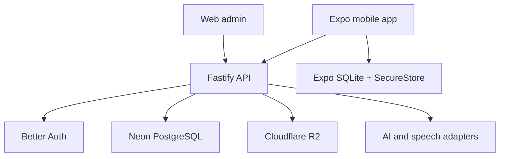

# Living Language Atlas — Ücretsiz ve Açık Kaynak Parça Kataloğu v1

**Tarih:** 1 Eylül 2026  
**Kapsam:** Expo/React Native mobil uygulama, Node.js/TypeScript backend, PostgreSQL, AI ve ses katmanı, içerik üretimi, tasarım, test, yayın ve gözlemlenebilirlik  
**Amaç:** Rastgele ücretsiz servis toplamak değil; Living Language Atlas'ın full-stack mimarisinde gerçekten kullanılabilecek parçaları, lisans ve ücretsiz plan tuzaklarıyla birlikte seçmek.

> Bu katalogdaki “ücretsiz” üç farklı anlama gelebilir: açık kaynak yazılım, kalıcı ücretsiz kota veya yalnızca başlangıç kredisi. Bunlar birbirinin aynısı değildir. Bir servis ücretsiz planını değiştirebilir; açık lisanslı bir kütüphane ise kendi altyapımızda çalıştırılabildiği sürece daha kalıcıdır.

> **German-first notice (2026-09-06):** Bu ilk katalogdaki Rusça/Kiril kaynak örnekleri gelecekteki genişleme veya tarihsel araştırma girdisidir. Güncel ilk öğrenme dili `de-DE` Almancadır. Dil-özel kaynaklar German reviewer, DaF/DaZ pedagoji ve lisans/provenance kapılarından geçmeden learner-facing içerik sayılamaz. Fiyat, kota ve uyumluluk bilgileri ilgili araştırma atomunda yeniden doğrulanır.

---

## 1. Kısa cevap: bugün seçilecek ana set

Living Language Atlas için ilk tercih setimiz aşağıdaki gibi olmalı:

| Alan | Birinci tercih | Neden | Karar |
|---|---|---|---|
| Mobil temel | [Expo + React Native](https://docs.expo.dev/) | iOS, Android ve web önizleme; mevcut ürün kararıyla uyumlu | Şimdi kullan |
| UI iskeleti | Kendi token sistemimiz + [gluestack-ui](https://gluestack.io/) parçaları | Hazır component hızını alır, uygulamanın kimliğini bir kite teslim etmeyiz | Seçerek kullan |
| Stil | [NativeWind](https://www.nativewind.dev/) | Cross-platform token ve utility yaklaşımı; MIT | Şimdi kullan veya mevcut StyleSheet yapısını koru |
| İkon | [Lucide](https://lucide.dev/) | Tutarlı, hafif, geniş ve ISC lisanslı | Şimdi kullan |
| Font | [Noto Sans](https://fonts.google.com/noto/specimen/Noto%2BSans) | Latin + Kiril desteği, arayüz ve Rusça içerik için güvenli temel | Şimdi kullan |
| Atlas grafikleri | SVG ile başla; gerekirse [React Native Skia](https://shopify.github.io/react-native-skia/) | Özgün yaşayan harita/bağlantı animasyonları için güçlü; fakat uygulamaya 4–6 MB civarı yük ekler | İhtiyaç doğunca ekle |
| API | [Fastify](https://fastify.dev/) + TypeScript | Kendi backend'imizi öğrenir ve kurarız; MIT, düşük overhead | Şimdi kullan |
| Veri doğrulama | [Zod](https://zod.dev/) | Mobil–API–admin sözleşmelerini aynı şemadan doğrulama | Şimdi kullan |
| ORM/migration | [Drizzle ORM](https://orm.drizzle.team/) | PostgreSQL'e yakın, hafif, SQL öğrenimini saklamıyor | Şimdi kullan |
| Ana veritabanı | [Neon Free](https://neon.com/pricing) | Yönetilen PostgreSQL; kendi Node API mimarimizi korur | İlk tercih |
| Hızlı alternatif backend | [Supabase Free](https://supabase.com/pricing) | Auth + Postgres + Storage tek yerde; daha hızlı ama platforma daha bağlı | B planı |
| Auth | [Better Auth](https://better-auth.com/) | TypeScript, self-hosted, framework ücretsiz ve açık kaynak | İlk tercih |
| Dosya/ses depolama | [Cloudflare R2](https://developers.cloudflare.com/r2/pricing/) | 10 GB-ay ücretsiz kota, internet egress ücreti yok | İlk tercih |
| API hosting | [Koyeb Free Service](https://www.koyeb.com/docs/faqs/pricing) | Küçük Node API'yi sürekli ücretsiz instance üzerinde denemeye uygun | Beta öncesi |
| AI metin | [Groq](https://console.groq.com/docs/rate-limits) arkasında provider adapter | Ücretsiz geliştirme kotası; model sağlayıcısına kilitlenmeden | Kontrollü kullan |
| İlk TTS | [Expo Speech](https://docs.expo.dev/versions/latest/sdk/speech/) | Cihazın TTS motorunu kullanır, dış API maliyeti yok | Destekleyici ses için şimdi |
| İlk STT | Groq Whisper; alternatif [Azure Speech F0](https://azure.microsoft.com/en-us/pricing/details/speech/) | Küçük beta için kota; sağlayıcı adapter'ı şart | Deneysel |
| Offline veri | [Expo SQLite](https://docs.expo.dev/versions/latest/sdk/sqlite/) | Cihazda gerçek kalıcı queue, lesson state ve content cache | Şimdi kullan |
| Hata izleme | [Sentry Developer](https://sentry.io/pricing/) | Crash ve hata teşhisi | Beta öncesi |
| Ürün analitiği | Önce kendi event tablomuz; sonra [PostHog Free](https://posthog.com/pricing) | Evidence verisi ile ürün analitiğini karıştırmadan ölçüm | Beta aşamasında |
| Mobil E2E | [Maestro](https://maestro.mobile.dev/) | Android/iOS akış testi; Apache 2.0 | Golden path oluşunca |
| Web E2E | [Playwright](https://playwright.dev/) | Admin, landing ve web smoke testleri | Şimdi kullan |
| Push | [Expo Push Service](https://docs.expo.dev/push-notifications/faq/) | Ücretsiz; mevcut Expo yapısıyla doğal uyum | Geri dönüş döngüsünde |
| Tasarım dosyaları | [Penpot](https://penpot.app/pricing) | Ücretsiz ve açık kaynak tasarım ortamı | İsteğe bağlı şimdi |

### Bu seçimin mimari anlamı

İlk çalışan sistem şu şekilde kurulabilir:



Bu yapı bize gerçek full-stack öğrenme alanı bırakır. Supabase'i tek tuşla bütün backend yerine koymadığımız için domain logic, API güvenliği, migrations, auth ve sync gerçekten bizim sistemimiz olur. Buna karşılık PostgreSQL sunucusu ve dosya depolama gibi düşük seviyeli operasyonları sıfırdan işletmeyiz.

---

## 2. Karar etiketleri

| Etiket | Anlamı |
|---|---|
| **YEŞİL — şimdi kullan** | Açık lisanslı veya erken aşamada güvenli, mimariye uyuyor |
| **SARI — koşullu kullan** | Ücretsiz kota, lisans, gizlilik, cold start ya da lock-in sınırı var |
| **GRİ — sonra değerlendir** | Güzel araç ama mevcut vertical slice için gerekli değil |
| **KIRMIZI — şimdilik kullanma** | Ticari lisans tuzağı, süreli kredi veya gereksiz mimari karmaşıklık |

---

## 3. Mobil UI, component ve tasarım parçaları

### 3.1 Temel component kaynakları

| Kaynak | Bize vereceği parça | Ücretsiz/lisans durumu | Atlas kararı |
|---|---|---|---|
| [gluestack-ui](https://github.com/gluestack/gluestack-ui) | Button, input, sheet, modal, toast, card, tabs, form parçaları | MIT; component/pattern'lar copy-paste yaklaşımında | **YEŞİL.** Form, modal ve erişilebilir primitive'leri seçerek al. Tema ve ekran tasarımını kopyalama. |
| [NativeWind](https://github.com/nativewind/nativewind) | React Native üzerinde Tailwind benzeri stil katmanı | MIT | **YEŞİL/SARI.** Yeni token sistemini kolaylaştırır; mevcut kod sade StyleSheet ile iyi gidiyorsa sırf moda diye migration yapma. |
| [React Native Paper](https://reactnativepaper.com/) | Material Design component seti | MIT, açık kaynak | **SARI.** Admin benzeri yüzeylerde hızlıdır; Living Atlas'ın özgün mobil kimliğini Material görünümüne kilitleme. |
| [Tamagui](https://tamagui.dev/) | Cross-platform styling ve component sistemi | Core açık kaynak; starter/pro ürünleri ayrıca ücretli olabilir | **GRİ.** Güçlü ama bu proje için ikinci bir framework öğrenme maliyeti yaratabilir. Mevcut Expo yapısını yeniden kurmak için kullanma. |
| [React Native Reusables](https://rnr-docs.vercel.app/) | NativeWind tabanlı copy-paste component örnekleri | Açık kaynak; her repository lisansını ayrıca kontrol et | **SARI.** İlham ve küçük primitive için; kaynağı körlemesine projeye dökme. |

### Uygulama kuralı

Hazır UI kitinden **görsel kimlik değil davranış** alınacak. Örneğin erişilebilir dialog focus yönetimini alabiliriz; fakat renk, radius, gölge, spacing, copy ve hiyerarşi Atlas token'larından gelir.

### 3.2 İkon, font ve illüstrasyon

| Kaynak | Kullanım alanı | Lisans/ücretsiz durum | Atlas kararı |
|---|---|---|---|
| [Lucide](https://lucide.dev/license) | Tab ikonları, durumlar, aksiyonlar | ISC; kullanım, değiştirme ve dağıtma serbest; lisans bildirimi korunmalı | **YEŞİL.** Birincil ikon ailesi. |
| [Google Noto Sans](https://fonts.google.com/noto/specimen/Noto%2BSans) | İngilizce UI + Rusça Kiril içerik | Google Fonts açık lisanslı; Noto Sans Latin, Kiril ve Yunanca destekler | **YEŞİL.** Font dosyasını app içine alıp self-host et. |
| [PT Sans](https://fonts.google.com/specimen/PT%2BSans) | Rusça odaklı alternatif tipografi | Libre lisans; Kiril desteği | **GRİ.** Marka yönü daha insani/editorial istenirse prototipte karşılaştır. |
| [Nunito Sans](https://fonts.google.com/specimen/Nunito%2BSans) | Daha sıcak ve oyunlu yardımcı font | Açık lisans, Kiril eklenmiş durumda | **GRİ.** Yalnız başlık/marketing deneyi; öğrenme metninde Noto daha güvenli. |
| [unDraw](https://undraw.co/license) | Onboarding, empty state, landing illüstrasyonları | Ticari kullanım ve değişiklik ücretsiz; attribution gerekmiyor; asset pack olarak yeniden dağıtım yasak | **YEŞİL/SARI.** Çekirdek Atlas dünyası için değil, ikincil empty state'lerde az kullan. |
| [Openverse](https://openverse.org/) | Açık lisanslı fotoğraf, görsel ve ses arama | Arama motoru; her varlığın asıl lisansı ayrıca doğrulanmalı | **SARI.** Kaynağı bulmak için kullan, lisans kanıtı olarak kullanma. |
| [Wikimedia Commons](https://commons.wikimedia.org/wiki/Commons:Reusing_content_outside_Wikimedia) | Kültürel görseller, mekânlar, tarihî medya, bazı sesler | Her dosyanın kendi CC/public-domain koşulları var | **SARI.** İçerik kartına creator, license, source URL ve attribution ekle. |

### 3.3 Harita, çizim ve hareket

| Kaynak | Kullanım alanı | Sınır | Atlas kararı |
|---|---|---|---|
| React Native SVG / kendi SVG asset'lerimiz | Mission Atlas düğümleri, bağlantılar, rozetler | Hafif ve yeterince esnek | **YEŞİL.** İlk gerçek harita bununla. |
| [React Native Skia](https://shopify.github.io/react-native-skia/docs/getting-started/installation) | Akışkan bağlantılar, parçacıklar, shader/özel canvas, gelişmiş ses görselleştirme | MIT; yaklaşık 6 MB iOS, 4 MB Android bundle artışı belirtiliyor | **SARI.** SVG darboğaz yaratınca ekle; ilk ekranda sırf havalı diye ekleme. |
| [MapLibre](https://maplibre.org/) | İleride gerçekten coğrafi şehir/ülke haritası gerekirse | Açık kaynak; harita tile sağlayıcısının maliyeti/lisansı ayrıca çözülür | **GRİ.** Living Mission Atlas coğrafi harita değil; ilk sürümde gereksiz. |
| [LottieFiles](https://lottiefiles.com/page/license) | Mikro animasyon örnekleri | Asset'in Lottie Simple License'ı ticari kullanıma izin verebilir; fakat mevcut ücretsiz/Individual platform planlarının ticari kullanım şartları ayrıca kısıtlı ve sayfalar arasında kafa karıştırıcı | **KIRMIZI/SARI.** Yalnız belirli dosyanın lisansı arşivlenirse; varsayılan asset kaynağı yapma. |
| [Rive](https://rive.app/pricing) | Etkileşimli animasyon state machine'leri | Runtime açık kaynak olsa da ürüne export/shipping güncel planda ücretli katmana bağlı | **KIRMIZI.** Ücretsiz üretim omurgasına koyma. |

### Özgün görsel kimlik için öneri

Atlas'ın ana karakteri hazır bir illüstrasyon paketinden gelmemeli. Düğümler, yollar, evidence parlamaları, skill takımyıldızları ve scenario kartları kendi küçük SVG sistemimizden üretilmeli. unDraw benzeri kaynaklar yalnız onboarding ve boş durum desteği olabilir.

---

## 4. Mobil cihaz yetenekleri ve offline parçalar

Expo'nun resmi modülleri açık kaynak uygulama katmanımızın en güvenli ücretsiz parçalarıdır.

| Parça | Görev | Atlas'ta kullanımı | Karar |
|---|---|---|---|
| [Expo SQLite](https://docs.expo.dev/versions/latest/sdk/sqlite/) | Cihazda ilişkisel kalıcı veri | Offline content manifest, route session, sync outbox, pending evidence | **YEŞİL** |
| [Expo SecureStore](https://docs.expo.dev/versions/latest/sdk/securestore/) | Küçük sırları şifreli saklama | Refresh token/session secret; büyük content veya lesson state burada tutulmaz | **YEŞİL** |
| [Expo FileSystem](https://docs.expo.dev/versions/latest/sdk/filesystem/) | Yerel dosya indirme/saklama | Audio cache, downloadable scenario pack, geçici kayıt | **YEŞİL** |
| [Expo Audio](https://docs.expo.dev/versions/latest/sdk/audio/) | Ses oynatma ve kayıt | Listening, speaking attempt, playback | **YEŞİL** |
| [Expo Speech](https://docs.expo.dev/versions/latest/sdk/speech/) | Cihaz TTS motoru | Draft/prototype ses ve accessibility desteği | **YEŞİL/SARI**; cihazdan cihaza ses değişir, canonical ders sesi değildir |
| [Expo Notifications](https://docs.expo.dev/versions/latest/sdk/notifications/) | Local/push notification | E4 delayed return ve kullanıcının seçtiği hatırlatma | **YEŞİL** |
| [NetInfo](https://docs.expo.dev/versions/latest/sdk/netinfo/) | Bağlantı türü/kalitesi | Sync politikası, Wi-Fi-only audio download, offline banner | **YEŞİL** |
| [Expo Localization](https://docs.expo.dev/versions/latest/sdk/localization/) | Locale bilgisi | İngilizce-first UI, ileride Türkçe UI; sayı/tarih formatlama | **YEŞİL** |

### Offline sınırı

SQLite sadece cache değil, cihazın geçici çalışma gerçeği olacaktır. Sunucu PostgreSQL sistemin source of truth'udur; cihaz ise idempotent `sync_operation` kayıtlarını outbox'ta tutar. `SecureStore` yalnız anahtar/token içindir. Bu ayrım yapılmazsa uygulama birkaç hafta içinde “hangi state gerçek?” çorbasına döner.

---

## 5. Backend, veritabanı, auth ve storage

### 5.1 Açık kaynak backend yapı taşları

| Kaynak | Rol | Lisans | Karar |
|---|---|---|---|
| [Fastify](https://github.com/fastify/fastify) | Node.js HTTP API | MIT | **YEŞİL.** Domain-modüler API'nin tabanı. |
| [Zod](https://github.com/colinhacks/zod) | Runtime validation ve shared contract | MIT | **YEŞİL.** Dışarıdan gelen her request/AI output doğrulanır. |
| [Drizzle ORM](https://github.com/drizzle-team/drizzle-orm) | PostgreSQL schema, query ve migration | Apache 2.0 | **YEŞİL.** SQL'i görünür tuttuğu için öğrenme hedefiyle uyumlu. |
| [TanStack Query](https://github.com/TanStack/query) | Client server-state cache/mutation | MIT | **YEŞİL.** Online request, retry ve invalidation; offline source of truth yerine geçmez. |
| [Better Auth](https://better-auth.com/docs/installation) | Email/password, social login, session | Framework ücretsiz ve açık kaynak; managed dashboard ayrı plan | **YEŞİL/SARI.** Auth'ı kendimiz işletiriz; güvenlik checklist'i ve email servisi şart. |
| [Payload CMS](https://payloadcms.com/get-started) | Reviewer/admin içerik yönetimi | MIT, self-host ücretsiz | **GRİ.** Reviewer sayısı artana kadar kendi dar admin ekranımız daha basit. |
| [Strapi Community](https://strapi.io/hosting) | Alternatif headless CMS | Community MIT, self-host ücretsiz | **GRİ.** Payload ve Strapi'yi birlikte kullanma; birini bile ancak ihtiyaç kanıtlanınca seç. |

### 5.2 Yönetilen PostgreSQL seçenekleri

#### Seçenek A — Neon + kendi API'miz: önerilen öğrenme/ürün dengesi

[Neon Free](https://neon.com/pricing) güncel planda proje başına 100 CU-saat, 0.5 GB storage ve 5 GB egress sunuyor. Hesap genelinde çok sayıda proje açılabilse de bizim için tek `dev` projesi yeterli.

**Avantajları**

- Gerçek PostgreSQL ve taşınabilir SQL migrations.
- Fastify, Better Auth ve Drizzle mimarimizi doğrudan öğreniriz.
- Backend domain kuralları platform fonksiyonlarına dağılmaz.
- İleride başka bir PostgreSQL sağlayıcısına geçiş makuldür.

**Dikkat**

- Auth, storage, email ve API hosting ayrı parçalar olur.
- 0.5 GB, learner audio ve asset için kullanılmamalı; yalnız ilişkisel veri.
- AI output ve event log'larında retention/aggregation uygulanmazsa kota çabuk dolar.

#### Seçenek B — Supabase: en hızlı entegre alternatif

[Supabase Free](https://supabase.com/pricing) iki ücretsiz proje; proje başına 500 MB database, 1 GB storage, 50.000 MAU ve çeşitli egress/realtime kotaları sunuyor. [Düşük etkinlikli ücretsiz projeler yedi gün civarında pause edilebilir](https://supabase.com/docs/guides/platform/free-project-pausing); 500 MB database kotası aşılırsa proje read-only duruma girebilir.

**Avantajları**

- PostgreSQL + Auth + Storage + Realtime tek panel.
- Çok hızlı prototip ve basit admin işleri.
- PostgreSQL bilgisi yine işe yarar.

**Güvenlik şartları**

- Public/exposed her tabloda RLS açık olmalı.
- `service_role` anahtarı mobil uygulamaya veya public web bundle'a asla girmemeli.
- `TO authenticated` tek başına authorization değildir; satırın kullanıcı/rol ilişkisi ayrıca kontrol edilir.
- View'ların RLS'i varsayılan olarak aşabileceği, UPDATE policy'nin SELECT ve `WITH CHECK` gerektirdiği unutulmamalı.
- `user_metadata` authorization kaynağı olarak güvenilmez.

**Karar:** İlk hedefimiz gerçek Node full-stack öğrenmek olduğu için Neon + Fastify daha uygun. Hız nedeniyle proje bloke olursa Supabase B planıdır; “herkes kullanıyor” diye iki backend'i aynı anda kurmayacağız.

### 5.3 Dosya ve ses depolama

| Kaynak | Ücretsiz kapasite | Atlas'ta kullanım | Karar |
|---|---|---|---|
| [Cloudflare R2](https://developers.cloudflare.com/r2/pricing/) | Standard storage için aylık 10 GB-ay, 1 milyon Class A ve 10 milyon Class B işlem; internet egress ücretsiz | Onaylı ders sesleri, user attempt'ler, content pack | **YEŞİL/SARI.** Lifecycle ve silme politikası kur. Aktivasyon sırasında billing bilgisi istenip istenmediğini hesapta doğrula. |
| Supabase Storage | Free planda 1 GB | Supabase seçilirse küçük beta asset'leri | **SARI.** Ayrı R2 eklemeyi geciktirebilir; bandwidth kotasını izle. |
| PostgreSQL bytea/blob | — | Küçük JSON dışındaki medya | **KIRMIZI.** Audio ve görseli database içine gömme. |

### 5.4 API ve web hosting

| Kaynak | Güncel ücretsiz davranış | Karar |
|---|---|---|
| [Koyeb Free](https://www.koyeb.com/docs/faqs/pricing) | Bir ücretsiz web service; küçük instance yaklaşık 0.1 vCPU, 512 MB RAM, 2 GB disk | **YEŞİL/SARI.** İlk Fastify API demo/beta. Performansı load test ile ölç. |
| [Render Free](https://render.com/docs/free) | Ücretsiz Node web service; resmi doküman production için önermiyor; 15 dakika inaktivite sonrası spin-down ve yaklaşık bir dakikalık cold start olabilir | **SARI.** Preview/demo için, gerçek speaking akışının düşük gecikmeli backend'i için değil. |
| [Cloudflare Workers](https://developers.cloudflare.com/workers/platform/pricing/) | Free plan günlük 100.000 request civarı başlangıç kotası | **SARI.** Hono/edge API için güçlü; fakat Node/Fastify öğrenme hedefimizi değiştirir. Proxy, webhook veya küçük edge görevlerinde kullan. |
| [Railway Free](https://docs.railway.com/pricing/free-trial) | İlk 30 gün/$5 deneme, sonrasında aylık yalnız $1 kaynak kredisi | **KIRMIZI/SARI.** Sürekli ücretsiz backend varsayımıyla plan kurma. |
| [Cloudflare Pages](https://developers.cloudflare.com/pages/platform/limits/) | Free planda aylık 500 deploy ve 20.000 dosya gibi geniş statik limitler | **YEŞİL.** Landing, docs ve statik policy sayfaları için. |
| [Vercel Hobby](https://vercel.com/docs/plans/hobby) | Ücretsiz Hobby kişisel ve non-commercial kullanım odaklı | **KIRMIZI.** Monetizasyon hedefli Atlas'ın production admin/landing varsayılanı yapma. |

---

## 6. AI, STT, TTS ve pronunciation parçaları

### 6.1 Metin AI

| Kaynak | Ücretsiz biçimi | Doğru kullanım | Karar |
|---|---|---|---|
| [Groq Developer](https://console.groq.com/docs/rate-limits) | Modele göre RPM/RPD/TPM/TPD kotaları; ücretsiz kullanım değişebilir | Grounded explanation, kontrollü roleplay, AI pre-review | **YEŞİL/SARI.** Provider adapter, timeout, quota guard ve deterministic fallback zorunlu. |
| [Hugging Face Inference Providers](https://huggingface.co/docs/inference-providers/pricing) | Free hesap için aylık kredi çok küçük; model keşfi için uygun | Model karşılaştırma ve yerel prototip | **GRİ.** Ana ürün API'si olarak güvenme. |
| Yerel açık modeller | Kendi bilgisayarının kapasitesi kadar | Batch içerik ön-inceleme, private deneme | **GRİ.** Mobil uygulamaya ağır model gömmek ilk sürüm işi değil. |

### AI bütçe koruması

Her AI isteği için aşağıdakiler loglanmalıdır:

- `provider`, `model`, `prompt_version`, `content_version`
- input/output token veya audio duration
- latency, retry count, cache hit
- safety/grounding sonucu
- tahmini maliyet; servis ücretsiz olsa bile **sıfır yazılmayacak**, piyasa karşılığı izlenecek

Ücretsiz kota ürün davranışını tanımlamamalıdır. Kota bittiğinde kullanıcı “uygulama bozuldu” görmez; deterministic task, önceden üretilmiş explanation veya retry-later yolu görür.

### 6.2 Speech-to-text

| Kaynak | Ücretsiz durum | Rusça/Atlas kullanımı | Karar |
|---|---|---|---|
| Groq Whisper endpoint | Ücretsiz plan limitleri; dosya başına ücretsiz tier'da 25 MB üst sınır belirtiliyor | Kısa speaking attempt transkripsiyonu | **YEŞİL/SARI.** 5–20 saniyelik kayıt, server proxy, provider abstraction. |
| [Azure Speech F0](https://azure.microsoft.com/en-us/pricing/details/speech/) | Ayda 5 audio saat real-time STT | Yedek provider ve karşılaştırmalı evaluation | **SARI.** Azure hesabı/region kurulumu ve veri işleme politikası incelenmeli. |
| [Deepgram](https://deepgram.com/pricing) | Sürekli ücretsiz kota değil; başlangıçta $200 kredi | Kalite/latency deneyi | **KIRMIZI/SARI.** “Free forever” stack'e yazma; yalnız kontrollü benchmark. |
| [whisper.cpp](https://github.com/ggml-org/whisper.cpp) | MIT, yerel inference | Masaüstü batch transkripsiyon ve privacy deneyi | **GRİ.** Mobil bundle/model boyutu ve latency ölçülmeden app içine alma. |

### 6.3 Text-to-speech ve canonical audio

| Kaynak | Ücretsiz durum | Karar |
|---|---|---|
| Expo Speech / cihaz TTS | API faturası yok; kalite ve ses cihaz/OS'a bağlı | **YEŞİL/SARI.** Accessibility, taslak preview ve düşük riskli fallback. Öğretilecek canonical telaffuzun tek kaynağı olamaz. |
| Azure Speech F0 | Ayda 0.5 milyon neural TTS karakteri | **SARI.** Onaylı metinlerden beta audio üretme deneyi; ses ve ticari şartları kaydet. |
| [ElevenLabs Free](https://elevenlabs.io/pricing) | 10.000 kredi fakat ticari lisans Starter+ planlarda | **KIRMIZI.** Monetize edilecek uygulamanın learner-facing audio'sunda ücretsiz planı kullanma. |
| Piper | Eski repository archived; yeni geliştirme GPL'e taşınmış ve voice modellerinin lisansları ayrı olabilir | **KIRMIZI/SARI.** Her code/model lisansı tek tek incelenmeden üretime alma. |
| İnsan tarafından kaydedilmiş ses | Kayıt sahibinden açık yazılı kullanım izni gerekir | **HEDEF.** Reviewer onaylı canonical phrase audio için en güvenilir yön. |

### Telaffuz gerçeği

STT'nin cümleyi doğru yazması, telaffuzun doğru olduğu anlamına gelmez. İlk sistem şunları ayırmalıdır:

1. **Task success:** Kullanıcının niyeti/cümlesi anlaşılmış mı?
2. **Pronunciation signal:** Beklenen kelime/segmentlerde belirsizlik var mı?
3. **Pedagogical feedback:** Yalnız güvenilir eşik aşılırsa kullanıcıya düzeltme veriliyor mu?

Ücretsiz STT ile “aksan skoru %87” gibi sahte kesinlik üretilmeyecek.

---

## 7. Rusça içerik, cümle ve açık medya kaynakları

Bu siteler **insan reviewer'ın yerine geçmez**. Kaynak, örnek, corpus veya ses adayı sağlarlar.

| Kaynak | Ne sağlar? | Lisans gerçeği | Atlas kullanımı |
|---|---|---|---|
| [Tatoeba](https://tatoeba.org/en/downloads) | Cümleler, çeviriler, bazı sesler | Metinlerin çoğu CC BY 2.0 FR; bir bölüm CC0. Audio lisansı kullanıcı/dosya bazında değişir ve NC olabilir | Corpus arama ve candidate example. Her cümlenin author/source/license kaydı tutulur; audio topluca güvenli varsayılmaz. |
| [Mozilla Common Voice](https://commonvoice.mozilla.org/en/datasets) | Topluluk konuşma datasetleri | Dataset CC0 yaklaşımında; belirli dataset sürümü ve datasheet incelenmeli | STT evaluation ve research. Learner-facing “örnek telaffuz” kütüphanesi gibi kullanılmaz. |
| [Wikimedia Commons](https://commons.wikimedia.org/wiki/Commons:Licensing) | Görsel, kültürel medya, konuşma ve ses | Dosya bazında CC BY, CC BY-SA veya public domain | Kültür/hikâye kartları; attribution ekranı ve asset registry şart. |
| [Openverse](https://openverse.org/about) | 800 milyondan fazla açık lisanslı medya için arama | Openverse lisans bilgisinin doğruluğunu garanti etmez; asıl kaynak kontrol edilir | Keşif motoru. İndirilen asset için kaynak sayfasının snapshot'ı alınır. |
| [Wiktionary](https://en.wiktionary.org/wiki/Wiktionary:Copyrights) | Kelime anlamı, çekim, etimoloji, bazı telaffuzlar | Metin genelde CC BY-SA/GFDL; media dosyalarının lisansı ayrı | Research/reference; doğrudan kopyala-yapıştır learner content yapılmaz. |

### Kitap ve filmler için net sınır

- Modern kitap, film, dizi altyazısı veya konuşması “internette bulundu” diye uygulamaya alınamaz.
- Kısa alıntı dahi ülkeye ve kullanım bağlamına göre telif riski taşır; eğitim ürünü olmak otomatik izin değildir.
- İlk kültürel senaryolar kendi yazdığımız özgün diyaloglar veya gerçekten public-domain metinlerden türetilmelidir.
- Public-domain eser seçilirken yalnız eserin değil, kullanılan **çeviri, ses kaydı, görsel ve edisyonun** da durumu kontrol edilir.
- Eserden ilham alan scenario ile eserin özgün cümlelerini kopyalamak farklı şeylerdir.

### İçerik asset kaydı

Her dış içerik parçası aşağıdaki kaydı taşır:

```text
asset_id:
asset_type: image | audio | sentence | font | icon | animation
title:
creator:
source_page_url:
direct_file_url:
downloaded_at:
license_name:
license_url:
attribution_text:
commercial_use_allowed:
derivatives_allowed:
share_alike_required:
source_snapshot_path:
sha256:
review_status:
approved_by:
content_version:
```

Lisansı belirsiz bir asset'in `review_status` değeri `BLOCKED_UNKNOWN_LICENSE` olur; “şimdilik kullanalım sonra bakarız” olmaz.

---

## 8. Analytics, crash, test, CI ve bildirim

### 8.1 Analytics ve gözlemlenebilirlik

| Kaynak | Ücretsiz plan | Atlas kararı |
|---|---|---|
| [PostHog](https://posthog.com/pricing) | Ayda 1 milyon analytics event, 5.000 replay, 100.000 exception gibi ürün bazlı ücretsiz kotalar; ücretsiz sınırda kullanım durur | **SARI.** Consent, redaction ve event dictionary kurulunca. Voice/text answer içeriğini analytics'e gönderme. |
| [Sentry](https://sentry.io/pricing/) | Free Developer plan; Expo rehberi güncel olarak yaklaşık 5.000 event/ay belirtir | **YEŞİL/SARI.** Beta öncesi crash reporting. User answer/audio/PII breadcrumb'larını filtrele. |
| Kendi `product_event` tablomuz | Database kotası kadar | **YEŞİL.** İlk funnel ve learning event'lerini dar şema ile tut; raw event sonsuza kadar saklama. |

### Analytics veri ayrımı

- **Learning evidence:** Kullanıcı becerisini ölçer; ürün analitiği değildir.
- **Product event:** Ekran/akış davranışını ölçer; mastery kararı vermez.
- **Operational telemetry:** Hata, latency, provider failure ve kota sinyalleridir.

Bu üç veri aynı tabloya veya üçüncü taraf analytics event'ine dökülmez.

### 8.2 Test araçları

| Araç | Rol | Lisans/ücret | Karar |
|---|---|---|---|
| [Vitest](https://vitest.dev/) | Domain/unit test | Açık kaynak | **YEŞİL.** Scoring, mastery, economy ve policy logic. |
| [React Native Testing Library](https://callstack.github.io/react-native-testing-library/) | Component ve interaction test | Açık kaynak | **YEŞİL.** Feedback, accessibility ve state ekranları. |
| [Maestro](https://github.com/mobile-dev-inc/Maestro) | Gerçek Android/iOS E2E flows | Apache 2.0 | **YEŞİL.** Onboarding, lesson, resume, offline recovery. |
| [Playwright](https://playwright.dev/) | Web admin/landing E2E | Açık kaynak | **YEŞİL.** Reviewer workflow ve contract smoke tests. |
| [k6](https://k6.io/open-source/) | API load test | Açık kaynak sürüm | **GRİ.** Beta öncesi auth, sync, AI proxy rate limit. |

### 8.3 Build ve CI

| Kaynak | Ücretsiz sınır | Karar |
|---|---|---|
| [Expo EAS Free](https://expo.dev/pricing) | Ayda 15 Android + 15 iOS build, düşük öncelikli queue; Updates 1.000 MAU | **YEŞİL/SARI.** Build profillerini boşa harcama; local development build kullan. |
| [GitHub Actions](https://docs.github.com/en/billing/concepts/product-billing/github-actions) | Public repo standard runner ücretsiz; private GitHub Free için aylık dahil dakika kotası | **YEŞİL.** Lint, types, unit, contract; EAS build yalnız release adayında. |

### 8.4 Email, push ve bot önleme

| Kaynak | Ücretsiz durum | Karar |
|---|---|---|
| [Resend](https://resend.com/pricing) | 3.000 email/ay, 100 email/gün, 3 domain | **YEŞİL/SARI.** Verification, password reset, safety notice. Marketing blast için değil. |
| [Expo Push Service](https://docs.expo.dev/push-notifications/faq/) | Gönderim ücretsiz; proje başına saniyede 600 notification sınırı | **YEŞİL.** E4 reminder; server-side throttling ve retry. |
| [Firebase Cloud Messaging](https://firebase.google.com/products/cloud-messaging) | Cloud Messaging için ücret yok | **YEŞİL/GRİ.** Expo Push arka planında/platform entegrasyonunda; ayrıca engagement suite kurma. |
| [Cloudflare Turnstile](https://developers.cloudflare.com/turnstile/) | Managed mode ücretsiz; web'e Cloudflare CDN olmadan da eklenebilir | **YEŞİL/SARI.** Admin/web signup ve abuse formlarında. Native app'te tek güvenlik katmanı gibi kullanma. |

---

## 9. Tasarım, dokümantasyon ve admin üretim araçları

| Kaynak | İş | Karar |
|---|---|---|
| [Penpot](https://penpot.app/pricing) | Wireframe, component/spec, developer handoff | **YEŞİL.** Cloud Professional $0 ve açık kaynak self-host seçeneği var. |
| [Excalidraw](https://github.com/excalidraw/excalidraw) | Hızlı mimari ve flow eskizi | **YEŞİL.** Beyin fırtınası; production UI source of truth değil. |
| [Mermaid](https://mermaid.js.org/) | Repo içinde mimari, state ve sequence diagram | **YEŞİL.** Dokümanla version control edilir. |
| [Storybook for React Native](https://storybook.js.org/tutorials/intro-to-storybook/react-native/en/get-started/) | İzole component geliştirme | **GRİ.** Design system 10–15 component'i geçtiğinde. |
| Payload CMS | Content/reviewer admin | **GRİ.** İlk reviewer tek kişi iken dar custom admin; sonra Payload. |

### Neyi ücretsiz template sitelerinden almamalıyız?

- Tam bir “Duolingo clone” template'i
- Kimliği ve lisansı belirsiz Figma community dosyasının komple UI'sı
- Hazır coin/store ekranları
- Genel sosyal medya feed'i
- AI chat template'i
- Kaynağı belli olmayan Rusça kurs JSON'ları

Bunlar geliştirmeyi hızlandırıyor gibi görünür; fakat ürünün domain modelini yanlış UI'ın içine hapseder. Biz primitive, pattern ve asset alacağız; ürün aklını değil.

---

## 10. “Ücretsiz” görünen ama dikkat edilmesi gerekenler

| Kaynak/kalıp | Sorun | Hüküm |
|---|---|---|
| Vercel Hobby | Kişisel/non-commercial kullanım sınırı | Ticari Atlas production'ında kullanma |
| Rive Free | Ürüne export/shipping ücretli plana bağlı | İlk sürümde kullanma |
| ElevenLabs Free | Commercial license Starter+ ile geliyor | Learner-facing production audio üretme |
| LottieFiles Free/Individual | Platform ticari kullanım şartları ile asset lisansı ayrı ve güncel metinler kafa karıştırıcı | Belirli asset lisansı arşivlenmeden kullanma |
| Deepgram $200 | Başlangıç kredisi; kalıcı ücretsiz kota değil | Bütçeyi buna göre kurma |
| Railway Free | Ayda $1 kredi, ciddi sürekli servis değil | Production API varsayımı yapma |
| Render Free | Cold start ve “production için kullanmayın” uyarısı | Demo/preview ile sınırla |
| Supabase Free | Inactivity pause ve 500 MB DB/read-only riski | Backup, migration ve quota alarmı olmadan güvenme |
| Tatoeba audio | Her konuşmacının audio lisansı değişebilir, NC olabilir | Dosya bazında doğrula |
| Openverse sonucu | Arama metadata'sı lisans garantisi değildir | Orijinal kaynak sayfasını doğrula |
| “Freepik/Storyset free” türü varlıklar | Attribution ve platforma göre lisans/AI kısıtları olabilir | Her asset ve planı tek tek doğrulamadan indirme |
| Film/dizi altyazıları | İnternette erişilebilir olmak yeniden kullanım izni değildir | İçerik üretim kaynağı yapma |

---

## 11. İlk geliştirme fazlarına göre hangi parçayı ne zaman alacağız?

### Faz A — Tek güvenilir golden path

Şimdi kurulacak:

1. Expo + Expo Router
2. Kendi design tokens + gluestack'ten seçilmiş primitives
3. Lucide + Noto Sans
4. Expo SQLite, SecureStore, FileSystem, Audio
5. Fastify + Zod + Drizzle
6. Neon PostgreSQL
7. Better Auth
8. R2 media bucket
9. Vitest + React Native Testing Library + Playwright web smoke
10. Groq adapter; learner-visible AI kapalı veya çok dar

Henüz kurulmayacak:

- PostHog session replay
- Payload/Strapi
- Skia
- MapLibre
- Lottie/Rive
- Deepgram/ElevenLabs
- Realtime social infrastructure
- Redis/queue

### Faz B — Kontrollü beta

Eklenecek:

1. Koyeb üzerinde API deploy
2. Sentry redaction kuralları
3. PostHog ya da dar kendi funnel dashboard'umuz
4. Maestro golden path testleri
5. Expo Push + E4 delayed-return reminder
6. Resend verification/reset email
7. Groq STT + Azure STT karşılaştırma harness'i
8. Content asset registry ve reviewer admin

### Faz C — Studio ve voice olgunlaştırma

Eklenecek:

1. Onaylı audio pipeline
2. Pronunciation evaluation benchmark seti
3. Gerekirse Skia ses görselleştirme
4. R2 lifecycle/retention jobs
5. AI cost ledger ve cache
6. Daha güçlü admin/CMS

### Faz D — Guided Language Exchange

Ücretsiz “chat component” bularak başlanmayacak. Önce:

- block/report
- age gate
- rate limits
- moderation queue
- evidence permission modeli
- abuse telemetry
- retention ve deletion policy
- identity/session security

kurulacak. Sosyal ürünün gerçek maliyeti chat balonları değil, güvenlik operasyonudur.

---

## 12. Asset ve dependency kabul kapısı

Bir site veya paket projeye yalnız şu sorular geçildikten sonra girer:

### Lisans

- Ticari kullanım açıkça izinli mi?
- Attribution gerekiyor mu?
- Değiştirmeye izin var mı?
- ShareAlike ürünün başka kısmını etkiliyor mu?
- Paket içindeki her asset aynı lisansa mı sahip?
- Lisans sayfasının URL'si ve indirme tarihi kaydedildi mi?

### Teknik

- Expo'nun kullandığımız stable SDK sürümüyle çalışıyor mu?
- New Architecture desteği var mı?
- Bundle'a ne kadar ekliyor?
- Native config/prebuild gerektiriyor mu?
- Erişilebilirlik davranışları test edilebilir mi?
- Paket kalkarsa kodu çıkarabilir miyiz?

### Ürün

- Gerçek bir roadmap kartını hızlandırıyor mu?
- Aynı işi mevcut stack zaten yapıyor mu?
- Learning evidence'i bozuyor mu?
- Offline ve düşük bağlantı davranışı var mı?
- Kullanıcının verisini üçüncü tarafa gönderiyor mu?

### Ekonomi

- Ücretsiz kota kalıcı mı, aylık mı, günlük mü, tek seferlik kredi mi?
- Kota bitince servis duruyor mu yoksa otomatik ücret mi yazıyor?
- Kredi kartı gerekiyor mu?
- Egress, build, storage, request ve seat ayrı ücretleniyor mu?
- Çıkış/migration yolu var mı?

---

## 13. Repository'de tutulacak kayıtlar

```text
docs/
  sourcing/
    FREE-RESOURCE-CATALOG.md
    ASSET-REGISTER.csv
    LICENSE-NOTICES.md
    PROVIDER-QUOTAS.md
    THIRD-PARTY-DATA-MAP.md
  decisions/
    ADR-xxx-*.md

assets/
  external/
    <asset-id>/
      original-file
      SOURCE.md
      LICENSE.txt
      source-page-snapshot.pdf-or-html
```

`PROVIDER-QUOTAS.md` içine yalnız bugünkü limit yazılmaz. `checked_at`, resmi kaynak URL'si, quota exhaustion davranışı ve bizim fallback'imiz de yazılır.

Örnek:

```text
provider: Groq
capability: STT
checked_at: 2026-09-01
official_source: https://console.groq.com/docs/rate-limits
quota_type: model-dependent free rate limit
on_exhaustion: deterministic speaking fallback + retry later
secret_location: backend only
owner: platform
```

---

## 14. Nihai öneri

Living Language Atlas'ın ilk sağlam full-stack sürümü için en dengeli ücretsiz omurga:

> **Expo + kendi design system'imiz + gluestack primitives + Lucide + Noto Sans + Expo SQLite + Fastify + Zod + Drizzle + Neon PostgreSQL + Better Auth + Cloudflare R2 + Koyeb + Groq adapter + Expo Speech/Audio + Sentry + Maestro + Playwright.**

Supabase, sistemi daha hızlı ayağa kaldırmak istersek tek parça B planıdır. Payload ancak içerik editörü/reviewer akışı gerçekten büyüyünce gelir. Skia yalnız SVG harita yetersiz kaldığında gelir. PostHog yalnız consent ve veri ayrımı kurulduğunda gelir. Ücretsiz animasyon ve ses siteleri ise asset bazında lisans kanıtı olmadan ürünün içine girmez.

Buradaki esas tasarruf yalnız para tasarrufu değildir. Daha değerlisi, yanlış servise kilitlenme ve telif borcu biriktirmeme tasarrufudur.

---

## 15. Resmî kaynak kontrol listesi

Bu katalog hazırlanırken fiyat ve lisans gibi değişken bilgiler için öncelikle resmî kaynaklar esas alındı:

- [Expo pricing](https://expo.dev/pricing) ve [Expo docs](https://docs.expo.dev/)
- [Neon pricing](https://neon.com/pricing)
- [Supabase pricing](https://supabase.com/pricing) ve [free project pausing](https://supabase.com/docs/guides/platform/free-project-pausing)
- [Cloudflare R2 pricing](https://developers.cloudflare.com/r2/pricing/), [Workers pricing](https://developers.cloudflare.com/workers/platform/pricing/) ve [Turnstile](https://developers.cloudflare.com/turnstile/)
- [Koyeb pricing FAQ](https://www.koyeb.com/docs/faqs/pricing)
- [Render free services](https://render.com/docs/free)
- [Groq rate limits](https://console.groq.com/docs/rate-limits)
- [Azure Speech pricing](https://azure.microsoft.com/en-us/pricing/details/speech/)
- [PostHog pricing](https://posthog.com/pricing), [Sentry pricing](https://sentry.io/pricing/) ve [Resend pricing](https://resend.com/pricing)
- [Lucide license](https://lucide.dev/license), [unDraw license](https://undraw.co/license) ve [Lottie license](https://lottiefiles.com/page/license)
- [Tatoeba terms](https://tatoeba.org/en/terms_of_use), [Common Voice datasets](https://commonvoice.mozilla.org/en/datasets) ve [Wikimedia licensing](https://commons.wikimedia.org/wiki/Commons:Licensing)

Fiyat/kota bilgileri tekrar kullanılmadan önce `checked_at` tarihi güncellenmelidir.
