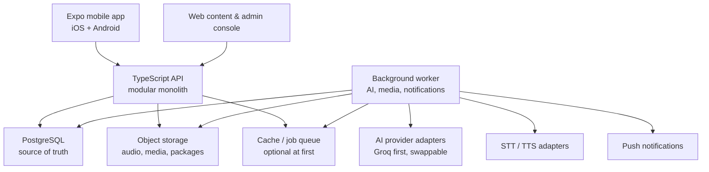

# Living Language Atlas — Birleşik Ürün Vizyonu ve Full-Stack Sistem Taslağı

**Belge türü:** Kurucu beyin fırtınası, ürün fikri ve sistem taslağı  
**Sürüm:** 1.1 — German-first owner correction  
**Tarih:** 1 Eylül 2026  
**Durum:** Önceki üretim denemesi iptal edilmiştir. Bu belge çalışan kodu, mevcut ekranları veya eski backlog'u savunmaz; uygulamanın gerçekten ne olması gerektiğini yeniden kurar.  
**Çalışma adı:** Living Language Atlas  
**İlk arayüz dili:** English  
**İlk öğrenme dili:** German — Germany (`de-DE`)  
**İlk kullanıcı grubu:** İngilizce arayüz kullanabilen, Almancaya sıfırdan başlayan 18+ yetişkinler  
**Genişleme yönü:** Almanca sistemi olgunlaştıktan sonra Rusça ve diğer diller

> **Supersession notice (2026-09-06):** Proje sahibinin German-first kararı bu belgedeki bütün Russian-first varsayımlarını geçersiz kılar. Aşağıdaki Rusça/Kiril örnekleri yalnız tarihsel tasarım düşüncesi ve gelecekteki dil genişlemesi girdisidir; güncel ürün kapsamı veya uygulama talimatı değildir. Güncel dil ve kanıt otoritesi `living_language_atlas_german_mvp_scope_and_evidence_spec_v1.md`, `living_language_atlas_wp01_normative_errata_v1_1.md`, atomik roadmap ve current-state kayıtlarıdır.

---

## 1. Önceki denemeden neyi iptal ediyoruz?

İptal edilen şey uygulama fikri değildir. İptal edilen şey, fikir henüz tek bir ürün mantığına dönüşmeden ekran, dosya, araştırma kapısı ve kod üretmeye başlamaktır.

Önceki çalışma üç ayrı şeye bölünmüştü:

1. Aşırı ayrıntılı bir araştırma/yönetişim sistemi,
2. 800'den fazla olası ürün yüzeyini içeren bir mimari envanter,
3. Rusça ilk kafe etkileşimini gösteren dar bir referans uygulama.

Bunların her biri bazı yararlı fikirler taşıyordu; fakat hiçbiri tek başına uygulamanın kendisi değildi. Araştırma sistemi ürünün önüne geçti, envanter özellik mezarlığına dönüştü, ilk kafe örneği de istemeden bütün vizyonun yerine oturdu.

Bu belgede yaklaşım tersine çevrilir:

- Önce uygulamanın özü tanımlanır.
- Sonra kullanıcı deneyimi ve öğrenme sistemi birbirine bağlanır.
- Daha sonra AI, sosyal sistem, ekonomi ve teknik mimari bu özün hizmetine yerleştirilir.
- Kod, ekran sayısı ve framework seçimi ürün fikrini yönetmez; ürün fikri onları yönetir.

### Eski çalışmadan korunacak çekirdekler

- Living Mission Atlas zihinsel modeli
- Evidence Loop / kanıta dayalı kişiselleştirme
- Atlas, Practice, Studio ve You ana yüzeyleri
- Kaynakla ve beceriyle sınırlandırılmış AI
- Gerçek beceri, çalışma alışkanlığı ve ekonominin ayrı tutulması
- Rusça için Kiril-öncelikli, transliterasyonu giderek azaltan yaklaşım
- Gerçek hayat görevleri, değişen bağlam ve gecikmeli hatırlama
- Sosyal özelliklerde 18+ ve safety-before-social yaklaşımı
- İnsan yardımı, native speaker ve profesyonel tutor rollerini ayırma
- Expo/React Native ile iOS ve Android odaklı ürün düşüncesi

### Eski çalışmadan korunmayacak şeyler

- 802 yüzeyi yapılacaklar listesi sanmak
- İlk kafe görevini ürünün tamamı sanmak
- Her fikir için aylar süren araştırma bürokrasisi kurmak
- AI ön-incelemesini insan uzman onayı gibi yorumlamak
- Özellik henüz tanımlanmadan kod üretmek
- Kullanıcıya boş tab, sahte AI, sahte topluluk veya çalışmayan gelecek vaadi göstermek
- Ekran sayısını ilerleme saymak

---

## 2. Uygulamanın özü

### Tek cümlelik tanım

**Living Language Atlas, kullanıcıya bir dili ders bitirerek değil, gerçek hayatta yapabildiği şeyleri kanıtlayarak öğreten; kursu, kişisel tekrarı, AI öğrenme stüdyosunu, hikâyeli senaryoları ve ileride güvenli insan pratiğini aynı beceri haritasında birleştiren mobil bir dil öğrenme sistemidir.**

### Kısa ürün vaadi

> Ne çalışacağını bil. Neden çalıştığını anla. Güvenli biçimde prova et. Yeni bir durumda kullan. Neyi gerçekten yapabildiğini gör. Unutmadan geri dön.

### Kullanıcıya hissettirmesi gereken temel fark

Diğer uygulamalarda kullanıcı çoğu zaman şu üç ayrı dünyada yaşar:

- bir yerde ders tamamlar,
- başka bir yerde AI ile konuşur,
- başka bir yerde insan arar,
- fakat bunların hiçbirinin gerçek ilerlemesini nasıl değiştirdiğini anlayamaz.

Living Language Atlas'ta bütün yüzeyler aynı soruya cevap verir:

> “Bu kullanıcı, hangi gerçek hayat işini, ne kadar destekle, hangi bağlamda yapabildi ve sırada ne var?”

Bir hikâye okumak, quiz çözmek, AI ile konuşmak, ses kaydetmek veya bir insanla pratik yapmak farklı eğlence modları değildir. Hepsi aynı beceri grafiğine kanıt gönderen farklı çalışma biçimleridir.

---

## 3. Çözülen ana problem

### Temel kullanıcı acısı

Dil öğrenen kişi uygulamada yüzlerce görev tamamlayabilir, streak tutabilir, kelime ezberleyebilir ve yine de gerçek konuşmada donabilir. Bunun nedeni yalnız “yeterince konuşmaması” değildir. Sistemler çoğu zaman şunları birbirine bağlamaz:

- hangi iletişim işini yapmaya çalıştığı,
- nerede hata yaptığı,
- hatanın bilgi, hatırlama, telaffuz, yazı sistemi, hız veya kaygı kaynaklı olup olmadığı,
- aynı beceriyi başka bir bağlamda kullanıp kullanamadığı,
- ertesi gün hatırlayıp hatırlamadığı,
- sıradaki çalışmanın neden seçildiği.

### İkincil problemler

1. **Uygulamada başarılı, gerçek hayatta kilitli olma:** Sabit örnek tanınır ama yeni cümle üretilemez.
2. **AI'ın öğretmen tiyatrosuna dönüşmesi:** Akıcı cevap verir ama neyi öğrettiği ve geri bildirimin doğruluğu belirsizdir.
3. **Tekrar yorgunluğu:** Her şey aynı flashcard veya aynı cümle kalıbına döner.
4. **Gramer duvarı:** Kural vardır ama iletişim işine bağlanmamıştır.
5. **İlerleme yanılsaması:** XP, streak ve lig gerçek yeterlilik gibi görünür.
6. **Sosyal pratik korkusu:** Partner bulma, taciz, flört amacı, dolandırıcılık, karşılıksızlık ve seviye uyumsuzluğu kullanıcıyı uzaklaştırır.
7. **İçerik bolluğu ama yön eksikliği:** Quiz, podcast, oyun, hikâye ve chat vardır; kullanıcı hangisinin neden gerekli olduğunu bilmez.
8. **Nadir veya zor dillerde ikinci sınıf deneyim:** İçerik, ses ve geri bildirim kalitesi dil bazında düşer.

### Jobs-to-be-Done

Kullanıcı uygulamayı şu işler için “tutar”:

- “Bugün ne çalışmam gerektiğine karar vermekle uğraşmadan anlamlı bir şey yapmak istiyorum.”
- “Gerçek konuşmadan önce utanmadan ve baskı hissetmeden prova yapmak istiyorum.”
- “Yanlışımın yalnız düzeltilmesini değil, neden yanlış olduğunu anlamak istiyorum.”
- “Bir şeyi ezberlediğimi değil, yeni bir durumda kullanabildiğimi görmek istiyorum.”
- “Kitap, film, kültür ve gerçek hayat ilgilerimi dil çalışmasına çevirmek istiyorum.”
- “Hazır olduğumda gerçek insanlarla amaçsız chat değil, düzenli ve güvenli pratik yapmak istiyorum.”

---

## 4. Hedef kullanıcı ve konumlandırma

### İlk hedef kullanıcı

- 18 yaş veya üzeri
- English UI kullanabiliyor
- Rusçaya A0 düzeyinden başlıyor veya temeli çok zayıf
- yalnız streak değil, gerçekten okuyup konuşmak istiyor
- AI ile pratik yapmaya açık ama içeriğin doğru ve açıklanabilir olmasını önemsiyor
- günde yaklaşık 10–30 dakika ayırabilir
- seyahat, kültür, ilişkiler, iş, merak veya medya nedeniyle Rusça öğreniyor

Kurucunun kişisel öğrenme hedefi ve motivasyonu Rusçayı ilk laboratuvar dili yapar. Bu, Rusçanın otomatik olarak en büyük ticari pazar olduğu iddiası değildir.

### İkinci kullanıcı katmanları

1. A1–A2 düzeyinde olup konuşmaya geçemeyenler
2. Başka uygulamalarda çalışmış ama hatalarını sistemli biçimde onaramayanlar
3. Kitap/film/podcast gibi içeriklerden kendi çalışma paketini üretmek isteyenler
4. İleride başka kullanıcılara ana dilinde yardımcı olmak isteyenler
5. Daha sonra doğrulanmış tutor veya öğretmenle çalışmak isteyenler

### Konumlandırma

Uygulama “Duolingo ama daha çok özellikli” değildir. “ChatGPT ile dil öğren” de değildir. Tandem benzeri sosyal ağ veya Preply benzeri tutor pazarı olarak da başlamaz.

En doğru kategori ifadesi:

> **Evidence-aware language learning platform** — kanıt farkındalığı olan dil öğrenme platformu.

Pazarlama dilinde daha insani karşılığı:

> **Learn it. Use it. Prove it to yourself.**

---

## 5. Ürünün zihinsel modeli: Living Mission Atlas

Kullanıcı bir kurs kataloğunda veya ders listesinin içinde yaşamaz. Bir dil dünyasında ilerler.

### Atlas'ın dört seviyesi

1. **World:** Öğrenilen dil ve büyük yaşam alanları. Örneğin Arrive, Move, Meet, Need, Belong, Work, Culture.
2. **District:** Birbiriyle ilişkili iletişim amaçları. Örneğin “First Encounters”, “Getting Around”, “Food & Service”.
3. **Route:** Önkoşulları ve alternatif çalışma yolları olan beceri rotası.
4. **Node:** Ders, pratik, hikâye, sesli prova, gerçek hayat görevi veya geri dönüş kontrolü.

Harita yalnız dekor değildir. Kullanıcı bir düğüme baktığında şunları görür:

- Burada ne yapmayı öğreneceğim?
- Bu neden şimdi açıldı?
- Hangi beceriler önkoşul?
- Hangi çalışma biçimlerini seçebilirim?
- Tamamlamak için neyi kanıtlamam gerekiyor?
- Başarısız olursam hangi onarım dalına gideceğim?

### Haritanın davranışı

- Bir düğüm tamamlanınca yalnız “yeşile dönmez”; hangi beceriye hangi tür kanıt eklendiği görünür.
- Kullanıcı zorlanırsa rota cezalandırıcı biçimde geri atmaz; yakınında bir **repair branch** açar.
- Gecikmeli tekrar zamanı geldiğinde eski düğüm sönüp ölmez; dönüş işareti verir.
- Kullanıcı isterse ana rotadan kültür, telaffuz, yazı sistemi veya hikâye dallarına sapabilir.
- Atlas her açılışta tek bir güçlü “Next best action” gösterir; kullanıcıyı dashboard mezarlığına gömmez.

---

## 6. Ana ürün yüzeyleri

### 6.1 Atlas

Ana müfredat, dünya haritası, görevler ve ilerleme bağlamıdır.

Atlas şunları içerir:

- dil ve track seçimi,
- bölge/rota/düğüm haritası,
- beceri önkoşulları,
- ders ve mission girişleri,
- indirilebilir bölge paketleri,
- açık repair dalları,
- gecikmeli dönüş işaretleri,
- kullanıcının hedeflerine göre önerilen rota.

Atlas'ın ana işi “çok içerik göstermek” değil, kullanıcının **nerede olduğunu ve sıradaki anlamlı hareketi** anlatmaktır.

### 6.2 Practice

Practice, rastgele egzersiz çekmecesi değildir. Kullanıcının kanıt boşlukları ve unutma ihtimaline göre çalışan kişisel onarım alanıdır.

Girişler:

- zamanı gelmiş tekrarlar,
- düşük güvenli beceriler,
- son hatalar,
- ses/yazı sistemi sorunları,
- kullanıcının manuel seçimi,
- yaklaşan gerçek hayat amacı.

Modlar:

- 5 dakikalık review,
- mistake repair,
- vocabulary recall,
- grammar contrast,
- listening discrimination,
- speaking rehearsal,
- writing production,
- Cyrillic/script practice,
- hands-free commute mode,
- mixed Daily Mission.

### 6.3 Studio

Studio, NotebookLM benzeri ama dil öğrenmeye özel bir çalışma laboratuvarıdır. Boş bir chatbot kutusuyla başlamaz. Önce kullanıcı **kaynak ve hedef** seçer.

Kaynak örnekleri:

- mevcut ders,
- seçili skill bundle,
- kullanıcının hata geçmişi,
- işaretlenmiş bir gramer açıklaması,
- onaylı hikâye veya diyalog,
- kullanıcının yüklediği/yapıştırdığı izinli kısa kaynak,
- ileride lisanslı kitap/film paketi.

İşlemler:

- bunu daha basit açıkla,
- iki formu karşılaştır,
- yalnız hatalarımdan quiz yap,
- konuşma provası başlat,
- sözlü mini sınav yap,
- dinleme egzersizi üret,
- kısa sesli özet hazırla,
- mini podcast hazırla,
- aynı beceriyi kullanan hikâye üret,
- gerçek hayat rol oyunu başlat,
- bunu Practice kuyruğuma kaydet,
- 24 saatlik return check oluştur.

Her çıktı şunları gösterir:

- hangi kaynaklardan üretildiği,
- hangi becerileri hedeflediği,
- içerik türünün authored / transformed / generated olup olmadığı,
- belirsizlik veya doğrulama sınırı,
- kaydetme ve raporlama seçenekleri.

### 6.4 You

You bir XP vitrini değildir. Kullanıcının öğrenme sicili ve kontrol merkezidir.

İçerik:

- somut can-do özeti,
- reading, listening, speaking, pronunciation, writing, grammar ve vocabulary için ayrı kanıt görünümü,
- beceri grafiği,
- kanıt zaman çizelgesi,
- alışkanlık özeti,
- hedefler ve çalışma programı,
- hatalar ve toparlanmalar,
- indirilen içerik,
- ses ve erişilebilirlik ayarları,
- gizlilik, veri dışa aktarma ve hesap silme,
- abonelik ve kullanım kotası,
- ileride sosyal güven/yardım profili.

Bu boyutlar tek bir sihirli “dil puanı”na erken dönemde ezilmez. Kullanıcı bir alanda güçlü, başka bir alanda kırılgan olabilir. CEFR ile ilişki referans olarak gösterilebilir; geçerlik ve kalibrasyon olmadan sertifika veya resmî seviye iddiasına dönüşmez.

### 6.5 People — ancak ürün hazır olduğunda

People ilk sürümde boş sekme olarak görünmez. Kimlik, yaş, eşleşme, moderasyon ve yeterli kullanıcı yoğunluğu hazır olduğunda eklenir.

People'ın amacı “insan bul ve mesaj at” değildir. Kullanıcıya belirli bir beceri için yapılandırılmış pratik oturumu bulmaktır.

### 6.6 Library — ayrı tab olmak zorunda değil

Hikâyeler, mini oyunlar, podcast'ler ve kültür paketleri Atlas ile Studio içinde erişilebilir bir medya kütüphanesi oluşturur. İlk aşamada ayrı ana sekme açılmaz; ürün büyüdükçe Atlas içi bir shelf veya ikincil navigation yüzeyi olabilir.

---

## 7. Uçtan uca kullanıcı deneyimi

### 7.1 İlk açılış

Onboarding kısa tutulur:

1. Interface language: English
2. Learning language: Russian
3. Amaç: travel / culture / relationships / work / curiosity / exam
4. Mevcut düzey ve Kiril aşinalığı
5. Günlük süre tercihi
6. Sesli pratik rahatlığı
7. Guest olarak başla veya hesap oluştur

Mikrofon izni onboarding'de istenmez. Kullanıcı ilk kez sesli etkinliği seçtiğinde bağlam içinde istenir.

Onboarding'in sonunda “A1 yoluna hoş geldin” gibi soyut bir mesaj yerine ilk somut hedef görünür:

> “In your first route, you’ll learn to enter a simple Russian interaction, ask for what you need, and repair the conversation when you get lost.”

### 7.2 İlk hafta deneyimi

İlk kafe etkileşimi bütün ürün değil, ilk referans görevidir. Kullanıcı:

- görevde gereken Kiril işaretlerini tanır,
- selam verme ve nazik isteme kalıplarını fark eder,
- cümlenin neden böyle kurulduğunu kısa biçimde öğrenir,
- destekli üretim yapar,
- ürün veya bağlam değişince yeniden üretir,
- karşı taraf hızlı konuşunca bir repair phrase kullanır,
- görevin sonunda neyi yapabildiğini ve nerede destek gerektiğini görür,
- ertesi gün farklı bir yüzeyde kısa geri dönüş yapar.

İsim, ülke, fiyat, sosyal konuşma ve daha geniş kafe diyaloğu sonraki düğümlere ayrılabilir. İçerik mimarisi, ilk görevi küçük tutarken dünya vizyonunu küçültmez.

### 7.3 Tipik günlük kullanım

Uygulama açıldığında tek bir Daily Mission önerir:

> “8 minutes — repair yesterday’s listening gap, then use it in a station scene.”

Mission içinde örneğin:

1. 60 saniyelik retrieval warm-up,
2. iki hedef cümle arasında meaning contrast,
3. kısa dinleme,
4. konuşmalı veya yazılı üretim,
5. değişen bağlamda mini scenario,
6. evidence debrief.

Kullanıcı isterse aynı hedef için format seçebilir; fakat format beceriyi gerçekten ölçemiyorsa aynı kanıtı vermez. Örneğin listening yerine yalnız quiz seçmek speaking kanıtı oluşturmaz.

### 7.4 Studio'dan Practice'e akış

Kullanıcı bir hâl kullanımında takılır:

1. Cümleyi veya hatayı Studio'ya taşır.
2. “Explain this from my current lesson” seçer.
3. Sistem yalnız onaylı ders ve hata kaydını kullanır.
4. Kısa açıklama, iki karşı örnek ve bir mini quiz üretir.
5. Kullanıcı “Save to Practice” der.
6. Ertesi gün aynı kural farklı kelimelerle review kuyruğuna gelir.
7. Başarılı üretim evidence state'i günceller; açıklamayı okumak tek başına güncellemez.

### 7.5 AI'dan insana geçiş

İleride kullanıcı bir skill bundle'da yeterli hazırlığa ulaştığında:

1. “Practice with a person” seçer.
2. Hedef, seviye, ana dil, hedef dil, süre ve tercih edilen modalite belirlenir.
3. Kullanıcıya oturum planı ve güvenlik kuralları gösterilir.
4. Oturum iki dil için adil zaman bloklarına ayrılır.
5. Prompts, turn timer, yardım kartları ve acil çıkış görünür kalır.
6. Oturum sonunda iki taraf fayda ve davranış değerlendirmesi yapar.
7. İnsan geri bildirimi ayrı bir güven etiketiyle kaydedilir; otomatik olarak mastery yaratmaz.

---

## 8. Öğrenme motoru

### 8.1 Canonical öğrenme nesneleri

`Language → Track → District → Route → Skill → Lesson → Activity → Mission → Attempt → Evidence → Return Check`

Destekleyici nesneler:

- vocabulary sense,
- grammar concept,
- communicative function,
- phoneme/grapheme target,
- phrase pattern,
- dialogue turn,
- error pattern,
- accepted variant,
- hint,
- explanation,
- audio asset,
- cultural note,
- source record,
- reviewer decision,
- safety classification.

### 8.2 Skill'in tanımı

Skill “coffee kelimesini bilmek” kadar gevşek olmamalıdır. Gözlenebilir bir can-do olmalıdır:

- “Can request one item politely in a formal service interaction.”
- “Can ask for repetition when the interlocutor speaks too quickly.”
- “Can distinguish Cyrillic Р from Latin P in a familiar word.”

Her skill şunlara sahip olur:

- dil,
- seviye referansı,
- iletişim amacı,
- önkoşullar,
- kabul edilebilir performanslar,
- hangi aktivitenin hangi kanıt türünü üretebildiği,
- başarısızlık/error taxonomy,
- return-check kuralı,
- içerik ve rubrik sürümü.

### 8.3 Evidence Loop

Uygulamanın asıl farklılaştırıcısı budur:

1. **Orient:** Kullanıcı gerçek hayat nedenini görür.
2. **Retrieve:** Önceki bilgiyi çağırır.
3. **Notice:** Yeni biçimi bağlam içinde fark eder.
4. **Understand:** Kısa, doğru ve ihtiyaca bağlı açıklamayı görür.
5. **Control:** Sınırlı alıştırmada hata türü ayrıştırılır.
6. **Produce:** Destek azaltılarak yazılı veya sesli üretim yapılır.
7. **Transfer:** Yüzey ayrıntıları değişmiş senaryoda aynı iş yapılır.
8. **Debrief:** Başarı, belirsizlik ve kalan açık gösterilir.
9. **Return:** Zaman geçtikten sonra farklı bağlamda yeniden çağrılır.
10. **Adapt:** Sonraki çalışma kanıt boşluğuna göre seçilir.

### 8.4 E0–E4 kanıt merdiveni

| Seviye | Anlamı | Örnek |
|---|---|---|
| E0 — Exposure | Gördü veya dinledi | Cümleyi ilk kez duydu |
| E1 — Recognition | Doğru anlamı/biçimi ayırt etti | İki seçenekten doğru repair phrase'i seçti |
| E2 — Supported production | İpucu veya yapı ile üretti | Kelimeleri düzenleyerek cümle kurdu |
| E3 — Changed-context transfer | Yeni yüzeyde bağımsız kullandı | Kafe yerine istasyon sahnesinde tekrar istemeyi başardı |
| E4 — Delayed return | Zaman geçtikten sonra yeniden kullandı | 24 saat sonra farklı promptta hatırladı |

E0 ve E1 faydalıdır ama “biliyorum” demek değildir. Uygulama bu ayrımı kullanıcıya laboratuvar kodu yağdırmadan doğal cümlelerle anlatır.

### 8.5 Skill durumları

- **Not tried:** Geçerli kanıt yok.
- **Recognizing:** Tanıma kanıtı var.
- **With support:** İpucuyla üretim var.
- **Usable:** Yeni durumda bağımsız kullanım var.
- **Holding:** Gecikmeli dönüşte de kullanıldı.
- **Needs repair:** Belirli ve onarılabilir bir açık bulundu.

“Mastered” kelimesi çok erken ve fazla kesin olduğu için kullanılmaz.

### 8.6 Hata sınıflandırması

Sistem yalnız doğru/yanlış tutmaz. Deneme şu boyutlarda etiketlenebilir:

- intention understood / misunderstood,
- vocabulary gap,
- grammar/form gap,
- word order,
- spelling/keyboard,
- script confusion,
- register/politeness,
- listening segmentation,
- recall failure,
- pronunciation candidate,
- ASR uncertainty,
- off-task,
- acceptable alternative,
- evaluator uncertainty.

Bu etiketler bir sonraki Practice içeriğini belirler.

---

## 9. Rusça-first içerik doktrini

Rusça yalnız ilk içerik paketi değil, sistemin dayanıklılık testidir. Kiril, vurgu, ses düşmeleri, palatalization, hâller, cinsiyet, fiil çekimi ve aspect gibi sorunlar genel bir “her dile aynı template” yaklaşımını hızla ifşa eder.

### Rusça için ilkeler

- Kiril varsayılan sunumdur.
- Transliterasyon ilk karşılaşmada açılabilir, sonra solar; kullanıcı erişilebilirlik desteği olarak yeniden açabilir.
- Vurgu bilgisi öğretimsel olarak gerektiğinde görünürdür.
- Ses ile yazı arasındaki farklar dürüstçe gösterilir.
- Gramer tabloları iletişim amacı olmadan dökülmez.
- Case ve aspect, “şu işi yapmak için neden bu biçim?” sorusuna bağlanır.
- Formal/informal register görünürdür.
- Her sesli etkinliğin typed fallback'i vardır.
- “Native-like accent”, “A1 oldun” veya otomatik CEFR sertifikası iddiası kurulmaz.

### İçerik genişleme yapısı

İlk A0–A1 dünyası örneğin şu district'lere ayrılabilir:

1. Read the World — Kiril ve temel ses/yazı
2. First Encounters — selam, tanışma, repair
3. Getting What You Need — kafe, mağaza, temel isteme
4. Moving Through the City — yön, metro, bilet, platform
5. Time and Plans — saat, gün, buluşma
6. Home and Daily Life — rutin, ev, temel ihtiyaç
7. People and Preferences — aile, arkadaş, sevme/istemek
8. Problems and Help — kaybolma, sağlık, yardım isteme
9. Culture Windows — kontrollü medya, gündelik kullanım, pragmatik farklar

Bu yalnız konsept haritasıdır; gerçek müfredat Rusça öğretimi konusunda yetkin insanlarca yazılmalı ve sürümlenmelidir.

### Almancaya genişleme

Almanca, Rusça track'inin çevrilmiş kopyası olmaz. Ortak engine korunur; fakat skill graph, kelime birleşimleri, artikel/case sistemi, word order, pronunciation ve kültürel senaryolar Almanca için yeniden tasarlanır. Platform aynı olabilir, pedagojik içerik dil-özeldir.

---

## 10. Aktivite kütüphanesi

Her aktivite bir hedef skill ve evidence kapasitesine sahip olmalıdır.

### Recognition aktiviteleri

- meaning match,
- sound-to-text,
- script contrast,
- minimal pair,
- choose the appropriate register,
- detect the odd sentence,
- dialogue intent identification.

### Supported production

- sentence builder,
- slot substitution,
- partial typing,
- guided dictation,
- shadowing,
- scaffolded voice response,
- cue-card dialogue.

### Independent production

- typed response,
- timed voice response,
- picture/scene description,
- role-based reply,
- information-gap task,
- repair event,
- short writing task.

### Transfer ve return

- changed product/location/person,
- reordered dialogue,
- new speaker speed/register,
- story branch,
- cumulative mission,
- delayed prompt,
- real-world checklist,
- human practice mission.

### Kullanıcıya seçim sunma

Kullanıcı hikâye, quiz veya konuşma tercih edebilir; fakat sistem seçimleri dürüstçe etiketler:

- “This version helps you recognize the pattern.”
- “This version can provide speaking evidence.”
- “This version is practice only; it will not update speaking evidence.”

Seçim özgürlük sağlar; ölçümü kandırma yolu sağlamaz.

---

## 11. Scenario Engine

Scenario Engine, hikâyeleri ve gerçek hayat görevlerini her defasında sıfırdan yazmak yerine kontrollü bileşenlerden kurar.

### Bir scenario template'inin parçaları

- ortam,
- karakter rolleri,
- iletişim amacı,
- hedef skill'ler,
- önkoşullar,
- zorunlu dil işlevleri,
- izinli kelime/gramer alanı,
- başlangıç durumu,
- dallanma noktaları,
- misunderstanding/repair olayları,
- başarı ve kısmi başarı koşulları,
- hint sistemi,
- yazılı/sesli seçenekler,
- evidence rubriği,
- güvenlik ve kültür sınıflandırması,
- kaynak/reviewer sürümü.

### Çalışma biçimleri

1. **Deterministic scenario:** Dallar ve kabul kümesi önceden tanımlıdır. İlk güvenilir sürüm.
2. **Constrained generative variation:** AI yalnız isim, ürün, yer, sıra veya yüzey detaylarını izin verilen schema içinde değiştirir.
3. **Bounded dialogue:** Model serbest cümle kurabilir ama hedef, vocabulary ceiling, turn count ve exit condition ile sınırlandırılır.
4. **Human session script:** Aynı scenario gerçek kullanıcılar arasında turn timer ve prompt kartlarıyla çalışır.

Her district sonunda o bölgenin becerilerini bir araya getiren authored mission; birkaç district'te bir de önceki rotalardan skill'leri geri çağıran kümülatif scenario bulunabilir. Kümülatif görev sürpriz bir sınav değil, parçaların gerçek hayatta birlikte çalışıp çalışmadığını gösteren kontrollü transfer anıdır.

### Kitaplar, filmler ve kültürel içerik

Kullanıcının istediği kitap/film tabanlı senaryolar ürünün güçlü bir sonraki katmanıdır. Ancak üç farklı kullanım ayrılmalıdır:

1. **Lisanslı içerik:** Yayıncı/stüdyo anlaşmasıyla gerçek karakter, sahne veya kısa diyalog kullanılabilir.
2. **Public-domain içerik:** Telif süresi bitmiş eserlerden kaynak gösterilerek uyarlama yapılabilir.
3. **Inspired-by original scenario:** Belirli bir eserin atmosferinden veya iletişim işinden esinlenen ama karakteri/diyaloğu kopyalamayan özgün görev.

Kullanıcının yüklediği metinlerde sistem:

- kaynağın kullanıcı tarafından sağlandığını kaydeder,
- uzun telifli metni yeniden üretmez,
- kısa dönüşüm ve kişisel çalışma amacıyla sınırlar,
- oluşturulan alıştırmayı canonical curriculum'a otomatik eklemez.

İdeal deneyim örneği:

> Kullanıcı sevdiği bir film sahnesindeki kısa ifadeyi seçer. Studio sahnenin dil işlevini açıklar, seviyesine uygun özgün mini diyalog üretir, bunu Practice'e kaydeder ve daha sonra aynı işlevi gerçek hayat görevinde test eder.

---

## 12. AI sistemi

### AI'ın rolü

AI öğretmen otoritesi değil, müfredat ve kullanıcı kanıtı üzerinde çalışan dönüşüm motorudur.

Yapabilecekleri:

- açıklamayı seviyeye göre sadeleştirmek,
- onaylı içerikten varyasyon üretmek,
- roleplay'i stateful yürütmek,
- kullanıcının niyetini ve hata adaylarını sınıflandırmak,
- uygun Practice aktivitesini seçmek,
- quiz, kısa dinleme, özet veya podcast taslağı üretmek,
- belirsizlik durumunda puan vermemek,
- kullanıcıya neden bu içeriği gördüğünü anlatmak.

Yapamayacakları:

- canonical müfredatı tek başına yazmak veya yayınlamak,
- uzman onayı varmış gibi davranmak,
- düşük güvenli ses kaydına kesin telaffuz notu vermek,
- XP veya chat süresini yeterlilik saymak,
- kaynaksız kültürel/genel bilgi üretmek,
- sınırsız ve bağlamsız sohbeti öğrenme diye sunmak,
- belirsiz cevabı zorla yanlış saymak.

### AI üretim sözleşmesi

Her AI isteği şu sözleşmeyle çalışır:

- `learner_state`
- `target_skill_ids`
- `allowed_content_ids`
- `content_version`
- `operation_type`
- `difficulty_ceiling`
- `allowed_language/register`
- `forbidden_claims`
- `output_schema`
- `evaluation_mode`
- `safety_policy`
- `token/time/cost_budget`

Çıktı serbest metin olarak doğrudan kullanıcıya basılmaz. Önce schema doğrulaması, content boundary kontrolü, safety filtresi ve mümkünse deterministik kural kontrolü yapılır.

### AI çalıştırma hattı

1. Kullanıcı işlemi seçer.
2. Backend yetki, kota ve gizlilik tercihini kontrol eder.
3. Curriculum service ilgili skill, içerik ve hata kayıtlarını getirir.
4. Prompt builder yalnız izinli bağlamı oluşturur.
5. Model provider adapter isteği yollar.
6. Structured output validator schema'yı denetler.
7. Language/content validator izinli sınırı kontrol eder.
8. Safety katmanı zararlı veya uygunsuz içeriği kontrol eder.
9. Evaluation policy çıktının scored mı unscored mu olacağını belirler.
10. Provenance kaydı tutulur.
11. Kullanıcı çıktıyı görür, kaydeder veya raporlar.

### Groq kullanımı

İlk geliştirme döneminde Groq'un ücretsiz API erişimi kullanılabilir; fakat ürün mimarisi Groq'a kilitlenmez.

- API anahtarı mobil uygulamaya gömülmez.
- Bütün çağrılar backend üzerinden geçer.
- `ModelProvider` arayüzü ile sağlayıcı değiştirilebilir.
- Ücretsiz limit biterse Studio sessizce bozulmaz; kota, bekleme veya deterministik fallback gösterir.
- Canonical dersler model çalışmasa da kullanılabilir.
- Maliyet ölçümü istek başına token, süre ve operasyon türüyle tutulur.

### AI değerlendirme sistemi

AI özelliği yalnız “güzel cevap veriyor” diye kabul edilmez. Her operation için golden set bulunur:

- doğru cevap,
- kısmen doğru cevap,
- kabul edilebilir alternatif,
- yazım hatası,
- yanlış register,
- gürültülü transcript,
- alakasız cevap,
- prompt injection,
- unsafe içerik,
- evaluator'ın emin olamayacağı durum.

Ölçüler:

- false correction,
- false acceptance,
- unsupported claim,
- source leakage,
- schema failure,
- safety miss,
- latency,
- cost,
- unscored rate,
- kullanıcı itirazı.

---

## 13. Voice ve telaffuz sistemi

Voice ürünün merkezî bir parçasıdır ama en kolay yalan söyleyen sistemlerden biridir. Bu nedenle voice akışı “kaydet → model puanı → kırmızı/yeşil” kadar basit olamaz.

### İlk aşama

- İnsan tarafından gözden geçirilmiş sesleri dinleme
- Kullanıcının kendi sesini kaydedip replay etmesi
- Shadowing ve self-comparison
- Yazılı cevap alternatifi
- Speech-to-text yalnız transcript yardımı olarak
- Düşük güven durumunda `unscored`
- Ham sesin varsayılan olarak kalıcı saklanmaması

### Olgun voice pipeline

1. Mikrofon izni ve gizlilik açıklaması
2. Local capture
3. Gürültü ve boş kayıt kontrolü
4. STT provider çağrısı
5. Confidence ve alternatif transcript'ler
6. Kullanıcıya transcript düzeltme hakkı
7. Hedef phrase/intent evaluator
8. Gerekirse phoneme/stress evaluator
9. Belirsizlik ayrımı
10. Feedback ve typed retry
11. Kullanıcı tercihlerine göre silme/saklama

### Feedback katmanları

- “I understood your intent.”
- “The transcript may be wrong; please check it.”
- “Try stressing this syllable.”
- “This pronunciation check is practice, not a certified score.”
- “I can't score this recording reliably.”

Telaffuz değerlendirmesi ayrı bir validasyon projesidir. Genel STT doğruluğu, telaffuz kalitesini ölçmekle aynı şey değildir.

---

## 14. Guided Language Exchange

Bu özellik uygulamanın uzun vadeli en çekici taraflarından biridir; aynı zamanda hukuki, sosyal ve operasyonel küçük bir canavardır. Bu nedenle romantize edilmeden tasarlanır.

### Temel fark

Serbest feed, rastgele DM ve “online kişiler” listesi yerine her etkileşim bir öğrenme oturumudur.

### Kullanıcı rolleri

- **Learner:** Hedef dilde pratik yapan kişi
- **Language Helper:** Bildiği dilde yapılandırılmış yardım sunan kullanıcı
- **Verified Proficient Speaker:** Dil yeterliliği belirli yöntemle doğrulanmış kullanıcı
- **Verified Tutor:** Kimliği ve öğretim yetkinliği doğrulanmış profesyonel
- **Moderator:** Güvenlik ve itiraz işlemlerini yürüten operasyon rolü

“Native speaker” otomatik olarak iyi öğretmen anlamına gelmez. Native/proficient bilgisi ile teaching qualification ayrı alanlardır.

### Eşleştirme sinyalleri

- ana/çok iyi bilinen dil,
- hedef dil,
- seviye,
- çalışılacak skill bundle,
- amaç,
- uygun süre,
- modalite,
- saat dilimi,
- güven ve no-show geçmişi,
- karşılıklılık dengesi,
- erişilebilirlik tercihleri,
- safety blocklist.

### Oturum yapısı

- 10, 15 veya 25 dakika
- iki dil için açık zaman paylaşımı
- ortak mission hedefi
- hazır icebreaker ve promptlar
- turn timer
- correction mode tercihi: interrupt / after turn / summary
- çeviri ve transcript araçları
- “I need help” kartı
- hızlı mute/block/leave/report
- oturum sonu karşılıklı fayda değerlendirmesi

### İnsan geri bildiriminin yetkisi

- Helper yorumu: öneri
- Proficient speaker yorumu: kullanım/doğallık sinyali
- Tutor yorumu: öğretimsel değerlendirme
- Platform assessment: yalnız doğrulanmış rubrik varsa kanıt

Hiçbiri tek bir oturumla otomatik seviye atlatmaz.

### Safety kapıları

People açılmadan önce:

- 18+ yaş politikası,
- hesap doğrulama ve risk sinyalleri,
- kullanıcı kuralları,
- block/mute/leave/report,
- oturum içi acil çıkış,
- PII ve scam uyarıları,
- taciz/flört/grooming politikası,
- moderasyon kuyruğu,
- karar açıklaması ve itiraz,
- kanıt saklama/minimizasyon dengesi,
- dil çifti bazında yeterli eşleşme yoğunluğu,
- no-show ve teknik arıza telafisi

gerçekten çalışmalıdır.

Video ilk sosyal sürümde bulunmamalıdır. Text ve kontrollü voice kanıtlandıktan sonra ayrı kapı olarak değerlendirilir.

---

## 15. Üç ayrı ledger: Evidence, Habit, Economy

### Evidence ledger

Ne yapabildiğini gösterir. Harcanamaz, satın alınamaz, coin ile değiştirilemez.

### Habit ledger

Çalışma günleri, planlanan geri dönüşler, session sürekliliği ve kişisel ritmi gösterir. Streak motivasyon aracıdır; dil seviyesi değildir.

### Economy ledger

Günlük görevler veya kaliteli insan katkısı için kazanılan coin'leri gösterir. Beceri kanıtı yaratmaz.

Bu üç sistem görsel olarak da ayrılır. Kullanıcı bunların neden farklı olduğunu anlayabilmelidir.

---

## 16. Coin ekonomisi

Coin sistemi ilk MVP'de yoktur; fakat fikir sistem tasarımında korunur.

### Kazanma yolları

- günlük mission'ı tamamlamak,
- gecikmeli return check'e dönmek,
- yapılandırılmış helper oturumunu tamamlamak,
- karşı tarafça faydalı bulunan düzeltme yapmak,
- onaylı topluluk görevine katkı,
- hata/kalite raporu doğrulandığında küçük ödül.

### Harcama alanları

Coin core öğrenmeyi veya mastery'yi kilitlememelidir. Olası sink'ler:

- Atlas kozmetikleri ve kişiselleştirme,
- ek temalı ama zorunlu olmayan scenario varyasyonları,
- ücretsiz kotanın üzerindeki bazı maliyetli Studio dönüşümleri,
- topluluk etkinliği veya grup mission bileti,
- hediye edilemeyen kişisel çalışma paketleri,
- topluluk projesine kolektif katkı.

### İlk aşamada yasaklar

- Coin satın alma
- Cash-out
- Coin ile proficiency yükseltme
- Kullanıcılar arası serbest transfer
- Mesaj başına ödül
- Popülerlik veya follower üzerinden kazanç
- Çocuk kullanıcı emeği

### Anti-fraud

- append-only ledger,
- günlük/haftalık limit,
- karşılıklı aynı çiftin farm etmesini sınırlama,
- quality multiplier,
- ödül bekletme/hold,
- anomali tespiti,
- cihaz ve hesap risk sinyalleri,
- itiraz edilebilir fraud kararı,
- human review eşiği.

Cash-out veya satın alınabilir coin gelecekte düşünülürse ödeme, vergi, mağaza politikaları, emek ve kara para riskleri ayrı bir ürün haline gelir. Varsayılan yön kapalı ekonomidir.

---

## 17. Monetizasyon

Ürünün ücretsiz katmanı gerçek öğrenme döngüsünü göstermelidir; yalnız demo olmamalıdır.

### Free

- temel Atlas rotaları,
- günlük Practice ve return checks,
- evidence özeti,
- sınırlı Studio işlemi,
- temel offline paket,
- temel ses replay/record,
- erişilebilirlik ve typed fallback,
- ileride sınırlı yapılandırılmış insan pratiği.

### Premium

- daha yüksek AI/Studio kotası,
- gelişmiş sesli özet ve mini podcast üretimi,
- daha fazla kişisel scenario varyasyonu,
- geniş offline indirme,
- ayrıntılı hata ve öğrenme analizi,
- gelişmiş çalışma planı,
- bazı lisanslı medya paketlerinde indirim veya erişim,
- daha uzun geçmiş ve export seçenekleri.

### Daha sonraki gelirler

- lisanslı story/media paketleri,
- verified tutor marketplace komisyonu,
- tek ders veya şeffaf paket satışı,
- kurum/üniversite lisansı,
- özel sınav veya mesleki track'ler.

### Ticari ilkeler

- yenileme tarihi açık,
- iptal kolay,
- kullanılmayan hakların davranışı görünür,
- karanlık tasarım yok,
- yapay kıtlık yok,
- “AI” etiketiyle her şeyi premium'a itme yok,
- core hata açıklaması ve erişilebilirlik paywall arkasına konmaz.

---

## 18. Full-stack teknik mimari

### 18.1 Mimari felsefe

İlk ürün microservice hayvanat bahçesi olmamalıdır. En doğru başlangıç **modüler monolith + background worker** yaklaşımıdır. Domain sınırları temiz kurulur; ihtiyaç doğduğunda ayrı servisler çıkarılır.

### 18.2 Üst düzey yapı



### 18.3 Önerilen başlangıç stack'i

#### Mobile

- Expo + React Native
- TypeScript
- Expo Router
- platform-adaptive native components
- local SQLite for offline learning state
- secure storage for auth/session secrets
- TanStack Query benzeri server-state katmanı
- lightweight local state for transient UI

#### Web admin/content console

- React/TypeScript tabanlı web uygulaması
- content authoring, reviewer workflow, analytics ve moderation yüzeyleri
- learner app ile aynı domain types paketini paylaşır

#### Backend

- Node.js + TypeScript
- Fastify benzeri hafif HTTP framework
- schema-first validation
- OpenAPI sözleşmesi
- PostgreSQL
- SQL migration sistemi
- background jobs
- object storage
- provider adapter katmanları

Bu seçim kurucunun Node.js + API + database öğrenme hedefiyle de uyumludur. Uygulama gerçek bir portföy projesi olurken gereksiz enterprise büyüsüne sapmaz.

#### Daha sonra

- real-time presence ve WebRTC social ürünle birlikte,
- search/vector retrieval Studio kaynakları büyüdüğünde,
- analytics warehouse veri hacmi gerektirdiğinde,
- ayrı moderation service operasyon yükü oluştuğunda eklenir.

### 18.4 Backend domain modülleri

1. **Identity:** kullanıcı, auth, cihaz, consent, age gate
2. **Learner Profile:** hedefler, düzey, tercihler, erişilebilirlik
3. **Curriculum:** language, track, district, route, skill graph
4. **Content:** lesson, phrase, explanation, audio, source, version
5. **Learning Session:** lesson/mission state ve resume
6. **Attempt & Evidence:** denemeler, sınıflandırma, skill state
7. **Review Scheduler:** spaced retrieval ve Daily Mission
8. **Scenario:** template, run, branch, outcome
9. **Studio/AI:** scope, generation, provenance, eval, quota
10. **Voice/Media:** upload, processing, transcript, audio assets
11. **Notification:** return check, study plan, system messages
12. **Social:** profile, matching, invitations, structured sessions
13. **Safety:** block, report, moderation, appeal, audit
14. **Economy:** wallet, ledger, hold, anti-fraud
15. **Commerce:** entitlement, subscription, purchase, refund state
16. **Admin/Ops:** content publication, incidents, feature flags

### 18.5 Modül sınırı kuralı

- Curriculum, user progress tablosunu doğrudan değiştirmez.
- Attempt bir olay üretir; Evidence policy kanıtı değerlendirir.
- Habit ve Economy, Evidence state'i güncelleyemez.
- AI canonical content'i yayınlayamaz.
- Social session, doğrulanmış rubrik olmadan mastery veremez.
- Commerce, erişilebilirlik veya kullanıcının kendi verisini kontrol etme hakkını kilitleyemez.

### 18.6 Mobile client iç mimarisi

Mobil uygulama ekran klasörlerinden ibaret olmamalıdır. Önerilen katmanlar:

- **App shell:** navigation, deep links, app lifecycle, theme, localization
- **Design system:** token, typography, adaptive component ve accessibility primitives
- **Feature modules:** Atlas, Lesson, Practice, Studio, You; daha sonra People
- **Content renderer:** activity schema'yı native etkileşime dönüştüren renderer registry
- **Domain client:** skill, session, attempt ve evidence kurallarının client tarafındaki güvenli kısmı
- **Offline repository:** SQLite, package manifest, outbox ve sync cursor
- **API client:** generated/shared request-response types, auth refresh, retry ve idempotency
- **Media layer:** audio playback, download, recording ve local file lifecycle
- **Telemetry bus:** privacy-aware product event'leri; UI kodu doğrudan vendor SDK'ya bağlanmaz
- **Recovery layer:** error boundary, safe resume, stale content ve provider outage durumları

Activity renderer örnekleri `meaning_match`, `sentence_builder`, `typed_response`, `audio_choice`, `voice_rehearsal` ve `scenario_turn` olabilir. Yeni bir etkinlik eklendiğinde bütün lesson player yeniden yazılmaz; schema ve renderer eklenir.

### 18.7 Shared packages

Monorepo kullanılacaksa başlangıçta şu paketler yeterlidir:

- `contracts`: API ve event schema'ları
- `domain`: saf skill/evidence/session kuralları
- `content-schema`: lesson, activity ve scenario validation
- `design-tokens`: ortak semantik token'lar
- `evaluation`: deterministic evaluator ve test fixtures
- `config`: environment-safe feature configuration

Mobil platforma özel UI, backend database kodu veya secret mantığı shared pakete konmaz. “Kod tekrarını azaltma” bahanesiyle bütün sistem birbirine yapıştırılmaz.

---

## 19. Veri modeli

### 19.1 Identity ve profil

- `users`
- `auth_identities`
- `devices`
- `learner_profiles`
- `language_goals`
- `study_preferences`
- `accessibility_preferences`
- `consents`
- `privacy_requests`

### 19.2 Curriculum ve content

- `languages`
- `tracks`
- `districts`
- `routes`
- `route_nodes`
- `skills`
- `skill_prerequisites`
- `grammar_concepts`
- `vocabulary_senses`
- `phrase_patterns`
- `lessons`
- `lesson_versions`
- `activities`
- `content_cards`
- `accepted_variants`
- `error_patterns`
- `audio_assets`
- `source_records`
- `reviewer_decisions`
- `publication_releases`

### 19.3 Learning state

- `learning_sessions`
- `session_steps`
- `attempts`
- `attempt_inputs`
- `attempt_evaluations`
- `evidence_events`
- `learner_skill_states`
- `review_items`
- `review_schedules`
- `daily_missions`
- `daily_mission_items`
- `learner_notes`

### 19.4 Scenario ve Studio

- `scenario_templates`
- `scenario_versions`
- `scenario_runs`
- `scenario_turns`
- `scenario_outcomes`
- `studio_scopes`
- `studio_runs`
- `studio_sources`
- `generated_artifacts`
- `ai_run_logs`
- `ai_eval_results`
- `user_ai_reports`

### 19.5 Voice/media

- `voice_attempts`
- `transcripts`
- `transcript_alternatives`
- `voice_confidence_events`
- `tts_assets`
- `media_packages`
- `download_manifests`

### 19.6 Social ve safety

- `social_profiles`
- `language_capabilities`
- `verification_records`
- `match_preferences`
- `match_candidates`
- `practice_invitations`
- `practice_sessions`
- `session_participants`
- `session_feedback`
- `blocks`
- `reports`
- `report_evidence`
- `moderation_cases`
- `moderation_actions`
- `appeals`
- `safety_audit_events`

### 19.7 Economy ve commerce

- `wallets`
- `ledger_entries`
- `reward_rules`
- `reward_holds`
- `fraud_signals`
- `entitlements`
- `subscriptions`
- `purchase_events`
- `refund_events`
- `usage_quotas`

### 19.8 Kritik veri ilkeleri

- Evidence ve Economy append-only event mantığıyla tutulur.
- Skill state, evidence events'ten yeniden hesaplanabilir.
- Her attempt content version ve evaluation version taşır.
- İçerik düzeltildiğinde eski kanıt sessizce yeniden yazılmaz.
- Withdrawn content yeni kullanıcıya gösterilmez; tarihsel kayıt audit için korunur.
- Ham ses varsayılan olarak kalıcı tutulmaz.
- Kullanıcının silme ve export talebi domain bazında uygulanabilir olmalıdır.

---

## 20. API ve olay sözleşmeleri

### İlk API yüzeyleri

| Endpoint grubu | İş |
|---|---|
| `/v1/bootstrap` | App config, kullanıcı ve güvenli resume özeti |
| `/v1/me` | Profil, hedef, ayar ve veri kontrolleri |
| `/v1/atlas` | Current world/district/route ve next action |
| `/v1/content/packages` | Sürümlü offline içerik paketleri |
| `/v1/lessons/:id` | Ders manifesti ve activity sözleşmeleri |
| `/v1/sessions` | Başlat, resume et, bitir |
| `/v1/attempts` | Denemeyi idempotent biçimde kaydet |
| `/v1/evidence` | Can-do ve evidence timeline |
| `/v1/practice/due` | Review kuyruğu ve Daily Mission |
| `/v1/scenarios` | Scenario başlat/ilerlet/bitir |
| `/v1/studio/runs` | Kaynakla sınırlandırılmış AI işlemi |
| `/v1/voice` | Upload/transcript/status/fallback |
| `/v1/notifications` | Tercihler ve return reminders |
| `/v1/social` | Gelecekte match/invite/session |
| `/v1/safety` | Block/report/case status |
| `/v1/wallet` | Bakiye değil, doğrulanabilir ledger görünümü |
| `/v1/entitlements` | Plan ve kota durumu |

### Domain olayları

- `LessonSessionStarted`
- `AttemptRecorded`
- `AttemptEvaluationCompleted`
- `EvidenceEventAccepted`
- `SkillStateChanged`
- `ReviewScheduled`
- `ReturnCheckDue`
- `ContentVersionPublished`
- `ContentWithdrawn`
- `StudioRunCompleted`
- `AiRunFlagged`
- `VoiceAttemptUnscored`
- `PracticeSessionCompleted`
- `SafetyReportSubmitted`
- `RewardHeld`
- `EntitlementChanged`

Event isimleri analitik log ile domain gerçeğini ayırır. “ButtonClicked” ürün gerçeği değildir; “EvidenceEventAccepted” gerçektir.

---

## 21. Offline ve sync

Dil uygulaması metroda, uçakta ve kötü ağda çalışmalıdır. Offline sonradan eklenecek lüks değildir.

### Offline içerik

- District/route paketleri manifest ile indirilir.
- Metin, activity schema, temel sesler ve görseller paketlenir.
- AI Studio ve server voice gerektiğinde unavailable olarak görünür; deterministic lesson devam eder.
- Content package hash ve version taşır.

### Local state

- aktif session,
- step progress,
- attempts outbox,
- local evidence pending state,
- downloaded manifests,
- reminder schedule,
- user drafts.

### Sync yaklaşımı

- Her client mutation benzersiz idempotency key taşır.
- Attempt ve evidence append-only olduğu için merge çoğunlukla güvenlidir.
- Ayar çakışmalarında last-write-wins yalnız düşük riskli alanlarda kullanılır.
- Aktif session çakışması kullanıcıya açıklanır; veri sessizce silinmez.
- Content version uyuşmazlığında eski session tamamlanabilir veya güvenli migration yapılır.
- Outbox başarıyla kabul edilene kadar yerelde kalır.

### Kullanıcıya gösterilen durum

“Offline” etiketi yalnız bağlantı yok demek değildir. Kullanıcı şunu anlamalıdır:

- Bu ders tamamen kullanılabilir mi?
- İlerlemem cihazda güvende mi?
- Hangi özellikler bağlantı bekliyor?
- Senkron ne zaman tamamlandı?

---

## 22. İçerik üretim ve reviewer sistemi

Canonical içerik bir code file'a elle gömülmüş cümle yığını olmamalıdır. Ayrı bir content operations sistemi gerekir.

### İçerik yaşam döngüsü

`DRAFT → AI_PRE_REVIEW → LANGUAGE_REVIEW → PEDAGOGY_REVIEW → APPROVED → PUBLISHED → REVISED / WITHDRAWN`

### Roller

- content author,
- language reviewer,
- pedagogy reviewer,
- audio reviewer,
- cultural/safety reviewer,
- release approver.

Aynı kişi küçük ekipte birkaç rol taşıyabilir; fakat kayıt hangi kararın kimden geldiğini göstermelidir.

### AI pre-review

“C2 native Russian” rolü verilen başka bir AI şu işlerde kullanılabilir:

- yazım ve gramer hatası avlamak,
- register ve doğallık riskini işaretlemek,
- stress/case/aspect noktalarını incelemek,
- alternatif cevap önermek,
- reviewer'a uzun rapor hazırlamak.

Fakat status yalnız `AI_PRE_REVIEW` olur. AI kendini native ilan ederek insan reviewer'a dönüşmez. Learner-visible canonical yayın yetkisi yoktur.

### Tek reviewer bundle

İnsan reviewer bulunduğunda dağınık dosyalar gönderilmez. Her release için tek bundle bulunur:

- exact içerik sürümü,
- İngilizce anlam ve işlev,
- bağlam/register,
- kabul edilen varyantlar,
- audio transcript,
- hedef skill,
- bilinen AI uyarıları,
- reviewer formu,
- satır bazında approve/revise/reject.

### Content admin console

- side-by-side version diff,
- bulk review,
- audio-text alignment,
- source/provenance paneli,
- accepted variant editor,
- scenario preview,
- test learner preview,
- release checklist,
- withdrawal/incident controlü.

---

## 23. Güvenlik, gizlilik ve güvenilirlik

### Veri minimizasyonu

- İlk öğrenme için gerçek ad, konum veya sosyal profil gerekmez.
- Guest mode mümkün olmalıdır.
- Mikrofon yalnız gerektiğinde istenir.
- Ham ses varsayılan olarak saklanmaz.
- AI provider'a yalnız operasyon için gereken minimal bağlam gönderilir.
- Prompt içine gereksiz kimlik, e-posta veya sosyal veri eklenmez.

### Sunucu güvenliği

- API anahtarları yalnız server/secret store'da,
- kısa ömürlü access token,
- refresh token rotation,
- rate limiting,
- cihaz/session yönetimi,
- audit log,
- role-based admin access,
- content publication için güçlü yetki,
- veri tabanı yedekleme ve restore testi,
- dependency ve secret scanning,
- abuse ve prompt-injection kontrolleri.

### AI güvenliği

- source boundary,
- output schema,
- prompt injection ayırma,
- user-provided content sanitization,
- forbidden claims,
- safety classification,
- report/appeal,
- provider outage fallback,
- model version log.

### Sosyal güvenlik

- proactive risk warnings,
- restricted DM modeli,
- oturum bağlamında mesajlaşma,
- görünür block/mute/leave,
- olay sırasında report,
- şeffaf vaka durumu,
- moderator tooling,
- karar açıklaması,
- appeal,
- kriz ve acil durum yönlendirmesi.

### Hukuki başlıklar

- KVKK/GDPR benzeri veri hakları,
- çocuk/minör politikaları,
- UGC ve moderasyon,
- ses kaydı ve taraf rızası,
- telif ve kullanıcı kaynakları,
- mağaza abonelik/ödeme kuralları,
- tutor/yardımcı emeği,
- coin satın alma/cash-out olursa ödeme ve vergi,
- otomatik karar ve itiraz mekanizması.

Bu alanlarda ürün ekibi hukukçu değildir; yüksek riskli özellik yayın öncesi profesyonel inceleme ister.

---

## 24. Tasarım dili

### Karakter

Sakin, yetişkin, editorial, canlı ve hafif sinematik. Çocuk oyuncağı, kurumsal LMS veya neon AI kumarhanesi gibi görünmemelidir.

### Görsel metafor

Editorial transit atlas + yaşayan şehir sahneleri.

- sıcak mineral beyazı canvas,
- derin mavi-siyah ink,
- rota için ultramarine,
- audio/Studio için electric sky,
- yalnız gerçek evidence için botanical green,
- due/attention için warm amber,
- safety/error için vermilion.

### Platform davranışı

- iOS ve Android aynı bilgi mimarisini paylaşır.
- Navigation, sheets, permissions ve back davranışı platforma uyarlanır.
- Brand asıl olarak Atlas, mission scene ve evidence dilinde yaşar.
- Sistem kontrolleri telefona yabancı davranmaz.

### Ekran ilkeleri

- Bir ekranda bir ana öğrenme sorusu
- Bir dominant action
- Progressive disclosure
- Uzun gramer açıklaması için sheet/detail
- Renk tek başına durum taşımaz
- Dynamic type, screen reader, reduced motion, high contrast
- Sahte confetti yok
- Gerçek transfer veya delayed return için ölçülü kutlama
- Empty teaser tab yok
- Loading, offline, error ve safe resume her akışın parçası

---

## 25. Analytics ve ölçüm

### North-star metric

Tek başına DAU, streak veya ders sayısı değildir.

Önerilen ana ölçü:

> **Haftalık en az bir E3 veya E4 kanıtı üreten aktif öğrenen oranı.**

Bu metrik “kullanıcı uygulamaya girdi mi?” yerine “bir beceriyi yeni bağlamda veya gecikmeli olarak kullanabildi mi?” sorusuna yaklaşır.

### Ürün metrikleri

- onboarding → first meaningful action,
- lesson start/completion,
- mission completion,
- hint ve fallback kullanımı,
- safe resume başarı oranı,
- Practice queue completion,
- Studio output save-to-practice,
- AI report/appeal,
- unscored voice rate,
- 1/7/30 günlük dönüş,
- offline sync failure,
- subscription conversion/churn.

### Öğrenme metrikleri

- E1 → E2 dönüşümü,
- E2 → E3 dönüşümü,
- E3 → E4 gecikmeli tutunma,
- error-type repair oranı,
- changed-context başarısı,
- hatalı kabul/düzeltme oranı,
- farklı aktivite renderer'larının eşdeğerliği.

### Sosyal metrikler

- match wait time,
- accepted invite,
- session completion,
- language-time fairness,
- no-show,
- useful-help rating,
- report rate ve severity,
- moderator response,
- repeat safe partner rate.

### Guardrail'ler

- Daha çok oturum ama daha çok taciz başarı değildir.
- Daha yüksek AI kullanım ama daha düşük transfer başarı değildir.
- Daha uzun streak ama artmayan E3/E4 başarı değildir.
- Daha çok coin ama reward farming başarı değildir.

---

## 26. Test ve kalite sistemi

### Kod testleri

- unit tests,
- domain rule tests,
- API contract tests,
- database migration tests,
- integration tests,
- end-to-end mobile flows,
- offline/sync chaos tests,
- accessibility tests,
- performance/load tests.

### Content testleri

- schema validation,
- missing source/reviewer check,
- Russian string/audio alignment,
- accepted variant regression,
- target skill/evidence mapping,
- withdrawn content leakage,
- translation/register consistency,
- accessibility alternative presence.

### AI testleri

- fixed eval corpus,
- model version comparison,
- prompt regression,
- unsupported claim detection,
- safety adversarial tests,
- schema and fallback tests,
- cost/latency budget,
- human spot review.

### Voice testleri

- sessiz kayıt,
- gürültü,
- aksan çeşitliliği,
- cihaz mikrofon farkı,
- kısa/uzun cevap,
- doğru transcript ama şüpheli telaffuz,
- yanlış transcript,
- izin reddi,
- ağ kesintisi,
- typed fallback.

### Sosyal testler

- fake profile,
- spam,
- dating intent,
- harassment,
- scam/PII request,
- repeat offender,
- false report,
- retaliation,
- moderator disagreement,
- appeal,
- no-show,
- emergency leave.

---

## 27. Gerçekçi ürün katmanları

Bu bölüm kod yol haritası değil; vizyonun hangi parçalarının birbirine bağımlı olduğunu gösterir.

### Katman A — Öğrenmenin çekirdeği

- English onboarding
- Russian A0–A1 skill graph
- Atlas
- deterministic lessons
- Practice
- attempts/evidence/return checks
- offline ve resume

Bu olmadan ürün yalnız fikir koleksiyonudur.

### Katman B — Kişisel öğrenme zekâsı

- error taxonomy
- next-best-action
- Daily Mission
- grounded Studio
- quiz/explanation/roleplay dönüşümleri
- AI eval ve provenance

Bu katman ürünün kişiselleştirme iddiasını oluşturur.

### Katman C — Zengin deneyim

- Scenario Engine
- authored stories
- mini games
- audio recap/podcast
- film/kitap kaynaklı izinli çalışma
- voice reliability

Bu katman ürünü yaşayan bir dünyaya dönüştürür.

### Katman D — İnsan ağı

- identity and safety
- guided matching
- text/voice sessions
- helper/proficient/tutor ayrımı
- moderation and appeals
- liquidity

Bu katman kurulmadan People görünmez.

### Katman E — Ekonomi ve pazar

- kapalı coin sistemi
- anti-fraud
- helper rewards
- premium
- tutor marketplace
- lisanslı content commerce

Bu katman öğrenme sisteminin üstüne oturur; onu yönetmez.

---

## 28. Düşük bütçeli geliştirme mantığı

Kurucunun günde yaklaşık iki saat ayırabildiği ve ilk dönemde ücretsiz servislerden yararlanmak istediği kabul edilir.

### Maliyet kontrol ilkeleri

- Canonical dersler AI olmadan çalışır.
- AI çağrıları kullanıcı aksiyonu ve anlamlı iş için yapılır; her tap model çağrısı değildir.
- Aynı kaynak/skill/operation çıktıları güvenliyse cache edilebilir.
- Sesli özet/podcast asenkron üretilir.
- Ücretsiz Groq erişimi development kolaylığıdır, iş modeli değildir.
- Büyük medya dosyaları sürümlü paket ve CDN mantığıyla çalışır.
- Real-time ve video gereksiz yere erken açılmaz.
- İlk backend modüler monolith olur.
- Analytics önce ürün olaylarıyla sınırlı tutulur.

### Kurucu için öğretici teknik değer

Bu proje yalnız AI'nın yazdığı bir ürün olmamalıdır. Kurucu özellikle şunları gerçekten öğrenebilir:

- TypeScript domain modeling,
- REST API ve validation,
- PostgreSQL schema/migrations,
- auth ve permissions,
- offline/sync mantığı,
- background jobs,
- AI provider entegrasyonu,
- evaluation ve test,
- analytics,
- güvenlik ve gizlilik.

AI; mekanik kod, test üretimi, veri dönüşümü ve dokümantasyonda hız kazandırır. Ürün kararları, domain kuralları ve kalite kapıları kurucu tarafından anlaşılır kalmalıdır.

---

## 29. Ürünün başarısını ne kanıtlar?

İlk başarılı ürün, 261 ekranı olan ürün değildir. Aşağıdaki davranışı güvenilir biçimde gerçekleştiren üründür:

1. Yeni kullanıcı neden burada olduğunu anlar.
2. Tek bir anlamlı göreve başlar.
3. İçerik doğru, ses ve metin tutarlıdır.
4. Kullanıcı destekli üretimden yeni bağlamda üretime geçer.
5. Sistem doğru/yanlış dışında hatanın türünü fark eder.
6. Kullanıcı ertesi gün geri döndüğünde kaldığı yer ve nedeni anlaşılır.
7. Gecikmeli görev aynı ezberi değil aynı beceriyi test eder.
8. Progress ekranı neyi gerçekten yapabildiğini dürüstçe gösterir.
9. AI çalışmasa bile çekirdek öğrenme devam eder.
10. AI çalıştığında kaynağı, hedefi ve belirsizliği görünürdür.

### İlk güçlü ürün hipotezi

> Bir kullanıcı, her çalışmanın neden seçildiğini ve hangi gerçek hayat becerisine kanıt ürettiğini görebilirse; değişen bağlam ve gecikmeli dönüşle çalışırsa, “uygulamada iyiyim ama konuşamıyorum” boşluğunu daha erken fark edip daha hedefli kapatabilir.

Bu hipotez doğrulanmalıdır; ürünün kutsal metni değildir.

---

## 30. Açık kararlar

Bu belge ürünü bütünleştirir ama bazı konuları sahte kesinlikle kapatmaz:

- Nihai marka adı ve görsel kimlik
- İlk Rusça A0–A1 müfredatının tam uzunluğu
- İçerik reviewer bütçesi ve organizasyonu
- Ses için ilk STT/TTS sağlayıcıları
- Free/Premium kesin kotalar ve fiyat
- İlk ticari ülke/mağaza odağı
- Kullanıcı kaynaklı telifli içerik sınırlarının ürün içi uygulaması
- People için minimum likidite
- Coin sink'lerinin gerçek kullanıcı değeri
- Tutor pazarının gerçekten gerekli olup olmadığı
- Almancanın ne zaman açılacağı

Bu kararlar vizyon eksikliği değildir. Doğru zamanda gerçek veriyle kapatılacak ürün sorularıdır.

---

## 31. Nihai sentez

Living Language Atlas'ın güçlü hâli tek bir “killer feature” üzerine kurulmaz. Gücü, normalde birbirinden kopuk sistemleri dürüstçe aynı öğrenme durumuna bağlamasından gelir:

```text
Reviewed curriculum
        ↓
Living Mission Atlas
        ↓
Lesson and retrieval
        ↓
AI-assisted rehearsal
        ↓
Changed-context scenario
        ↓
Evidence and error model
        ↓
Delayed return
        ↓
Personal next action
        ↓
Later: safe human practice
```

Kullanıcı uygulamayı açtığında yüzlerce özellik görmez. O gün kendisi için anlamlı tek bir hareket görür. Fakat o basit hareketin arkasında güçlü bir sistem vardır: içerik sürümleri, beceri grafiği, evidence ledger, kişisel hata hafızası, AI provenance, offline state ve ileride güvenli insan ağı.

Uygulamanın asıl kişiliği de burada doğar. Çocuksu puan patlamalarıyla “öğrendin” demez. Soğuk bir akademik platform gibi yalnız tablo da göstermez. Kullanıcıya sakin, canlı ve hafif sinematik bir dünya sunar; sonra dürüstçe şunu söyler:

> “Bunu gördün. Bunu destekle yaptın. Bunu yeni bir durumda gerçekten kullandın. Şurası hâlâ kırılgan. Yarın burada tekrar buluşacağız.”

Bu, ürünün kalbidir. Kafe görevi onun yalnız ilk sahnesidir.

---

## 32. Bu belgenin sonraki kullanımı

Bu metin doğrudan bir AI promptu değildir. Gelecekte ürün üzerinde çalışılırken şu işlere kaynak olur:

- ürün gereksinim belgesi,
- bilgi mimarisi,
- domain model,
- content model,
- teknik mimari kararları,
- UX akışları,
- tasarım sistemi,
- AI eval planı,
- sosyal güvenlik tasarımı,
- monetizasyon deneyi,
- gerçek geliştirme yol haritası.

Her yeni fikir önce şu üç sorudan geçmelidir:

1. Hangi gerçek kullanıcı problemini çözüyor?
2. Hangi skill/evidence/learning loop parçasına bağlanıyor?
3. Ürünü daha anlaşılır mı yapıyor, yoksa yalnız özellik sayısını mı artırıyor?

Üçüncü soruda cevap karanlıksa fikir çöpe gitmez; backlog'a gider. Ürünün ortasına atılıp küçük bir dijital tarikat kurmasına izin verilmez.

---

## 33. Release, dağıtım ve işletim modeli

### Ortamlar

- **Local:** Mock veya seed content; geliştiricinin cihazında çalışır.
- **Development:** Paylaşılan entegrasyon ortamı; gerçek kullanıcı verisi bulunmaz.
- **Staging:** Production'a benzeyen altyapı, release candidate içerik ve kapalı test hesapları.
- **Production:** Yalnız onaylı content release ve kontrollü feature flag'ler.

Her ortamın veritabanı, object storage alanı, API anahtarı ve model kotası ayrıdır. Production secret'ı local build'e düşmez.

### CI/CD kapıları

Bir değişiklik merge veya release olmadan önce:

1. format/lint/typecheck,
2. unit ve domain tests,
3. content-schema ve contract tests,
4. database migration dry-run,
5. mobile build smoke test,
6. accessibility/static design checks,
7. AI prompt/eval regression — ilgili dosya değiştiyse,
8. content reviewer gate — learner-visible içerik değiştiyse,
9. security/dependency scan,
10. staging E2E

geçer.

### Feature flags

AI operation, yeni activity renderer, voice evaluation, ücretli plan ve sosyal yüzeyler server-controlled flag ile açılır. Flag yalnız görünürlüğü değil backend yetkisini de kontrol eder. Mobilde gizlenmiş ama API'de açık endpoint “kapalı özellik” sayılmaz.

### Beta sırası

1. Kurucu/dogfood testi
2. Küçük kapalı teknik alpha
3. Russian learner + content-review odaklı kapalı beta
4. Voice reliability beta
5. Store review için production candidate
6. App Store ve Google Play kontrollü yayın
7. Social için tamamen ayrı 18+ invite-only beta

People, coin veya tutor marketi ana beta içine “belki çalışır” diye sızdırılmaz.

### Observability

- structured application logs,
- request/job trace id,
- error aggregation,
- latency ve provider health,
- AI token/cost/timeout,
- sync failure ve outbox yaşı,
- content version adoption,
- safety queue SLA,
- privacy-aware product metrics.

Loglara raw voice, tam AI prompt, access token veya gereksiz kişisel veri yazılmaz.

### Incident davranışı

- AI kesilirse deterministic course devam eder.
- Voice provider kesilirse typed fallback ve local recording/replay kalır.
- Content hatası bulunursa release withdraw edilir ve etkilenen session'lar güvenle yönlendirilir.
- Sync arızasında local attempts silinmez.
- Güvenlik olayı oluşursa ilgili social feature kill switch ile kapatılabilir.
- Ödeme durumu belirsizse kullanıcı erişimi cezalandırılmadan grace period uygulanır.

### Yedekleme ve geri dönüş

- PostgreSQL point-in-time veya düzenli yedek,
- object storage versioning,
- content release rollback,
- migration rollback yerine mümkün olduğunda forward repair,
- düzenli restore provası,
- kritik ledger'larda bütünlük kontrolü.

Bir yedeğin var olması restore edilebildiği anlamına gelmez. O da yazılım dünyasının küçük kara mizahlarından biridir; mezarlıklar “backup aldık” diyen ekiplerle doludur.
